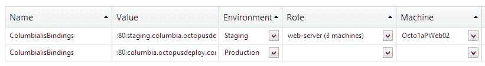

# 八达通部署 1.1-八达通部署

> 原文：<https://octopus.com/blog/1.1>

今天我很高兴地宣布，Octopus Deploy[1.1 版已经发布](http://octopusdeploy.com/downloads)。自上一个 1.0 版本以来，已经做了很多改进，在这篇博客文章中，我想带您了解其中的一些改进。

## 计算机角色

这个版本中最大的变化是概念上的变化。以前，环境包含机器，步骤和变量指向这些机器。从 1.1 开始，一台机器将被标记为一个或多个“角色”，这些角色是步骤和变量所指向的。我在上一篇博客文章中详细描述了这一变化，因此我将使用这篇文章来了解该功能的工作原理。

编辑计算机时，现在可以输入角色列表：

您可以输入任何您喜欢的角色名称，您以前使用过的角色将使用自动完成（使用[Select2](http://ivaynberg.github.com/select2/)控件）显示。角色可能是通用的（“web 服务器”），也可能是特定于您的应用程序的（“crm 批量导入器”）。

还要注意，上述机器属于两种不同的环境。以前，您必须复制一台机器，但现在可以轻松地在环境之间移动机器。

编辑步骤时，您现在将选择将接收包的角色：

但是，变量的作用域可以是角色或计算机：

这些变化带来了许多好处：

1.  无需创建新版本即可添加或删除机器
2.  机器可以在环境之间移动
3.  现在可以更容易地将变量限定到一组计算机

[自动触手注册](http://octopusdeploy.com/blog/automated-tentacle-installation)也支持此功能——使用`tentacle register-with`时只需传递`--role=my-role`命令行参数。

## 项目组

本版本中引入的另一个新概念是“项目组”的概念。这为您的项目提供了一个嵌套级别，使它们能够更容易地分组和管理。

例如，在我的一个内部 Octopus Deploy 安装中，我有两个组-一个用于实际应用程序，另一个用于示例：

项目设置页面用于配置项目组:

项目菜单也将使用组显示项目:

项目组有一个名称和一个环境列表，该组中的项目可以部署到这些环境中:

在这里，您可以看到我的“真正的应用程序”项目组只被允许部署到两个环境中——登台和生产。另一方面，我的“示例应用程序”项目组只被允许部署到一个临时环境中。这将影响仪表板的布局，仪表板现在分为多个组:

以及哪些环境出现在组内项目的部署屏幕中:

在未来，项目组将变得更加重要，因为它们将成为设置保留策略和大多数权限的地方。目前，它们是驯服仪表板的好方法。

## 最喜欢的项目

我们还引入了“收藏夹”的概念，以控制哪些项目出现在下拉菜单中。这是针对每个用户的设置。您可以通过点按星形图标将项目标记为个人收藏:

如果您设置了任何喜爱的项目，则只有您的喜爱的项目会出现在菜单中(如果您没有选择任何喜爱的项目，则前 20 个项目会出现):

## 升级

支持角色的变化需要打破旧的数据模型，因此必须引入一些变化。在安装新的 Octopus 服务器之前，请确保进行备份(您可以在 Octopus 门户网站的*配置*下的*存储*选项卡中进行备份)。然后，安装新的 Octopus 服务器后，使用 *Octopus 管理工具*中*服务器*选项卡上的*开始*按钮。这将对您现有的项目进行一些更改，以启用角色支持。在这篇博客文章中，我写了更多关于将要做出的改变[(我们选择了选项 3)](http://octopusdeploy.com/blog/roles-and-upgrades) 。

如您所见，1.1 是一个相当大的变化。我们要解决的下一个特性是让 Octopus 服务器和触须自己清理以节省磁盘空间，这个特性我们称之为“保留策略”，它可能会挂在项目组上。

请注意，由于版本中的许多变化，我们也发布了 Octo.exe 的新版本。

如果您对此升级有任何问题，请使用[帮助台](http://help.octopusdeploy.com)或跳到 [Jabbr](http://jabbr.net/#/rooms/octopus) 。愉快的部署！