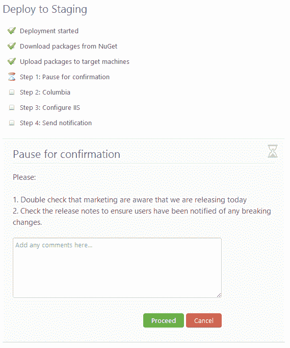

# 具有手动步骤、电子邮件步骤和 PowerShell 步骤的 Octopus 1.3-Octopus 部署

> 原文：<https://octopus.com/blog/1.3>

章鱼 1.3 刚刚发布。它包括许多错误修复，以及对最近发布的 RavenDB 2.0 的升级，感觉快得多。它还包括三种新类型的部署步骤:

Octopus 仍然面向使用 NuGet 包的应用程序的自动部署，但是这三个新的步骤类型提供了很大的灵活性。

## 运行 PowerShell 脚本

这种步骤类型允许您在给定角色的所有触角上运行 PowerShell 片段。

注意，该脚本可以引用任何 Octopus 定义的变量作为 PowerShell 变量。在部署过程中，您将在部署日志中看到输出:

## 发送电子邮件

这一步允许您发送电子邮件。您可以使用 Octopus [变量替换语法](http://octopusdeploy.com/blog/variable-substitutions)在您的电子邮件正文中引用 Octopus 变量。

SMTP 服务器设置在配置菜单下单独配置:

## 需要手动干预

虽然 Octopus 是一个自动化部署解决方案，但有些任务是无法自动化的。有时部署需要签署，无论是在开始还是结束。Octopus 中的手动步骤使这成为可能。我之前在博客中提到了我们的[手动部署](http://octopusdeploy.com/blog/manual-deployments-rfc)计划，现在这些计划已经实现了。

当遇到该步骤时，部署将暂停:

授权组中的用户将看到说明，然后可以决定部署是通过还是失败:

部署任务实际上是暂停的，同时等待手动步骤完成。这意味着您可以重启 Octopus 服务器，并在一周后批准这一步骤。

我希望这些新增加的东西对你有用！