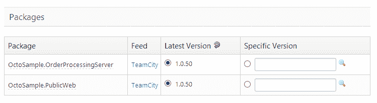

# Octopus 1.6 改进了直接下载和发布功能- Octopus Deploy

> 原文：<https://octopus.com/blog/1.6>

我们刚刚发布了 Octopus Deploy 1.6，你可以从[下载页面](http://octopusdeploy.com/downloads)获得。这个版本将是最后一个主要版本 1。x 发布；从现在开始，我们将把注意力集中在 Octopus Deploy 2.0 上。我会在 2.0 中发布更多的想法，但是现在让我们看看 1.6 中的新内容。

## 从触须直接下载软件包

我在博客上写了我们上个月的计划:

> 第二个变化是软件包步骤设置中的一个选项，让 Tentacles 直接下载软件包。八达通不是下载软件包，而是指示触手下载软件包。下载会在部署步骤运行之前发生(同样，这样我们就不用在部署步骤之间等待复制包)，但是它们会直接到达 NuGet 服务器。

创建包步骤时，您可以通过从下面的单选按钮中进行选择来加入:


## 改进的发布创建屏幕

我们还对创建发布屏幕实施了一些[计划中的更改。](http://octopusdeploy.com/blog/release-creation-screen)



## 代理服务系统

我们增加了 Octopus 和触手使用代理服务器的能力，包括使用基本和集成认证的代理。您可以在管理工具中指定代理服务器:


## 步进变量

以前，在包步骤中可以使用许多预定义的变量:

```
Octopus.Step.Name
Octopus.Step.Package.NuGetPackageId
Octopus.Step.Package.NuGetPackageVersion 
```

然而，这些变量在电子邮件或手动步骤中是不可用的，因为没有包。如果您想发送一封包含上一步的 NuGet 版本号的电子邮件，这就会引起问题。

现在，您可以通过索引来访问变量:

```
Octopus.Step[0].Name
Octopus.Step[0].Package.NuGetPackageId
Octopus.Step[0].Package.NuGetPackageVersion 
```

索引从 0 开始，并根据步骤的执行顺序进行编号。

1.6 还包括了许多其他的错误修正和改变，你可以在发布说明中读到更多关于[的内容。愉快的部署！](http://octopusdeploy.com/downloads/1.6.0.1712)