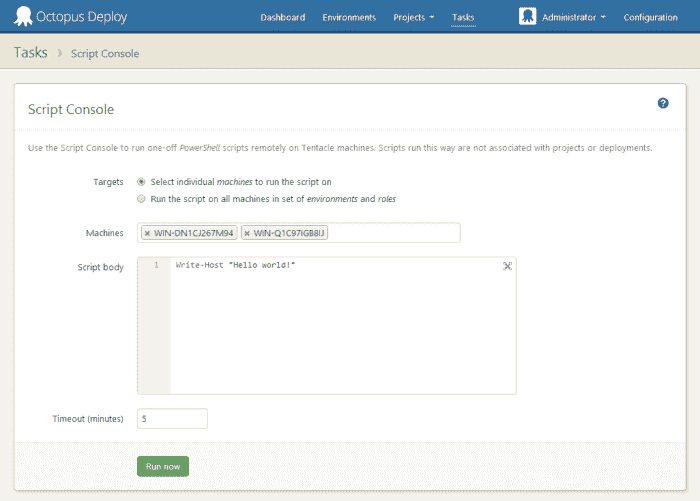
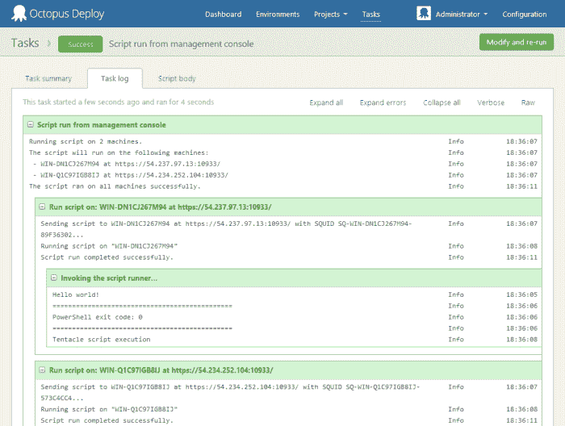
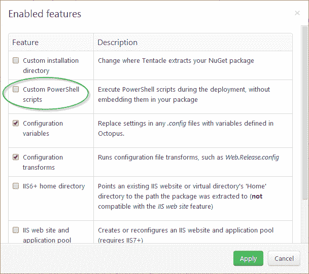
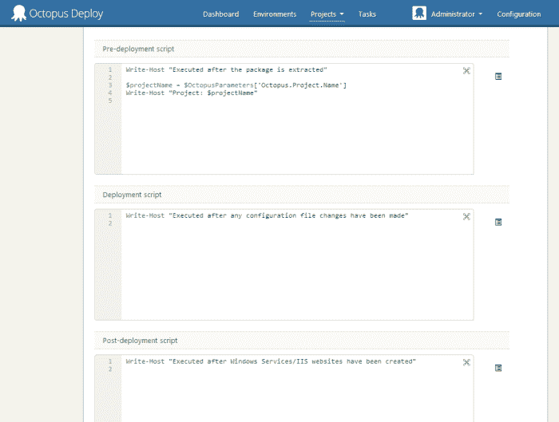
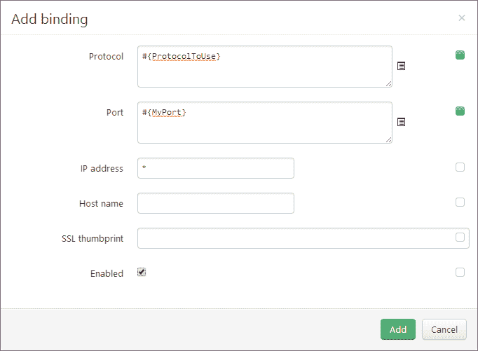

# Octopus 2.2 的新特性- Octopus 部署

> 原文：<https://octopus.com/blog/2.2>

我们刚刚发布了章鱼部署 2.2 的预发布版本。这个版本包含了许多错误修复和小的增强，以及一些新的功能。

## 脚本控制台

对于管理员来说，2.2 引入了一个新的[脚本控制台](http://docs.octopusdeploy.com/display/OD/Script+Console)，它可以用来使用 PowerShell 执行特定的管理任务。这使得在多台机器上运行 PowerShell 代码片段变得容易，并且可以在一个地方查看结果。

当脚本运行时，所有服务器的所有输出都显示在任务输出中:

以这种方式运行的脚本也会出现在审核日志中，您可以随时查看运行的脚本。我认为这是使用远程桌面或 PowerShell Remoting 来远程执行任务的一个很好的替代方法。

## 在 Octopus 中定义部署脚本

大多数时候，当您需要在 Octopus 中执行自定义操作时，您可以使用嵌入在 NuGet 包中的 PowerShell 脚本来执行它们。我们还支持将 PowerShell 脚本作为独立步骤运行的能力。

但是有时您需要在包部署期间运行一个脚本(这样您就有了所有可用的变量)，但是不需要将它们嵌入到 NuGet 包中。现在，您可以使用包装步骤中的新功能来实现这一点:

启用该特性后，您的部署脚本现在可以在 Octopus UI 中编辑，而不是在 NuGet 包中编辑:

注意，通常我们仍然建议将定制的部署逻辑放在 NuGet 包中；这个特性实际上只适用于少数不可能实现这一点的场景。

## 全屏 PowerShell 编辑

在上面的屏幕截图中，您可能已经注意到，脚本编辑控件现在显示了一个按钮，使 PowerShell 编辑器全屏显示。不再编辑微小的文本区域！

## IIS 绑定可以是...束缚

另一个变化是，当使用自动 IIS 站点创建功能时，您现在可以在为站点定义的 HTTP/HTTPS 绑定上绑定字段。

## 错误修复

相当多的小错误和改进也在这个版本中出现了——详情请查看[版本说明](http://octopusdeploy.com/downloads/2.2.1)。愉快的部署！