# Octopus 2.3 的新特性- Octopus 部署

> 原文：<https://octopus.com/blog/2.3>

我们刚刚发布了一个预发布的[章鱼部署 2.3](http://octopusdeploy.com/downloads/2.3.1) 。自从 2.0 发布以来，我们已经习惯了，每隔几周就发布新的版本。如果你看看我们的[发布历史](http://octopusdeploy.com/downloads/previous)，你可以看到我们上一次发布是在两周前，[章鱼 2.2](http://octopusdeploy.com/downloads/2.2.1) 。

以下是 2.3 的亮点。我想你会同意我们在这么短的时间内一直很忙！

## 部署时提示变量

有时，在对部署进行排队时，您需要向 Octopus 提供额外的信息。提示变量允许您定义变量以及标签和帮助文本，其值将由用户在创建部署时提供。

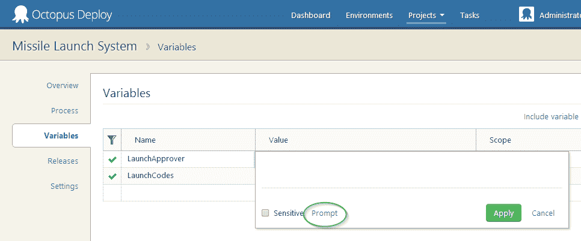

当您单击提示链接时，您将能够配置提示的详细信息:


在部署时，提示将出现在“创建部署”页面上。如果您为变量提供了默认值，这将是文本框中的默认值:

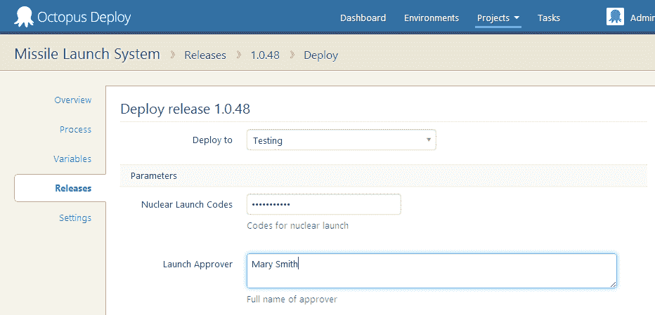

请注意，提示变量可以像其他变量一样确定作用域；因此，您可以对一个环境使用固定值，对生产部署使用提示值。提示变量也可以标记为敏感，在这种情况下，将出现一个密码框。

提示变量可以像任何其他变量一样在脚本和配置中使用:

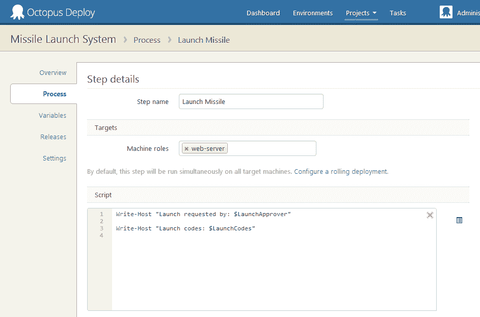

敏感的提示变量会像其他变量一样被屏蔽。

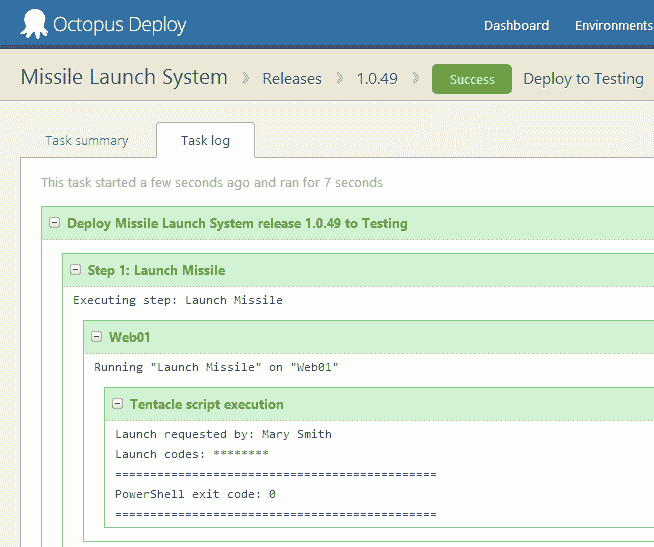

## 部署到特定机器

有时，您可能会向环境中添加一台新机器，并且您需要向该机器重新部署一个版本，但是不希望影响环境中的其他机器。在 Octopus 2.3 中，您现在可以选择要部署到的特定机器:

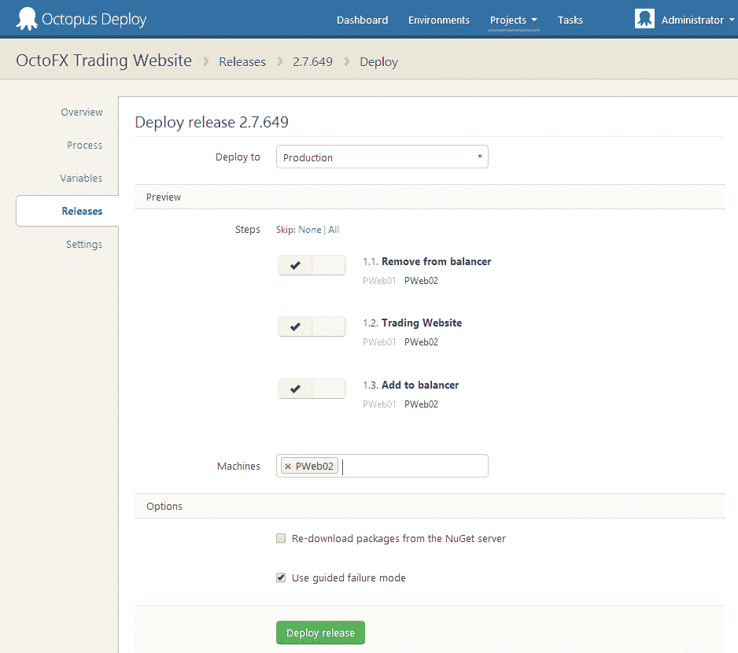

## 任务输出“有趣”模式

当任务正在运行时，您必须连续单击“Expand All”才能在添加新的日志节点时看到输出(与按顺序记录输出的构建服务器不同，Octopus 并行执行许多事情，因此日志输出是分层的，多个节点同时生成日志消息)。

我们现在已经使“全部展开/错误/无”链接“有粘性”——如果您全部展开，并且添加了新节点，它们也会自动展开。我们还创建了一个新模式，称为有趣模式，它可以自动扩展正在运行或已经失败的节点。这是默认的模式，它带来了很好的体验——当您查看任务输出时，您会自动看到您可能最感兴趣的内容。

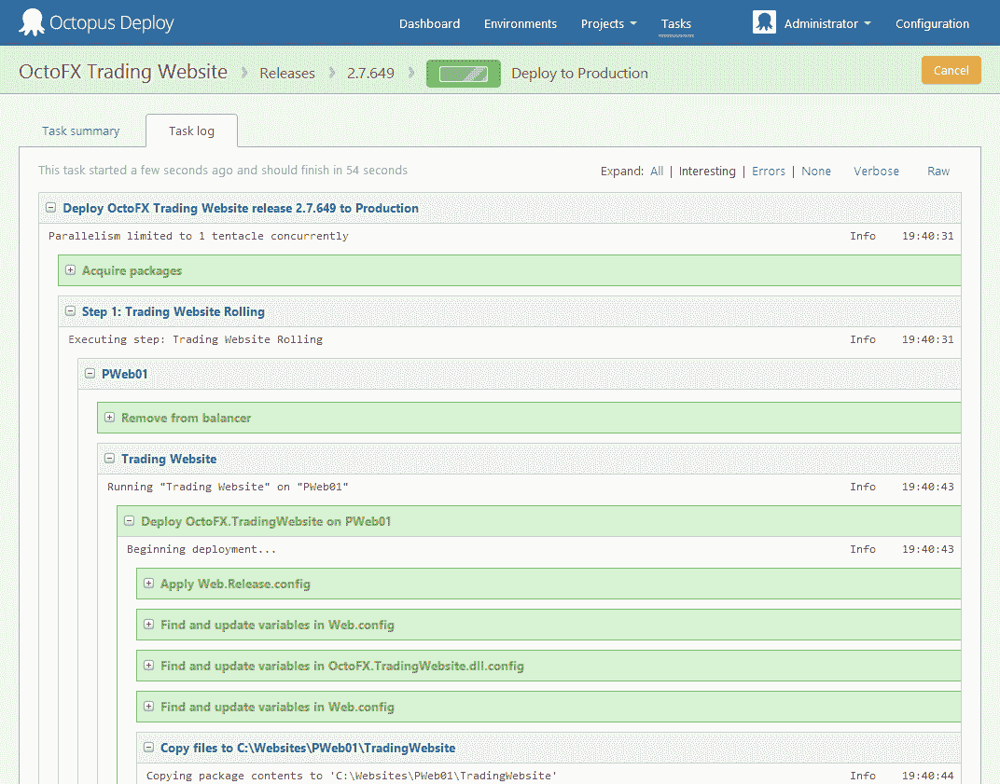

## 审核日志过滤

审计日志现在可以按人员、项目或日期范围过滤:

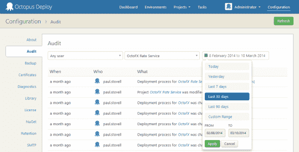

## 包 ID 和源中的自定义表达式

这个更容易用图片解释。现在，您可以像这样定义部署过程中的步骤:

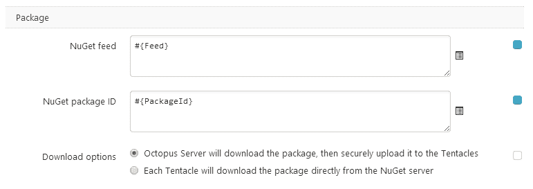

像这样的变量:

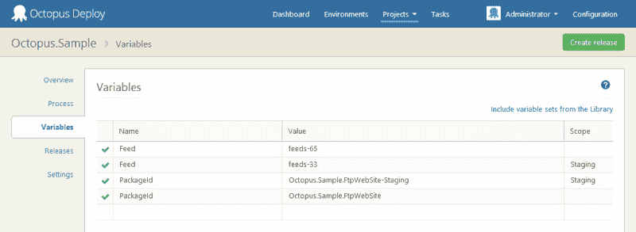

这仍然有效:

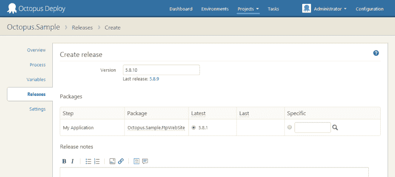

这也是:

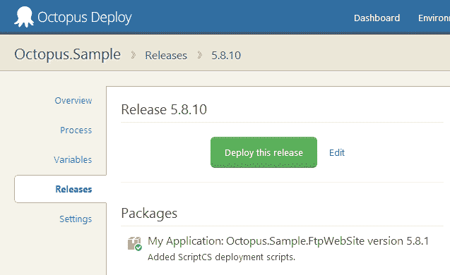

这使得某些工作流变得更加容易，比如针对不同的环境使用不同的提要，但是我稍后会在博客中对此进行介绍。

## 为什么我的部署在排队？

有时，当您执行部署时，您的部署可能处于“排队”状态。原因通常是因为另一个部署当前正在为该环境/项目组合运行，但是很难找出原因。

为了有所帮助，我们现在显示了当前任务在执行之前正在等待的任务列表:

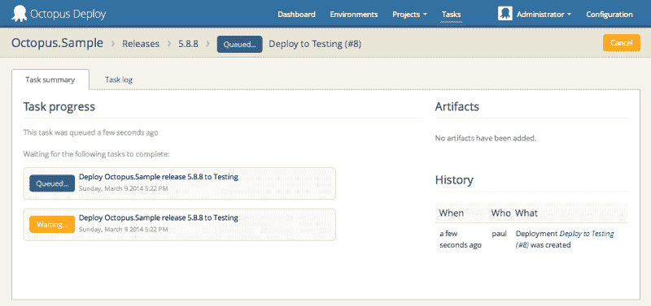

## 基于模板的文件转换

尼克已经[在博客上介绍了这个功能](http://octopusdeploy.com/blog/variable-substition-in-files)。我觉得挺酷的！

## 消除器

在以前版本的 Octopus 中，正在运行的任务上的 Cancel 按钮更多的是一个建议，而不是命令。例如，假设我有这样一个脚本:

```
Write-Output "Sleeping for 1 second..."
Start-Sleep 1000
Write-Output "Done!" 
```

哎呀！默认情况下，假设我指的是秒，而不是毫秒。现在我将永远等待我的部署完成。啊！

在以前的版本中，点击任务上的*取消*不会有帮助——在取消其余的动作之前，触手仍然会等待脚本完成。但是在 Octopus 2.3 中，我们现在将终止正在运行的 PowerShell 进程:

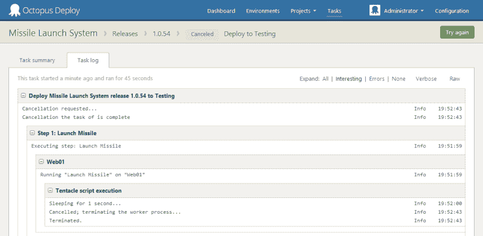

这是一个更好的体验，因为这意味着当你有一个挂起的任务时，现在取消实际上是有效的。另一方面，你在使用它的时候必须更加小心一点！

## 更好的任务输出和仪表板性能

仪表板和任务输出页面得到了很多关注。以前，任务输出会冻结在几百行输出中，当您有许多项目/环境时，仪表板会间歇性地冻结。这两个问题现在都得到了解决，他们应该感觉更快了！

我们还解决了此版本中的一些其他已知错误和其他性能问题。检查一下，如果遇到任何问题，请告诉我。愉快的部署！