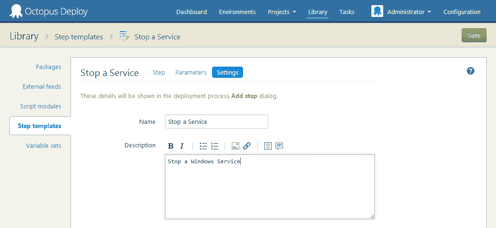
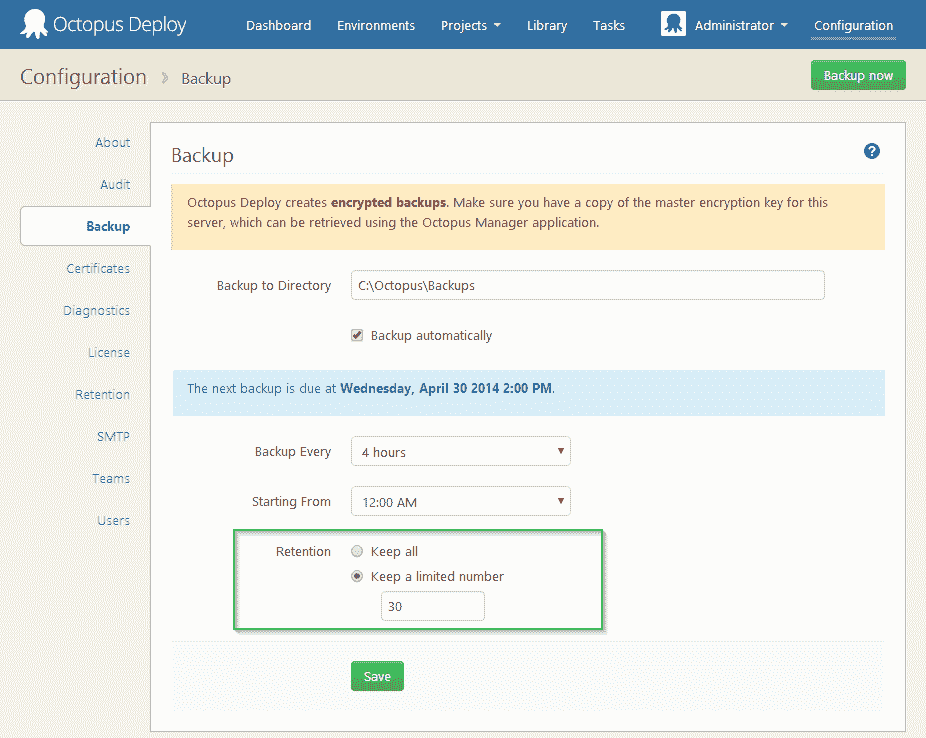

# Octopus 2.4 的新特性- Octopus 部署

> 原文：<https://octopus.com/blog/2.4>

我刚刚在一个预发布版本的[章鱼部署 2.4](http://octopusdeploy.com/downloads/2.4.1) 上按下按钮。这次发行比宾虚还大！我们上一次主要发布是在大约两个月前，它显示:我们关闭了 GitHub 中的 79 个问题，并添加了一堆大的新功能。它是如此之大，以至于我们将做一个关于 2.4 中新特性的[免费网络研讨会。希望你能成功！](http://octopusdeploy.com/blog/new-in-2.4-webinar)

以下是此版本中新增内容的简要概述。

## 库标签

2.4 中最显著的变化是我们增加了一个新的顶级区域，叫做**库**:

以前，NuGet feed 设置和库变量集位于 Configuration 选项卡下，仅供管理员使用。由于我们增加了许多新的特性，这些特性将在项目间共享，我们决定是时候为这些设置提供一个专用的地方了。

## 更好的内置 NuGet 存储库管理

库下面有许多选项卡，默认是内置的 NuGet 存储库。

您可以单击任何包来查看版本列表:

您可以选择包来删除它们，或者单击某个版本来查看详细信息:

您甚至可以直接从 UI 上传软件包，这在部署一次性实用程序时非常有用:

作为保留策略的一部分，内置存储库中的软件包现在会自动清理。当相应的发行版被删除时，不再被任何发行版使用的软件包将被自动从磁盘中删除。

## 步骤模板

这个功能在我看来是 2.4 中**最酷的**功能。**步骤模板**允许您创建可以跨项目使用的可重用步骤。这个功能实际上是来自[体育解决方案](http://www.sportingsolutions.com/)的大卫·桑苏姆的一个拉式请求，我们喜欢这个概念。非常感谢大卫和运动解决方案！

它是这样工作的。“步骤模板”选项卡是您的模板所在的位置:

添加模板时，您可以选择使用任何内置步骤类型。对于这个例子，我将使用一个 PowerShell 脚本:

为您的模板命名和描述，以便其他人知道它的用途:

我的脚本将停止一个 Windows 服务，所以我希望使用我的步骤模板的人告诉我他们想要停止哪个服务。我通过定义参数来做到这一点:

定义了参数后，我现在可以定义如何运行我的步骤模板，并利用这些参数:

这是激动人心的部分。当定义任何项目的部署过程时，我可以使用我的步骤模板**，就好像它是一个内置步骤**:

使用步骤模板时，我定义的参数可以编辑，并且可以绑定到变量:

我认为这个特性将会开启大量的可能性，围绕着能够创建可重用的脚本块或其他步骤。我们将在未来为人们建立一个共享他们的 step 模板的地方，所以请关注这个空间！:-)

## 脚本模块

如果您的所有部署都遵循相似的模式，那么创建一组可重用的 PowerShell 函数在它们之间使用是很有诱惑力的。在过去，虽然这是可能的，但从来没有一个非常好的方法能够轻松地使用共享这些功能。

现在在 Octopus 2.4 中，您可以使用脚本模块来定义一组 PowerShell 函数——本质上是一个`.psm1`文件:

然后，您可以将脚本模块作为项目部署过程的一部分:

现在，无论何时在该项目中运行 PowerShell，该模块都是可用的。这意味着您可以从脚本步骤或者在您的`Deploy.ps1`和相关文件中引用该模块。在运行期间，Octopus 将确保模块在触手上并被加载；没有额外的工作要做:

## 团队中的 Active directory 组

用户之声的[第三高投票建议现在已经完成——你可以将 Octopus 中的团队链接到活动目录组:](https://octopusdeploy.uservoice.com/forums/170787-general/suggestions/3885904-have-the-ability-to-link-teams-to-ad-groups-so-th)

**我们需要你的帮助**来测试这一点，因为即使在最好的情况下，活动目录集成也是棘手的。如果你正在使用 AD，并且可以为我们试用 2.4.1 以确保群组成员工作，我们将非常感谢。

## 自定义角色

在 Octopus 2.0 中，我们通过创建一些高级角色极大地简化了权限系统。然而，一些客户需要修改这些内置角色的能力，或者定义新的角色。在 2.4 中，您现在可以定义自己的。

可以在团队页面中找到角色:

在那里，您可以添加自定义角色，或修改内置角色的权限:

## 集成 Windows 身份验证

如果您使用的是 Active Directory 身份验证，用户现在可以选择使用集成的 windows 身份验证质询登录，而不是直接键入密码:

当然，如果您有时需要以不同的用户身份登录，或者由于某种原因这不起作用，您可以继续以旧的方式登录。

## 保留有限数量的备份

Henrik 在他工作的第一天就实现了这一点。现在，您可以告诉 Octopus 应该保留 Octopus 数据库的多少个备份:

## 可定制的版本号策略

当您创建一个版本时，Octopus 试图通过增加以前的版本号来为您生成一个版本号。现在，您可以通过编辑项目设置来更好地控制这种行为。您可以告诉 Octopus 使发布号与特定 NuGet 包的号相匹配:

或者，您可以使用如下语法自行指定格式:

## 项目徽标

有时，在像 Octopus 这样的应用程序中，搞清楚自己的确切位置可能会令人困惑。在 2.4 中，我们增加了为每个项目上传自定义徽标的功能。导航您的项目时，此徽标将出现在左上角:

您可以从设置页面更改徽标:

## 试试吧，告诉我们你的想法！

现在这个版本的 Octopus 是一个预发布版本，虽然它修复了大量的问题，但它总是有可能引入一些问题。由于有这么多的变化，我们真的很希望你下载它，并采取了一个旋转。我认为新功能使它成为一个相当引人注目的升级！