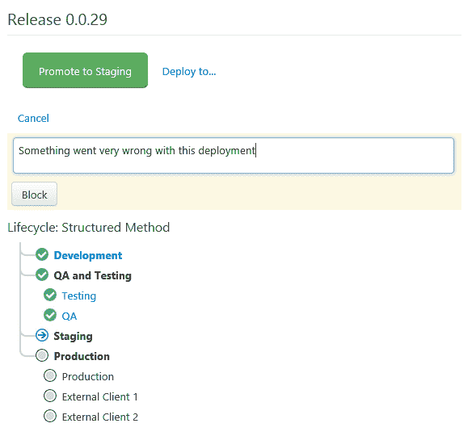
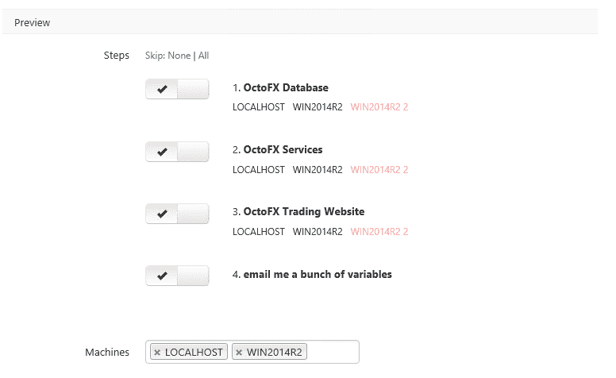

# Octopus Deploy 2.6 的新特性- Octopus Deploy

> 原文：<https://octopus.com/blog/2.6>

Octopus Deploy 2.6 现已发布！喜欢边缘生活的可以下载 [Octopus Deploy 2.6 预发布](http://octopusdeploy.com/downloads/2.6.0 "Download Octopus Deploy 2.6")。当这个版本包含如此多的新功能时，谁*不想生活在边缘呢？以下是亮点:*

*   控制推广和自动化部署的生命周期
*   从 NuGet push 自动创建发布
*   并行运行步骤
*   高达 5 倍的包上传速度
*   跳过脱机计算机

## 生活过程

这个标题只是没有足够的宣传这个功能。想象一下，气球弹出，小号手吹号，五彩纸屑炮弄得到处都是。

好吧，我会停止，但我喜欢这个功能！

生命周期允许您指定和控制部署到环境的进度。您不仅能够订购部署环境，还可以:

*   当环境符合部署条件时，将环境设置为自动部署
*   检查您的工作流程，确保在继续之前已经部署了 N QA 环境
*   将多个环境归入一个阶段
*   一次部署到多个环境

是的，一次部署到多个环境！

生命周期由阶段和保留策略组成。先说阶段。

### 生命周期阶段

一个生命周期可以由许多阶段组成。一个阶段可以由许多环境组成。每个阶段都允许您向其中添加环境。您可以控制每个阶段，以确保在下一个阶段有资格部署之前，已经发布了 N 个环境。

当选择将哪个环境添加到阶段时，您可以选择是手动发布还是自动发布。如果它们被设置为自动发布，当它们到达部署链的阶段时，它们将开始部署。

### 生命周期和保留政策

生命周期有自己的保留策略。每个阶段都有一个总体的保留策略。但是，您可以为每个阶段覆盖它。

这意味着对于一周有 1300 个版本的开发，您可以设置一个非常严格的保留策略来删除除最后 3 个版本之外的所有版本。但是对于生产来说，你可以永远保留一切。或者在中间的某个地方，如果你的需求不是那么极端的话

### 生命周期和项目

生命周期通过进程屏幕分配给项目。

您可能会注意到，您的项目概览屏幕有一点大修。

它现在将显示您的最新版本，它们在每个环境中的位置，并提供任何部署或升级按钮。它让您可以一目了然地看到最新和以前的部署。持续绿色表示您最近的部署，中度褪色绿色表示您以前的部署，浅褪色绿色表示所有其他部署。

### 生命周期、发布、部署和促销

发布页面现在为您提供了一个图形树，显示了当前部署的位置、阶段和正在部署的内容。你可能会注意到这里的一些事情。部署/升级按钮变得更智能了。它知道链条中的下一步是什么。它还允许您部署到已经部署到的任何环境中。

现在，只需点击一个按钮，就可以发布到多个环境中。没错。

或者你可以使用这个选择框，并选择它们！

当您完成部署后，promote 按钮会知道下一步是什么，并为您提供升级到下一个环境的选项。

部署屏幕也变得简单了一些。更容易找到“立即部署”按钮。但是不要担心，所有的东西在高级下都是可用的，如果你愿意，你可以告诉它记住一直显示高级设置。

### 生命周期和阻止部署

如果您有一个坏的发布，它刚刚对您的 QA 服务器做了一些坏的事情(tm ),那么您可能想要阻止这个发布进一步向下发布，直到问题被解决。现在，您可以阻止部署。

第 1 步阻止部署的原因。

在您的发布屏幕上，您可以看到“升级”按钮已经消失，并且您的生命周期部署树对于那些它不能升级到的环境有一个红色图标。

现在，您还会在概览中看到一个警告标记，而不会再看到该版本的促销按钮。事实上，所有的推广按钮都不见了。此时，您只能部署到已经部署到的环境中。问题解决后解除阻止将授予您部署该版本的完全权限。

### 生命周期和自动发布创建

是的，还有更多！

在 project process 屏幕上，您可以定义一个包的名称，当它被推送到或上传到内部存储库时，将自动为您创建一个版本。

如果您在生命周期设置中有第一个要自动部署的环境，这意味着您可以将一个 NuGet 包推送到内部存储库，让它自动创建一个发布并部署它！我们在看你们 TFS 的用户！

正如你所看到的，生命周期是 Octopus 的许多领域都有的功能，这是一个很大的功能，我们对此非常自豪。我们借此机会尝试在 UserVoice 中听取您的反馈和建议，以增加更多价值。我们真的希望你和我们一样喜欢它！

## 并行运行步骤

2.6 中的另一个特性允许您设置多个并行运行的项目步骤。

您可以选择一个项目步骤，使其与前一个步骤并行运行。

流程页面已更新，以显示这些组合在一起的步骤。如果它们运行在同一台机器上，它们仍然会排队，除非你[配置项目允许多个步骤并行运行](http://docs.octopusdeploy.com/display/OD/Run+multiple+processes+on+a+Tentacle+Simultaneously "configure the project to allow multiple steps to run in parallel")

## 保留策略已经改变

如上所述，保留策略已经进入了生命周期。您将不再在“配置”下找到“保留策略”选项卡。它们也不能再为项目组设置。剩下的工作就是为内部包存储库设置保留策略。

这已经被移到包所在的位置，在库->包下。

## 包上传流

在 2.6 版本中，当 Octopus 下载一个包，然后发送给 Tentacles 时，它现在将通过流媒体来完成。我们看到速度提高了 5 倍。这也将减少一些内存开销，在保存之前，触手使用这些内存来存储包块。

## SNI 支持

除了修复 SSL 绑定的一些问题，我们还增加了 SNI 支持。

## 跳过脱机计算机

目前，当在非常大的环境中进行部署时，离线机器可能会妨碍您的工作。我们现在可以继续部署，但跳过离线机器。

我们现在在部署屏幕上显示离线计算机(显示为红色)。这将允许您返回并检查机器的连接。或者您可以使用“忽略脱机计算机”功能。

这将自动列出除脱机计算机之外的所有计算机。

这就结束了 2.6 中的新特性之旅。我们只提到了这个版本中的主要特性，但是也有一些小的改动和错误修复，所以请查看发行说明以了解这些小项目的更多细节。我们希望你和我们一样对生命周期感到兴奋！

立即下载 [Octopus Deploy 2.6 预发布版](http://octopusdeploy.com/downloads/2.6.0 "Download Octopus Deploy 2.6")！