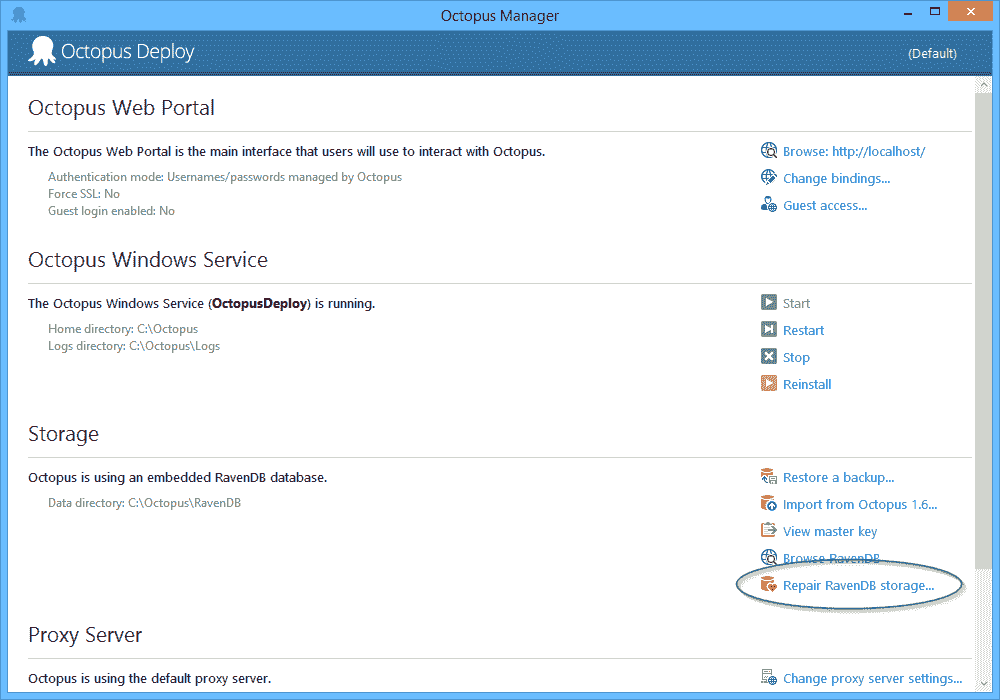

# 在 Octopus 3.0 中，我们将从 RavenDB 切换到 SQL Server - Octopus Deploy

> 原文：<https://octopus.com/blog/3.0-switching-to-sql>

Octopus 的早期测试版本使用带有实体框架的 SQL Server。2012 年，就在 1.0 之前，我改用了 RavenDB，写了一篇关于[我们如何使用嵌入式版本 RavenDB](http://octopusdeploy.com/blog/how-we-use-ravendb) 的博文。

两年多来，我们一直在基于 RavenDB 进行开发。在此期间，我们安装了超过 10，000 台 Octopus，这意味着我们负责将 RavenDB 投入生产超过 10，000 次。由于大多数客户没有内部的 Raven 专家，所以当 Raven 出现问题时，我们是第一(唯一)支持线。我们不只是在踢轮胎或“看着”乌鸦，我们把农场押在它身上。

对于 Octopus 3.0，我们将停止使用 RavenDB，而使用 SQL Server。可以理解，许多人对“为什么”感兴趣。开始了。

## 第一，好的

RavenDB 有很好的开发经验。与 SQL + EF 或 NHibernate 相比，使用 RavenDB 可以极快地进行迭代，并且它通常“工作正常”。如果我在一个紧张的期限内构建一个最小可行的产品，RavenDB 将是我的首选数据库。我们在 6 个月的时间里重写了 Octopus 1.6 和 2.0 之间的几乎所有内容，我不认为我们可以在 SQL + EF 上这么快地迭代。

## 坏事

我们通过电子邮件/论坛处理大部分支持，但当出现大问题时，我们会将其升级为 Skype/GoToMeeting 电话，以便帮助客户。通常是在早上很早的时候，或者晚上很晚的时候，所以最小化做这些事情的需求对我们的理智是至关重要的。

我们大多数支持电话的原因是什么？不幸的是，它要么是 Raven，要么是我们在使用 Raven 时犯的一个错误。而且用 Raven 的时候真的很容易出错。这些问题通常分为两类:索引/数据损坏问题，或 API/使用问题。

最重要的是，数据库需要坚如磐石，性能可靠。Raven 的底层使用 ESENT，我们通常不会丢失 Raven 事务方面的任何数据。但是指数是基于 Lucene.NET 的，这是一个不同的故事。已经损坏并需要重建的索引是如此常见，以至于我们为 1.6 版写了一篇博文解释人们如何能够[重置他们的索引](http://octopusdeploy.com/blog/resetting-raven-indexes)。我们把这篇博文发给了很多人，所以在 2.0 中我们[在 UI](http://docs.octopusdeploy.com/display/OD/Repairing+the+Octopus+database) 中为他们构建了一个完整的功能。



当我说我们从未丢失过交易数据时，这并不完全正确。在 RavenDB 中添加一个导致大问题的索引真的很容易。拿着这个:

```
 Map = processes => from process in processes
                     from step in process.Steps
                     select {...}
  Reduce = results => from result in results
                      group result by .... 
```

你可以写这个索引，它对你来说很好，你把它投入生产。然后，您发现一个客户有 10，000 个流程文档，每个文档有 40 个步骤。

虽然 Raven 使用 Lucene 进行索引，但它也将索引记录写入 ESENT。我不知道内部的情况，但是 Raven ESENT 数据库内部有各种各样的表，有些是用来临时写这些 map/reduce 记录的。对于每个被索引的条目，它将向这些表中写入大量的记录。因此，我们从一个客户那里得到一个支持问题:他们启动 Octopus，他们的数据库文件以每秒几十或几百 MB 的速度增长，直到填满磁盘。数据库文件变得太大，他们无法修复。他们所能做的就是从备份中恢复。当我们最终获得这些巨大数据文件中的一个副本，并使用 ESENT 的一些 UI 工具对其进行研究时，这些表包含了数百万条记录，仅 10，000 个文档。

RavenDB 团队意识到这是一个问题，因为在 3.0 中他们增加了一个新功能。如果地图操作产生的输出记录超过 15 条，则该文档不会被索引。

我是说，再读一遍那一段。你写一些代码，测试它，它在开发中运行良好。你把它放到生产环境中，它对每个人都很好。然后你接到一个客户的电话:我刚刚添加了一个新流程，它没有出现在列表中。只有在许多电子邮件和支持电话之后，你才意识到这是因为 Raven 认为 15 是可以的，16 是不行的，并且该项目没有被索引。你没有阅读文档是你的错！

**“默认安全”是*所以*生产中痛苦**

Raven 有一个“默认安全”的哲学，但是 API 使得编写“安全”的代码变得如此容易，以至于在生产中中断。例如:

```
session.Query<Project>().ToList(); 
```

把它投入生产，你会得到一个支持电话:“我刚刚添加了我的第 129 个项目，但它没有出现在屏幕上”。为了避免可怕的“无界结果集”问题，Raven 限制了任何查询返回的项数。感谢不是这个:

```
DeleteExcept(session.Query<Project>().Where(p => !p.KeepForever).ToList()) 
```

无界的结果集当然不好。但是，在开发和生产中工作的代码，直到当记录数量改变时，它突然表现出不同的行为，就更糟糕了。如果 RavenDB 相信防止无限的结果集，他们根本就不应该让那个查询运行——当我在没有调用`.Take()`的情况下做任何查询时抛出一个异常。让它成为开发问题，而不是生产问题。

在一个会话中，您只能执行 30 个查询。结果集是有界的*。每个被映射的项目只有 15 个映射结果。当你和 Raven 一起工作时，每次和 RavenDB 互动时，都要记住这些限制，否则你会后悔的。*

这些限制被清楚地记录下来，但是你会忘记它们。只有当生产中发生了奇怪的事情，你去寻找时，你才会意识到它们。尽管有两年使用 Raven 的生产经验，这些意见仍然咬着我们。看到像这样的[帖子出现在](http://ayende.com/blog/169057/is-the-library-open-or-not)网站上让我很沮丧，这些帖子提倡的解决方案如果有人尝试，将会积极地打破生产。

## 结论

RavenDB 非常适合开发。也许我们正在经历的问题是我们的错。所有的数据库都有它们的缺点，也许这是另一边的草总是更绿的例子。切换到 SQL Server 可能看起来像是一种倒退，并且可能会使开发更加困难，但是在这一点上，我确实觉得我们在生产中使用 SQL Server 会有更少的问题。它已经存在了很长一段时间，其中的陷阱至少是众所周知和可以预见的。

关于我们为什么要离开 RavenDB 已经说得够多了。下周我将分享一些关于我们计划如何在 Octopus 3.0 中使用 SQL Server 的细节。

(*)您可以通过指定要返回的无限项来禁用无限结果集保护，如果您知道在哪里关闭它的话。但是您仍然必须在每次编写查询时显式调用`.Take(int.MaxValue)`。