# 替代 Kubernetes 仪表板-八达通部署

> 原文：<https://octopus.com/blog/alternative-kubernetes-dashboards>

[](#)

最初有*[Kubernetes 仪表板](https://github.com/kubernetes/dashboard)。对于任何想要监控 Kubernetes 集群的人来说，这个仪表板都是默认选项，但是多年来，已经开发出了许多值得研究的替代方案。*

 *在这篇博客中，我们将看看这些替代 Kubernetes 仪表板。

## Kubernetes 星团样本

对于这篇文章，我在本地运行 minikube，用 Istio 提供的 [Bookinfo](https://istio.io/docs/examples/bookinfo/) 应用程序填充。

## K8Dash

[K8Dash 主页](https://github.com/herbrandson/k8dash)

> K8Dash 是管理 Kubernetes 集群最简单的方法。

K8Dash 有一个干净、现代的界面，使用过 Kubernetes 官方仪表盘的人应该都很熟悉。K8Dash 的卖点是界面会自动更新，不需要手动刷新页面来查看集群的当前状态。

使用以下命令可以轻松完成安装:

```
kubectl apply -f https://raw.githubusercontent.com/herbrandson/k8dash/master/kubernetes-k8dash.yaml
kubectl port-forward service/k8dash 9999:80 -n kube-system 
```

[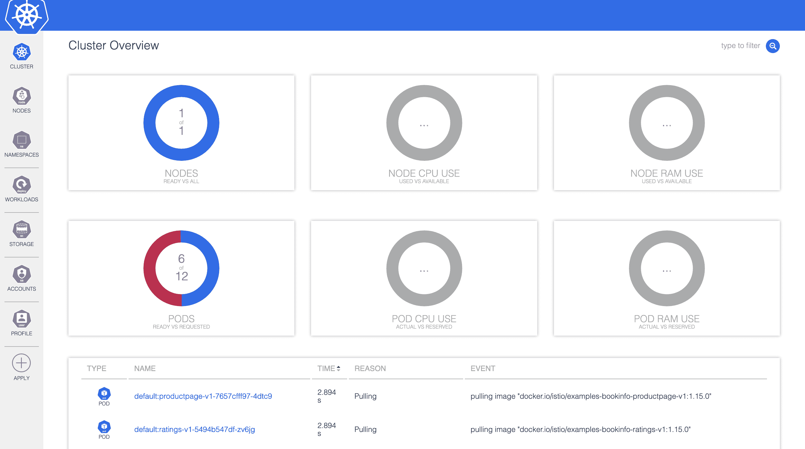 ](#) [ 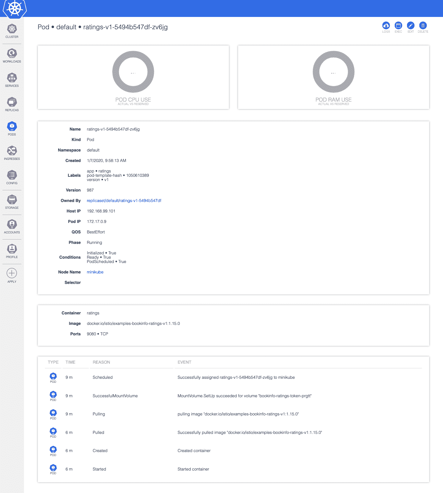](#)

## 星状的

> 可视化 Kubernetes 应用程序

Konstellate 与其说是一个 Kubernetes 仪表板，不如说是一个创建、链接和可视化 Kubernetes 资源的工具。

主画布允许您添加新的 Kubernetes 资源，如部署、服务和入口。动态用户界面允许您构建这些资源的 YAML 描述，通过相关描述公开可用的子属性。

[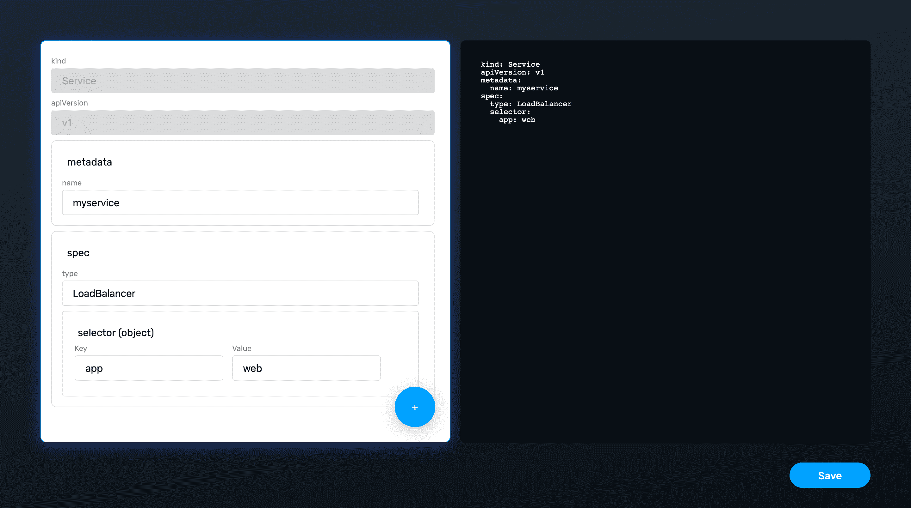 ](#) [ 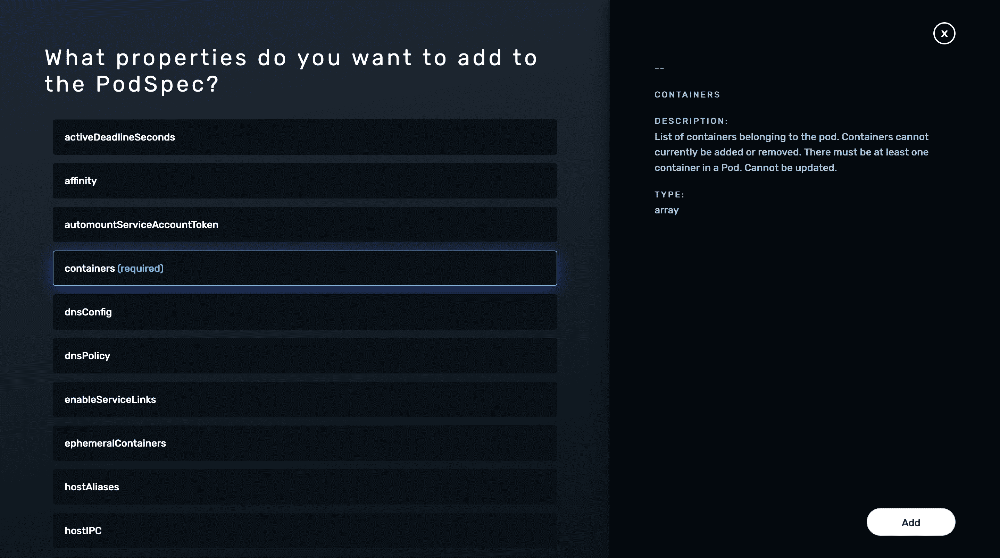](#)

然后可以连接两个相关的实体，Konstellate 显示将它们链接在一起的相关属性。

[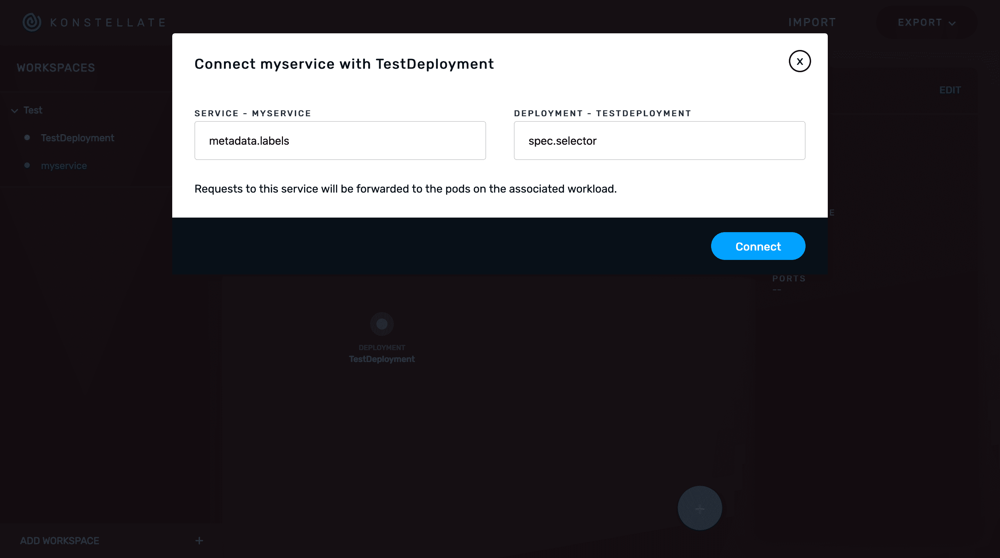](#)[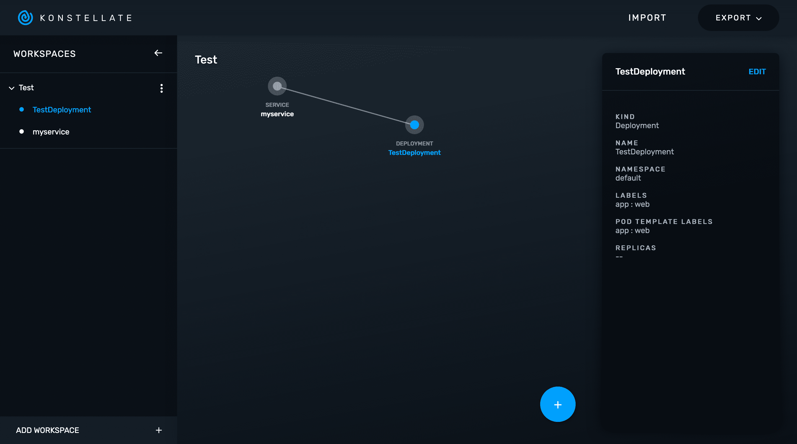【](#)

如果说手工编辑 YAML 有什么挑战的话，那就是我总是在谷歌上搜索准确的房产名称和它们之间的关系。上下文感知的 Konstellate 编辑器是探索给定实体的各种可用属性的好方法。

一个杀手级的特性是能够可视化现有集群中的资源，但是这个特性还没有实现。

Konstellate 是从源代码构建的，并没有提供我所能看到的任何预构建的 Docker 映像或二进制文件。您所需要的只是 Clojure 和一个构建并运行应用程序的命令，但下载所有依赖项可能需要几分钟时间。GitHub 页面链接到一个演示，但是当我尝试的时候它关闭了。

总的来说，这是一个非常酷的应用程序，绝对是一个值得关注的项目。

## 库伯纳特

[Kubernator 主页](https://github.com/smpio/kubernator)

> 与高级的 Kubernetes Dashboard 不同，Kubernator 提供了对集群中所有对象的低级控制和清晰的视图，并具有创建新对象、编辑和解决冲突的能力。

Kubernator 是一个功能强大的 YAML 编辑器，直接链接到 Kubernetes 集群。导航树显示了类似文件系统的集群视图，而编辑器提供了选项卡、键盘快捷键和差异视图等功能。

[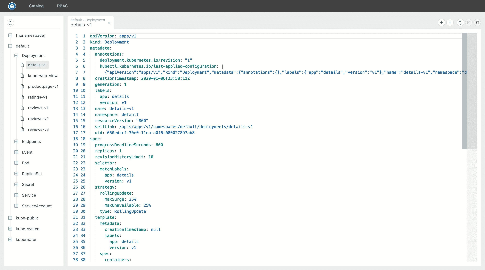](#)

除了编辑原始 YAML，Kubernator 还将可视化基于角色的访问控制(RBAC)资源，显示用户、组、服务帐户、角色和集群角色之间的关系。

[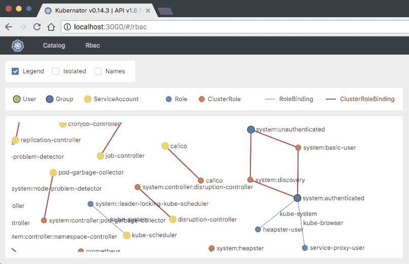](#)

安装速度很快，Docker 映像可以随时部署到现有的 Kubernetes 集群中:

```
kubectl create ns kubernator
kubectl -n kubernator run --image=smpio/kubernator --port=80 kubernator
kubectl -n kubernator expose deploy kubernator
kubectl proxy 
```

接下来，只需在浏览器中打开[服务代理 URL](http://localhost:8001/api/v1/namespaces/kubernator/services/kubernator/proxy/) 。

## Kubernetes 运营视图

[Kubernetes 运营视图主页](https://github.com/hjacobs/kube-ops-view)

> 多个 K8s 集群的只读系统控制面板

你有没有想过像电影里的超级极客一样管理你的 Kubernetes 集群？那 KOV 就是你的了。

基于 WebGL，KOV 将你的 Kubernetes 仪表盘可视化为一系列嵌套的盒子，显示集群、节点和单元。附加的图表直接嵌套在这些元素中，工具提示提供了附加的细节。可视化效果可以缩放和平移，以深入查看各个窗格。

[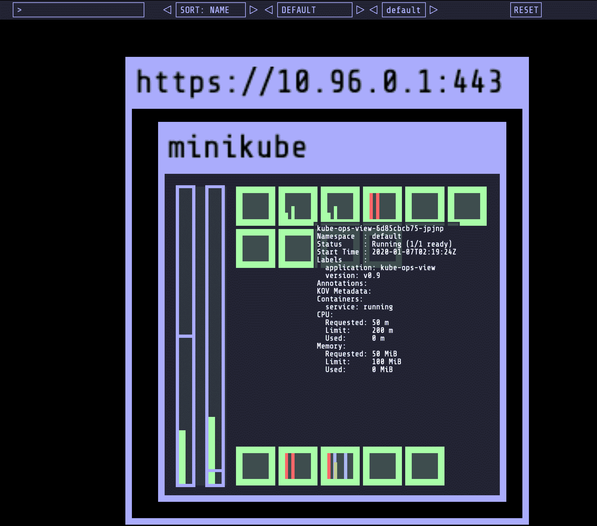](#)

KOV 是一个只读仪表板，因此您不能使用它来管理集群或设置警报。

然而，我用 KOV 来演示 Kubernetes 集群如何在添加和删除 pod 和节点时工作，人们说这种特殊的可视化是他们第一次理解 Kubernetes 是什么。

KOV 提供了一组 YAML 文件，可以作为一个组部署到现有集群中，从而简化了安装:

```
kubectl apply -f deploy
kubectl port-forward service/kube-ops-view 8080:80 
```

## 库布里克斯

[库布里克斯主页](https://kubricks.io/)

> 针对单个 Kubernetes 集群的可视化工具/故障排除工具

Kubricks 是一个桌面应用程序，它将 Kubernetes 集群可视化，并允许您从节点级别深入到流量视图，反映 kube-proxy 通过服务将传入请求定向到不同 pods 的方式。

我的 minikube 集群只有一个节点，看起来没什么意思:

[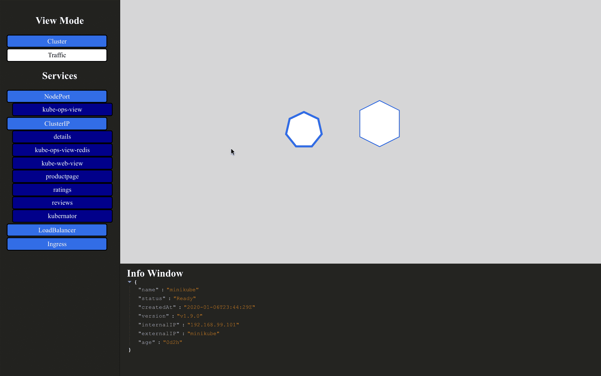](#)

单击节点会显示部署到该节点的单元:

[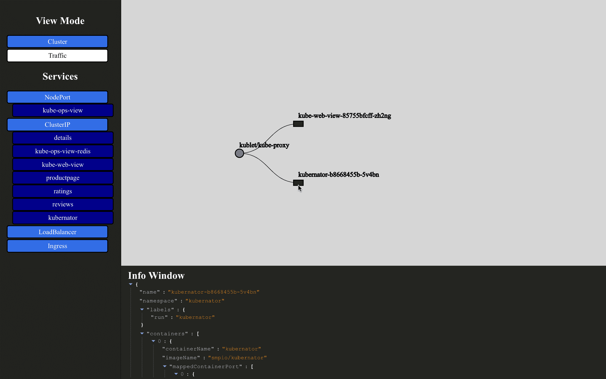](#)

这是 Kubricks 的交通视图:

[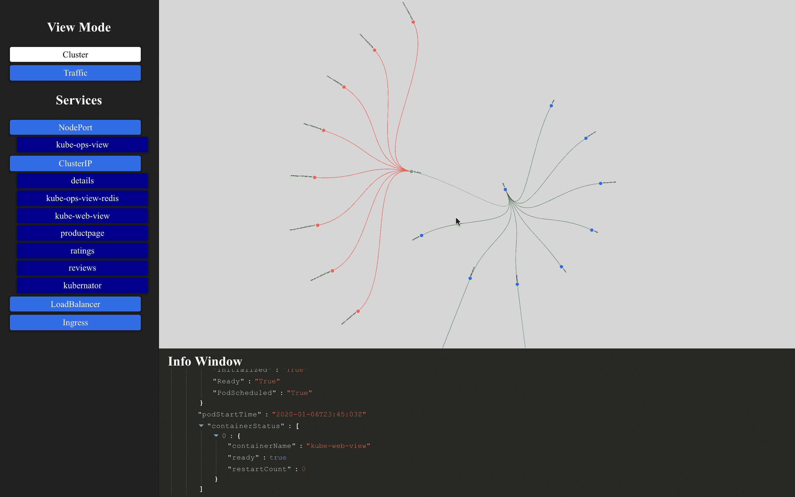](#)

我不得不承认，我很难理解库布里克斯向我展示了什么。要查看流量图中各点之间的连接，我必须缩小到标签难以阅读的位置，节点视图似乎缺少一些窗格。

macOS 和 Linux 的下载安装很容易。

## 八分仪

[八分主页](https://github.com/vmware-tanzu/octant)

> 一个基于 web 的、高度可扩展的平台，供开发人员更好地理解 Kubernetes 集群的复杂性。

Octant 是一个本地安装的应用程序，它公开了一个基于 web 的仪表板。Octant 有一个直观的界面，用于导航、检查和编辑 Kubernetes 资源，并能够可视化相关资源。它还有明暗模式。

[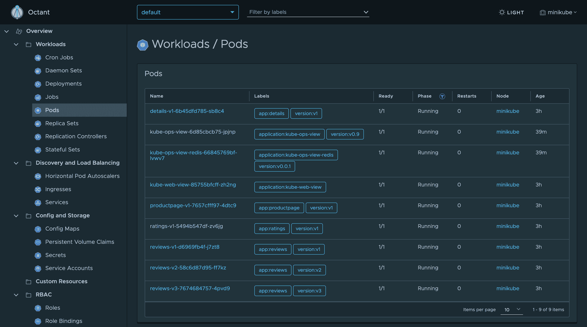](#)[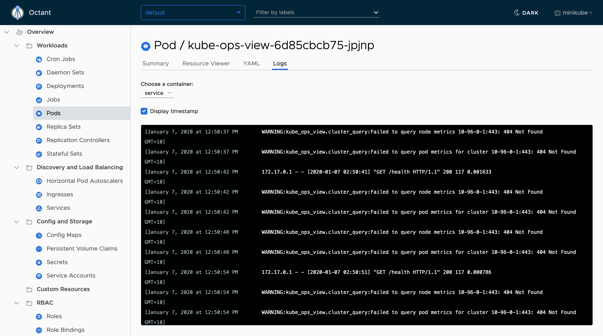](#)[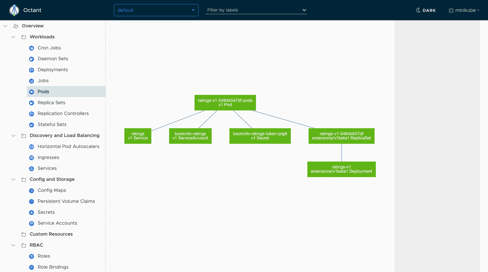](#)

我特别喜欢直接从接口配置端口转发的能力。

[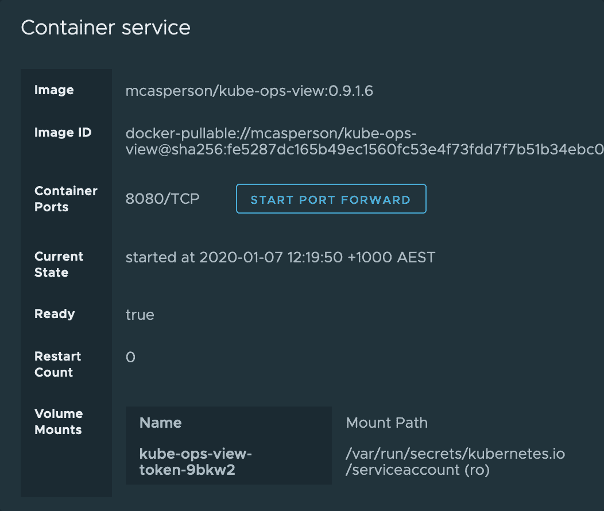 ](#) [ 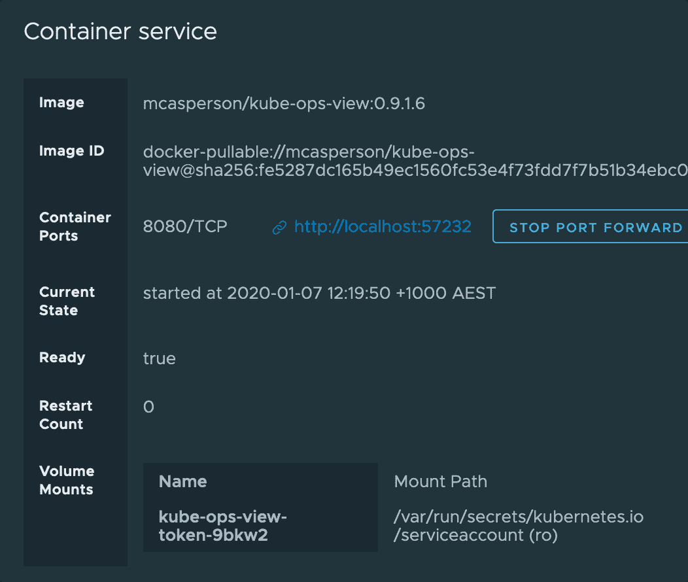](#)

使用 Brew 和 Chocolatey 提供的包，以及针对 Linux 编译的 RPM 和 DEB 包，安装非常容易。

## 编织范围

[编织范围主页](https://github.com/weaveworks/scope)

> Docker & Kubernetes 的监控、可视化和管理

Weave Scope 提供了 Kubernetes 节点、pod 和容器的可视化，显示了有关内存和 CPU 使用的详细信息。

【T8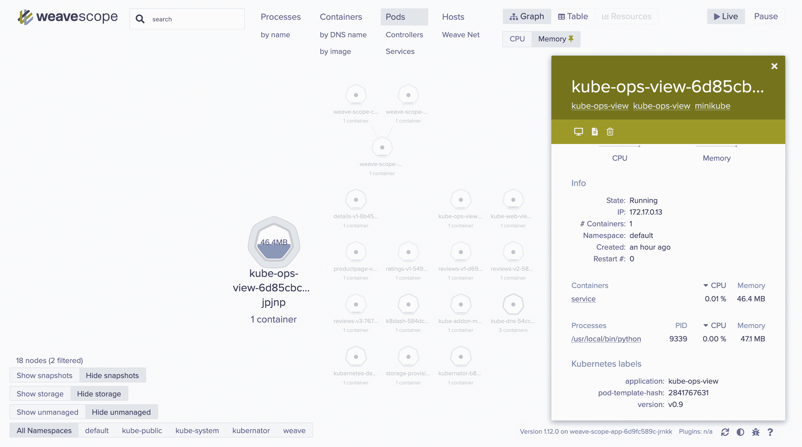[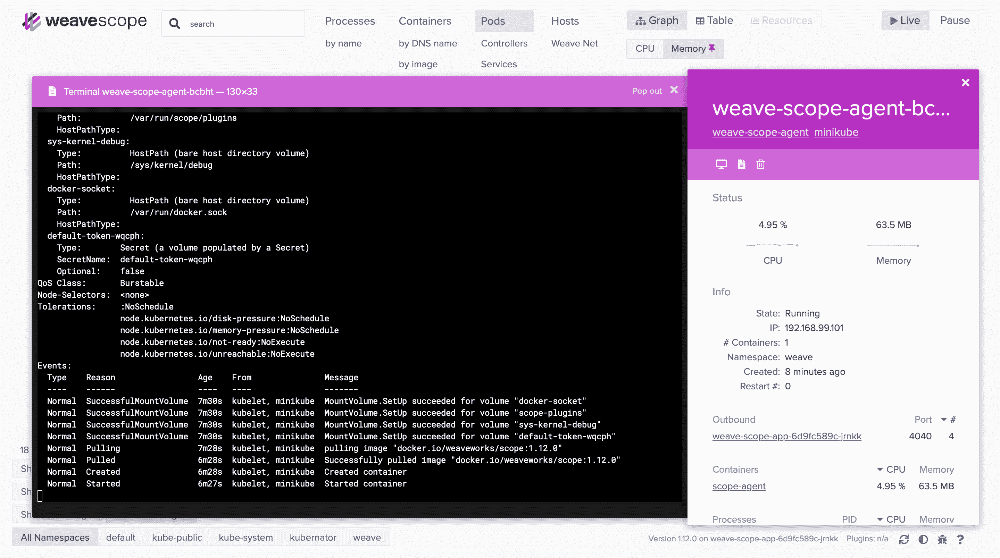](#)

更令人感兴趣的是 Weave Scope 捕捉吊舱如何相互通信的能力。这种洞察力是我在这里测试的其他仪表板所没有的。

[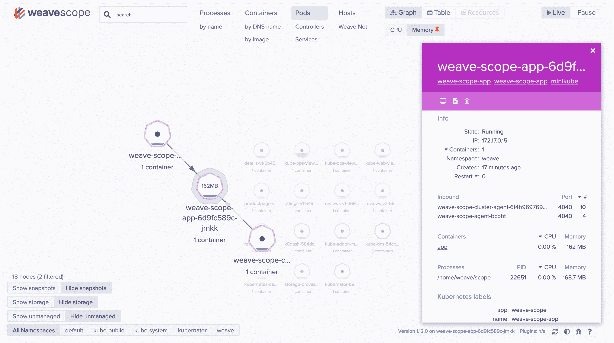](#)

但是，Weave 范围是非常面向过程的，忽略了静态资源，如配置映射、机密等。

安装很简单，只需一个 YAML 文件就可以直接部署到 Kubernetes 集群中。

```
kubectl apply -f "https://cloud.weave.works/k8s/scope.yaml?k8s-version=$(kubectl version | base64 | tr -d '\n')"
kubectl port-forward -n weave "$(kubectl get -n weave pod --selector=weave-scope-component=app -o jsonpath='{.items..metadata.name}')" 4040 
```

## 结论

如果官方的 Kubernetes 仪表板不能满足您的需求，有大量高质量、免费和开源的替代品可供选择。总的来说，我对这些仪表板的安装简单印象深刻，很明显，他们的设计中投入了大量的工作，大多数都提供了至少一个令人信服的更换理由。*