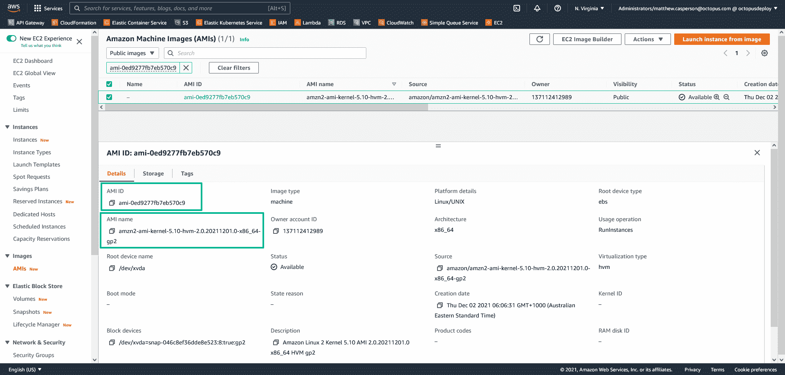

# 为 CloudFormation - Octopus Deploy 创建 AMI 映射

> 原文：<https://octopus.com/blog/ami-mappings-cloudformation>

AWS 提供的许多服务都是针对个别地区的，亚马逊机器图像(AMIs)只是其中一个例子。虽然通用 AMI 发布到所有地区，但每个地区的 AMI ID 都是唯一的。

这在编写 CloudFormation 脚本时提出了一个挑战，因为传递给 EC2 资源的 AMI ID 是特定于区域的，这使得您的模板也是特定于区域的。

[Mappings](https://docs.aws.amazon.com/AWSCloudFormation/latest/UserGuide/intrinsic-function-reference-findinmap.html) 可以用来编写通用的 CloudFormation 模板，允许 AMI IDs 映射到一个区域，并在部署模板时进行查找。不幸的是，AMI IDs 经常变化，并且没有简单的映射引用包含在您的模板中。

在本文中，您将了解如何使用最新的区域 AMI IDs 生成最新的映射，以便包含在您的 CloudFormation 模板中。

## 先决条件

脚本需要`jq`。`jq` [下载页面](https://stedolan.github.io/jq/download/)包含为主要 Linux 发行版安装工具的说明。

## 查找脚本

下面的 Bash 脚本在 YAML 构建了一个云结构图:

```
#!/usr/bin/env bash
echo "Mappings:"
echo "  RegionMap:"
regions=$(aws ec2 describe-regions --output text --query 'Regions[*].RegionName')
for region in $regions; do
    (
     echo "    $region:"
     AMI=$(aws ec2 describe-images --region $region --filters Name=is-public,Values=true Name=name,Values="$1*" Name=architecture,Values=x86_64 | jq -r '.Images |= sort_by(.CreationDate) | .Images | reverse | .[0].ImageId')
     echo "      ami: $AMI"
    )
done 
```

将脚本保存到类似于`amimap.sh`的文件中，然后使用命令将该文件标记为可执行文件:

```
chmod +x amimap.sh 
```

调用该脚本时，AMI 名称(或 AMI 名称的开头)作为第一个参数:

```
./amimap.sh amzn2-ami-kernel-5.10 
```

输出如下所示:

```
$ ./amimap.sh amzn2-ami-kernel-5.10-hvm
Mappings:
  RegionMap:
    eu-north-1:
      ami: ami-06bfd6343550d4a29
    ap-south-1:
      ami: ami-052cef05d01020f1d
    eu-west-3:
      ami: ami-0d3c032f5934e1b41
    eu-west-2:
      ami: ami-0d37e07bd4ff37148
    eu-west-1:
      ami: ami-04dd4500af104442f
    ap-northeast-3:
      ami: ami-0f1ffb565070e6947
    ap-northeast-2:
      ami: ami-0eb14fe5735c13eb5
    ap-northeast-1:
      ami: ami-0218d08a1f9dac831
    sa-east-1:
      ami: ami-0056d4296b1120bc3
    ca-central-1:
      ami: ami-0bae7412735610274
    ap-southeast-1:
      ami: ami-0dc5785603ad4ff54
    ap-southeast-2:
      ami: ami-0bd2230cfb28832f7
    eu-central-1:
      ami: ami-05d34d340fb1d89e5
    us-east-1:
      ami: ami-0ed9277fb7eb570c9
    us-east-2:
      ami: ami-002068ed284fb165b
    us-west-1:
      ami: ami-03af6a70ccd8cb578
    us-west-2:
      ami: ami-00f7e5c52c0f43726 
```

## 在云形成中使用映射

以下 CloudFormation 模板演示了如何使用脚本生成的映射:

```
Mappings:
  RegionMap:
    eu-north-1:
      ami: ami-06bfd6343550d4a29
    ap-south-1:
      ami: ami-052cef05d01020f1d
    eu-west-3:
      ami: ami-0d3c032f5934e1b41
    eu-west-2:
      ami: ami-0d37e07bd4ff37148
    eu-west-1:
      ami: ami-04dd4500af104442f
    ap-northeast-3:
      ami: ami-0f1ffb565070e6947
    ap-northeast-2:
      ami: ami-0eb14fe5735c13eb5
    ap-northeast-1:
      ami: ami-0218d08a1f9dac831
    sa-east-1:
      ami: ami-0056d4296b1120bc3
    ca-central-1:
      ami: ami-0bae7412735610274
    ap-southeast-1:
      ami: ami-0dc5785603ad4ff54
    ap-southeast-2:
      ami: ami-0bd2230cfb28832f7
    eu-central-1:
      ami: ami-05d34d340fb1d89e5
    us-east-1:
      ami: ami-0ed9277fb7eb570c9
    us-east-2:
      ami: ami-002068ed284fb165b
    us-west-1:
      ami: ami-03af6a70ccd8cb578
    us-west-2:
      ami: ami-00f7e5c52c0f43726
Resources: 
  myEC2Instance: 
    Type: "AWS::EC2::Instance"
    Properties: 
      ImageId: !FindInMap
        - RegionMap
        - !Ref 'AWS::Region'
        - ami
      InstanceType: m1.small 
```

## 查找 AMI 名称

您会从上面的命令中注意到，AMI 名称必须作为参数传递。然而，AWS 控制台通常会显示 AMI 描述，这对用户更友好。那么，如何从 AMI ID 或描述中找到名字呢？

一个简单的解决方案是在 EC2 控制台中打开**图像**链接。这允许通过其 ID 或描述来搜索公共 AMI，然后 AMI 详细信息页面显示 AMI 名称:

[](#)

## 使用参数存储

允许 CloudFormation 模板自动引用最新的 Amazon AMIs 的另一个选项是查询 AWS Systems Manager 参数存储。博客[使用 AWS 系统管理器参数存储查询最新的 Amazon Linux AMI id](https://aws.amazon.com/blogs/compute/query-for-the-latest-amazon-linux-ami-ids-using-aws-systems-manager-parameter-store/)演示了如何使用如下所示的模板引用最新的 Amazon Windows 和 Linux AMI:

```
Parameters:
  LatestAmiId:
    Type: 'AWS::SSM::Parameter::Value<AWS::EC2::Image::Id>'
    Default: '/aws/service/ami-amazon-linux-latest/amzn2-ami-hvm-x86_64-gp2'

Resources:
 Instance:
    Type: 'AWS::EC2::Instance'
    Properties:
      ImageId: !Ref LatestAmiId 
```

## 结论

用最新的 AMI IDs 保持您的 CloudFormation 模板的更新是一个持续的挑战。因为每个地区都有唯一的 AMI IDs，所以情况更加复杂。

在本文中，您了解了如何使用区域 AMI IDs 生成最新的映射，以便复制并粘贴到您的 CloudFormation 模板中。

查看我们的[关于云形成模板的其他帖子](https://octopus.com/blog/tag/CloudFormation)。

阅读我们的 [Runbooks 系列](https://octopus.com/blog/tag/Runbooks%20Series)的其余部分。

愉快的部署！