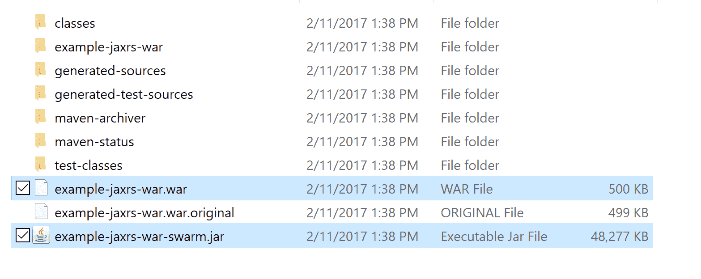
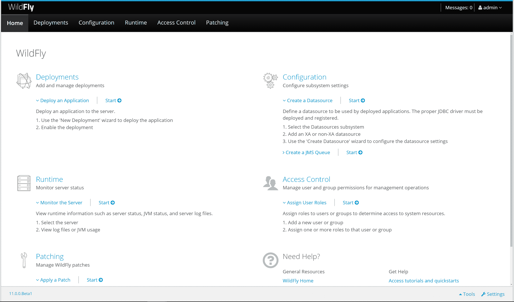

# 应用服务器与 UberJAR - Octopus 部署

> 原文：<https://octopus.com/blog/application-server-vs-uberjar>

不久前，如果您想部署一个 Java web 应用程序，您可以编译一个 WAR 文件并将其托管在应用服务器中。今天，Java web 应用程序可以像自包含的 UberJARs 一样容易地部署。

什么是像 [WildFly](http://wildfly.org/) 这样的应用服务器，什么是 UberJAR，以及像 [WildFly Swarm](http://wildfly-swarm.io/) 这样的项目如何改变 Java 部署的执行方式？

## 什么是 Java EE 应用服务器？

考虑以下代码:

```
public class HelloWorld {
    public static void main(String[] args)  {
        System.out.println("Hello, World");
    }
} 
```

这是用 Java 编写的传统的“Hello World”应用程序。作为一名开发人员，我可以在任何有 Java 运行时环境(JRE)的地方运行这些代码。我也不需要捆绑任何额外的类库，因为这里引用的所有类都是由任何 JRE 提供的，无论它是来自 Oracle、OpenJDK、Zulu 还是 IBM 等等。

哪个供应商提供了 JRE 并不重要，Java 应用程序最终运行在什么操作系统上也不重要。因为这段代码使用了标准的 Java 类，所以它可以在任何地方运行。

现在考虑这段代码:

```
package com.octopus;

import javax.ws.rs.ApplicationPath;
import javax.ws.rs.core.Application;

@ApplicationPath("/")
public class MyApplication extends Application {

    public MyApplication() {
    }
} 
```

```
package com.octopus;

import javax.ws.rs.GET;
import javax.ws.rs.Path;
import javax.ws.rs.Produces;

@Path("/")
public class MyResource {

    @GET
    @Produces("text/plain")
    public String get() {
        return "Hello World";
    }
} 
```

我们这里有一个基于 [JAX-RS](https://en.wikipedia.org/wiki/Java_API_for_RESTful_Web_Services) 标准的简单 REST API。JAX-RS 是 Java EE 规范的一部分，这意味着作为一名开发人员，我可以将这个应用程序部署到任何 Java EE 应用服务器上。

更重要的是，我不需要捆绑任何实现 JAX-RS 标准的库。根据应用服务器的不同，JAX-RS 标准可能由像 RESTEasy 或 Jersy 这样的库提供。但是只要底层库符合规范，我的应用程序就能按预期运行。

当然，Java EE 提供的不仅仅是创建 RESTful 服务的规范。它包括数据库访问、消息传递、邮件、MVC 框架、管理 API 和更多的规范。

多个供应商提供了 Java EE 规范的实现，WildFly 只是其中一个例子。你还有 [WebSphere、WebLogic、Payara、GlassFish、TomEE 等](https://en.wikipedia.org/wiki/List_of_application_servers#Java)。

但是我部署到哪个供应商的应用服务器并不重要。只要我的代码和应用服务器符合 Java EE 规范，我就可以在任何应用服务器上运行我的代码。

在现实世界的实践中，构建可以部署到多个 Java EE 应用服务器的 Java EE 应用程序并不容易。但是为了讨论的方便，我们假设情况是这样的。

因此，一般来说，Java EE 应用服务器提供了一个环境，在这个环境中可以部署和运行使用 Java EE 规范编写的应用程序。

重要的是，Java EE 应用服务器通常并排托管多个应用程序。例如，您可以部署多个网站，每个网站都被编译为一个单独的 WAR 文件，并排放在一个应用服务器中。可以独立地部署、启动、停止和取消部署各个应用程序，而不必启动和停止应用服务器本身。

## 什么是战争？

Web 档案(WAR)是 Java web 应用程序使用的一种档案格式。

看看[爆炸部署 vs 战争套装](https://octopus.com/blog/defining-tomcat-context-paths#exploded-deployments-vs-war-packages)关于战争和爆炸战争的讨论。

## 什么是 UberJAR？

UberJAR 不是官方术语，还有 FatJAR、ShadowJAR 之类的其他名称。所有这些术语都指一个 JAR 文件，其中包含运行应用程序所需的所有类和资源。

考虑一下这个[小代码](https://github.com/OctopusDeploy/UberJARDemo)，它使用了 Apache Commons 库。

```
package com.octopus;

import org.apache.commons.lang3.StringUtils;

public class Main {
    public static void main(String[] args) {
        System.out.println(StringUtils.trim(" hello world "));
    }
} 
```

为了从这段代码中生成一个可执行的 JAR，Maven build 添加了一个包含以下内容的清单文件:

```
Manifest-Version: 1.0
Archiver-Version: Plexus Archiver
Built-By: mcasperson
Class-Path: libs/commons-lang3-3.6.jar
Created-By: Apache Maven 3.5.0
Build-Jdk: 1.8.0_131
Main-Class: com.octopus.Main 
```

这里重要的一行是`Class-Path`，它引用了`libs/commons-lang3-3.6.jar`下的第二个 JAR 文件。

当我们列出 JAR 文件的内容时，我们会看到它只包含了`Main.class`文件。

```
$ jar tf target/original-uberjardemo-1.0-SNAPSHOT.jar
META-INF/
META-INF/MANIFEST.MF
com/
com/octopus/
com/octopus/Main.class
META-INF/maven/
META-INF/maven/com.octopus/
META-INF/maven/com.octopus/uberjardemo/
META-INF/maven/com.octopus/uberjardemo/pom.xml
META-INF/maven/com.octopus/uberjardemo/pom.properties 
```

要运行这个“传统的”JAR 文件，它和它的库 JAR 文件都需要存在。在这个简单的例子中，这意味着应用程序由两个 JAR 文件组成。但是一个应用程序需要几十个 JAR 文件并不罕见。

这个应用程序的 UberJAR 版本创建了一个 JAR 文件，它是所有独立依赖项的合并结果。UberJAR 文件可能非常大，但是因为它们是一个单独的文件，所以很容易分发。

如果我们列出 UberJAR 的内容，我们可以看到我们的`Main.class`文件存在，还有组成 Apache Commons 库的类。

```
$ jar tf target/uberjardemo-1.0-SNAPSHOT.jar
META-INF/
META-INF/MANIFEST.MF
com/
com/octopus/
com/octopus/Main.class
META-INF/maven/
META-INF/maven/com.octopus/
META-INF/maven/com.octopus/uberjardemo/
META-INF/maven/com.octopus/uberjardemo/pom.xml
META-INF/maven/com.octopus/uberjardemo/pom.properties
META-INF/LICENSE.txt
org/
org/apache/
org/apache/commons/
org/apache/commons/lang3/
org/apache/commons/lang3/BitField.class
... and many more apache classes 
```

UberJAR 文件与 WAR 文件相似，都是可用于运行应用程序的独立文件。它们的不同之处在于 WAR 文件需要一个应用服务器来运行，而 UberJAR 文件可以从 JRE 中运行。

### 什么是野生蜂群？

[WildFly Swarm](http://wildfly-swarm.io/) 是一个项目，它提供了将 WildFly 应用服务器提供的相同 Java EE 库捆绑到 UberJAR 中的能力。最终结果是一个单独的 JAR 文件，当它被执行时，将启动一个 web 服务器并运行 Java EE 应用程序。

WildFly Swarm 如何将所需的类和资源嵌入到 UberJAR 中的实际机制比我上面给出的例子更复杂，但最终结果是相同的:您得到一个可从任何 JRE 运行的可执行 JAR 文件。

WildFly Swarm 团队提供了一堆例子，他们[JAX-遥感的例子](https://github.com/wildfly-swarm/wildfly-swarm-examples/tree/master/jaxrs/jaxrs)与我上面展示的 hello world 的例子非常相似。

一旦编译完成，WildFly Swarm UberJAR 文件就可以使用标准的`java`可执行文件从命令行执行。

```
$ java -jar example-jaxrs-war-swarm.jar
2017-11-02 03:43:29,747 INFO  [org.wildfly.swarm] (main) WFSWARM0013: Installed fraction:                  Logging - STABLE          org.wildfly.swarm:logging:2017.11.0-SNAPSHOT
2017-11-02 03:43:29,756 INFO  [org.wildfly.swarm] (main) WFSWARM0013: Installed fraction:          Bean Validation - STABLE          org.wildfly.swarm:bean-validation:2017.11.0-SNAPSHOT
2017-11-02 03:43:29,757 INFO  [org.wildfly.swarm] (main) WFSWARM0013: Installed fraction:                   JAX-RS - STABLE          org.wildfly.swarm:jaxrs:2017.11.0-SNAPSHOT
2017-11-02 03:43:29,757 INFO  [org.wildfly.swarm] (main) WFSWARM0013: Installed fraction:                 Undertow - STABLE          org.wildfly.swarm:undertow:2017.11.0-SNAPSHOT
2017-11-02 03:43:29,758 WARN  [org.wildfly.swarm] (main) WFSWARM0013: Installed fraction:                  Swagger - UNSTABLE        org.wildfly.swarm:swagger:2017.11.0-SNAPSHOT
2017-11-02 03:43:32,158 INFO  [org.jboss.msc] (main) JBoss MSC version 1.2.6.Final
2017-11-02 03:43:32,250 INFO  [org.jboss.as] (MSC service thread 1-1) WFLYSRV0049: WildFly Swarm 2017.11.0-SNAPSHOT (WildFly Core 2.2.1.Final) starting
2017-11-02 03:43:32,340 INFO  [org.wildfly.swarm] (MSC service thread 1-1) WFSWARM0019: Install MSC service for command line args: []
2017-11-02 03:43:33,172 INFO  [org.jboss.as.naming] (ServerService Thread Pool -- 18) WFLYNAM0001: Activating Naming Subsystem
2017-11-02 03:43:33,175 INFO  [org.jboss.as.security] (ServerService Thread Pool -- 12) WFLYSEC0002: Activating Security Subsystem
2017-11-02 03:43:33,193 INFO  [org.jboss.as.security] (MSC service thread 1-2) WFLYSEC0001: Current PicketBox version=4.9.6.Final
2017-11-02 03:43:33,200 INFO  [org.wildfly.extension.io] (ServerService Thread Pool -- 17) WFLYIO001: Worker 'default' has auto-configured to 2 core threads with 16 task threads based on your 1 available processors
2017-11-02 03:43:33,355 INFO  [org.jboss.as.naming] (MSC service thread 1-2) WFLYNAM0003: Starting Naming Service
2017-11-02 03:43:33,365 INFO  [org.wildfly.extension.undertow] (MSC service thread 1-2) WFLYUT0003: Undertow 1.4.11.Final starting
2017-11-02 03:43:33,432 INFO  [org.xnio] (MSC service thread 1-1) XNIO version 3.4.3.Final
2017-11-02 03:43:33,447 INFO  [org.xnio.nio] (MSC service thread 1-1) XNIO NIO Implementation Version 3.4.3.Final
2017-11-02 03:43:33,524 INFO  [org.wildfly.extension.undertow] (MSC service thread 1-1) WFLYUT0012: Started server default-server.
2017-11-02 03:43:33,585 INFO  [org.wildfly.extension.undertow] (MSC service thread 1-2) WFLYUT0006: Undertow HTTP listener default listening on [0:0:0:0:0:0:0:0]:8080
2017-11-02 03:43:33,765 INFO  [org.jboss.as] (Controller Boot Thread) WFLYSRV0025: WildFly Swarm 2017.11.0-SNAPSHOT (WildFly Core 2.2.1.Final) started in 1667ms - Started 70 of 77 services (14 services are lazy, passive or on-demand)
2017-11-02 03:43:34,002 WARN  [org.wildfly.swarm.swagger] (main) WFSSWGR0002: Ignoring package: org.wildfly.swarm.generated
2017-11-02 03:43:34,003 WARN  [org.wildfly.swarm.swagger] (main) WFSSWGR0002: Ignoring package: org.wildfly.swarm.generated
2017-11-02 03:43:34,004 INFO  [org.wildfly.swarm.swagger] (main) WFSSWGR0004: Configure Swagger for deployment example-jaxrs-war.war with package org.wildfly.examples.swarm.jaxrs
2017-11-02 03:43:34,309 INFO  [org.wildfly.swarm.runtime.deployer] (main) deploying example-jaxrs-war.war
2017-11-02 03:43:34,351 INFO  [org.jboss.as.server.deployment] (MSC service thread 1-1) WFLYSRV0027: Starting deployment of "example-jaxrs-war.war" (runtime-name: "example-jaxrs-war.war")
2017-11-02 03:43:35,307 INFO  [org.wildfly.extension.undertow] (MSC service thread 1-1) WFLYUT0018: Host default-host starting
2017-11-02 03:43:35,660 INFO  [org.jboss.resteasy.resteasy_jaxrs.i18n] (ServerService Thread Pool -- 2) RESTEASY002225: Deploying javax.ws.rs.core.Application: class org.wildfly.examples.swarm.jaxrs.MyApplication
2017-11-02 03:43:35,692 INFO  [org.wildfly.extension.undertow] (ServerService Thread Pool -- 2) WFLYUT0021: Registered web context: /
2017-11-02 03:43:35,800 INFO  [org.jboss.as.server] (main) WFLYSRV0010: Deployed "example-jaxrs-war.war" (runtime-name : "example-jaxrs-war.war")
2017-11-02 03:43:35,808 INFO  [org.wildfly.swarm] (main) WFSWARM99999: WildFly Swarm is Ready 
```

### 应用服务器还是 UberJAR？

从应用程序的角度来看，部署到应用服务器或作为独立的 UberJAR 运行没有什么区别。您可以访问相同的库，并可以公开相同的功能。事实上，您可以将一个构建传统 Java EE WAR 文件的项目转换为 WildFly Swarm UberJAR，而无需修改代码，只需在 Maven 或 Gradle 项目文件中添加几行代码。

构建 WildFly Swarm JAX-RS 示例项目实际上会生成 UberJAR 和 WAR 文件。WAR 文件可以部署到 WildFly 应用服务器，并运行与 UberJAR 相同的代码。这突出了这样一个事实，即在构建 WAR 文件以部署到应用服务器或可以独立运行的 UberJAR 时，代码不会改变。

[](#)

这些方法之间的区别更多地在于应用程序编译后的部署和管理方式。

多年来，应用服务器已经发展到提供丰富的管理工具，允许通过 web 界面或命令行部署、启动、停止、取消部署和升级应用程序。

[](#)

应用服务器还可以提供资源的集中配置，如数据库连接和消息队列。这种资源和应用程序的分离在运营人员控制诸如数据库线程和凭证之类的东西的环境中工作得很好。

您还可以通过让多个应用程序共享公共库来减少应用服务器的内存消耗。我见过应用服务器运行数百个单独的 web 应用，其中应用服务器托管共享库，这将每个 web 应用减少到仅几 MB。

然而，随着微服务、不可变基础设施和 PaaS 等范例越来越受欢迎，应用服务器已经过时了。在这些情况下，自包含的 UberJARs 是更自然的选择。

扩展部署为 UberJARs 的应用程序很容易，因为每个单独的应用程序都可以在需求增加时部署到新的实例，并在需求减少时关闭。

所有支持 Java 的 PaaS 解决方案都将支持运行 UberJAR，因为 Uber jar 只需要存在一个 JRE。虽然一些 PaaS 解决方案支持应用服务器，但它们往往只支持一两家供应商，或者依赖社区贡献来构建应用服务器环境。

UberJARs 还具有将基础设施移入 Java 构建工具的效果。例如，在构建 UberJAR 时，开发人员负责添加数据库连接驱动程序和配置，而不是依赖于应用服务器所拥有的配置。

不过 UberJARs 没有管理层。部署、启动和关闭应用程序由您决定；您无法获得应用服务器提供的那种本机管理工具。PaaS 解决方案通常会提供管理 UberJARs 的工具。

如果您对 Java 应用程序的自动化部署感兴趣，[下载 Octopus Deploy](https://octopus.com/downloads) 的试用版，并查看一下[我们的文档](https://octopus.com/docs/deployments/java/deploying-java-applications)。