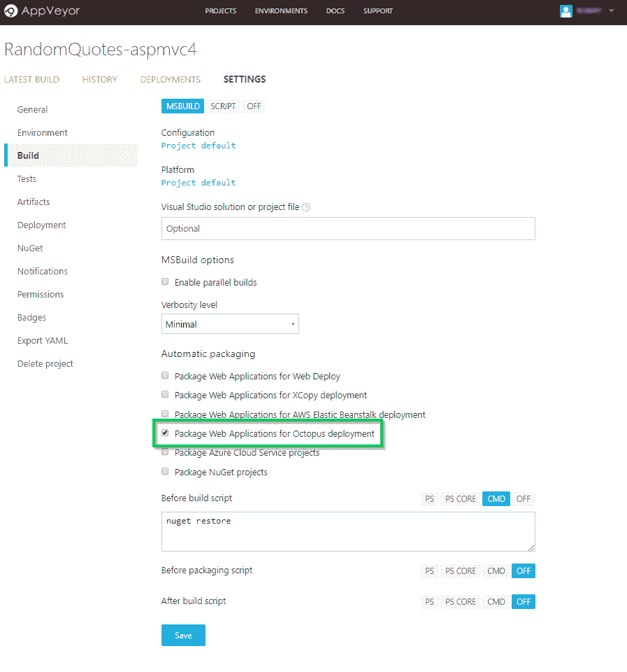
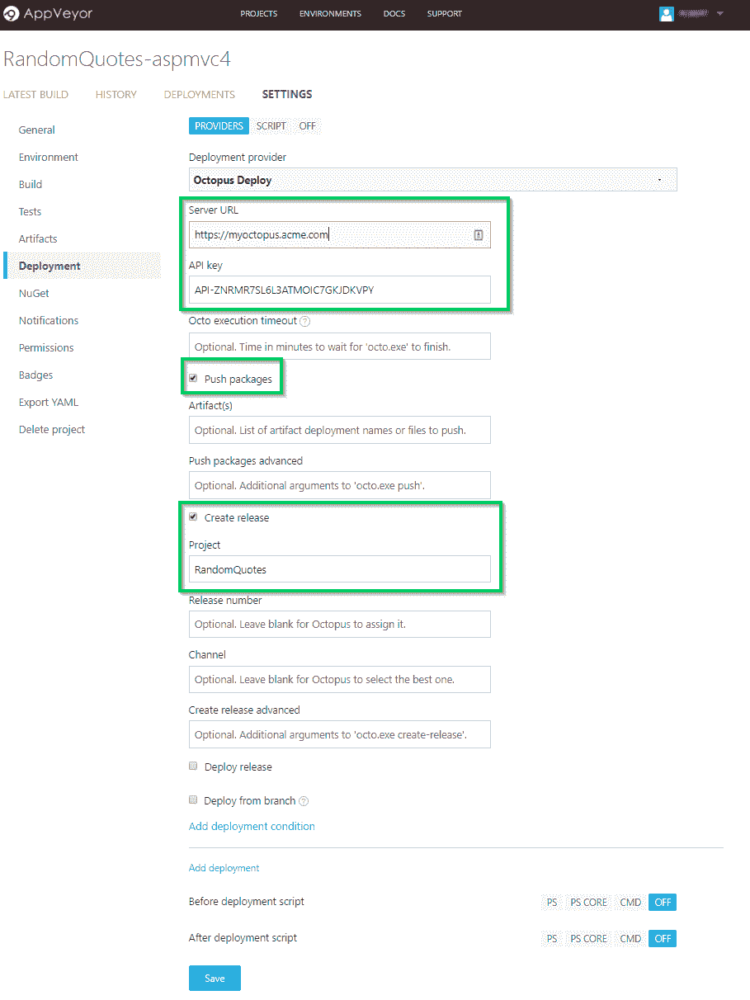
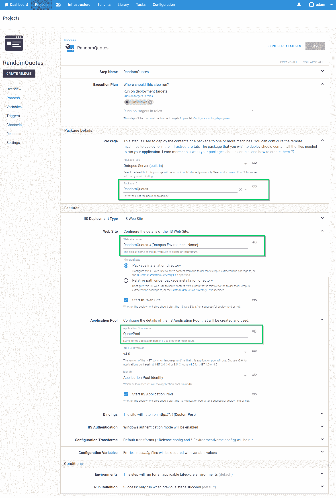
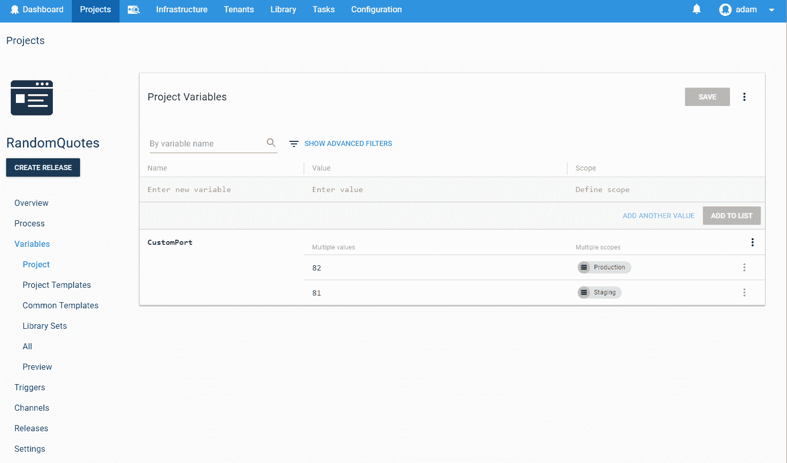
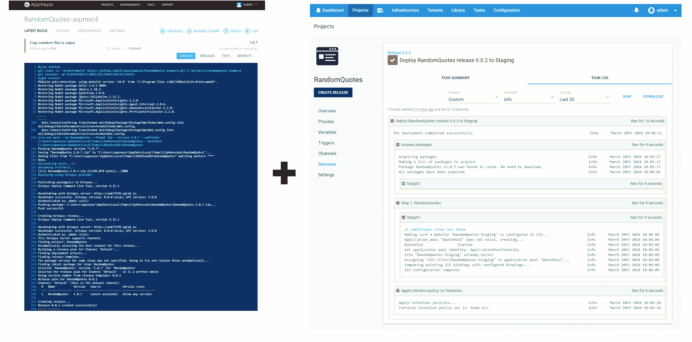
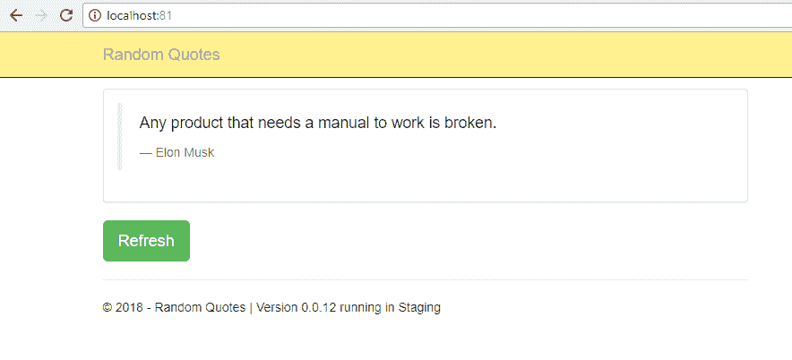
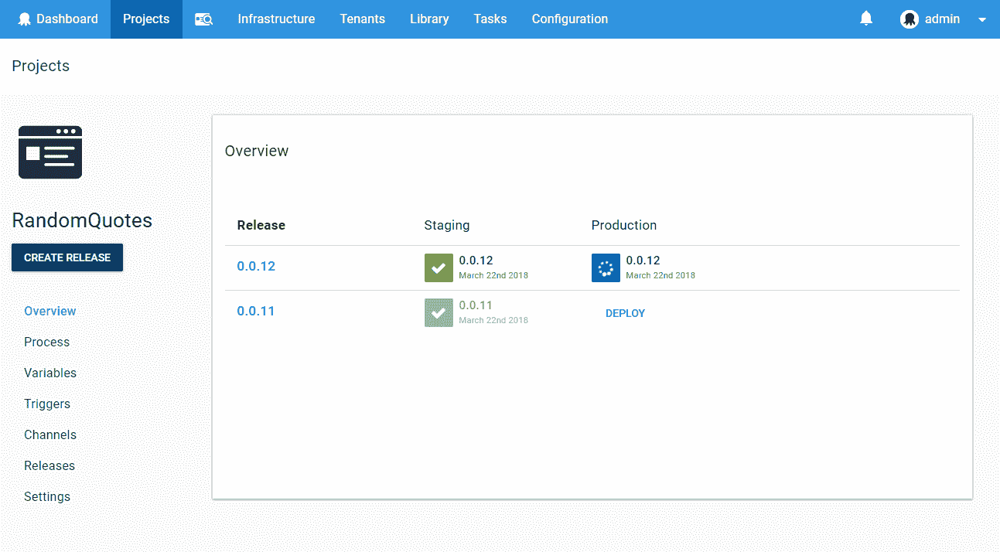
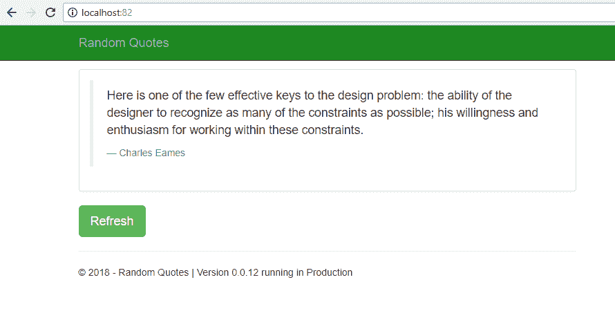

# Octopus Deploy 来到 AppVeyor - Octopus Deploy

> 原文：<https://octopus.com/blog/appveyor-integration>

[](#)

AppVeyor 的优秀团队最近增加了对推送和部署项目的内置支持。NET、Java、JavaScript 等)与 Octopus 一起部署。AppVeyor 是一个云托管的持续集成工具，在开源项目中非常流行，尤其是在。净空间。从与您的源代码控制直接集成到部署插件，如他们的新 Octopus Deploy 产品，AppVeyor 提供了一个简单的开箱即用的解决方案来构建您的应用程序，而不必管理您自己的构建基础设施。每个构建都有自己干净的环境，其中包含启动自动化 CI 解决方案所需的所有工具。现在有了新的 Octopus 集成，这个过程将变得更加容易。

**与我们即将推出的 [Octopus Cloud](https://octopus.com/cloud) 产品结合使用，您将很快能够创建一个基于云的、完全可扩展的持续部署管道，而无需自己管理一台机器。那是多么令人兴奋啊！**

让我们看一个如何充分利用这一新产品的示例。

## appveyor 章鱼外挂程式

在一个简单的免费注册过程之后，我们可以开始创建一个新的 AppVeyor 项目，我已经添加了`OctopusSamples/RandomQuotes-aspmvc4` GitHub 库作为源代码库。从 BitBucket 到 VSTS，还有一系列其他存储库选项可供选择。公共的[OctopusSamples/RandomQuotes-aspmvc 4](https://github.com/OctopusSamples/RandomQuotes-aspmvc4)存储库提供了一个基本的 ASP.NET MVC 应用程序来显示一串明智的报价。我们的目标是建立一个交付管道，将该网站部署到我们的 IIS 服务器上，用于试运行和生产环境。

### 构建和打包

查看构建阶段，您应该注意到一个`Package Applications for Octopus Deployment`标志。

[](#)

这个标志确保构建完成后，内容被压缩到一个包中，这个包可以被推送到 Octopus Deploy。虽然 Octopus 将接受任何 NuGet、zip 或 tar 包，但是这个标志将利用`octo.exe`到[创建一个 zip](https://octopus.com/docs/packaging-applications/create-packages/) ，使用这个 AppVeyor 项目的应用程序名称和版本来命名。

### 推

在`Deployment`配置中，选择新的`Octopus Deploy`部署提供者。这个特性执行所有适当的调用，将包传递给 Octopus，并创建一个相关的 Octopus [Release](https://octopus.com/docs/releases) 。

[](#)

添加您的 Octopus 服务器 URL 和 API 密钥后，勾选`Push Packages`选项，允许 AppVeyor 自动检测上一步构建的 Octopus 包。AppVeyor 随后会将包裹推送到 Octopus [内置的 NuGet feed](https://octopus.com/docs/octopus-rest-api/examples/feeds/push-package-to-builtin-feed/) 。虽然 Octopus 支持在新的包可用时自动创建发布版本，但是在这个场景中，我们将通过 AppVeyor 来触发它。单击`Create Release`复选框并提供项目名称`RandomQuotes`，我们稍后将在 Octopus 中设置该项目，AppVeyor 将通过编程触发该项目。

#### 源控制配置

AppVeyor 的另一个很棒的特性是能够通过一个`appveyor.yml`文件提供您的构建配置，该文件与您的代码共存，而不是通过 web 门户进行设置。这意味着该过程可以直接与源代码联系起来，这样可以简化版本管理，并且您的构建步骤可以与项目一起发展。阅读他们的[文档](https://www.appveyor.com/docs/build-configuration/#appveyoryml-and-ui-coexistence)以获得更多关于这在实践中如何工作的信息。这种方法类似于我们 Octopus 正在开发的一个功能，允许您的 CD 管道的部署端通过源代码控制配置进行存储。[看看](https://github.com/OctopusDeploy/Specs/blob/master/ProcessAsCode/index.md)关于我们如何实现“带代码的部署配置”的想法，让我们知道你的想法。

随着我们的 AppVeyor 构建管道的建立，现在让我们进入我们的 Octopus 服务器并部署这个网站。

## 通过八达通继续部署

为了与我们刚刚在 AppVeyor 中提供的配置相匹配，创建一个新项目，并将其命名为`RandomQuotes`。对于我们的简单部署场景，我们将首先转到`Process`部分，简单地添加一个新的 IIS 步骤。选择`Deploy to IIS`步骤后，我们将添加一些设置来提供 Octopus 信息，以便创建和配置 IIS 网站。

[](#)

在提供了一个映射到目标的角色之后，我们将配置哪个包将用于这一步。使用内置的 AppVeyor 将推送至该 feed ),我们可以提供 PackageId `RandomQuotes`。

配置网站本身最简单的方法就是设置两个额外的值，`Website name`和`AppPool`。对于这个例子，我们将在同一台机器上同时托管`Staging`和`Production`(对于一个真实的项目来说，这不是一个好主意)，所以我们将根据正在部署的环境提供一个不同的网站名称。名称的`#{Octopus.Environment.Name}`部分将在部署时被替换为环境的名称。

除了`Website Name`之外，我们还决定在`Staging`和`Production`之间提供不同的绑定端口。这个值`#{CustomPort}`是在项目的`Variables`部分中设置的，可以根据不同的部署环境组合(如环境、机器或[租户](https://octopus.com/docs/tenants))来设定不同的值，这里仅举几个例子。

[](#)

一种常见的模式是在 Octopus 中为不同的环境定义变量，这些变量在应用程序运行时使用的配置文件中被替换。在部署过程中使用它们会带来大量高级场景。

对于我们的`RandomQuotes`项目，我们为每个环境都有一个配置转换文件。看起来像这样的`Web.Production.config`转换:

```
<?xml version="1.0"?>
<configuration xmlns:xdt="http://schemas.microsoft.com/XML-Document-Transform">
  <appSettings>
    <add key="ReleaseVersion" value="#{Octopus.Release.Number}" xdt:Transform="SetAttributes" xdt:Locator="Match(key)"/>
    <add key="EnvironmentName" value="#{Octopus.Environment.Name}" xdt:Transform="SetAttributes" xdt:Locator="Match(key)"/>
    <add key="BackgroundColor" value="#1e8822" xdt:Transform="SetAttributes" xdt:Locator="Match(key)"/>
  </appSettings>
  <system.web>
    <compilation xdt:Transform="RemoveAttributes(debug)" />
  </system.web>
</configuration> 
```

注意`ReleaseVersion`的值包含了部署期间提供的模板模式。(如果实在受不了悬念和什么来看看这是什么样子，就跳到这篇帖子的末尾)。

## 承诺并享受

现在，我们已经配置了自动化 CI/CD 渠道。当我们提交对项目的更改时，AppVeyor 将自动检测并从 GitHub 中提取更改，构建项目，并将其推送到我们的 Octopus 服务器。从那时起，Octopus Deploy 接管并将其部署到我们的`Staging`环境中。一旦我们对这个版本感到满意，我们可以通过点击一个按钮来部署到`Production`。已经过测试的同一个构建好的包将使用我们的变量提供的新值被推送到我们的生产环境中。

【T2 

当部署发生时，Octopus 将在您的项目中应用任何 web.config 转换并执行变量替换，以便在每个环境中运行相同的构建工件，确保您测试的代码是您在生产中运行的代码。

**分期**

[](#)

有了应用程序的试运行版本，我们就可以在开始生产部署之前对其进行检查和测试...

[](#)

**生产**

[](#)

请注意转换是如何应用的，它改变了导航条的颜色，同时端口和其他变量也根据部署到的环境进行了更新。

有关这项新功能的更多信息，请务必阅读我们的 [AppVeyordocs](https://octopus.com/docs/packaging-applications/build-servers/appveyor)

## AppVeyor + Octopus =随时部署

AppVeyor 与 Octopus Deploy 的结合提供了一种令人兴奋的新方法，以可重复、可靠的方式自动化您的连续交付渠道。向在周五下午 5 点崩溃的手工定制脚本解决方案说再见吧。今天用一个[免费八达通试用](https://octopus.com/licenses/trial)来发挥 AppVeyor 新功能的威力。

愉快的部署！