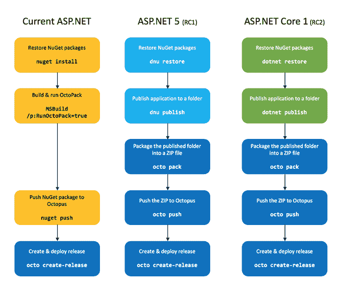
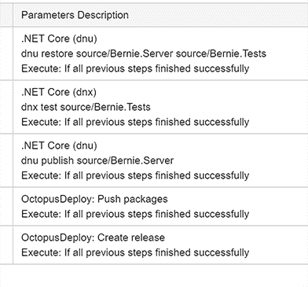
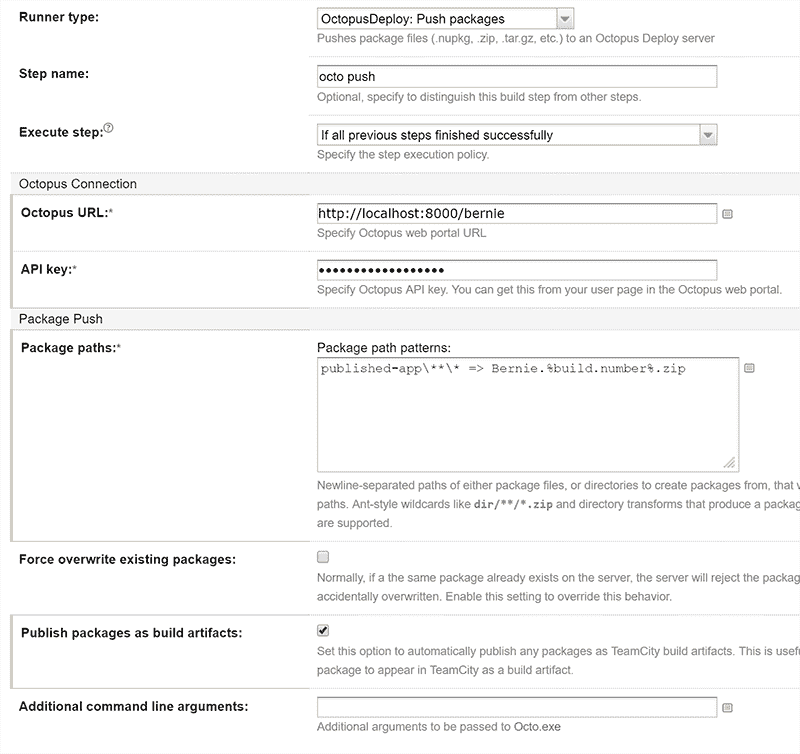

# ASP.NET 核心 1 建设和部署管道，采用 TeamCity 和 Octopus - Octopus 部署

> 原文：<https://octopus.com/blog/aspnet-core-build-and-deploy>

很难形容我对即将到来的[ASP.NET Core 1](http://www.hanselman.com/blog/ASPNET5IsDeadIntroducingASPNETCore10AndNETCore10.aspx)和 [dotnet CLI](http://dotnet.github.io/) 的变革浪潮有多兴奋。虽然编程语言和 API 没有显著变化，但围绕运行时如何分布的幕后工作，首先转向命令行，并使其跨平台，是非常棒的。这是成为. NET 开发人员的大好时机。

在这篇文章中，我想解释一些我认为影响开发人员构建和部署管道的主要变化，并展示它将如何与 ASP.NET 核心 1 RC1 和 RC2 一起工作。我的计划是将这些全部放入关于 ASP.NET Core 1 构建和部署的免费电子书中，但是考虑到 T2 迁移到 dotnet CLI 并推迟了发布日期，我认为是时候在这本书等待 RC2 发布的时候进行更新了。

在我们开始讨论如何构建和部署之前，我想谈谈一个重大变化。

## 发布应用程序将被标准化！

当你把一个 ASP.NET 应用程序发布到产品中时，它需要一些文件——DLL、配置文件、CSS/JS、图像等等。同样，当 Windows 服务或控制台应用程序在生产环境中运行时，它需要一些文件——可执行文件、DLL、配置文件等。

直到现在，从来没有一个一致的方法来“发布”所有这些。NET 应用程序。ASP.NET 项目有一个复杂的命令行咒语，可以“发布”网站，但不适用于 Windows 服务。对于 Windows 服务，你可能只需要压缩`bin\release`目录。这就是为什么在过去的四年里，我们依靠 [OctoPack](http://docs.octopusdeploy.com/display/OD/Using+OctoPack) 来沟通这一切——OctoPack 的全部目的是查看你的项目，并试图找出应该发表的内容。

我很遗憾没有一个标准的方法来发布和打包所有的内容。NET 应用程序:一个通用的软件包格式。网。

好消息是，当 dotnet CLI 发布时，最终会有一个标准的方式来发布这些应用程序。它们只发布到一个文件夹中，因此需要额外的步骤来打包应用程序，但至少这是非常接近的。

使用新的`dotnet`工具，你可以`dotnet publish`一个 web 应用程序，或者一个控制台应用程序，或者可能是一个 Windows 服务，或者最终是 WPF 应用程序(假设所有这些平台最终都被移植)，它将生成一个文件夹，其中包含应用程序运行所需的文件。

这还有另一个影响: **OctoPack 将成为过去的遗迹**。T2 和压缩输出的结合将会是替代品。

## 构建和部署过程将会是什么样子

下图概述了在这个美丽新世界中，使用 Octopus 构建和部署管道的构建模块:



## 一个例子

这是 ASP.NET 5 RC1 的一个例子:

```
dnu restore source/MyApp.Web source/MyApp.Tests

dnu publish source/MyApp.Web --runtime active --out published-app --no-source

octo pack --id MyApp.Web --version 1.0.0 --basePath published-app --format zip

octo push --package MyApp.Web.1.0.0.zip --server http://octopus --apikey API-1234567

octo create-release --project MyApp --version 1.0.0 --packageversion 1.0.0 --server http://octopus --apikey API-1234567 
```

## 与团队合作

TeamCity 团队正在开发一个[新插件，它包装了 DNU/DNX 和`dotnet`命令](https://github.com/JetBrains/teamcity-dnx-plugin)。不用写脚本，你可以使用这个插件来执行上面的`dnu`命令:



本周我们还发布了一个包装了`octo.exe push`的章鱼团队城市插件的更新。您可以使用它来动态创建 ZIP 文件并将其推送到 Octopus:



一旦您发布了应用程序，对其进行了打包，并将其推送到 Octopus，就一切如常了。我们有一个新的 [Octopus JSON 配置特性](http://docs.octopusdeploy.com/display/OD/JSON+Configuration+Variables+Feature)来利用新的`appsettings.json`文件格式，但是除此之外，Octopus 内部不需要做太多改变来支持 ASP.NET 核心 1。

## 摘要

ASP。NET Core 1 使发布成为平台的第一级特性。这消除了对 OctoPack 的需求，并将最终标准化发布应用程序以供部署的过程。如果你正在使用 TeamCity，有一个新的插件来调用这些命令，我们可以期待其他构建服务器在未来得到类似的命令。剩下的就是压缩发布的文件夹，推送到 Octopus，然后用 Octopus 部署。

欢迎来到美丽新世界！