# 使用 Octopus - Octopus Deploy 将 ASP.NET 核心部署到 Linux

> 原文：<https://octopus.com/blog/aspnet-core-linux>

你可能已经看过了。NET Core 和 ASP.NET Core 1.0 最近在[开发](http://www.devnation.org/)上发布。

在[主题演讲](https://www.youtube.com/watch?v=MiUrYH3ybX0)期间，斯科特·汉斯曼演示了使用 Octopus Deploy 将. NET 核心应用程序部署到 Red Hat Linux 服务器上([斯科特在 48:15](https://youtu.be/MiUrYH3ybX0?t=48m15s) 上台，[在 1:02:00](https://youtu.be/MiUrYH3ybX0?t=1h2m) 演示 Octopus Deploy 集成)。

我们很荣幸在斯科特的报告中被提及。我们对这种可能性感到兴奋。网芯。

斯科特可以理解地跳过了血淋淋的细节。对于那些感兴趣的人来说，这篇文章将更深入地探讨 ASP.NET 核心应用程序在 Linux 服务器上的真实部署。

**免责声明:** IANALG(我不是 Linux 的家伙)。但我觉得这才是重点。大多数。NET 开发人员(至少目前)最熟悉 Windows。对于我们许多人来说，Linux 是一个陌生的(老实说，是可怕的)新世界。来吧，让我们手牵手...

## 最佳食用期

写一篇技术程序文章的问题是，当你写完它的时候，它通常已经过时了(这个问题在关注。网芯)。

只要有可能，我都会参考官方文档，这些文档更容易维护。

## 佐料

*   显然，我们将需要一个 Octopus 部署服务器。如果你手头没有，那么[下载一个试用](https://octopus.com/downloads)实例或者从 [Azure Marketplace](https://azure.microsoft.com/en-us/marketplace/partners/octopus/octopusdeployoctopus-deploy/) 上升级一个。

*   要部署到的 Linux 服务器。在 Hanselman 先生的带领下，我们将使用运行 Red Hat Enterprise Linux 7.2 的服务器。你可以在 Azure 中轻松创建一个 [RHEL 虚拟机。](https://azure.microsoft.com/en-us/marketplace/partners/redhat/redhatenterpriselinux72/)

*   要部署的 ASP.NET 核心应用程序。我们将使用一个为此而创建的演示项目:[https://github.com/MJRichardson/aspnetcoredemo](https://github.com/MJRichardson/aspnetcoredemo)
    它很简单，但是包含两个相关的特性:

    *   它使用来自`appsettings.json`的配置设置(我们将把 Octopus 变量代入其中)
    *   它包含一些位于`\conf`目录下的配置文件，我们将使用这些文件来配置我们的 Linux 服务器。

## 创建一个包

*如果你想跳过创建包，你可以从 GitHub 库的[发布](https://github.com/MJRichardson/aspnetcoredemo/releases/tag/1.0.0)页面下载 zip 文件。*

如果您还没有，克隆示例应用程序 repo:

```
git clone https://github.com/MJRichardson/aspnetcoredemo.git 
```

移动到您克隆项目的目录。下面的命令将从那里运行。

**注:**我们章鱼总部有句话:*“朋友不让朋友右键-发布”*。在一个. NET 核心世界里我们可能要把它更新为:*“朋友不让朋友 dotnet 发布”*。创建您的包并将其推送到 Octopus 应该由您的构建服务器来执行。插件可用于大多数流行的构建服务器(例如[团队城市](http://docs.octopusdeploy.com/display/OD/TeamCity)、[詹金斯](https://wiki.jenkins-ci.org/display/JENKINS/OctopusDeploy+Plugin)、 [TFS](http://docs.octopusdeploy.com/pages/viewpage.action?pageId=5669025) )。

见[此处](http://docs.octopusdeploy.com/display/OD/Deploying+ASP.NET+Core+Web+Applications)获取我们向 Octopus 发布 ASP.NET 核心应用的官方文档。

恢复 NuGet 包:

```
dotnet restore src 
```

将应用程序发布到目录:

```
dotnet publish src --output published 
```

目录的内容将是我们的包的内容。你可以用你喜欢的归档工具(我推荐 [7-Zip](http://www.7-zip.org) )将`\published`(不是目录)的*内容*归档到一个名为`aspnetcoredemo.1.0.0.zip`的文件中。

现在把包上传到 Octopus Deploy。

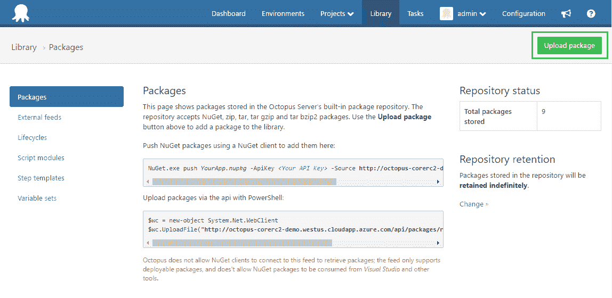

您现在应该可以看到您发布的包:


## 在 Octopus 中创建一个 SSH 目标

### 八达通要求

Red Hat Linux 服务器必须满足几个要求才能被添加为 Octopus 中的 SSH 目标:

#### 单声道的

必须安装 Mono。最新说明可在[单声道文档](http://www.mono-project.com/docs/getting-started/install/linux/)中找到。对于 RHEL 服务器，请遵循“CentOS 和衍生品”一节。

在一个*根外壳*中，执行:

```
yum install yum-utils
rpm --import "http://keyserver.ubuntu.com/pks/lookup?op=get&search=0x3FA7E0328081BFF6A14DA29AA6A19B38D3D831EF"
yum-config-manager --add-repo http://download.mono-project.com/repo/centos/
yum intall mono-complete 
```

#### SSH 密钥

Octopus 将使用 SSH 密钥对与 RHEL 服务器进行认证。创建密钥对的指南可以在[这里](http://docs.octopusdeploy.com/display/OD/SSH+Key+Pair#SSHKeyPair-create-key-pair)找到。

在您的 Linux shell 中，生成一个 SSH 密钥对:

```
ssh-keygen -t rsa 
```

将公钥添加到授权密钥中:

```
cat ~/.ssh/id_rsa.pub >> ~/.ssh/authorized_keys 
```

确保 SSH 目录的正确所有权:

```
chmod 700 ~/.ssh
chmod 600 ~/.ssh/authorized_keys 
```

### 其他要求

#### 。网络核心

显然我们需要。网芯。安装说明。RHEL 上的 NET Core 可以在这里找到[。为了充分披露，这位作者遵循了](https://www.microsoft.com/net/core#redhat) [CentOS 说明](https://www.microsoft.com/net/core#centos)，而不是使用订阅管理器。

#### NGINX

对于我们的小演示应用程序，没有理由不让 Kestrel 直接服务于请求。但是[共识](https://github.com/aspnet/KestrelHttpServer/issues/612)似乎是最佳实践是使用生产级 web 服务器作为 ASP.NET 核心应用程序前面的反向代理。在 Windows 上，这将是 IIS。

我们将使用 [NGINX](https://nginx.org/en/) 。按照位于[https://www . nginx . com/resources/wiki/start/topics/tutorials/install/#](https://www.nginx.com/resources/wiki/start/topics/tutorials/install/#)的说明，我创建了一个文件`/etc/yum.repos.d/nginx.repo`，并将其编辑为包含:

```
[nginx]
name=nginx repo
baseurl=http://nginx.org/packages/rhel/7/$basearch/
gpgcheck=0
enabled=1 
```

我还修改了`/etc/nginx/nginx.conf`,加入了下面一行:

```
include /etc/nginx/sites-enabled/*.conf; 
```

我们还应该创建目录:

```
mkdir /etc/nginx/sites-enabled 
```

这在我们部署应用程序时非常重要。

因此`http`部分显示为:

```
http {
    include       /etc/nginx/mime.types;
    default_type  application/octet-stream;

    log_format  main  '$remote_addr - $remote_user [$time_local] "$request" '
                      '$status $body_bytes_sent "$http_referer" '
                      '"$http_user_agent" "$http_x_forwarded_for"';

    access_log  /var/log/nginx/access.log  main;

    sendfile        on;
    #tcp_nopush     on;

    keepalive_timeout  65;

    #gzip  on;

    include /etc/nginx/sites-enabled/*.conf;
    include /etc/nginx/conf.d/*.conf;
} 
```

#### 监督者

通过执行`dotnet`实用程序来运行 ASP.NET 核心应用程序。当您在本地测试时，通过终端直接执行它是没问题的，但是对于部署到服务器，我们需要:

*   为了能够启动和停止服务
*   对于服务器重新启动时自动启动的服务

所以我们要用[主管](http://supervisord.org/)。

遵循[安装说明](http://supervisord.org/installing.html):

```
yum install python-setuptools
easy_install supervisor 
```

我们将使用默认设置创建一个管理员配置文件，如下图[所示](http://supervisord.org/installing.html#creating-a-configuration-file):

```
echo_supervisord_conf > /etc/supervisor/supervisord.conf 
```

现在，我们将创建一个目录来保存特定于应用程序的 supervisor 配置:

```
mkdir -p /etc/supervisor/conf.d 
```

并编辑`/etc/supervisor/supervisord.conf`并在末尾添加:

```
[include]
files = /etc/supervisor/conf.d/*.conf 
```

*注意:*使用`easy-install`安装监控程序似乎没有向[系统和](https://access.redhat.com/documentation/en-US/Red_Hat_Enterprise_Linux/7/html/System_Administrators_Guide/chap-Managing_Services_with_systemd.html)注册监控程序。这似乎是你肯定想做的事情。点击可查看[完整的主管设置。](https://rayed.com/wordpress/?p=1496)

#### 安全性

默认情况下，您的 RHEL 服务器可能会被锁定(理应如此)。因为我们将把它用作 web 服务器，所以我们需要放松束缚。

我不能说我没有资格提供 Linux 安全建议。请咨询您当地的系统管理员。并提前道歉。

我们需要打开端口 80:

```
firewall-cmd --zone=public --add-port=80/tcp --permanent
firewall-cmd --reload 
```

默认情况下，SELinux 阻止 NGINX 将 HTTP 请求代理给 Kestrel。关于这方面的信息可以在找到[。](https://www.nginx.com/blog/nginx-se-linux-changes-upgrading-rhel-6-6/)

运行以下命令应该可以建立连接:

```
setsebool httpd_can_network_connect on -P 
```

### 创造环境

因为所有目标都需要属于一个环境，所以让我们先创建一个环境。


### 创建 SSH 密钥对帐户

[章鱼文档](http://docs.octopusdeploy.com/display/OD/SSH+Key+Pair)。

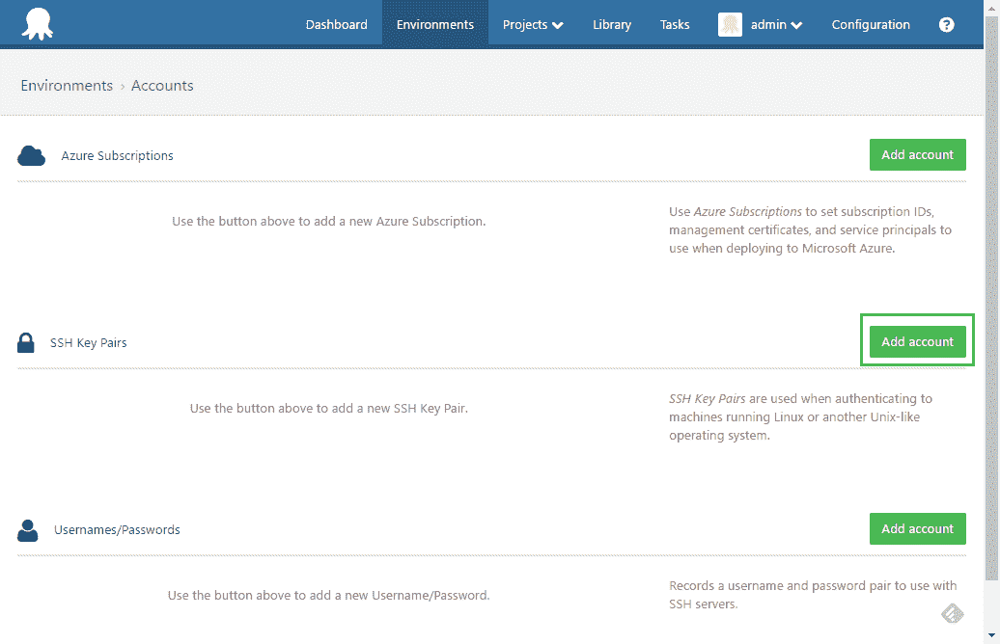

私钥可以通过以下方式获得:

```
cat ~/.ssh/id_rsa 
```

您需要将文本保存到一个文件中，该文件将提供给“私钥”字段，如下所示。

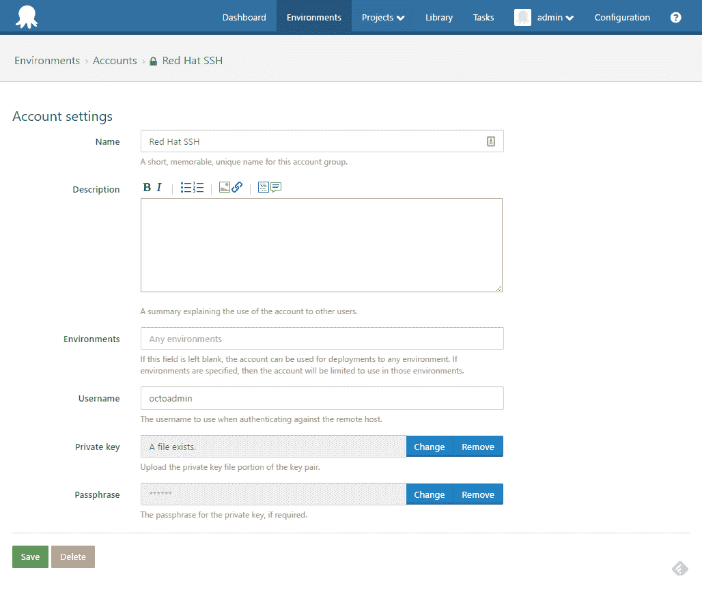

### 创建 SSH 目标

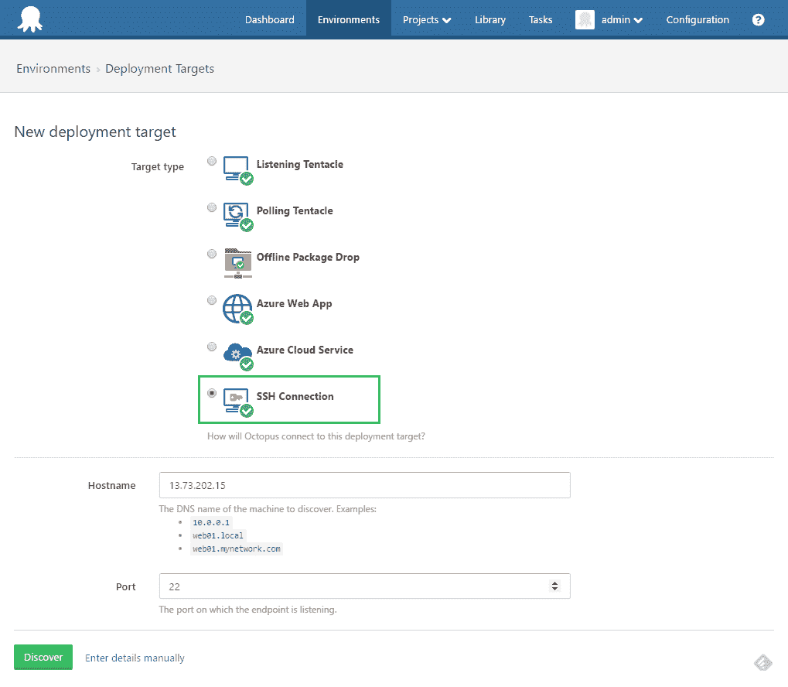

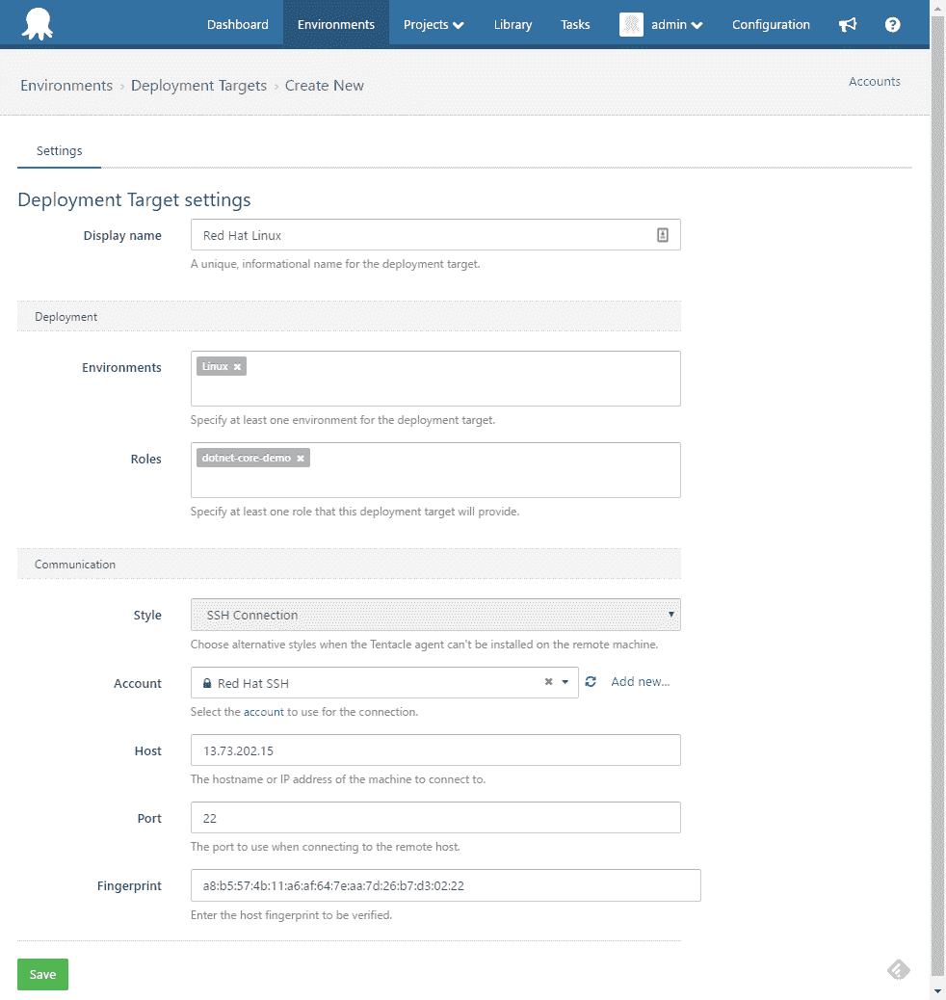

创建目标后，您可以运行运行状况检查以确保连接。

## 在 Octopus 中创建一个项目

现在我们将创建一个项目来部署我们的 ASP.NET 核心演示应用程序。

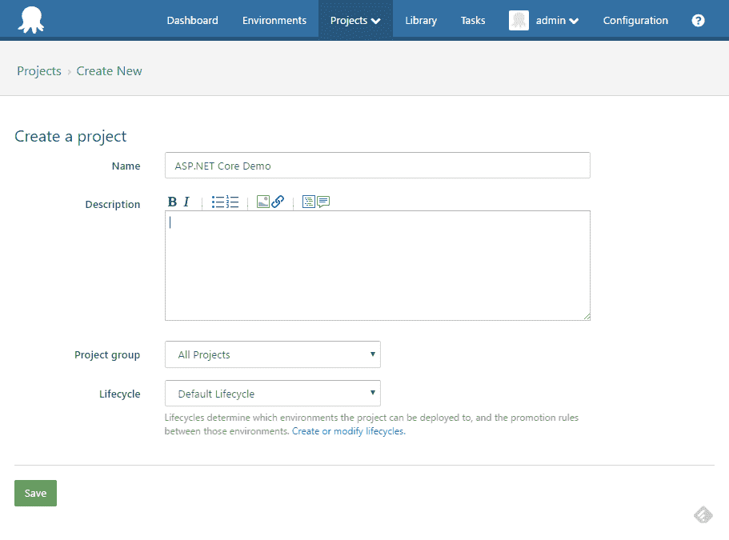

### 添加部署包步骤

向您的项目添加一个*部署包*步骤。

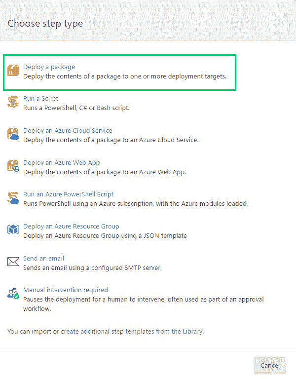

它将引用我们之前上传的包。

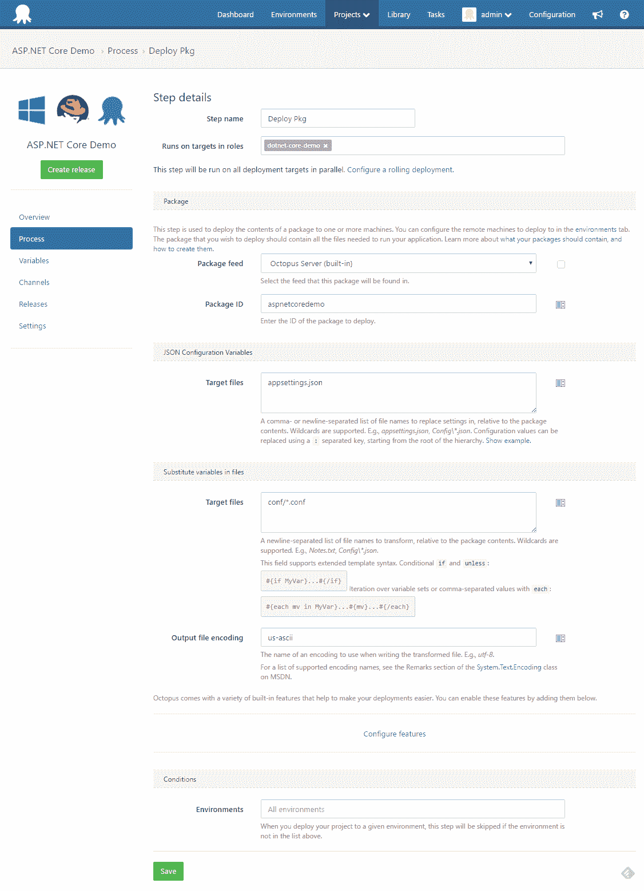

我们将为此步骤启用两个功能:

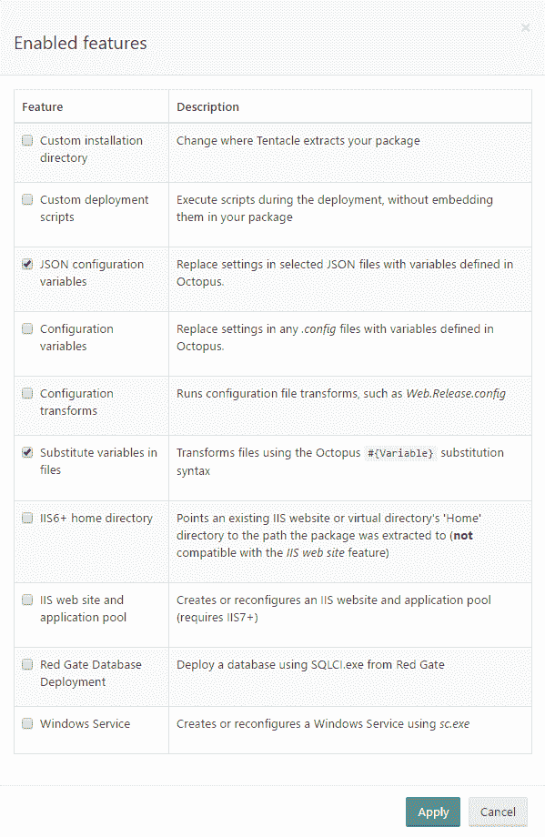

#### JSON 配置变量

我们将使用 [JSON 配置变量特性](http://docs.octopusdeploy.com/display/OD/JSON+Configuration+Variables+Feature)来转换我们的`appsettings.json`文件。

在这种情况下，我们只是简单地改变了呈现的消息，但这演示了 Octopus 如何在 JSON 配置文件中转换层次变量。

#### 替换文件中的变量

我们还将使用[文件中的替代变量特性](http://docs.octopusdeploy.com/display/OD/Substitute+Variables+in+Files)为我们的 NGINX 和 Supervisor 配置文件提供变量。

如果您查看这些文件(位于`src\aspnetcoredemo\deployment`)，您会看到它们包含 Octopus 变量的占位符。例如，`nginx.conf`文件包含了`#{IPAddress}`变量:

```
server {
 listen 80;
 server_name #{IPAddress};
 location / {
     proxy_pass http://localhost:5000;
     proxy_http_version 1.1;
     proxy_set_header Upgrade $http_upgrade;
     proxy_set_header Connection keep-alive;
     proxy_set_header Host $host;
     proxy_cache_bypass $http_upgrade;
 }
} 
```

### 配置 NGINX

接下来，我们将添加一个*运行脚本*步骤，将我们的 NGINX 配置文件移动到`/etc/nginx/sites-enabled`，并告诉 NGINX 重新加载。

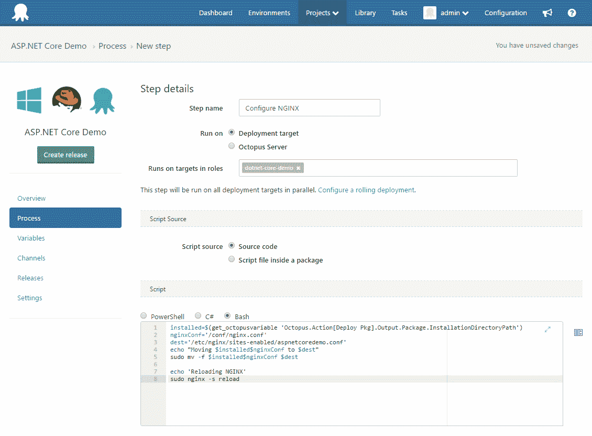

脚本来源是:

```
installed=$(get_octopusvariable 'Octopus.Action[Deploy Pkg].Output.Package.InstallationDirectoryPath')
nginxConf='/conf/nginx.conf'
dest='/etc/nginx/sites-enabled/aspnetcoredemo.conf'
echo "Moving $installed$nginxConf to $dest"
sudo mv -f $installed$nginxConf $dest

echo 'Reloading NGINX'
sudo nginx -s reload 
```

第一行获取解压后的包的路径。

能够将文件放入`sites-enabled`目录使我们不必修改现有的`nginx.conf`。

显然，一种常见的方法是同时拥有一个`sites-available`和`sites-enabled`目录。实际的配置文件被部署到`sites-available`，符号链接被添加到`sites-enabled`。然后是包含在`nginx.conf`中的`sites-enabled`。我会把这个留给家庭作业。

### 运行主管

现在我们将添加另一个*运行脚本*步骤，将我们的 Supervisor 配置文件移动到`/etc/supervisor/conf.d/aspnetcoredemo.conf`并告诉 Supervisor 重新加载。

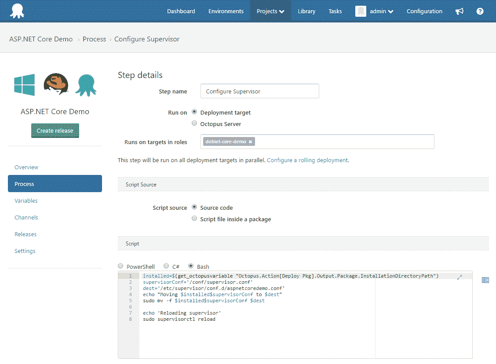

脚本来源是:

```
installed=$(get_octopusvariable "Octopus.Action[Deploy Pkg].Output.Package.InstallationDirectoryPath")
supervisorConf='/conf/supervisor.conf'
dest='/etc/supervisor/conf.d/aspnetcoredemo.conf'
echo "Moving $installed$supervisorConf to $dest"
sudo mv -f $installed$supervisorConf $dest

echo 'Reloading supervisor'
sudo supervisorctl reload 
```

### 变量

最后，我们需要添加将被替换到配置文件中的变量。

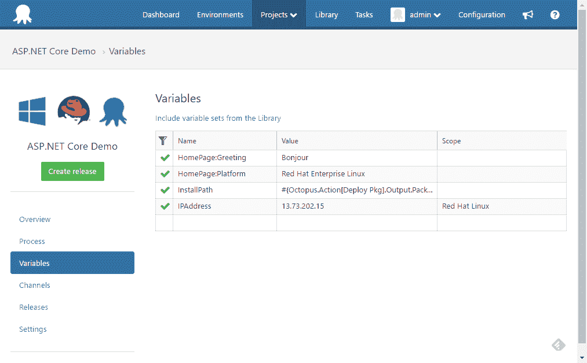

## 部署

此时，您的部署过程应该类似于:

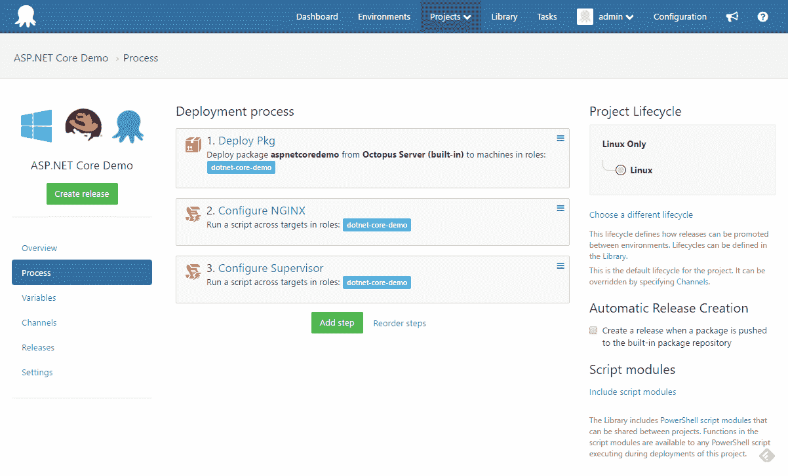

你还在等什么？创建一个版本，然后部署！

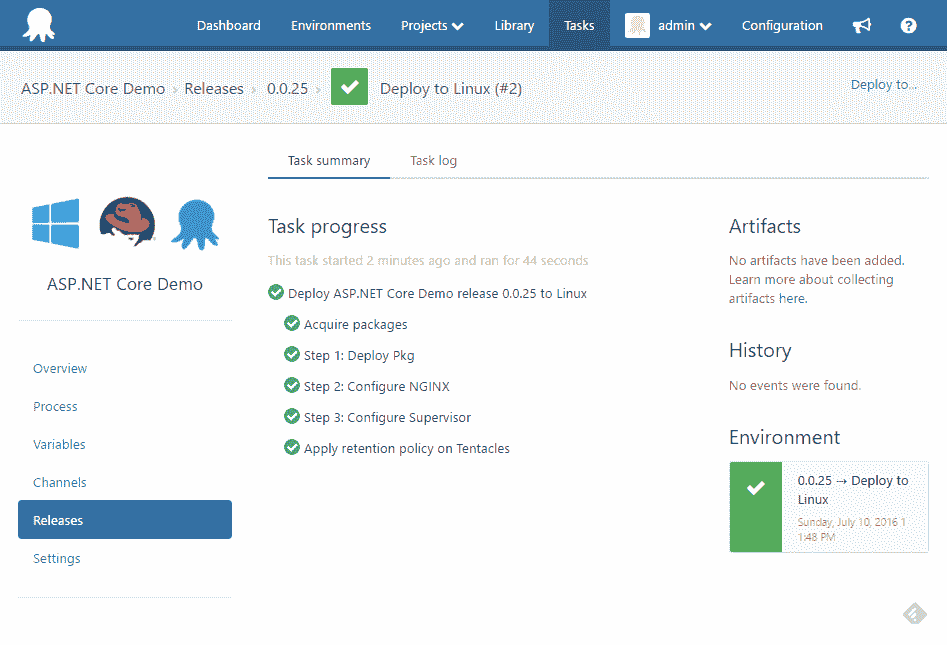

如果一切顺利，您已经将 ASP.NET 核心应用程序部署到 Red Hat Enterprise Linux 服务器上。

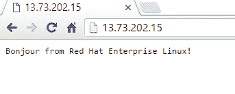

*自我提醒:将 balloons.png 添加到示例应用程序主页；)*

## XPlat

虽然这超出了本文的范围，但值得一提的是，只需很少的努力，我们就可以将同一个包部署到 Windows 2012 R2 服务器*和 Azure Web 应用*上。

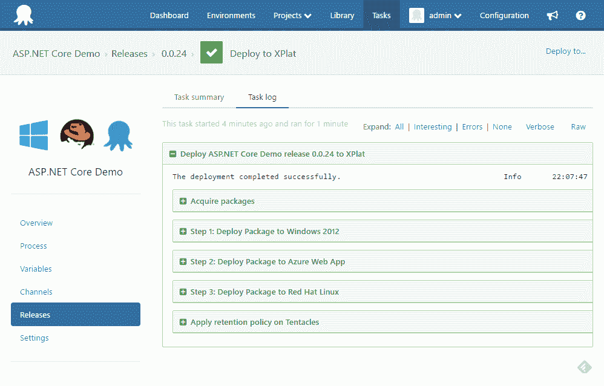

## 未来

。NET Core 为我们改进部署到 Linux 目标的故事提供了一个很好的机会。

### 无单声道

事实上，目前您必须在您的 Linux 服务器上安装 Mono 框架，以使其成为 Octopus 部署目标，这在许多情况下是很尴尬的。我们正朝着使用。NET 核心，完全消除了对 Mono 的依赖。

### 无脚本

我们主要关注的是提供将您想要的部署到您想要的位置的能力，而无需您自己编写脚本。章鱼在历史上一直是目标。NET，还有。NET 一直是针对 Windows 的。。NET Core 已经突破了 Linux 的防火墙。我们应该能够逐步完成并实现一些更多的以 Linux 为中心的部署步骤。

## 反馈

如果您正在使用 Octopus(甚至考虑使用它)进行部署。NET 核心应用程序移植到 Linux 上，我们希望收到您的来信。

请告诉我们哪些可行，哪些不可行，以及我们如何才能让您的部署更简单、更可靠。

*愉快的(跨平台)部署！*