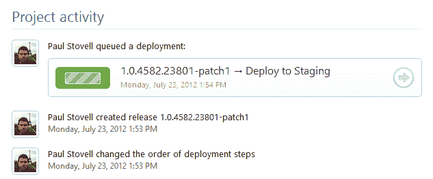

# 新功能:审计和历史- Octopus 部署

> 原文：<https://octopus.com/blog/auditing-and-history>

Octopus Deploy 的目标之一是成为一个信息辐射者。当您的部署过程由运行一堆批处理文件的“某个人”组成时，您团队中的其他人(以及利益相关者)很难洞察正在发生的事情。当前正在运行哪些部署？过去一小时完成了哪些部署？

Octopus 试图将这些信息放在仪表板的前面和中心。您可以查看部署的输出、正在运行的部署以及部署的历史记录。您可以在一个界面中看到一个版本如何从开发进展到生产。

直到现在，章鱼还没能回答的一个问题是*谁*执行了一个动作。今天的版本首次实现了这一特性:

章鱼现在记录:

1.  谁对部署进行了排队，谁取消了部署
2.  谁创建或修改了版本
3.  谁改变了项目步骤或变量

随着时间的推移，这些信息将开始变得越来越丰富，我们将有其他方法来分割它。例如，有一天，我可以想象一个“用户”页面，显示特定用户的所有活动，包括一个 RSS 提要。这只是一个开始，但希望它是一个对您有用的特性。我很想听听你的反馈！