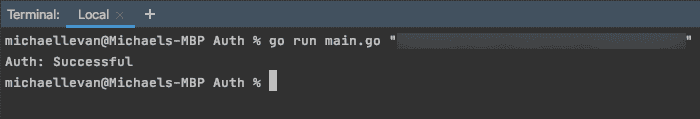

# 使用 Golang - Octopus 部署向 Azure 进行身份验证

> 原文：<https://octopus.com/blog/authenticate-to-azure-with-golang>

[](#)

当你使用任何编程或自动化语言时，很可能你首先需要解决的事情之一就是*我如何从 SDK 认证到云平台？*根据您使用的 SDK，该过程可能会有很大不同。

例如，PowerShell 通过`Connect-AZAccount` cmdlet 进行身份验证，而 Python 可以通过应用注册或使用 Azure CLI 配置文件进行身份验证。重点是，每种语言和 SDK 都不一样，那么 [Golang (Go)](https://golang.org/) 怎么样？如果你是当今世界的一名开发人员，你可能听说过 Golang(Terraform、Docker 和 Kubernetes 就是用它编写的)，它是当今工具领域中发展最快和最流行的语言之一。

在这篇博客文章中，你将采取实践的方法来学习如何向 Azure 认证以使用虚拟机客户端。

## 先决条件

要跟进这篇博文，您需要:

1.  对围棋的初级到中级理解。
2.  Azure 账户。如果你没有，你可以注册一个[免费 30 天试用](https://azure.microsoft.com/en-us/free/)。
3.  一个 IDE 或者脚本编辑器，比如 [GoLand](https://www.jetbrains.com/go/) 或者 [VS Code](https://code.visualstudio.com/) 。

## 要使用哪些包

Azure authentication with Go 的第一步是找出程序中需要哪些库/包。出于本文的目的，除了标准的`os`和`fmt`包，还有两个 Azure 包。

1.  在你的桌面上创建一个目录，用 VS 代码打开它。
2.  在目录中创建一个`main.go`文件。
3.  添加以下代码来启动带有标准包的`main.go`文件，以及您需要连接到 Azure 并向其进行身份验证的包:

```
package main

import (
    "fmt"
    "os"

    "github.com/Azure/azure-sdk-for-go/services/compute/mgmt/2020-06-01/compute"
    "github.com/Azure/go-autorest/autorest/azure/auth"
) 
```

## Azure connection

接下来，您将设置`AzureAuth`功能:

1.  在`main.go`文件中的`import`下，创建如下所示的新函数。该函数为`subscriptionID`使用了一个`os.Arg`，稍后您将在`main`函数中定义它，并使用`compute.VirtualMachinesClient`类型来使用 Azure 的身份验证方法:

```
func AzureAuth(subscriptionID string) compute.VirtualMachinesClient {

} 
```

2.  创建新功能后，您可以使用来自本地环境的身份验证来设置 Azure 的客户端身份验证:

```
vmClient := compute.NewVirtualMachinesClient(subscriptionID)
authorizer, err := auth.NewAuthorizerFromEnvironment() 
```

## 错误处理和验证

身份验证代码的最后一部分是错误处理和身份验证的混合体。`if`语句指定如果`nil`不为空，则打印出一个错误，否则让用户知道认证成功并启动 VM 客户机:

```
if err != nil {
        fmt.Println(err)
    } else {
        fmt.Println("Auth: Successful")
        vmClient.Authorizer = authorizer
    }

    return vmClient 
```

## 配置主要功能

接下来，我们将配置`main`功能。因为 Go 是一种基于过程的语言，所以您将使用`main`函数来调用`AzureAuth`函数。这样，函数就按顺序运行了。

`main`函数是两行代码，实现了以下功能:

*   指定运行时要传入的订阅 ID 的`os.Arg`。
*   调用`AzureAuth`函数。

在`AzureAuth`函数上方添加以下代码，以指定它是一个`main`函数:

```
func main() {
    subscriptionID := os.Args[1]

    AzureAuth(subscriptionID)
} 
```

编辑器中的代码现在应该是这样的:

```
package main

import (
    "fmt"
    "os"

    "github.com/Azure/azure-sdk-for-go/services/compute/mgmt/2020-06-01/compute"
    "github.com/Azure/go-autorest/autorest/azure/auth"
)

func main() {
    subscriptionID := os.Args[1]

    AzureAuth(subscriptionID)
}

func AzureAuth(subscriptionID string) compute.VirtualMachinesClient {
    vmClient := compute.NewVirtualMachinesClient(subscriptionID)

    authorizer, err := auth.NewAuthorizerFromEnvironment()
    if err != nil {
        fmt.Println(err)
    } else {
        fmt.Println("Auth: Successful")
        vmClient.Authorizer = authorizer
    }
    return vmClient
} 
```

要运行该程序，您需要一个 Azure 订阅 ID 在运行时传入。运行以下代码行来运行程序:

```
go run main.go your_subscription_id 
```

如果身份验证成功，您应该会看到类似如下的输出:

[](#)

恭喜你。您已成功通过 Golang 向 Azure 认证。

## 结论

无论是在云中还是在内部，对任何平台进行身份验证都是重要的第一步。如果没有身份验证，如果您打算用它来连接平台，代码基本上是无用的。

在这篇博文中，你初步了解了如何使用 Go for virtual machines 认证 Azure。