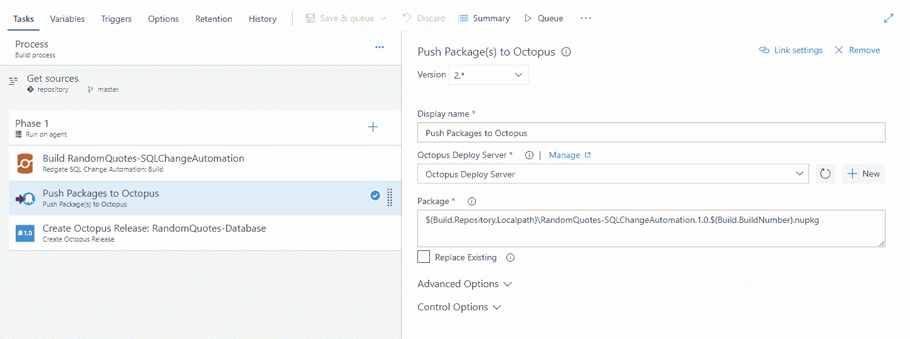
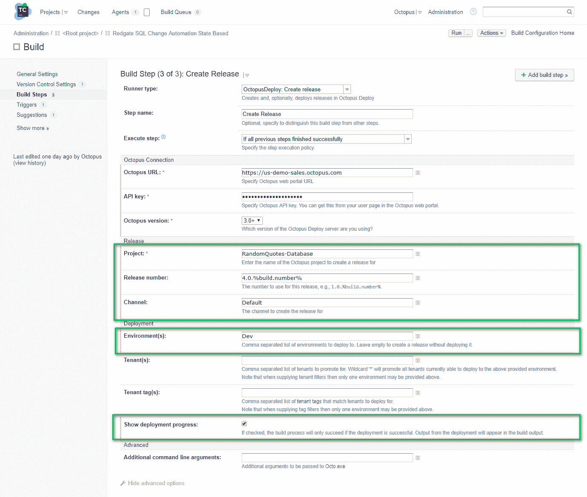
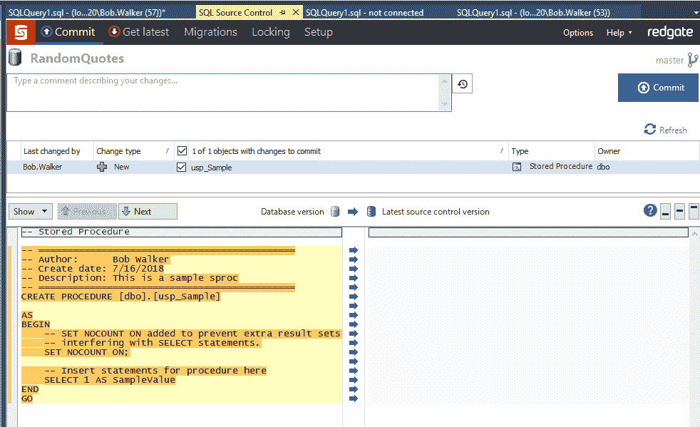

# 使用基于状态的 Redgate SQL 变更自动化- Octopus Deploy 实现数据库部署自动化

> 原文：<https://octopus.com/blog/automated-database-deployments-redgate-sql-change-automation-state-based>

[](#)

我之前的博客文章讨论了为什么[您应该考虑自动化数据库部署](/blog/why-consider-database-deployment-automation)和[入门技巧](/blog/database-deployment-automation-approaches)。

本文将使用[基于状态的方法](https://www.red-gate.com/products/sql-development/sql-change-automation/approaches)为 [Redgate 的 SQL 变更自动化](https://www.red-gate.com/products/sql-development/sql-change-automation/)建立一个数据库部署自动化管道。我选择这个工具是因为它易于设置，可以与 SSMS 集成，而且我已经有了一个演示设置。我也[偏向【Redgate 的工装。](https://www.red-gate.com/hub/events/friends-of-rg/friend/BobWalker)

在本文结束时，您将拥有一个可以演示的概念证明。

## 准备工作

对于这个演示，您需要一个正在运行的 SQL Server 实例、一个 Octopus Deploy 实例和一个 CI 服务器。我建议使用一个开发环境或您的本地机器来进行概念验证。

你需要以下工具。给出的例子使用了团队城市和 VSTS/TFS，但是即使你使用不同的工具，所有 CI 工具的核心概念和用户界面都是非常相似的。

*   八达通部署:
*   Redgate SQL 工具带
*   构建服务器/持续集成(CI)工具(选择一项):
*   SQL Server Management Studio (SSMS):
*   SQL Server:

## 安装软件

如果您在安装这些工具时遇到问题，请访问供应商网站寻求帮助。如果您在安装 Octopus Deploy 时需要任何帮助，请从我们的[文档](https://octopus.com/docs/installation)开始，或者联系[支持](mailto:support@octopus.com)。

### 开发者工作站

这是您将用来进行模式更改并将它们签入源代码控制的机器。当你安装 Redgate 的 SQL Tool-belt 时，会提示你安装相当多的软件。您只需要安装以下软件:

*   SQL 源代码管理。
*   SQL 提示符(这不是必需的，但它使事情变得容易得多)。
*   SSMS 集成包。

Octopus Deploy 和 Redgate 都有主要构建服务器/持续集成工具的插件:

*   詹金斯:
*   团队城市:
*   VSTS/TFS:
*   竹子:

### 部署目标或数据库工作者

在 SQL Server 上安装 Octopus 触手是一个大禁忌。我们的[文档](https://octopus.com/docs/deployment-examples/sql-server-databases#SQLServerdatabases-Tentacles)会更详细地解释为什么。

首选的解决方案是在 Octopus Deploy 和 SQL Server 之间配置一个跳转框。Octopus 为此支持两个选项:

*   部署目标
*   数据库工作者

在这篇文章中，我将添加一个部署目标，但是我想提到 workers 也是一个不错的选择。它们对于进行大量数据库部署的团队特别有用。

Workers 使您能够将部署工作转移到在池中运行的其他机器上，数据库部署是一个常见的用例。您可以创建一个专门的工作人员池，供多个项目和团队用于数据库部署。

更多信息见[我们的文档](https://octopus.com/docs/infrastructure/workers)。

出于安全考虑，我建议以特定用户帐户运行触手/Worker。这样，您可以利用集成的安全性。您可以配置[活动目录](https://octopus.com/docs/infrastructure/windows-targets/running-tentacle-under-a-specific-user-account)或者使用 SQL 用户来代替。

对于跳线盒，您需要安装以下项目:

*   SQL 变更自动化 PowerShell 3.0。
*   SQL 变更自动化。

## 示例项目

对于这个演练，我修改了 RandomQuotes 项目。这个示例的源代码可以在这个 [GitHub repo](https://github.com/OctopusDeploy/AutomatedDatabaseDeploymentsSamples) 中找到。派生存储库，以便在阅读本文时可以进行修改。

## 配置 CI/CD 管道

您需要的一切都已经签入到源代码控制中。我们需要做的就是构建它并将其推送到 SQL Server。

### Octopus 部署配置

您需要从 Redgate 到[创建数据库版本](https://library.octopus.com/step-templates/c20b70dc-69aa-42a1-85db-6d37341b63e3/actiontemplate-redgate-create-database-release)和[部署数据库版本](https://library.octopus.com/step-templates/7d18aeb8-5e69-4c91-aca4-0d71022944e8/actiontemplate-redgate-deploy-from-database-release)的步骤模板。当您浏览步骤模板时，您可能会注意到步骤模板直接从包中[部署。SQL 变更自动化的基于状态的功能通过比较存储在 NuGet 包中的数据库的状态和目标数据库来工作。每次运行时，它都会创建一组新的增量脚本来应用。推荐的流程是:](https://library.octopus.com/step-templates/19f750fb-2ce8-4361-859e-2dfcdf08a952/actiontemplate-redgate-deploy-from-package)

1.  将数据库包下载到跳转框中。
2.  通过将跳转框上的包与 SQL Server 上的数据库进行比较来创建增量脚本。
3.  查看 delta 脚本(这在 dev 中可以跳过)。
4.  使用跳转框上的触手在 SQL Server 上运行脚本。

使用步骤模板从包中部署会阻止查看脚本的能力。

这是我为部署数据库而组织的流程。

[](#)

该过程执行以下操作:

*   数据库的主要 SQL 用户。
*   数据库。
*   将 SQL 用户添加到数据库中。
*   将用户添加到角色中。

如果您希望您的流程这样做，您可以从 [Octopus 社区步骤模板库](https://library.octopus.com/listing)下载这些步骤模板。

如果这是自动化数据库部署之旅的开始，您不必添加所有这些功能。上面截图中需要的主要步骤是:

[](#)

让我们逐一介绍一下。下载包的步骤非常简单，除了选择包名之外没有自定义设置:

[](#)

Redgate - Create 数据库发布步骤更有趣一些。**导出路径**是增量脚本将被导出到的位置。这必须是 Octopus Deploy 触手文件夹之外的目录，因为**Redgate-Deploy from Database Release**步骤需要访问该路径，而触手文件夹对于每个步骤都是不同的:

[](#)

我喜欢使用项目变量:

[](#)

该变量的完整值为:

```
 C:\RedGate\#{Octopus.Project.Name}\#{Octopus.Release.Number}\Database\Export 
```

该屏幕上的其他建议:

*   我已经提供了用户名和密码。我建议使用集成安全性，并让触手作为一个特定的服务帐户运行。我的测试机器上没有配置 Active Directory，所以我在这个演示中使用了 SQL 用户。
*   查看一下[默认 SQL 比较选项](https://documentation.red-gate.com/sr1/using-sql-compare-options-in-sql-release/default-sql-compare-options-used-by-sql-release)，确保它们符合您的需求。如果没有，您需要在`SQL Compare Options (optional)`变量中提供您想要的。你可以在这里查看文档[。如果您决定使用定制选项，我建议在](https://documentation.red-gate.com/sc11/using-the-command-line/options-used-in-the-command-line)[库变量集](https://octopus.com/docs/deployment-process/variables/library-variable-sets)中创建一个变量，这样这些选项可以在许多项目中共享。
*   如果您希望限制部署过程可以更改的内容，请使用自定义过滤器。我写了一篇关于如何做到这一点的博文。我个人倾向于过滤掉所有用户，让 DBA 管理他们。更好的是，让章鱼来管理它们，因为它可以处理环境差异。

下一步是批准数据库发布。我建议创建一个定制团队来负责此事，但我更喜欢在开发和 QA 中跳过这一步:

[](#)

创建数据库发布步骤利用了 Octopus Deploy 中内置的工件功能。这允许批准者下载文件并检查它们:

[](#)

最后一步是部署数据库版本。这一步将 delta 脚本放在导出数据路径中，并在目标服务器上运行它，这就是为什么我建议将导出路径放在一个变量中:

[](#)

这就是 Octopus 部署配置。现在是时候转移到构建服务器了。

### 构建服务器配置

在这篇博文中，我使用了 VSTS/TFS 和团队城市。至少，构建应该做到以下几点:

1.  使用 Redgate 插件构建一个包含数据库状态的 NuGet 包。
2.  使用 Octopus Deploy 插件将包推送到 Octopus Deploy。
3.  为刚刚使用 Octopus Deploy 插件推出的包创建一个发布版本。
4.  使用 Octopus Deploy 插件部署该版本。

#### VSTS / TFS 大楼

在 VSTS/TFS，构建和部署数据库只需三个步骤:

[](#)

第一步将从源代码控制构建数据库包。突出显示的项目是您需要更改的项目。子文件夹路径变量是相对的。我正在使用一个示例 Git repo，这就是为什么*redgatesqlchangeautomationstate based*文件夹位于路径:

【T2 

push package to Octopus 步骤要求您知道上一步生成的工件的完整路径。我不能 100%确定不经过反复试验你怎么会知道:

[](#)

这是全部价值，如果你想复制的话:

```
 $(Build.Repository.Localpath)\RandomQuotes-SQLChangeAutomation.1.0.$(Build.BuildNumber).nupkg 
```

必须在 VSTS/TFS 配置 Octopus Deploy 服务器。你可以在我们的[文档](https://octopus.com/docs/packaging-applications/build-servers/tfs-azure-devops/using-octopus-extension)中看到如何操作。

最后一步是创建一个发布，并将其部署到 dev。用 Octopus Deploy 连接 VSTS/TFS 后，您可以读取所有项目名称。您还可以配置这个步骤，将发布部署到 dev。单击**显示部署进度**将停止构建并强制等待 Octopus 完成:

[](#)

#### 团队城市

团队城市的设置与 VSTS/TFS 的设置非常相似。只需要三个步骤:

[](#)

第一步是构建数据库包步骤，它有类似于 VSTS/TFS 的选项。您需要输入文件夹以及包的名称:

[](#)

您必须在高级选项中输入一个包版本，否则您将从 Redgate 工具中得到一个关于无效包版本的错误:

[](#)

发布包步骤需要填充所有三个选项。默认情况下，Redgate 工具将在根工作目录中创建 NuGet 包:

[](#)

最后一步是创建和部署版本。提供项目名称、版本号和您要部署到的环境:

[](#)

## 查看 CI/CD 管道的运行情况

现在是时候看看这一切是如何运作的了。对于这个演示，我创建了一个新的数据库，*RandomQuotes _ BlogPost _ Dev*:

[](#)

如您所见，我没有任何同名的数据库。我将该 SQL Server 用作自动化部署的测试平台:

[](#)

让我们快速看一下存储在源代码控制中的表:

[](#)

如果我们打开其中一个文件，我们可以看到由 Redgate 的 SQL 源代码控制生成的创建脚本:

[](#)

启动一个构建，让我们看看整个管道运行情况。构建看起来很成功:

[](#)

毫无疑问，在 Octopus Deploy 中部署是成功的。VSTS/TFS 版本被设置为等待 Octopus Deploy 完成数据库部署。如果部署失败，构建也会失败:

[](#)

回到 SSMS，我们现在可以看到数据库和表已经创建:

[](#)

## 更改数据库模式

这适用于现有的项目，但是让我们对数据库模式做一个小的更改，并测试这个过程。这涉及到更多的设置:

1.  将分叉的回购克隆到本地机器上。
2.  打开 SSMS，在你的本地机器上创建一个随机报价数据库。
3.  在 SSMS，将受源代码管理的数据库绑定到新创建的数据库。你可以在[文档](https://www.red-gate.com/products/sql-development/sql-source-control/resources/how-to-set-up-sql-source-control)中阅读如何操作。

将数据库链接到源代码管理时，需要提供存储源代码管理的文件夹的完整路径。我将所有代码存储在一个名为 C:\Code.git 的文件夹中。

```
C:\Code.git\AutomatedDatabaseDeploymentsSamples\RedGateSqlChangeAutomationStateBased\db\src\ 
```

[](#)

现在我们可以对数据库进行更改了。对于这个测试，让我们添加一个将返回值的存储过程:

[](#)

现在我们可以将更改提交到源代码控制:

[](#)

假设 CI/CD 管道被设置为在提交时触发，您应该看到新的存储过程出现在 dev 中。

## 结论

数据库部署自动化确实需要一些准备工作，但是付出的努力是值得的。光是审计就值得了。有了这个工具，我现在可以看到谁做了更改，何时做了更改，以及更改何时投入生产。过去，它保存在另一个位置，有 50%的更新机会。

当您开始这一旅程时，我的建议是将手动验证步骤添加到所有环境中，直到建立信任为止。这将确保您不会意外地签入一个会吹走团队一半数据库变更的变更。

下次再见，愉快的部署！

* * *

数据库部署自动化系列文章: