# 演练:通过 TFS 预览版、MyGet 和 Octopus Deploy - Octopus Deploy 自动部署到 Amazon EC2

> 原文：<https://octopus.com/blog/automated-deployment-with-tfspreview-octopack-myget>

[TFS 预览版](http://tfspreview.com/ "TFSPreview")是微软新推出的云托管 Team Foundation Server 即服务解决方案(TFSaaS？).您将获得一个 Team Foundation Server 实例，带有团队构建(持续集成)和工作项跟踪。

微软把 TFS 不仅仅作为一个源代码控制系统来推销，而是作为一个应用程序生命周期管理解决方案。这张来自 TFS 预览主页的图片很好地概括了这一点:

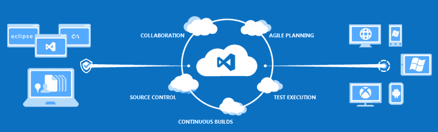

右边的箭头代表不同渠道的“部署”——毕竟，“应用程序生命周期管理”确实应该包括某种部署能力。然而，问题是在 TFS 预览版的情况下，箭头实际上只是意味着“自动部署到 Azure”。这绝对是一个很酷的特性，但是如果你的目标服务器没有运行在 Azure 上呢？如果您使用的是 Amazon EC2，或者您的服务需要在数据中心的一些本地服务器上运行，该怎么办？

不要担心，Octopus 在这里将“部署”放在应用程序生命周期管理中。我们将扩展图像，如下所示:

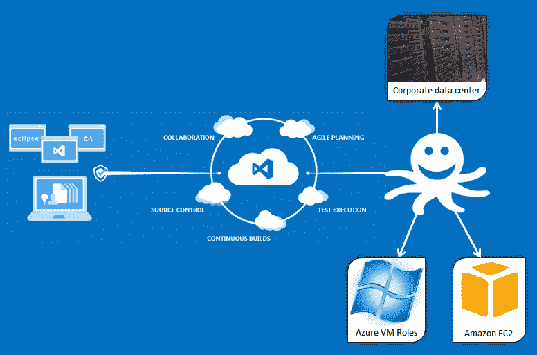

在这篇文章中，我将采用 ASP.NET 网站，并让它在 TFS 预览下建设。我需要做几件事:

*   创建一个 [TFS 预览](http://tfspreview.com/ "TFS Preview")账户
*   创建一个 [MyGet](http://myget.org/ "MyGet") 账户。我们将使用 MyGet 来托管我们的 NuGet 包。
*   创建 ASP.NET 站点，并使用 [OctoPack](https://github.com/OctopusDeploy/OctoPack) 对其进行打包
*   建立一个团队构建来构建包并将它们发布到 MyGet
*   配置 Octopus 使用 MyGet 并部署应用程序

虽然我将在本例中使用 TFS 预览版，但这些步骤(或类似步骤)中的大部分也适用于内部 TFS 安装。

## 步骤 1:创建项目

访问 [TFS 预览版](https://tfspreview.com/ "TFSPreview")主页，注册账号。这是免费的，而且只需要几分钟，挺好的。完成后，您将被带到一个帐户控制面板:

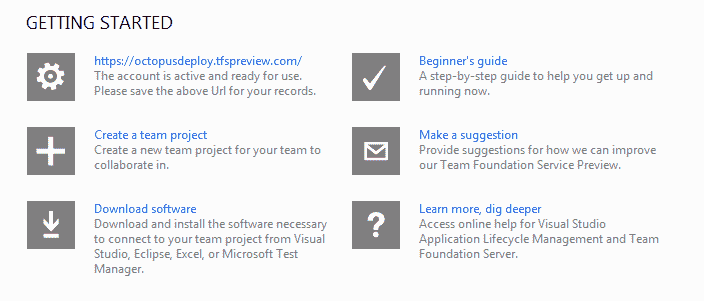

我将创建一个新的团队项目:


创建项目大约需要一分钟，之后您将看到项目主页:

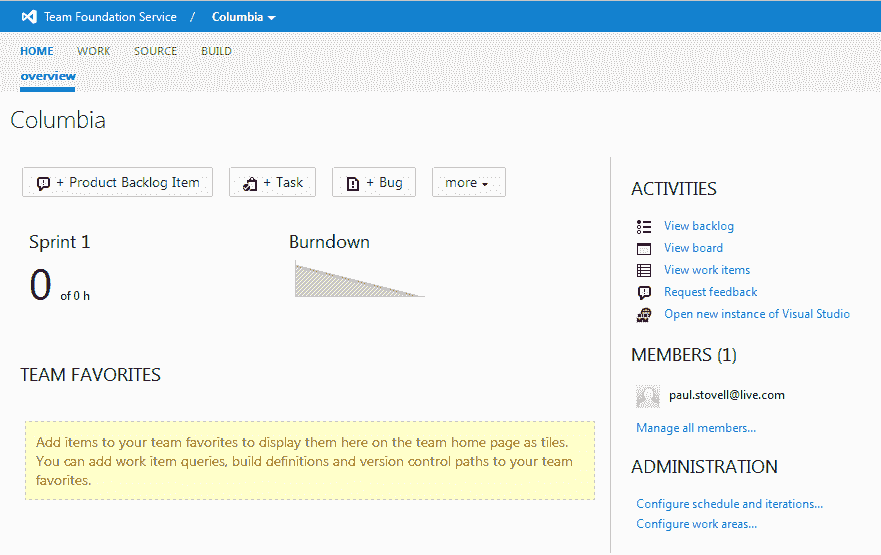

接下来，我将把 TFS 服务器添加到我的 Visual Studio 团队资源管理器中:

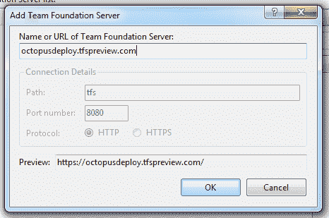

现在，我将创建一个 ASP.NET MVC 4 项目，并勾选“添加到源代码控制”。我将使用互联网模板，我也将添加一个单元测试项目。


项目创建完成后，我会被问到代码应该在 TFS 的什么地方。我添加了一个`Trunk\Source`文件夹:

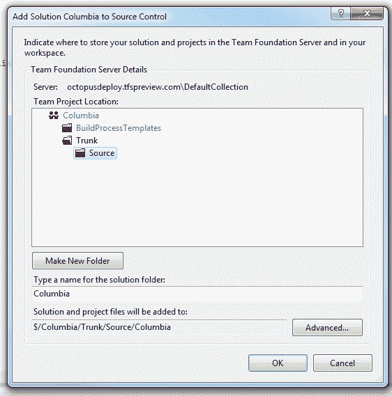

在我签入之前，我将在解决方案上启用 [NuGet 包恢复](http://docs.nuget.org/docs/workflows/using-nuget-without-committing-packages)，这样我就不必签入我的所有 NuGet 包:

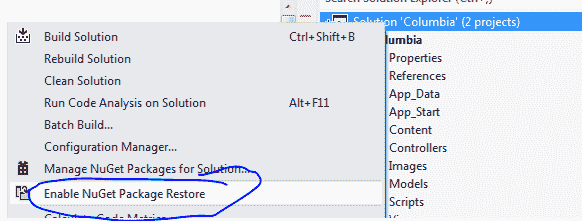

从 pending changes 窗口中，我将排除`packages`目录，并签入我的代码:

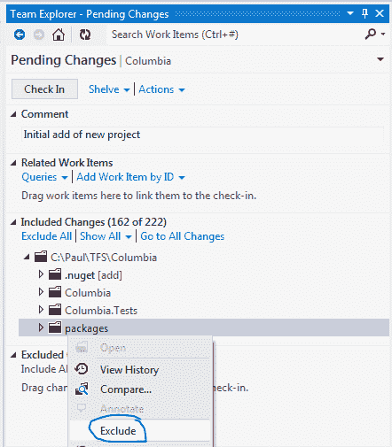

通过互联网办理入住手续出奇的快。我过去在互联网上使用 TFS 2010 有过不好的经历，但是这个非常快。

## 步骤 2:持续集成

签入我的初始代码后，是时候建立团队构建了。我将创建一个名为“CI”的新团队构建定义。在“Trigger”选项卡上，我将选择“CI”选项:

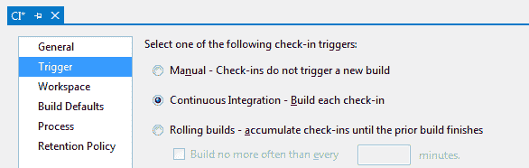

在“过程”选项卡上，Team Build 会自动找到我的解决方案。我要做的唯一更改是显式指定发布配置:

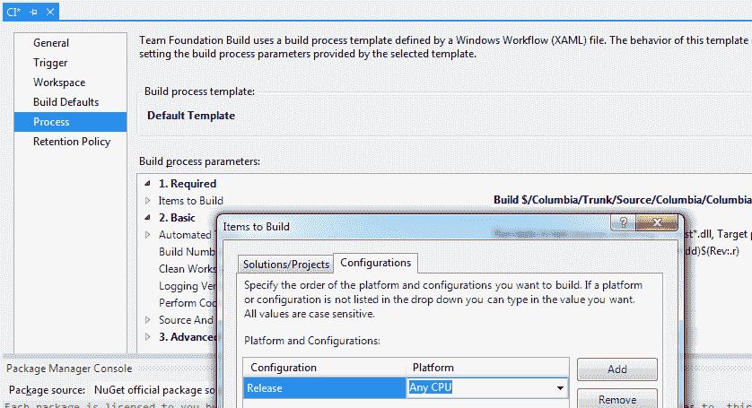

我将保存构建配置，然后让它排队运行:

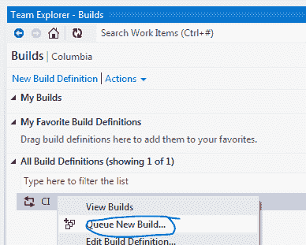

构建在运行之前在队列中停留了大约一分钟，大概是构建机器正在被提供或者其他什么。实际构建花费了大约 2.5 分钟，并成功完成:

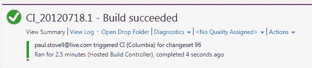

如果我在 Visual Studio 中使用源代码管理器窗口，我可以看到构建的输出。在一个`_PublishedWebsites`目录下是我的项目的目录，其中包含了我运行我的 ASP.NET 网站所需的所有文件。

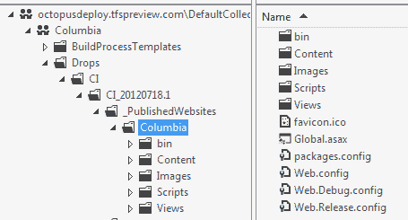

这是 TFS 的一个特色，很不错，但是我该拿它怎么办呢？手动下载文件，然后像 1998 年一样用 FTP 传输到某个地方？不，我们可以做得更好！

## 步骤 3:打包网站

到目前为止，我有一个使用 Team Build 构建的 ASP.NET 站点，该站点的内容被发布到`_PublishedWebsites`文件夹中。现在，我将这个文件夹压缩到一个 NuGet 包中，这样我就可以使用 [OctopusDeploy](http://octopusdeploy.com) 来部署它。

为此，我将使用 [OctoPack](https://github.com/OctopusDeploy/OctoPack) ，这是一个特殊的 NuGet 包，它将为我处理这个问题。我将在软件包管理器控制台中发出`install-package OctoPack`命令，注意选择我的网站作为目标项目:

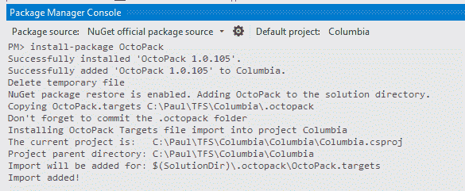

OctoPack 修改网站的`.csproj`文件，添加一个特殊目标文件的链接。这个目标文件将在发布构建完成后负责打包。

由于我使用的是 NuGet 包恢复，OctoPack 在我的解决方案的根目录下添加了一个`.octopack`文件夹，紧挨着`.nuget`文件夹，这就是保存目标文件的地方。令人烦恼的是，这并没有出现在团队资源管理器的 Pending Changes 窗口中，所以我将使用 Source Explorer 手动添加它。

我还将在我的项目中添加一个`.nuspec`文件，这是 OctoPack 所需要的。这将作为我的包裹的舱单。

```
<?xml version="1.0"?>
<package >
  <metadata>
    <id>Columbia</id>
    <title>A sample web application</title>
    <version>1.0.0</version>
    <authors>Paul Stovell</authors>
    <owners>Paul Stovell</owners>
    <licenseUrl>http://octopusdeploy.com</licenseUrl>
    <projectUrl>http://octopusdeploy.com</projectUrl>
    <requireLicenseAcceptance>false</requireLicenseAcceptance>
    <description>A sample project</description>
    <releaseNotes>This release contains the following changes...</releaseNotes>
  </metadata>
</package> 
```

这将被添加到我的 web 项目的根目录，我将把构建操作设置为 None:

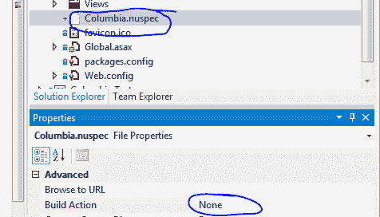

最后，我将提交更改，再次确保不要添加 NuGet packages 文件夹(我认为待定更改需要一个‘永久忽略’按钮)。


签入后，我的团队构建被自动触发。我在准备这个演示时犯了一个错误(忘记添加`.nuspec`)，这就是为什么会有一个代表以前失败构建的条。添加它修复了构建:


现在，如果我检查 drops 文件夹，我会发现一个`Columbia.1.0.0.0.nupkg`文件:

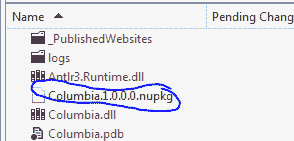

如果我使用 [NuGet 包浏览器](http://npe.codeplex.com/)，我可以看到它包含了我运行网站所需的文件，以及来自我的`.nuspec`的清单信息:

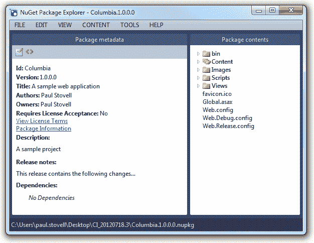

## 步骤 4:增加版本号

NuGet 包从项目的输出程序集的`[assembly: AssemblyVersion]`属性中获取它的版本号，这个属性默认设置为`1.0.0.0`。我们可以在`AssemblyInfo.cs`文件中改变这一点，给每个包一个唯一的版本号:

```
[assembly: AssemblyVersion("1.0.*")] 
```

我将签入它，并让 CI 构建再次运行，几分钟后，我有了一个新的 drops 文件夹，其中包含一个新的包:

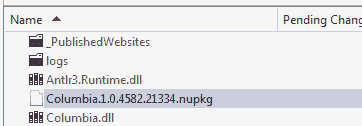

## 步骤 5:托管 NuGet 包

我的 CI 构建现在正在生成与 Octopus 兼容的 NuGet 包。在部署它们之前，我需要将 NuGet 包托管在 Octopus 可以访问它们的地方。不幸的是，TFS 预览版不能兼作 NuGet 包库，所以我们必须看看外面。

Octopus [支持任何 NuGet 存储库](http://octopusdeploy.com/documentation/packaging)，所以一种选择是手动将每个包复制到 Octopus 可以引用的本地文件共享。如果我们只是偶尔进行部署，这可能是一个不错的选择，但它并不是完全自动化的。

另一个选择是将我们的包发布到 NuGet 服务器上。我们可以通过设置一个运行 [NuGet Gallery](https://github.com/NuGet/NuGetGallery) 的虚拟机来托管它，但这需要一些努力。一种更简单的方法是使用[MyGet.org](http://www.myget.org/)，一种“NuGet 即服务”的解决方案。

我将使用我的 Live ID 创建一个帐户，然后填写注册页面:

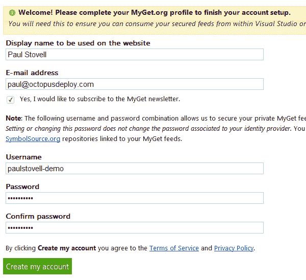

接下来，我将创建一个由 MyGet 托管的 NuGet 提要。在这个例子中，我将使用公共提要，但是您也可以选择使用私有提要:

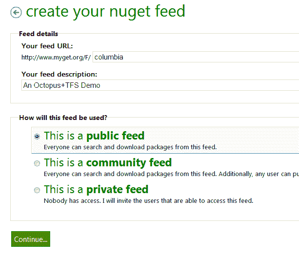

创建了我的 feed 后，我可以使用 MyGet Feed Details 选项卡来获取 Feed 的信息:


## 步骤 6:将包推送到 MyGet

现在，我将设置 Team Build 来自动将我的包推送到 MyGet 提要。我将从编辑团队构建定义开始:

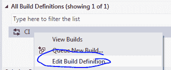

在**进程**选项卡上，我将展开高级部分并设置 MSBuild Arguments 属性:

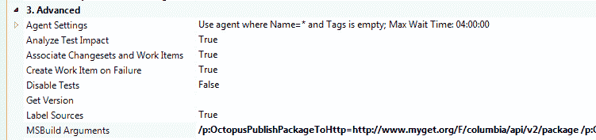

我已经设置为:

```
/p:OctopusPublishPackageToHttp=http://www.myget.org/F/columbia/api/v2/package /p:OctopusPublishApiKey=156372ea-b731-42f6-ba3d-65269e7b01a8 
```

注意:这些变量在 OctoPack 2.0 中已经改变——它们现在是`Octo**Pack**PublishPackageToHttp`和`Octo**Pack**PublishApiKey`。

我正在使用几天前[引入 OctoPack 的两个属性](http://octopusdeploy.com/blog/publishing-with-octopack)。第一个设置要发布到的 URI——在本例中是我的 MyGet 提要——第二个是要使用的 API 键。我从 MyGet.org Feed 详细信息页面获得了这两个值。

再次排队我的构建，它通过:

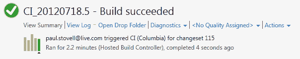

如果我检查“我的获取包”选项卡:

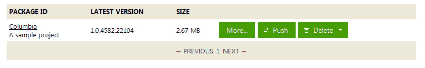

呜哇！

## 步骤 7:向 Octopus 添加 MyGet 提要

让我们回顾一下我们的现状:

1.  我们有一个网站
2.  我们有一个 CI 构建
3.  我们已经把网站打包了
4.  我们把这个包发布到了一个 NuGet 服务器上
5.  现在我们需要部署这个包

我已经安装了一个 Octopus Deploy 服务器([参见安装指南](http://octopusdeploy.com/documentation/install)了解如何安装的细节)，我有三个服务器，都运行在 Amazon EC2 上。一台服务器位于暂存环境中，另外两台位于生产环境中:

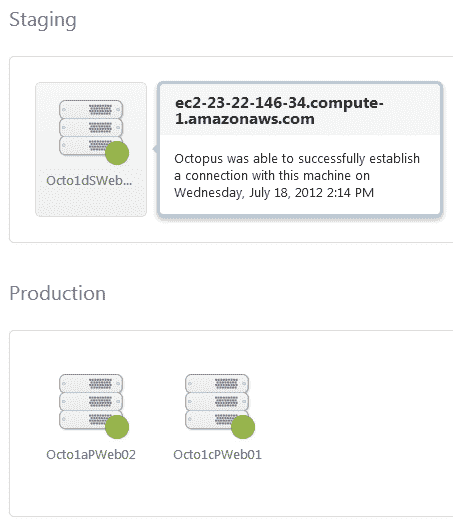

这些机器是 Amazon EC2 Windows Server 2008 R2 映像，我已经安装了 IIS 组件以及在本地运行的 Octopus 部署代理。我已经使用 Octopus 内置的公钥加密支持建立了一个[信任关系](http://octopusdeploy.com/documentation/security/octopus-tentacle)，这允许我安全地将包从我的 Octopus 服务器推送到我的机器上。

在 Octopus web portal 配置区域，我将转到 NuGet 选项卡，添加一个新的提要，粘贴我的 MyGet 提要的详细信息:

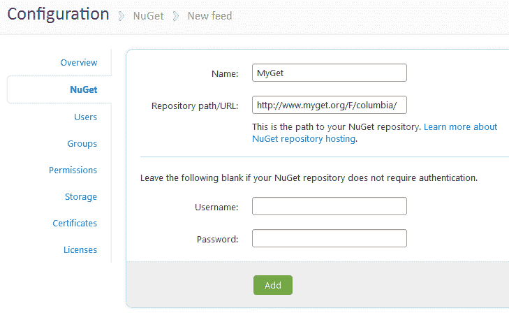

如果我使用的是私人的 MyGet feed，或者 TeamCity feed，我会在下面的框中添加用户名/密码。在这种情况下，我使用的是公共提要，所以我将它们留空。

添加提要后，我可以通过单击 Test 并执行搜索以列出包来验证它是否工作:

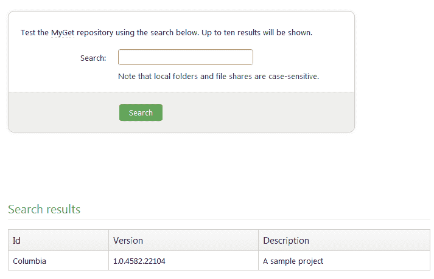

## 步骤 8:在 Octopus 中定义项目

接下来，我将在 Octopus UI 中创建新项目:


在步骤选项卡上，我将单击**添加包步骤**。在这个页面上，我将输入我的 NuGet 包的 ID，选择提要，并选择应该将它部署到哪些机器上:

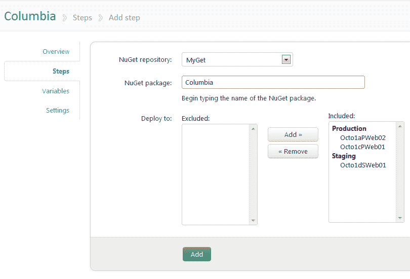

定义好我的项目后，我将创建一个新的版本，选择要部署的 NuGet 包的版本:

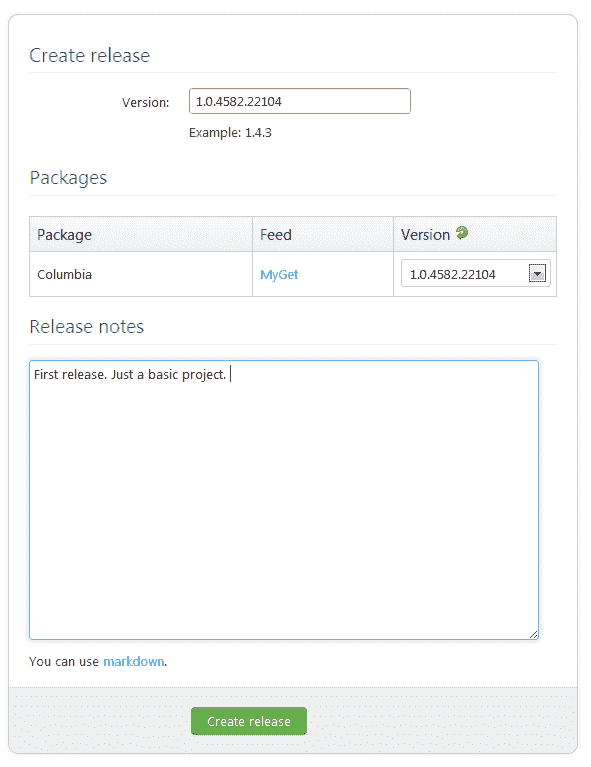

在 release details 页面上，我有一个中心位置，在这里我可以看到我的发行说明，以及关于该版本中包含的 NuGet 包的信息。


接下来，我将单击**部署该版本...**并选择要部署到的环境:

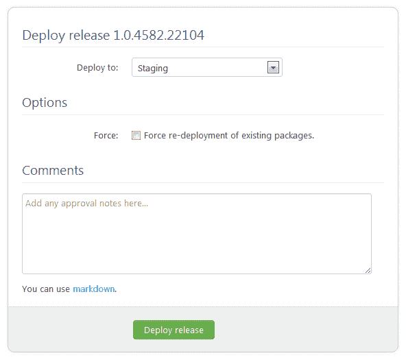

部署将会运行。在这个阶段，Octopus 通过几个步骤工作:

1.  它从 MyGet 提要下载包，并验证散列
2.  它将它上传到目标机器
3.  它告诉目标机器上的部署代理安装软件包

部署成功:

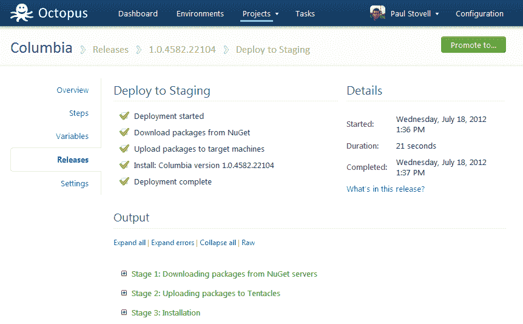

## 步骤 8:配置 IIS

Octopus 提取了 NuGet 包，但是还没有修改 IIS。如果我浏览部署日志，我会看到:

> WARN 在本地计算机上找不到名为“Columbia”的 IIS 网站或虚拟目录。如果你希望 Octopus 为你更新，你应该手动创建站点和/或虚拟目录。否则，您可以忽略此消息。

在这个阶段，我有两个选择。我可以远程桌面到我的所有三台机器上，并用正确的应用程序池设置创建一个名为 Columbia 的新 IIS 站点。Octopus 然后会自动找到这个 IIS 站点(因为它与 NuGet 包同名)并改变主目录指向它提取 NuGet 包的路径。

但是，我懒。因此，我将把一个 [PostDeploy.ps1 文件](http://octopusdeploy.com/documentation/features/powershell "PowerShell support in Octopus")添加到我的项目中。这是一个 PowerShell 脚本，因为它被命名为 *PostDeploy.ps1* ，运行在远程机器上的触手代理将*自动*为我执行它。我不需要摆弄 PowerShell remoting，我的机器也不需要在同一个 Active Directory 域上；是 automagic！

我将在 Visual Studio 的项目中创建该文件，以便我团队中的开发人员可以看到它。我还会将它标记为 Content，这样它就会包含在 NuGet 包的文件列表中:

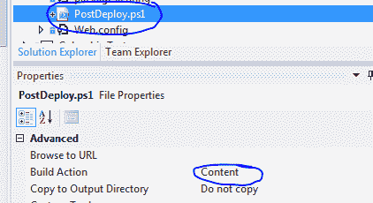

该脚本将如下所示:

```
# Define the following variables in the Octopus web portal:
#
#   $ColumbiaIisBindings = ":80:columbia.octopusdeploy.com"
#
# Settings
#---------------
$appPoolName = ("Columbia-" + $OctopusEnvironmentName)
$siteName = ("Columbia - " + $OctopusEnvironmentName) 
$siteBindings = $ColumbiaIisBindings
$appPoolFrameworkVersion = "v4.0"
$webRoot = (resolve-path .)

# Installation
#---------------
Import-Module WebAdministration

cd IIS:\

$appPoolPath = ("IIS:\AppPools\" + $appPoolName)
$pool = Get-Item $appPoolPath -ErrorAction SilentlyContinue
if (!$pool) { 
    Write-Host "App pool does not exist, creating..." 
    new-item $appPoolPath
    $pool = Get-Item $appPoolPath
} else {
    Write-Host "App pool exists." 
}

Write-Host "Set .NET framework version:" $appPoolFrameworkVersion
Set-ItemProperty $appPoolPath managedRuntimeVersion $appPoolFrameworkVersion

Write-Host "Set identity..."
Set-ItemProperty $appPoolPath -name processModel -value @{identitytype="NetworkService"}

Write-Host "Checking site..."
$sitePath = ("IIS:\Sites\" + $siteName)
$site = Get-Item $sitePath -ErrorAction SilentlyContinue
if (!$site) { 
    Write-Host "Site does not exist, creating..." 
    $id = (dir iis:\sites | foreach {$_.id} | sort -Descending | select -first 1) + 1
    new-item $sitePath -bindings @{protocol="http";bindingInformation=$siteBindings} -id $id -physicalPath $webRoot
} else {
    Set-ItemProperty $sitePath -name physicalPath -value "$webRoot"
    Write-Host "Site exists. Complete"
}

Write-Host "Set app pool..."
Set-ItemProperty $sitePath -name applicationPool -value $appPoolName

Write-Host "Set bindings..."
Set-ItemProperty $sitePath -name bindings -value @{protocol="http";bindingInformation=$siteBindings}

Write-Host "IIS configuration complete!" 
```

这个脚本看起来很长，但是阅读起来非常简单——它检查应用程序池是否存在，然后创建或更新它，然后对 web 站点做同样的事情。这些都是使用 IIS PowerShell 模块完成的。

该脚本使用了两个变量。第一个是`$OctopusEnvironmentName`，它由触手部署代理自动传递给脚本，在这个例子中它将是“Staging”或“Production”(顺便说一下，您可以在 Octopus Deploy 中创建任意多个环境)。

第二个变量是一个自定义变量，`$ColumbiaIisBindings`。我使用我的 web 服务器来托管多个站点，所以我将配置 IIS 绑定来只监听一个主机名。

*   在制作中，我会使用`"columbia.octopusdeploy.com"`
*   在 Staging 中，我将使用`"staging.columbia.octopusdeploy.com"`

在 PowerShell 脚本中，您会注意到我实际上没有为这个 PowerShell 变量设置值。既然每个环境都不一样，我该如何设置呢？答案是[章鱼变量](http://octopusdeploy.com/documentation/features/variables)。

我将在 Octopus UI 中定义两个变量，并为每个变量设置环境:

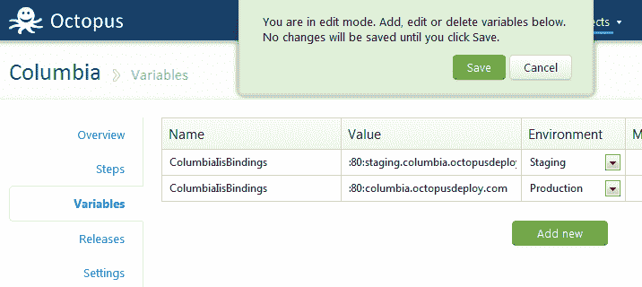

最后，我将创建一个新版本，并选择新的包版本:

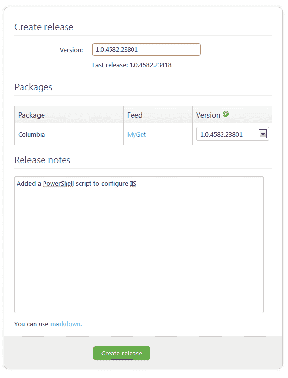

## 步骤 9:重新部署到暂存

我将再次将其部署到暂存:

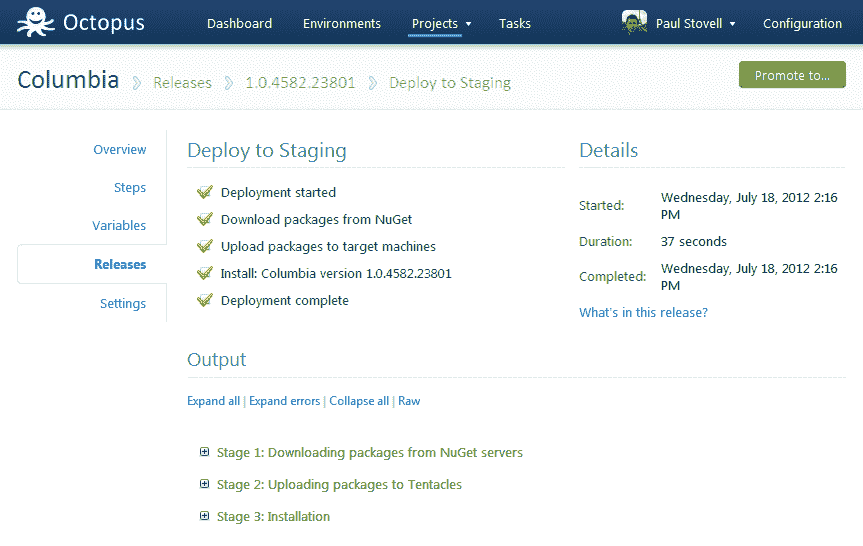

展开部署日志，我可以看到 PowerShell 脚本的输出:

```
2012-07-18 13:05:22 INFO   Calling PowerShell script: 'C:\Apps\Staging\Columbia\1.0.4582.23418\PostDeploy.ps1'
2012-07-18 13:05:37 DEBUG  Script 'C:\Apps\Staging\Columbia\1.0.4582.23418\PostDeploy.ps1' completed.
2012-07-18 13:05:37 DEBUG  Script output:
2012-07-18 13:05:37 DEBUG  App pool does not exist, creating...

Name                     State        Applications
----                     -----        ------------
Columbia-Staging         Started
Set .NET framework version: v4.0
Set identity...
Checking site...
Site does not exist, creating...

Name         : Columbia - Staging
ID           : 2
State        : Started
PhysicalPath : C:\Apps\Staging\Columbia\1.0.4582.23418
Bindings     : Microsoft.IIs.PowerShell.Framework.ConfigurationElement

Set app pool...
Set bindings...
IIS configuration complete! 
```

如果我浏览网站，我会看到:

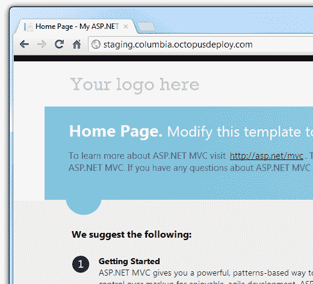

## 步骤 10:部署到生产环境

既然我们已经验证了试运行部署可以工作，那么让我们将其部署到生产环境中。当一个环境的部署完成时，会出现一个升级按钮:

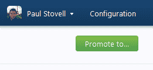

点击它，让我们选择生产:

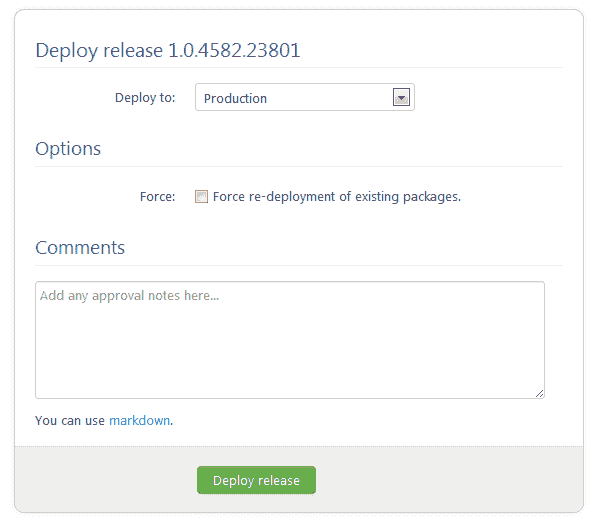

当部署完成时，我们可以展开第三步来查看包实际上被部署到两台机器上，它们位于 Amazon 负载平衡器的后面:

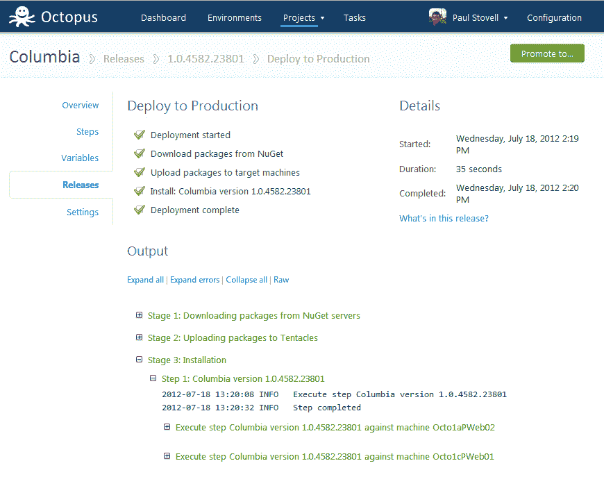

让我们来看看生产现场:

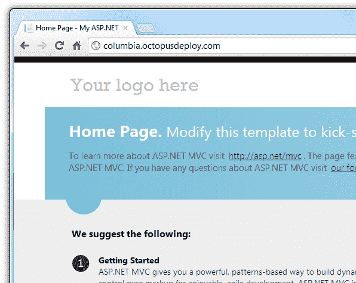

## 摘要

在这篇文章中，我创建了一个 ASP.NET MVC 4 站点，并将其签入到我托管的 TFS 预览实例中。然后，我使用 OctoPack 从 Team Build 创建 NuGet 包，使用 MyGet 托管包。最后，我配置 Octopus 将应用程序部署到一台登台机器和两台生产机器上。


结合我之前的图片，我们已经使用 Octopus 扩展了 TFS 预览版以部署到 EC2。但不止于此。Octopus 被设计成能够部署到云中、私有数据中心的虚拟机上，甚至部署到你桌子下面的机器上。我们已经扩展了 ALM，使其不仅仅意味着“部署到 Azure web 角色”。我们现在能够部署到托管在任何地方的虚拟机，并跨环境推广我们的产品。现在**即**是连续交货。

## 关于 TFS 预演的最后想法

正如我所说，我以前使用过 TFS 2010 的主机版本，体验并不好。然而，TFS 预览版已经走过了漫长的道路。源代码控制有了很大的改进，一旦我习惯了 UI，使用起来真的很棒。我可能会继续使用 GitHub 和 TeamCity 来完成我的大部分个人工作，但我认为微软已经为企业开发者创造了一个非常好的解决方案。试试看。