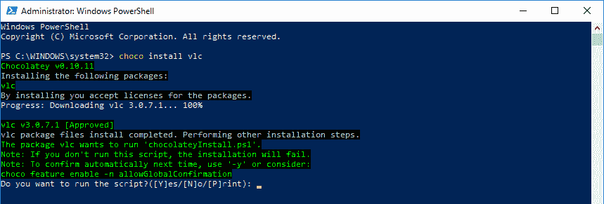
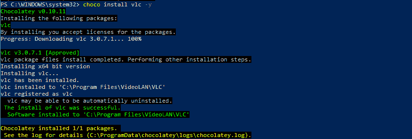
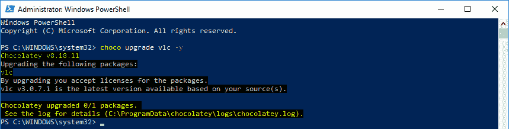
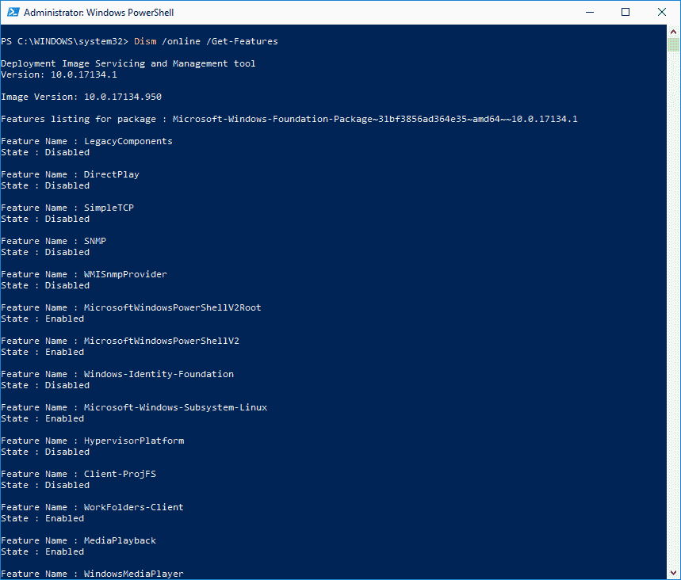

# 使用 Chocolatey - Octopus Deploy 自动设置开发人员机器

> 原文：<https://octopus.com/blog/automate-developer-machine-setup-with-chocolatey>

[](#)

没有什么比全新安装 Windows 更好的了，尤其是在开发人员的机器上。有了这些天我们得到的硬件，计算机正在飞快地尖叫。然而，这种幸福的感觉很快就被打破了，因为是时候安装所需的应用程序和框架了。第一步是打开 IE Edge 下载 Chrome、Firefox 或任何其他浏览器。接下来，找到所有的网站，然后手动下载并安装所有必要的工具。所有这些都让我想起了我的大学时光。当我在大学的时候，我会每六个月左右重新安装一次 Windows。我在 Windows 9x/ME 时代上过大学。似乎每个人，从网站到 TechTV，都推荐这样做，那是大约二十年前的事了。

谢天谢地，现在是 2019 年，可用的工具比我在大学时强大得多。我们不再需要浪费几个小时或一整天来下载和安装所有的东西。在这篇文章中，我将带你了解如何使用 [Chocolatey](https://chocolatey.org/) 自动设置开发人员的机器。

## 为什么是巧克力？

在加入 Octopus Deploy 之前，我曾在多家公司工作过。他们中的每一个人都遇到了同一个问题:我们如何让开发人员快速行动起来？提议的解决方案总是属于两种情况之一:

*   开发者图像。
*   像 SCCM 这样的强力工具。

第一个桶包含显影剂图像。人们谈论开发人员的图像，就像他们比炎热的夏天的冷饮更好。硬盘崩溃了？别担心，换下硬盘，使用图像，开发人员不到一个小时就可以开始工作了。新的开发者开始了吗？订购一台新的笔记本电脑，安装映像，开发人员不需要设置任何东西。他们进门之前就准备好了。

好吧，酷。除此之外，开发者工具一直在发布新版本。感觉好像一个星期都没有 Visual Studio 烦我更新到最新版本。谁来维护这一形象？该图像多久更新一次？最终经常发生的是，开发人员花费更多的时间更新和卸载旧工具，这实际上减慢了他们的速度。创建带有最新补丁的核心 Windows 映像，并让开发人员从那里开始，这更有意义。

第二个桶里装着像 SCCM 这样笨重的工具。我用过的工具有一个网络界面，我可以在那里选择我想安装在我机器上的软件，这听起来很棒。直到你看到你最喜欢的工具不见了或者列表上的版本是三年前的。将其添加到列表中涉及多个步骤，在某些情况下，还需要批准。是否要安装 Visual Studio 代码？酷，这将需要几个小时才能通过官僚程序，并且该列表永远不会更新，因为开发人员选择了阻力最小的路径。当下载和安装最新版本只需要不到 10 分钟的时间时，为什么要通过官僚主义来斗争呢？当每个人都必须有一个标准的软件包，如特定版本的 Microsoft Office 时，像 SCCM 这样的工具非常适合非开发人员的机器。

Chocolatey 不属于上述两个类别。如果你是一个. NET 开发者，那么你应该熟悉 NuGet。Chocolatey 是 Windows 的 NuGet。如果 Linux 是你的首选操作系统，那么 Chocolatey 就是包管理器，比如 apt 或者 RPM。它不属于这两个范畴，因为它是轻量级的，一个快速脚本安装它，并且它默认安装最新版本的包。它还将安装软件包需要的任何依赖项，如修补程序或另一个软件包。巧克力包装包裹着一个 MSI。它可能是章鱼触手、Visual Studio 或。NET Core SDK。

## 入门指南

首先，你需要安装 Chocolatey。你可以通过运行这里的脚本来实现。完成后，您就可以开始使用 Chocolatey 安装应用程序了。你可以通过进入[巧克力套装页面](https://chocolatey.org/packages)找到可用的应用程序。我的电脑上没有安装 VLC，所以我将通过键入以下内容进行安装:

```
choco install vlc 
```

这将导致出现一个提示:

[](#)

那个提示有点烦人。然而，它告诉我可以通过在我的命令中包含`-y`开关来避免它。让我们取消此操作，然后用`-y`开关重试。

【T2 

现在我已经在我的机器上安装了 VLC。如果我想更新它，我需要运行命令:

```
choco upgrade vlc -y 
```

如你所见，因为我刚刚安装了它，所以我有最新的版本。

[](#)

## 自动化开发机器设置

当我第一次开始使用 Chocolatey 时，我缺乏 PowerShell 知识，所以我的脚本看起来像这样:

```
Write-Host "Installing Google Chrome"
choco install googlechrome -y

Write-Host "Installing Firefox"
choco install firefox -y

Write-Host "Installing Redis"
choco install redis-64 -y

Write-Host "Installing 7-zip"
choco install 7zip -y 
```

对于一些软件包来说，复制/粘贴命令还不错。对于 20 多个包，复制/粘贴相同的命令很快就会过时。我想做的是将所有这些应用程序放入顶部的逗号分隔列表中，并浏览该列表:

```
$chocolateyAppList = "googlechrome,firefox,redis-64,7zip,dotnetcore-sdk,dotnetcore-windowshosting"
if ([string]::IsNullOrWhiteSpace($chocolateyAppList) -eq $false){   
    Write-Host "Chocolatey Apps Specified"  

    $appsToInstall = $chocolateyAppList -split "," | foreach { "$($_.Trim())" }

    foreach ($app in $appsToInstall)
    {
        Write-Host "Installing $app"
        & choco install $app /y
    }
} 
```

### Windows 功能

如果您是 Windows 的 web 开发人员，很有可能需要在您的机器上安装 IIS。IIS 不是 MSI，而是 Windows 的一项功能。好消息是 Chocolatey 也可以安装这些软件。它通过利用所谓的 [DISM 或部署映像服务管理](https://docs.microsoft.com/en-us/windows-hardware/manufacture/desktop/what-is-dism)来实现这一点。

要了解您可以使用哪些功能，您可以运行以下命令:

```
Dism /online /Get-Features 
```

[](#)

通过 Chocolatey 安装 DISM 功能的命令是:

```
choco install [Feature Name] /y /source windowsfeatures 
```

例如:

```
choco install IIS-ManagementService -y -source windowsfeatures 
```

使用与上面相同的逻辑，我们可以在脚本中包含 DISM 特征:

```
$dismAppList = "IIS-ASPNET45,IIS-CertProvider,IIS-ManagementService"

if ([string]::IsNullOrWhiteSpace($dismAppList) -eq $false){
    Write-Host "DISM Features Specified"    

    $appsToInstall = $dismAppList -split "," | foreach { "$($_.Trim())" }

    foreach ($app in $appsToInstall)
    {
        Write-Host "Installing $app"
        & choco install $app /y /source windowsfeatures | Write-Output
    }
} 
```

### Visual Studio 和其他缺失的应用程序

在撰写本文时，Chocolatey 中 Visual Studio 的最新版本是 Visual Studio 2017。Visual Studio 2019 于 2019 年 4 月问世。缺少最新的 Visual Studio 凸显了 Chocolatey 公共存储库的一个弱点。你只能任由开发应用程序的公司来创建软件包，或者由社区中的某个人来更新软件包。然而，你有能力[创建你自己的包](https://chocolatey.org/docs/create-packages)。您甚至可以建立一个[内部存储库](https://chocolatey.org/docs/how-to-host-feed)(就像您可以使用 NuGet 包一样)。内部存储库是免费的，但可以考虑为你的团队或公司购买巧克力。

**Post 发布注意:** Visual Studio 2019 在上面；我写这篇文章的那天，我很虚弱。可以找到 [Visual Studio 2019 企业版](https://chocolatey.org/packages/visualstudio2019enterprise)、 [Visual Studio 2019 专业版](https://chocolatey.org/packages/visualstudio2019professional)、 [Visual Studio 2019 社区版](https://chocolatey.org/packages/visualstudio2019community)。因为我没有找到 Visual Studio 2019，所以我添加了一个说明，说明这是 Chocolatey 公共回购的一个弱点。任何人都可以发布一个软件包，如果一家公司不这样做，人们可能会认为这是一种优势，而不是劣势。这是一个很好的反驳，任何人都能发布包是一个很大的优势。公共回购中有成千上万的应用程序，这是有原因的。由此得出的结论是:公共回购极有可能拥有你所需要的最新、最好的工具。但是，您选择的工具不在公共存储库中的可能性很小。特别是如果工具是内部构建和维护的，那么为该工具创建一个包是很容易的。但是，在哪里发布软件包将取决于您公司策略和工具。希望你能回馈社区，将这个包发布到公共回购上。但如果你不能公开回购，那么创建一个内部回购仍然是一个很大的选择。如果你选择内部回购，考虑为你的团队或公司购买巧克力。

### 创建可重复使用的脚本

到目前为止，所有的脚本示例都有硬编码的变量值，适用于工作良好的小型团队或公司。随着越来越多的团队使用这种方法，您需要提供一些灵活性。我见过几种情况。同一家公司的. NET 团队使用不同的工具集，这是因为他们工作的应用程序不同。一个团队可能需要 WIX 来开发 Windows 窗体应用程序，而另一个团队只使用 ASP.NET web API 后端来开发 Angular 网站。脚本应该接受参数。

另一件要考虑的事情是，我们不知道脚本何时运行，也不知道运行它的人是否已经安装了 Chocolatey。该脚本应该能够处理这种情况，并在需要时安装 Chocolatey:

```
Param(  
    [string]$chocolateyAppList,
    [string]$dismAppList    
)

if ([string]::IsNullOrWhiteSpace($chocolateyAppList) -eq $false -or [string]::IsNullOrWhiteSpace($dismAppList) -eq $false)
{
    try{
        choco config get cacheLocation
    }catch{
        Write-Output "Chocolatey not detected, trying to install now"
        iex ((New-Object System.Net.WebClient).DownloadString('https://chocolatey.org/install.ps1'))
    }
}

if ([string]::IsNullOrWhiteSpace($chocolateyAppList) -eq $false){   
    Write-Host "Chocolatey Apps Specified"  

    $appsToInstall = $chocolateyAppList -split "," | foreach { "$($_.Trim())" }

    foreach ($app in $appsToInstall)
    {
        Write-Host "Installing $app"
        & choco install $app /y | Write-Output
    }
}

if ([string]::IsNullOrWhiteSpace($dismAppList) -eq $false){
    Write-Host "DISM Features Specified"    

    $appsToInstall = $dismAppList -split "," | foreach { "$($_.Trim())" }

    foreach ($app in $appsToInstall)
    {
        Write-Host "Installing $app"
        & choco install $app /y /source windowsfeatures | Write-Output
    }
} 
```

我们现在可以为每个团队指定一个脚本来指定要安装的应用程序:

```
$chocolateyAppList = "googlechrome,firefox,redis-64,7zip,dotnetcore-sdk,dotnetcore-windowshosting"
$dismAppList = "IIS-ASPNET45,IIS-CertProvider,IIS-ManagementService"

Invoke-Expression "InstallApps.ps1 ""$chocolateyAppList"" ""$dismAppList""" 
```

## 附加用法

看看上面的 PowerShell 脚本并回答这个问题，这些脚本有开发机器专用的吗？没有。现在，这是一个有趣的想法，因为您可以使用脚本来引导 Windows 服务器机器，而不仅仅是开发机器。这引出了下一个问题，为什么不创建一个图像或使用工具，如 DSC？便携性和易于配置。

就像开发人员的机器一样，服务器也需要安装不同的应用程序。试图创造“一个图像来统治他们”是不可行的。使用带有最新补丁的核心 Windows 映像并在其上安装必要的应用程序要容易得多。或者，如果您使用云提供商，请使用所提供的 Windows 映像之一。

你可以一起使用 Chocolatey 和 DSC。或者您可以只使用一种工具。比起 DSC 我更喜欢用 Chocolatey。DSC 的[学习曲线比巧克力更陡。但它也更强大。我的建议是看看可用的工具，看看哪一个最有意义。](https://www.red-gate.com/simple-talk/sysadmin/powershell/powershell-desired-state-configuration-the-basics/)

我的团队每天都在创建和破坏我们的演示基础设施。美国中部时间凌晨 2 点，基础设施上线。在美国中部时间晚上 9 点，基础设施被摧毁。我们正在建立服务器，使用 Chocolatey 安装所需的组件，并安装 Tentacles 以获得最新的代码。服务器不打算活很久，我也不需要 DSC 的开销。

## 结论

正如您所看到的，使用 Chocolatey，可以自动设置开发人员的机器，同时为团队选择他们自己的工具提供了灵活性。这就是我喜欢用巧克力的原因。这是一个我可以根据自己的需要来设计的框架，它让我的生活变得更加轻松。在我个人的使用中，我看到了巨大的节约。在此之前，当我得到一台新机器时，我会花一个小时左右安装 Windows 更新，然后花几个小时下载并安装我最喜欢的应用程序。浪费几个晚上或一整天去做那件事并不罕见。现在，这一比例发生了逆转。我仍然需要花一个小时左右的时间来安装 Windows 更新，但现在我启动了 PowerShell 脚本，大约半个小时后，我就可以开始了。现在我唯一的麻烦是保持我的 Chocolatey 应用程序列表更新。