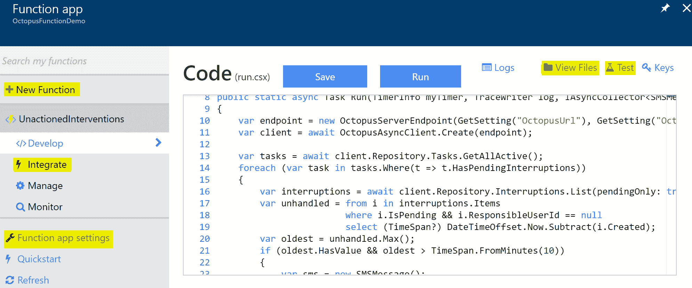
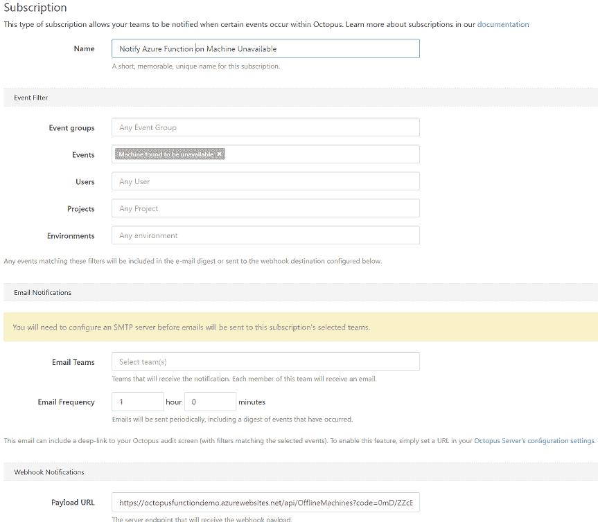

# 用 Azure 功能自动化 Octopus-Octopus Deploy

> 原文：<https://octopus.com/blog/automating-octopus-with-azure-functions>

随着微软和亚马逊分别发布 Azure Functions 和 T2，托管小型服务和脚本的努力和成本壁垒已经降低。这些服务可以与 Octopus [REST API](http://docs.octopusdeploy.com/display/OD/Octopus+REST+API) 和[订阅功能](http://docs.octopusdeploy.com/display/OD/Subscriptions)相结合，提供高于 Octopus 现成功能的自动化。

这篇文章探讨了两个这样的集成。第一个示例升级无人认领的手动干预，第二个示例响应机器离线。两个例子都使用了 [Octopus。客户端](http://docs.octopusdeploy.com/display/OD/Octopus.Client)带 C# [Azure 函数的库](https://azure.microsoft.com/en-us/services/functions/)。也使用了 [Twilio SMS 集成](https://docs.microsoft.com/en-us/azure/azure-functions/functions-bindings-twilio)，但这可以用您选择的通知方法来代替，或者只是一条日志消息。

## 示例 1 -无人认领的干预

该示例定期查询 Octopus 服务器，并查找任何具有待定手动干预的部署。如果在检查时，那些手动干预没有被分配给任何人，并且已经超过一分钟，则发送 SMS。引导故障也包括在内，因为它们是人工干预的特殊情况。

### 功能设置



使用您的 Azure 帐户创建新功能应用后，添加新功能并选择`TimerTrigger-CSharp`模板。给它一个名称，并保持默认的时间表。

以章鱼为参照。客户端 nuget 包，选择`View Files`(见上图 sceenshot)，添加一个名为`project.json`的文件，内容如下。更多细节请看 [Azure 功能包管理](https://docs.microsoft.com/en-us/azure/azure-functions/functions-reference-csharp#package-management)。

```
{
  "frameworks": {
    "net46":{
      "dependencies": {
        "Octopus.Client": "4.5.0"
      }
    }
   }
} 
```

接下来设置 Octopus 公共 URL 和 [API 键](http://docs.octopusdeploy.com/display/OD/How+to+create+an+API+key)。为此，选择`Function app settings`项(见截图)，然后选择`Configure app settings`。添加两个 app 设置，`OctopusUrl`和`OctopusApiKey`。

最后，设置 Twilo 集成。这是可选的，所以如果跳过它，从代码中删除对 Twilo 和`SMSMessage`的引用。再次选择该功能，然后选择`Integrate`。创建新的`Output`，选择`Twilio SMS`。输入您的 Twilo 详细信息。请注意，SID 和令牌是对应用程序设置的引用，因此您需要到那里输入实际的 SID 和应用程序设置。

### 该功能

将函数体(`run.csx`)替换为以下内容:

```
#r "Twilio.Api"

using System.Net;
using Octopus.Client;
using Octopus.Client.Model;
using Twilio;

public static async Task Run(TimerInfo myTimer, TraceWriter log, IAsyncCollector<SMSMessage> message)
{
    var endpoint = new OctopusServerEndpoint(GetSetting("OctopusUrl"), GetSetting("OctopusApiKey"));
    var client = await OctopusAsyncClient.Create(endpoint);

    var tasks = await client.Repository.Tasks.GetAllActive();
    foreach (var task in tasks.Where(t => t.HasPendingInterruptions))
    {
        var interruptions = await client.Repository.Interruptions.List(pendingOnly: true, regardingDocumentId: task.Id);
        var unhandled = from i in interruptions.Items
                        where i.IsPending && i.ResponsibleUserId == null
                        select (TimeSpan?) DateTimeOffset.Now.Subtract(i.Created);
        var oldest = unhandled.Max();
        if (oldest.HasValue && oldest > TimeSpan.FromMinutes(1))
        {
            var sms = new SMSMessage();
            sms.Body = $"The task {task.Description} has not been actioned after {oldest.Value.TotalMinutes:n0} minutes";
            log.Info(sms.Body);
            await message.AddAsync(sms);
        }
    }  
}

public static string GetSetting(string name) =>  System.Environment.GetEnvironmentVariable(name, EnvironmentVariableTarget.Process); 
```

点击`Save and run`按钮，查看日志输出，应该运行成功。

### 测试

为了测试集成，创建一个带有[手动干预](http://docs.octopusdeploy.com/display/OD/Manual+intervention+and+approvals)步骤的新项目(或者使用一个现有的项目)并部署它。或者导致部署因[导向故障](http://docs.octopusdeploy.com/display/OD/Guided+failures)而暂停。等待一分钟，然后再次手动运行该功能(或等待该功能在计时器上运行)。

## 示例 2 -脱机计算机

这个例子是由一个[订阅](http://docs.octopusdeploy.com/display/OD/Subscriptions)触发的，当一台机器由于运行状况检查或部署而从可用转换到不可用时。然后，它确定是删除该机器还是采取一些补救措施。如果机器无法恢复，将发送短信。为了简单起见，下面的实现总是确定不应该删除该机器，补救措施是什么也不做。

## 设置

基于`HttpTrigger-CSharp`模板添加一个新功能(保持授权级别为`Function`)，并按照上述说明设置 Octopus。客户和 Twilio。

接下来在 Octopus 实例中添加一个[订阅](http://docs.octopusdeploy.com/display/OD/Subscriptions)，带有一个事件过滤器`Machine found to be unavailable`和一个 Azure 函数的有效负载 URL。



### 测试

由于该函数响应外部事件和有效负载，为了加速该函数的开发和测试，可以使用内置测试功能捕获有效负载，然后重放。首先，用以下内容替换函数体(`run.csx`)并保存:

```
#r "Twilio.Api"

using System.Net;
using Twilio;

public static async Task<HttpResponseMessage> Run(HttpRequestMessage req, TraceWriter log, IAsyncCollector<SMSMessage> message)
{
    dynamic data = await req.Content.ReadAsAsync<object>();
    log.Info(data.ToString());
    return req.CreateResponse(HttpStatusCode.OK);
} 
```

接下来，停止服务器的一个触角，并对该触角运行健康检查。这项检查应该会失败。

查看您的函数的日志输出，您应该看到 Octopus 请求有效负载。如果没有，检查[服务器日志](http://docs.octopusdeploy.com/display/OD/Log+files)中的警告。

从日志输出中复制请求有效负载，并选择 Test 菜单项(在 View Files 旁边)。将有效负载粘贴到请求正文部分。现在再次单击 Run 按钮，有效负载将再次打印到输出中。

### 该功能

为了简单起见，这个函数有两个占位符方法`HasBeenDecommissioned`和`AttemptToBringOnline`。在完整的实现中，这些方法将与外部系统交互，如 Azure 管理 API 或一些基础设施监控软件。

将函数体(`run.csx`)替换为以下内容:

```
#r "Twilio.Api"

using System.Net;
using Octopus.Client;
using Octopus.Client.Model;
using Twilio;

public static async Task<HttpResponseMessage> Run(HttpRequestMessage req, TraceWriter log, IAsyncCollector<SMSMessage> message)
{
    var endpoint = new OctopusServerEndpoint(GetSetting("OctopusUrl"), GetSetting("OctopusApiKey"));
    var client = await OctopusAsyncClient.Create(endpoint);

    var machineIds = await GetAffectedMachineIds(req);
    log.Info($"Machines {string.Join(", ", machineIds)} have gone offline");

    var failedMachines = new List<MachineResource>();
    foreach(var id in machineIds)
    {
        var machine = await client.Repository.Machines.Get(id);
        if(HasBeenDecommissioned(machine))
        {
            log.Info($"Machine {machine.Id} is no longer required, removing");
            await client.Repository.Machines.Delete(machine);
        }
        else
        {
            log.Info($"Machine {machine.Id} should not have gone offline");
            failedMachines.Add(machine);
        }
    }

    await SendOutageSms(failedMachines.Count, message);
    await AttemptToBringOnline(failedMachines);
    var task = await client.Repository.Tasks.ExecuteHealthCheck();

    return req.CreateResponse(HttpStatusCode.OK);
}

public static string GetSetting(string name) =>  System.Environment.GetEnvironmentVariable(name, EnvironmentVariableTarget.Process);

static async Task<string[]> GetAffectedMachineIds(HttpRequestMessage req)
{
    dynamic data = await req.Content.ReadAsAsync<object>();
    var ids = (string[]) data.Payload.Event.RelatedDocumentIds.ToObject<string[]>();
    return ids.Where(i => i.StartsWith("Machines-")).ToArray();
}

// Call out to cloud provider or monitoring software
static bool HasBeenDecommissioned(MachineResource machine) => false;

static Task SendOutageSms(int count, IAsyncCollector<SMSMessage> message)
{
    var sms = new SMSMessage();
    sms.Body = $"{count} machines has become unavailable";
    return message.AddAsync(sms);
}

// Take some remedial action
static Task AttemptToBringOnline(List<MachineResource> machines) => Task.CompletedTask; 
```

点击`Save and run`按钮并检查日志输出，它应该报告机器已经离线。

## 更多信息

参见[协调多个项目](http://docs.octopusdeploy.com/display/OD/Coordinating+Multiple+Projects)文档页面，该页面概述了一些进一步的场景以及一些示例代码。

有关更多代码示例，请参见 [OctopusDeploy-Api](https://github.com/OctopusDeploy/OctopusDeploy-Api) GitHub 资源库。

最后， [LinqPad](https://www.linqpad.net/) 是编辑和测试部分功能的绝佳工具。