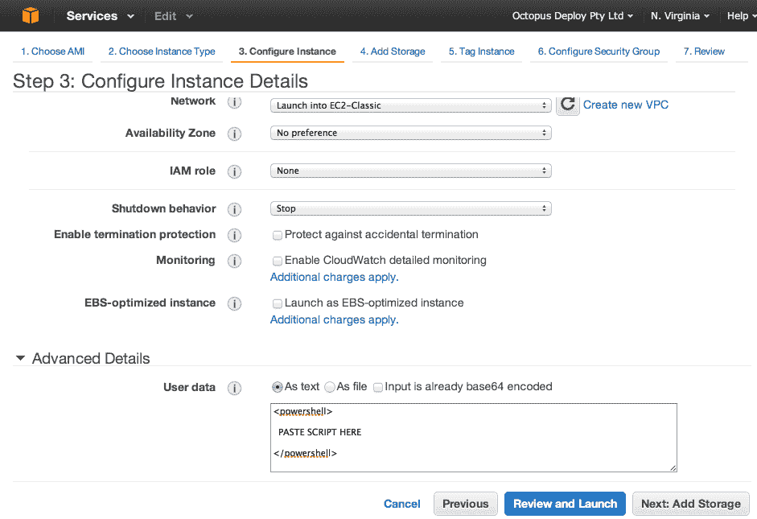
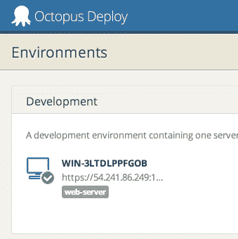

# 自动提供安装了触手的 Amazon EC2 实例——Octopus Deploy

> 原文：<https://octopus.com/blog/auto-provision-ec2-instances-with-tentacle-installed>

Octopus 用来自动化部署的触手代理长期以来一直支持通过命令行进行配置。可以自动下载 MSI，安装它，配置触手实例，甚至向 Octopus 服务器注册它，所有这些都通过命令行完成。

当通过 Amazon EC2 配置 Windows 服务器时，您可以将 PowerShell 脚本作为用户数据传递。这将在 EC2 实例第一次启动时执行:

我已经根据我们在[自动化触手安装](http://docs.octopusdeploy.com/display/OD/Automating+Tentacle+installation)上的说明整理了一个示例脚本。你可以在下面找到这个脚本。将它粘贴到`<powershell>` XML 元素之间，然后等待机器启动。当它最终启动时，机器将注册到您的八达通服务器:

如果遇到任何问题，请远程访问机器并查看以下两个文件:

*   `C:\TentacleInstallLog.txt`
*   `C:\Program Files\Amazon\Ec2ConfigService\Logs\Ec2ConfigLog.txt`

以下是 PowerShell 脚本:

当您设置 EC2 实例并为其分配安全组时，请确保您指定的触手监听端口(默认为 10933)允许 TCP 流量。该脚本会自动将例外添加到 Windows 防火墙，但是您需要对 AWS 防火墙执行相同的操作。

有关 EC2 实例预配和用户数据的更多信息，请参见: