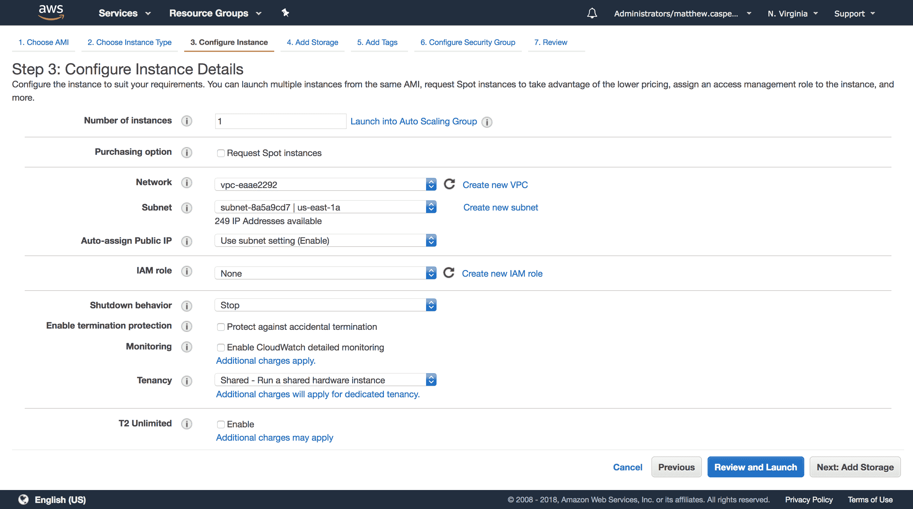
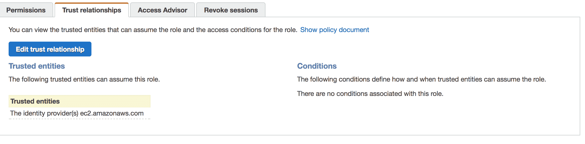

# 相信我-分配和承担 IAM 角色- Octopus 部署

> 原文：<https://octopus.com/blog/aws-roles>

AWS 允许向 EC2 实例这样的资源分配 IAM 角色。实际上，这给了在 EC2 实例上运行的应用程序该角色的权限。这意味着代码本身和运行代码的进程都不需要提供任何凭证或密钥，这在设计部署实践时非常方便。

在这篇博文中，我们将看看如何将角色分配给 EC2 实例，然后用来承担次要角色。

## 将角色分配给 EC2 实例

我们将从一个没有角色的 EC2 实例和一个名为`ExampleRole`的 IAM 角色开始，该角色没有附加策略。可以使用以下命令将角色分配给现有 EC2 实例:

```
aws ec2 associate-iam-instance-profile --instance-id i-0123456789abcdef0 --iam-instance-profile Name="ExampleRole" 
```

输出将类似于:

```
{
    "IamInstanceProfileAssociation": {
        "AssociationId": "iip-assoc-0123456789abcdef0",
        "InstanceId": "i-0123456789abcdef0",
        "IamInstanceProfile": {
            "Arn": "arn:aws:iam::123456789012:instance-profile/ExampleRole",
            "Id": "ABCDEFGHIJKLMNOPQRSTU"
        },
        "State": "associating"
    }
} 
```

EC2 实例现在被分配了一个角色。

您可以在创建 EC2 实例的过程中使用`IAM role`下拉菜单分配一个角色。

[](#)

## 创建信任策略

在 EC2 实例可以使用分配的角色之前，该角色需要给予 EC2 服务这样做的权限。这是通过将以下策略分配给`ExampleRole`信任关系来实现的。

```
{
  "Version": "2012-10-17",
  "Statement": [
    {
      "Effect": "Allow",
      "Principal": {
        "Service": "ec2.amazonaws.com"
      },
      "Action": "sts:AssumeRole"
    }
  ]
} 
```

[](#)

## 从实例角色生成密钥

分配给 EC2 实例的角色列表可以从实例元数据中找到。这是通过一个私有的 HTTP API 访问的，该 API 可以在[HTTP://169 . 254 . 169 . 254/latest/metadata](http://169.254.169.254/latest/meta-data)下访问。

要获得与实例相关联的角色，请从 EC2 实例本身运行这个命令。这个 URL 末尾的斜线很重要。

```
curl http://169.254.169.254/latest/meta-data/iam/security-credentials/ 
```

输出应该是带有角色名称的单行。

```
ExampleRole 
```

该命令将返回访问、机密和会话令牌密钥。

```
curl http://169.254.169.254/latest/meta-data/iam/security-credentials/ExampleRole 
```

该调用的结果是以下 JSON:

```
{
  "Code" : "Success",
  "LastUpdated" : "2018-01-25T23:15:40Z",
  "Type" : "AWS-HMAC",
  "AccessKeyId" : "AKJBD787KHV7JHV7JGC9",
  "SecretAccessKey" : "oqfqoufbqow/qwobOUBuIViyciycIY7ivy7gcUCj",
  "Token" : "FQoDYXdzEID//////////wEaDMb+nhXW1CzKSssr7iK3A6xOpwS5AQ+Rx/3ZsvWa2mcnZv/e3LHOSU9oNShnnL91uu8NHiiZyKVhoH/G/58WwEUtMf5tZKLT05Rv7ihLNdhsyJ9YkIGplsnl3KQUGEVbg1yfjOLzEHcBcqzYorwVyqDyeo7xoo4CGqxMzjcBApKDTRRA8X146raCb1/marnHzhqDqpfJykKr8WXAhbIfxHTNPdKFIa7Fm9h1mNsbTZOy8obwMR3tOf88HtmxVSPpISSn3VTzcEpZT9VHDe6O7HEtTrTn9Phid0/Fq5KUh4KOgxDfzLSfJiGGTqs8wF99310DUdK8bQFLemrrOmq2iUhVv0SkH4MKlkMY8B7/T1gqoN1JaQ9xUXZL2J6ZDPFSmRmx7GiR8emN17wQAH0+VMVlrl0sXX8IkMoZyd3M5S9VRF4csRYyzPGhTBwYuBsf/85ANKc/k/K2/uBLqpabsqt+ccleU7A2PrcFqRL+MpZDfPotWspT6b9Q2By7D3X/5NtnIjIxutvdcn2MN38CCi1l/cYuc9iJwZVY2eluV5HXZbyV0oMwi9bYy7BZz0e/54tauABSf3s6JSmfBw0NByUEn5aZeT4o88mp0wU=",
  "Expiration" : "2018-01-26T05:40:31Z"
} 
```

要使用这些键，通常要将它们分配给环境变量。

| JSON 字段 | 环境变量 |
| --- | --- |
| AccessKeyId | AWS_ACCESS_KEY_ID |
| 秘钥 | AWS_SECRET_ACCESS_KEY |
| 代币 | AWS _ 会话 _ 令牌 |

## 在 AWS CLI 中使用角色凭据

尽管可以查询实例元数据并根据键创建环境变量，但是很多工具已经知道如何自己查询实例元数据。AWS CLI 就是一个很好的例子。

不创建任何环境变量或运行`aws configure`将任何键保存在本地配置文件中，运行命令:

```
aws sts get-caller-identity 
```

将导致:

```
{
    "Account": "123456789012",
    "UserId": "ABCDEFGHIJKLMNOPQRSTU:i-0123456789abcdef0",
    "Arn": "arn:aws:sts::123456789012:assumed-role/ExampleRole/i-0123456789abcdef0"
} 
```

在这种情况下，AWS CLI 知道如何从实例元数据生成密钥，如果没有其他密钥、环境变量或配置文件，它会自动生成密钥。

## 承担次要角色

从分配给 EC2 实例的角色中，我们可以假设一个次要角色。次要角色可能用于测试权限，或者以与使用`sudo`命令相同的方式运行具有额外权限的流程。

让我们假设我们有第二个角色叫做`ExampleAssumedRole`，我们想从`ExampleRole`开始承担这个角色。

第一步是给`ExampleRole`承担`ExampleAssumedRole`的权限。这是通过`ExampleRole`上的以下策略完成的:

```
{
    "Version": "2012-10-17",
    "Statement": [
        {
            "Sid": "Stmt1512947264000",
            "Effect": "Allow",
            "Action": [
                "sts:AssumeRole"
            ],
            "Resource": [
                "arn:aws:iam::123456789012:role/ExampleAssumedRole"
            ]
        }
    ]
} 
```

那么`ExampleAssumedRole`需要更新为信任`ExampleRole`:

```
{
  "Version": "2012-10-17",
  "Statement": [
    {
      "Effect": "Allow",
      "Principal": {
        "AWS": "arn:aws:iam::123456789012:role/ExampleRole"
      },
      "Action": "sts:AssumeRole"
    }
  ]
} 
```

有了这些策略，运行以下命令来承担一个角色:

```
aws sts assume-role --role-arn arn:aws:iam::123456789012:role/ExampleAssumedRole --role-session-name MySession 
```

然后结果包含`AccessKeyId`、`SecretAccessKey`和`SessionToken`，它们可以按照`Generating Keys from an Instance Role`中描述的相同方式分配给环境变量:

```
{
    "AssumedRoleUser": {
        "AssumedRoleId": "ABCDEFGHIJKLMNOPQRSTU:MySession",
        "Arn": "arn:aws:sts::123456789012:assumed-role/ExampleAssumedRole/MySession"
    },
    "Credentials": {
        "SecretAccessKey": "oqfqoufbqow/qwobOUBuIViyciycIY7ivy7gcUCj",
        "SessionToken": "FQoDYXdzEIH//////////wEaDB9lgc8b8VS+LXRmliLtAdYWQNM1RnhGG/UdRszkg1xOtCIVevt7W34A4Lu1McUpEMVsFUrhEYIZR3fVFbPP6dwnxQ/H78jN1jKZuXgXPIH00NA3PtvxR8zcHDmkVeeCrnz+TiNk5k8/Tzh1qyzaH29sPY6oXhLCfsKSaQkw3nGd5RoslByOnNywVtJc762ke4F9YXAZffelSmQIhKdntqQj7L+DDAijRmjxCjadItJz7oxRdkN11ez13dny1wzIdPC7vuszivgF9+uACjZFQxgPS95f7w1VOhcCtmSMt9ErZd29BWdiO5CPr2ytBVEhNG7URgljEup2zqLCTCjc1qnTBQ==",
        "Expiration": "2018-01-26T00:42:20Z",
        "AccessKeyId": "AKJBD787KHV7JHV7JGC9"
    }
} 
```

## 结论

AWS 提供了一个灵活的安全系统，允许将角色分配给 EC2 实例，并允许承担次要角色。这允许在应用程序或脚本中不嵌入密钥的情况下分配权限，并允许使用不同的权限运行进程，就像使用`sudo`命令一样。