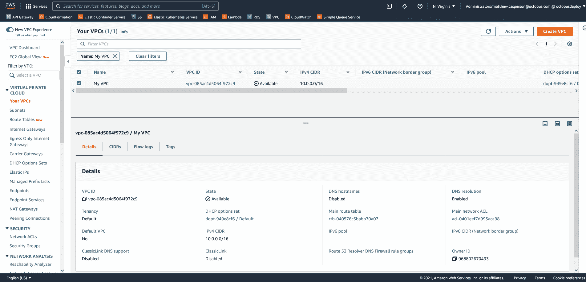

# 使用 CloudFormation - Octopus Deploy 创建一个私有 AWS VPC

> 原文：<https://octopus.com/blog/aws-vpc-private>

虚拟专用云(VPC)是部署到 AWS 的任何基础设施的支柱。几乎所有的资源都需要一个 VPC，并且大多数资源隔离都是通过 VPC 完成的。

不幸的是，尽管它们无处不在，创建 VPC 并不像想象的那么简单。

在本文中，您将了解 AWS 中可用的不同类型的 VPC，并找到一个示例 CloudFormation 模板，该模板可用于部署带有私有子网的简单 VPC。

## AWS 子网的类型

AWS 有两种类型的子网:公共子网和私有子网。

公共子网通过[互联网网关](https://docs.aws.amazon.com/vpc/latest/userguide/VPC_Internet_Gateway.html)连接到互联网，并且可以托管具有公共 IP 地址的资源。

AWS 将互联网网关定义为:

> 一个水平扩展、冗余且高度可用的 VPC 组件，允许您的 VPC 和互联网之间的通信。

私有子网不会将流量路由到互联网网关。私有子网中的资源没有公共 IP 地址，只能与同一 VPC 中的其他子网中的资源通信。

一个或多个子网可以放在一个 VPC 中。可以在 VPC 中混合搭配公共和私有子网，允许 VPC 中的一些资源访问互联网，而一些资源只能访问 VPC 中的其他资源。

带有专用子网的 VPC 是最容易配置的，您将在下一节中进行配置。

## 创建带有私有子网的 VPC

以下 CloudFormation 模板创建了一个带有两个专用子网的 VPC:

```
Parameters:
  Tag:
    Type: String

Resources: 
  VPC:
    Type: "AWS::EC2::VPC"
    Properties:
      CidrBlock: "10.0.0.0/16"
      Tags:
      - Key: "Name"
        Value: !Ref "Tag"

  SubnetA:
    Type: "AWS::EC2::Subnet"
    Properties:
      AvailabilityZone: !Select 
        - 0
        - !GetAZs 
          Ref: 'AWS::Region'
      VpcId: !Ref "VPC"
      CidrBlock: "10.0.0.0/24"

  SubnetB:
    Type: "AWS::EC2::Subnet"
    Properties:
      AvailabilityZone: !Select 
        - 1
        - !GetAZs 
          Ref: 'AWS::Region'
      VpcId: !Ref "VPC"
      CidrBlock: "10.0.1.0/24"

  RouteTable:
    Type: "AWS::EC2::RouteTable"
    Properties:
      VpcId: !Ref "VPC"

Outputs:
  VpcId:
    Description: The VPC ID
    Value: !Ref VPC 
```

VPC 的名称由`Tag`参数定义:

```
 Tag:
    Type: String 
```

VPC 被定义为一种 [AWS EC2 VPC](https://docs.aws.amazon.com/AWSCloudFormation/latest/UserGuide/aws-resource-ec2-vpc.html) 资源。

`CidrBlock`属性定义无类域间路由 IP 块，该块定义与 VPC 相关联的子网可用的 IP 地址范围。`10.0.0.0/16`定义了一组以`10.0`开头的 IP 地址。

请注意，VPC 有一个名为`Name`的标签。此标记的值显示在 AWS web 控制台中:

```
 VPC:
    Type: "AWS::EC2::VPC"
    Properties:
      CidrBlock: "10.0.0.0/16"
      Tags:
      - Key: "Name"
        Value: !Ref "Tag" 
```

接下来，使用 [AWS EC2 子网](https://docs.aws.amazon.com/AWSCloudFormation/latest/UserGuide/aws-resource-ec2-subnet.html)资源定义两个子网。

子网被放置在[可用区域](https://docs.aws.amazon.com/AWSEC2/latest/UserGuide/using-regions-availability-zones.html) (AZs)中，这些区域是一个区域中的隔离位置。az 具有类似于`us-east-1`或`ap-southeast-2`的代码，这些代码基于 az 所在的区域。

您可以使用 [`Select`内在函数](https://docs.aws.amazon.com/AWSCloudFormation/latest/UserGuide/intrinsic-function-reference-select.html)从 [`GetAZs`数组](https://docs.aws.amazon.com/AWSCloudFormation/latest/UserGuide/intrinsic-function-reference-getavailabilityzones.html)中返回项目，这将返回您的 VPC 正在创建的区域的可用 AZ，而不是硬编码这些 AZ 名称。

每个子网都有自己唯一的 CIDR 块。

*   第一个子网定义了块`10.0.0.0/24`，这意味着该子网中的所有资源都有以`10.0.0`开头的 IP 地址。

*   第二个子网定义了块`10.0.1.0/24`，这意味着第二个子网中的所有资源都有以`10.0.1`开头的 IP 地址:

```
 SubnetA:
    Type: "AWS::EC2::Subnet"
    Properties:
      AvailabilityZone: !Select 
        - 0
        - !GetAZs 
          Ref: 'AWS::Region'
      VpcId: !Ref "VPC"
      CidrBlock: "10.0.0.0/24"

  SubnetB:
    Type: "AWS::EC2::Subnet"
    Properties:
      AvailabilityZone: !Select 
        - 1
        - !GetAZs 
          Ref: 'AWS::Region'
      VpcId: !Ref "VPC"
      CidrBlock: "10.0.1.0/24" 
```

子网之间的网络连接由路由表定义，路由表由[AWSEC2route table](https://docs.aws.amazon.com/AWSCloudFormation/latest/UserGuide/aws-resource-ec2-routetable.html)资源创建。默认路由表允许每个子网中实例之间的连接，因此您无需在此处指定任何其他路由:

```
 RouteTable:
    Type: "AWS::EC2::RouteTable"
    Properties:
      VpcId: !Ref "VPC" 
```

要部署该模板，请使用[部署 AWS CloudFormation 模板](https://octopus.com/docs/deployments/aws/cloudformation)步骤。

下面的屏幕截图显示了创建后 AWS 控制台中的 VPC:

[](#)

## 结论

带有专用子网的 VPC 最容易创建。在本文中，您看到了一个简单的 CloudFormation 模板来创建一个带有两个私有子网的 VPC。

在下一篇文章中，你将学习如何创建带有公共子网的 VPC。

阅读我们的 [Runbooks 系列](https://octopus.com/blog/tag/Runbooks%20Series)的其余部分。

愉快的部署！