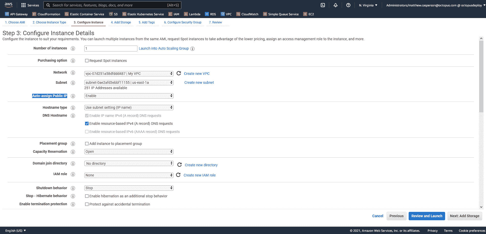
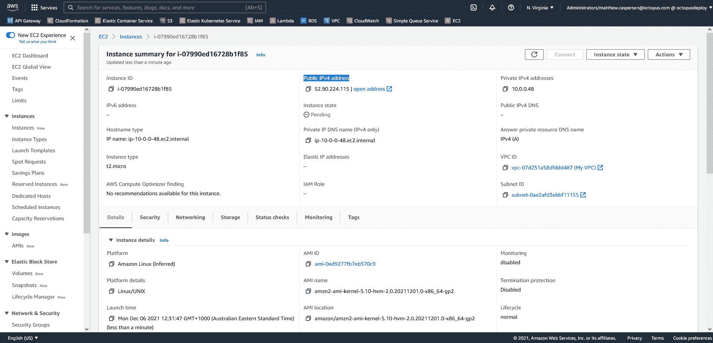

# 使用 CloudFormation - Octopus Deploy 创建公共 AWS VPC

> 原文：<https://octopus.com/blog/aws-vpc-public>

在我们的第一篇文章[用 CloudFormation](https://octopus.com/blog/aws-vpc-private) 创建一个私有的 AWS VPC 中，您看到了如何创建一个带有私有子网的 VPC。此 VPC 中的实例无法访问互联网，只能与同一 VPC 的子网中的实例通信。

在本文中，您将创建一个带有公共子网的 VPC，允许实例访问互联网以及从互联网被访问。

## 子网的类型

AWS 有两种类型的子网:公共子网和私有子网。

公共子网通过[互联网网关](https://docs.aws.amazon.com/vpc/latest/userguide/VPC_Internet_Gateway.html)连接到互联网，并且可以托管具有公共 IP 地址的资源。AWS 将互联网网关定义为:

> 一个水平扩展、冗余且高度可用的 VPC 组件，允许您的 VPC 和互联网之间的通信。

私有子网不会将流量路由到互联网网关。私有子网中的资源没有公共 IP 地址，只能与同一 VPC 内其他子网中的资源通信。

带有公共子网的 VPC 允许实例访问互联网。如果这些实例有公共 IP 地址，也可以从互联网访问它们。

## 创建带有公共子网的 VPC

以下 CloudFormation 模板创建了一个包含两个公共子网的 VPC:

```
Parameters:
  Tag:
    Type: String

Resources: 
  VPC:
    Type: "AWS::EC2::VPC"
    Properties:
      CidrBlock: "10.0.0.0/16"
      InstanceTenancy: "default"
      Tags:
      - Key: "Name"
        Value: !Ref "Tag"    

  SubnetA:
    Type: "AWS::EC2::Subnet"
    Properties:
      AvailabilityZone: !Select 
        - 0
        - !GetAZs 
          Ref: 'AWS::Region'
      VpcId: !Ref "VPC"
      CidrBlock: "10.0.0.0/24"

  SubnetB:
    Type: "AWS::EC2::Subnet"
    Properties:
      AvailabilityZone: !Select 
        - 1
        - !GetAZs 
          Ref: 'AWS::Region'
      VpcId: !Ref "VPC"
      CidrBlock: "10.0.1.0/24"

  RouteTable:
    Type: "AWS::EC2::RouteTable"
    Properties:
      VpcId: !Ref "VPC"

  InternetGateway:
    Type: "AWS::EC2::InternetGateway"

  VPCGatewayAttachment:
    Type: "AWS::EC2::VPCGatewayAttachment"
    Properties:
      VpcId: !Ref "VPC"
      InternetGatewayId: !Ref "InternetGateway"

  InternetRoute:
    Type: "AWS::EC2::Route"
    Properties:
      DestinationCidrBlock: "0.0.0.0/0"
      GatewayId: !Ref InternetGateway
      RouteTableId: !Ref RouteTable

  SubnetARouteTableAssociation:
    Type: "AWS::EC2::SubnetRouteTableAssociation"
    Properties:
      RouteTableId: !Ref RouteTable
      SubnetId: !Ref SubnetA

  SubnetBRouteTableAssociation:
    Type: "AWS::EC2::SubnetRouteTableAssociation"
    Properties:
      RouteTableId: !Ref RouteTable
      SubnetId: !Ref SubnetB

Outputs:
  VpcId:
    Description: The VPC ID
    Value: !Ref VPC 
```

上面的模板建立在上一篇文章中的模板之上，[使用 CloudFormation](https://octopus.com/blog/aws-vpc-private) 创建一个私有 AWS VPC，添加一个互联网网关和将流量定向到互联网所需的路由表。参考[以前的帖子](https://octopus.com/blog/aws-vpc-private)阅读 VPC、子网和路由表资源的详细信息。

要将 VPC 连接到互联网，您必须连接一个互联网网关，由[AWSEC2internet gateway](https://docs.aws.amazon.com/AWSCloudFormation/latest/UserGuide/aws-resource-ec2-internetgateway.html)资源表示。除了添加自定义标记之外，此资源不支持任何配置属性:

```
 InternetGateway:
    Type: "AWS::EC2::InternetGateway" 
```

互联网网关通过[AWSEC2VPCGatewayAttachment](https://docs.aws.amazon.com/AWSCloudFormation/latest/UserGuide/aws-resource-ec2-vpc-gateway-attachment.html)资源连接到 VPC:

```
 VPCGatewayAttachment:
    Type: "AWS::EC2::VPCGatewayAttachment"
    Properties:
      VpcId: !Ref "VPC"
      InternetGatewayId: !Ref "InternetGateway" 
```

要通过 internet 网关引导外部流量，您必须创建一个路由，由 [AWS EC2 Route](https://docs.aws.amazon.com/AWSCloudFormation/latest/UserGuide/aws-resource-ec2-route.html) 资源表示。

下面的路由定义了一个`0.0.0.0/0`的`DestinationCidrBlock`，匹配所有流量。此路由将在连接同一 VPC 子网中实例的默认路由之后应用，因此只有不是发往 VPC 中另一个实例的流量才会受到此路由的影响。实际上，这意味着任何外部流量都通过互联网网关进行定向:

```
 InternetRoute:
    Type: "AWS::EC2::Route"
    Properties:
      DestinationCidrBlock: "0.0.0.0/0"
      GatewayId: !Ref InternetGateway
      RouteTableId: !Ref RouteTable 
```

然后，该路由通过[AWSEC2SubnetRouteTableAssociation](https://docs.aws.amazon.com/AWSCloudFormation/latest/UserGuide/aws-resource-ec2-subnet-route-table-assoc.html)资源与两个子网相关联，这使它们成为公共子网:

```
 SubnetARouteTableAssociation:
    Type: "AWS::EC2::SubnetRouteTableAssociation"
    Properties:
      RouteTableId: !Ref RouteTable
      SubnetId: !Ref SubnetA

  SubnetBRouteTableAssociation:
    Type: "AWS::EC2::SubnetRouteTableAssociation"
    Properties:
      RouteTableId: !Ref RouteTable
      SubnetId: !Ref SubnetB 
```

要部署该模板，请使用[部署 AWS CloudFormation 模板](https://octopus.com/docs/deployments/aws/cloudformation)步骤。请注意放置在此 VPC 中的 EC2 实例如何选择接收公共 IP 地址:

[](#)

分配给 EC2 实例的 IP 地址允许您从本地 PC SSH 到它:

[](#)

## 结论

公共子网允许实例访问互联网，并为它们提供分配公共 IP 地址的选项。创建带有公共子网的 VPC 需要构建一个 internet 网关，将其连接到 VPC，定义一个路由以引导公共流量通过 internet 网关，并将路由分配给子网。

在这篇文章中，您看到了一个创建带有两个公共子网的 VPC 的云形成模板。在下一篇[文章](https://octopus.com/blog/aws-vpc-public-private)中，您将学习如何创建一个包含公共和私有子网的 VPC，以及一个 NAT 网关，以允许私有子网中的实例访问互联网。

阅读我们的 [Runbooks 系列](https://octopus.com/blog/tag/Runbooks%20Series)的其余部分。

愉快的部署！