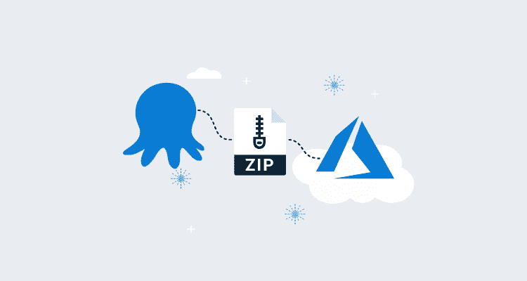
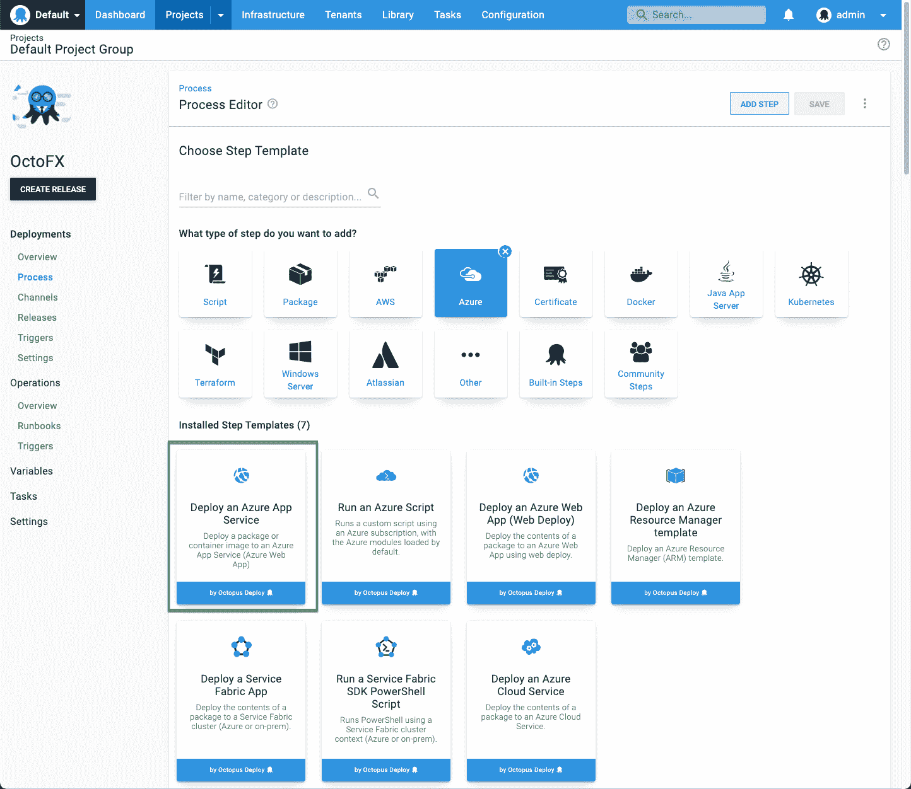
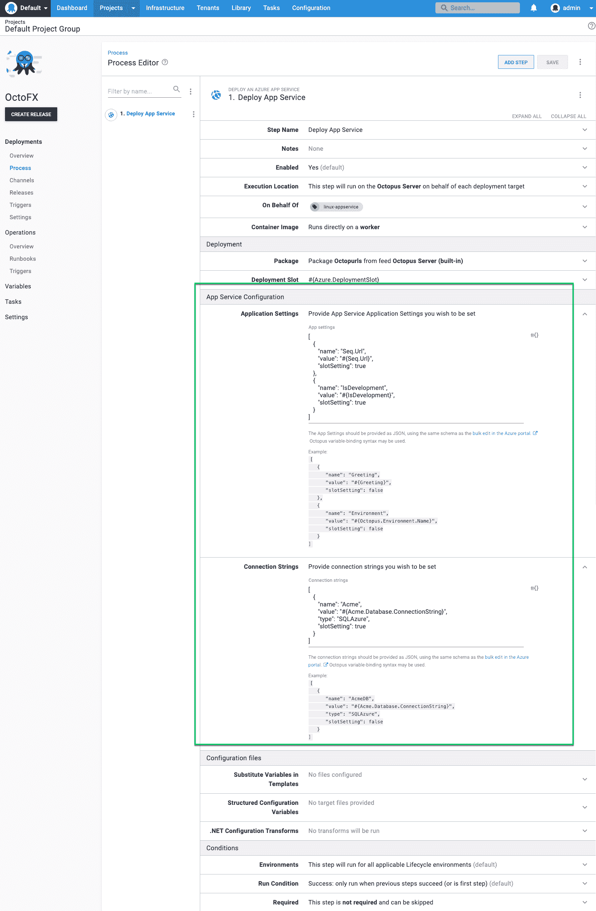
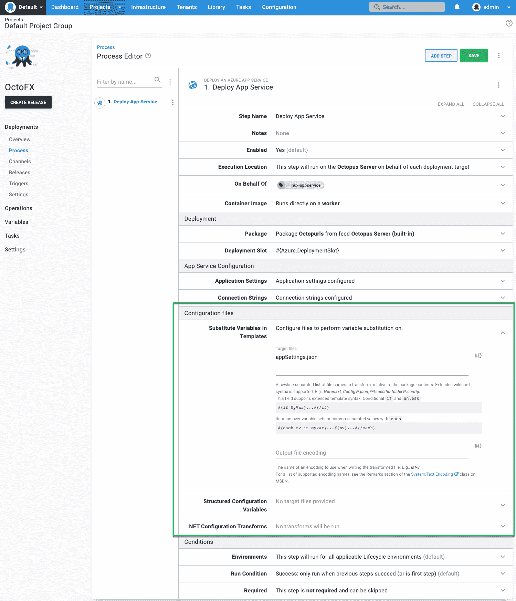

# 改进的 Azure 应用服务部署- Octopus Deploy

> 原文：<https://octopus.com/blog/azure-app-service-step>

章鱼部署 Q2 版本包括一个新的 T2 部署 Azure 应用服务的步骤。这一步对部署 Azure web 应用程序进行了重大改进，包括:

*   部署到 Linux 应用服务计划(没有晦涩的配置黑客)。
*   部署容器映像。
*   在 Linux Octopus workers 上执行部署。
*   配置应用程序设置和连接字符串。

## 什么变了？

*部署 Azure 应用服务*步骤旨在取代现有的*部署 Azure Web 应用*步骤，然而，原始步骤仍然可用。

*部署 Azure Web App* 步骤依赖于[微软 Web Deploy](https://www.iis.net/downloads/microsoft/web-deploy) 作为部署机制。这限制了在 Windows workers 上执行的步骤，需要特殊的配置来使用 Linux 应用服务计划，并且不支持容器映像。新的步骤依赖于用于基于文件的包(zip、nupkg、war)的 [zip 部署 API](https://docs.microsoft.com/en-us/azure/app-service/deploy-zip#rest) ，并且还支持部署容器映像。

## 应用程序设置和连接字符串

新的步骤还带来了配置 Azure 应用程序设置和连接字符串的能力。

这是通过以 JSON 的形式提供设置和/或连接字符串来实现的。

使用 JSON 格式的好处是:

*   它与 Azure 门户网站中的[批量编辑功能是相同的 JSON 格式，这使得将现有的应用程序设置移动到 Octopus 变得很容易。](https://docs.microsoft.com/en-us/azure/app-service/configure-common#edit-in-bulk)
*   这些字段接受 [Octopus 变量表达式](https://octopus.com/docs/projects/variables/variable-substitutions)，允许高级场景，例如有条件地包含值，并迭代 Octopus 变量集合以构建应用程序设置或连接字符串。

在未来，我们希望在这些字段上添加一个更友好的 UI，并保持 JSON 配置为“高级”模式。

## 转换配置文件

当部署打包为 zip、nupkg 或 war 文件的应用程序时，有多个选项可用于转换包中的配置文件。Octopus 将提取包并在推送到 Azure 之前执行这些转换。

提供了以下用于转换配置文件的选项:

## 结论

我们向 Clear Measure 的朋友们致敬，感谢他们帮助我们开发这个新的 Azure 应用服务集成。

*部署 Azure 应用服务*步骤现在在 Octopus Cloud 实例和自托管[下载页面](https://octopus.com/downloads)上的 Octopus 2021.1 中都可用。我们希望这使得部署 Azure web 应用程序比以往任何时候都更容易。

愉快的部署！