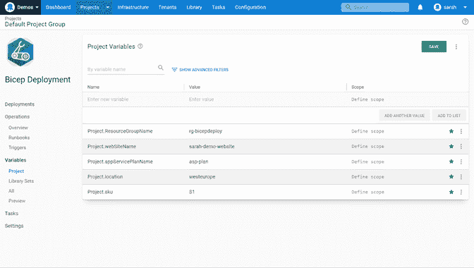
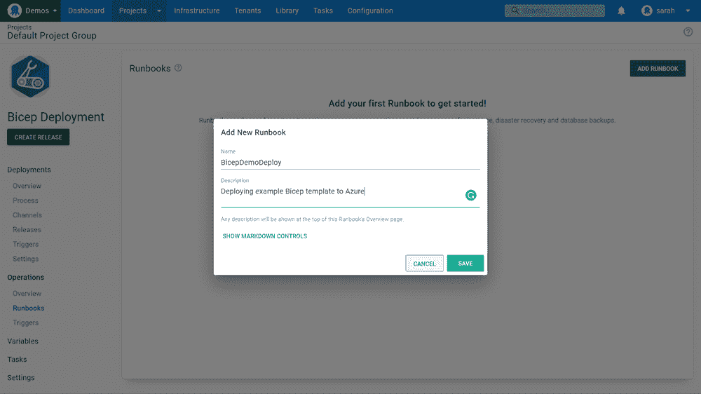
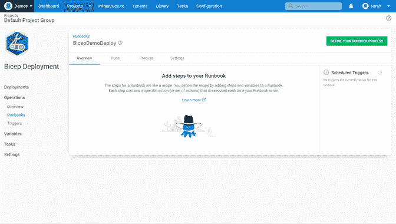
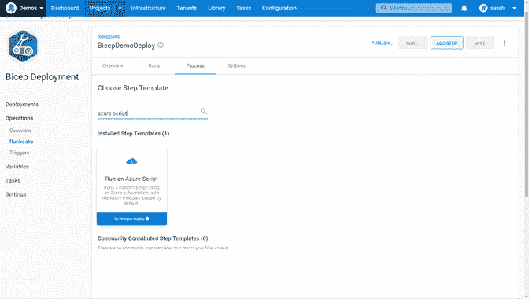
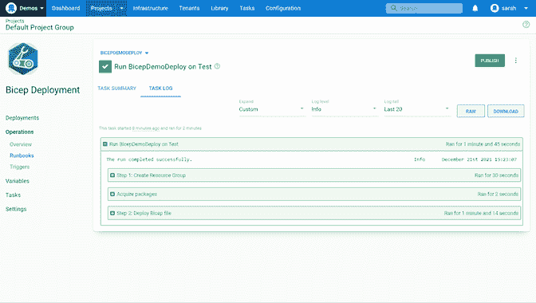

# 蓝色二头肌和章鱼部署-章鱼部署

> 原文：<https://octopus.com/blog/azure-bicep-octopus-deploy>

2020 年末，微软公布了他们的新项目， [Bicep](https://docs.microsoft.com/azure/azure-resource-manager/bicep/overview) ，一种用于部署 Azure 资源的领域特定语言(DSL)。Bicep 旨在简化创作体验，使其易于学习。它也是模块化和可重用的。

Bicep 在 IT 界非常流行。你可以在官方的 [Bicep GitHub 空间](https://github.com/Azure/bicep)上找到博文、推文、会议和大量互动。从 v.0.3 开始，Bicep 已经得到了微软支持计划的支持，并被认为可以投入生产。

在这篇文章中，我将介绍 Bicep 模板，并向您展示如何使用[Octopus run book](https://octopus.com/docs/runbooks)来自动化它们的部署。

## 二头肌和章鱼入门

### 先决条件

您需要以下工具来开始使用二头肌:

### 创建您的第一个二头肌模板

微软提供了 [Bicep 微软学习路径](https://docs.microsoft.com/en-gb/learn/paths/fundamentals-bicep/)来帮助你入门。

在这篇文章中，我解释了如何创建一个基本的模板。这篇文章假设你有 ARM 模板或类似的经验。我介绍了 Azure 应用服务计划和 Azure Linux Web 应用的创建过程。

首先，在模板中，您需要声明您正在使用的参数和变量:

```
// Declare parameters
param sku string
param linuxFxVersion string = 'node|14-lts' // The runtime stack of web app
param location string
param resourceTags object = {
  Environment: 'Tutorial'
  Owner: 'Me'
} // Tags for all resources
param appServicePlanName string
param webSiteName string 
```

您可以为这些参数声明静态条目，也可以将它们留空，然后在部署期间输入值。在本例中，您将一些声明为 static，而将其他的留空，以便您可以在部署过程中传递信息。

接下来，定义您希望如何部署 Azure 应用服务计划:

```
// Deploying the Azure App Service Plan
resource appServicePlan 'Microsoft.Web/serverfarms@2021-02-01' = {
  name: appServicePlanName
  location: location
  tags: resourceTags
  properties: {
    reserved: true
  }
  sku: {
    name: sku
  }
  kind: 'linux'
} 
```

我来给你分解一下:

*   资源标识符(resource`appServicePlan`)——告诉 Bicep 创建一个名为`appServicePlan`的新资源。这个名称标识 Bicep 模板中的资源。这不是您将在 Azure 中创建的资源的名称。
*   `Microsoft.Web/serverfarms@2021-02-01`——定义资源提供者`Microsoft.Web`，然后是资源类型`serverfarms`，最后是要使用的 API 版本`2021-02-01`。查看微软官方文档，看看是否有更新的 API 总是值得的。
*   名称——这是 Azure 资源的实际名称。
*   位置——这是您将要部署的 Azure 区域。
*   标记-标记你的资源有助于你合理地组织它们。
*   属性-您可以从这里开始根据自己的需求配置应用服务计划。在这里，您定义了 SKU 和种类(Linux 或 Windows)。

接下来，您将部署 Azure Web 应用程序:

```
// Deploying the Azure Web App
resource appService 'Microsoft.Web/sites@2021-02-01' = {
  name: webSiteName
  location: location
  tags: resourceTags
  properties: {
    serverFarmId: appServicePlan.id
    siteConfig: {
      linuxFxVersion: linuxFxVersion
    }
  }
} 
```

我来给你解释一下:

*   资源标识符(resource`appService`)——告诉 Bicep 创建一个名为`appService`的新资源。这个名称标识 Bicep 模板中的资源。这不是您将在 Azure 中创建的资源的名称。
*   `Microsoft.Web/sites@2021-02-01`——定义资源提供者`Microsoft.Web`，然后是资源类型`sites`，最后是要使用的 API 版本`2021-02-01`。查看微软官方文档，看看是否有更新的 API 总是值得的。
*   名称——这是 Azure 资源的实际名称。
*   位置——这是您将要部署的 Azure 区域。
*   标记-标记你的资源有助于逻辑地组织它们。
*   属性-这是您开始配置应用程序服务的地方。您定义了此 web 应用使用的应用服务计划以及您想要的 Linux 版本。您可以配置更多的设置，但在本例中我们保持简单。

模板现在完成了。你可以在 GitHub 上[看到完成的模板。](https://gist.github.com/weeyin83/7a9a20a5fc7e10e65561b4d5e6ed4019)

### 准备在 Octopus Deploy 中使用的二头肌模板

要在 Octopus Runbook 中运行您的二头肌模板文件，您首先需要使用 Octopus CLI 将其保存在 ZIP 文件中。

```
octo pack --id="BicepTemplate" --format="zip" --version="1.0.0.0" --basePath="c:\Bicep\" --outFolder="c:\Bicep" 
```

您可以通过门户将 ZIP 文件上传到 Octopus 库或再次使用 Octopus CLI。

```
octo push --package="c:\bicep\BicepTemplate.1.0.0.0.zip" --server="https://MyOctopusServer" --apiKey="API-MyApiKey" 
```

### 从 Octopus Runbook 运行二头肌模板

有了 Octopus 中的 Bicep ZIP 文件，是时候自动化其部署了。

这篇文章假设你已经设置了一个 Octopus 环境，并且已经连接了你的 Azure 账户。

在一个新的或现有的项目中，点击左侧菜单中的**变量**。

您需要为部署定义变量。输入变量:

*   资源组
*   网站名称
*   应用服务计划名称
*   位置
*   SKU 应用服务计划

[](#)

输入变量后，导航至**操作**并点击**操作手册**。

选择**添加 Runbook** 创建新的 Runbook 来部署您的二头肌模板。

[](#)

在该操作手册中，点击**定义您的操作手册流程**。

[](#)

添加的第一步是**运行一个 Azure 脚本**。这一步创建 Azure 资源组来保存您的资源。

[](#)

为该步骤命名以供参考。然后，输入您的 Azure 帐户的详细信息。

接下来，使用 Azure CLI 命令输入将创建您的资源组的脚本。

```
az group create -l $OctopusParameters["Project.location"] -n $OctopusParameters["Project.ResourceGroupName"] 
```

您正在使用在前面步骤中声明的一些变量。

现在你需要添加另一个**运行 Azure 脚本**的步骤。这将部署您的二头肌模板，因此要适当地命名它。然后，滚动到 Azure 部分，再次添加您的 Azure 帐户详细信息。

接下来，滚动到**脚本**部分，输入以下脚本:

```
# Tell the deployment to use the package we’ve associated and the file path
$filePath = $OctopusParameters["Octopus.Action.Package[BicepTemplate].ExtractedPath"]

# Change Directory to extracted package
cd $filePath

# Get current date and set the deployment name
$today=Get-Date -Format "dd-MM-yyyy"
$deploymentName="BicepDeploy"+"$today"

# Deploy Bicep template and pull in the variable information
New-AzResourceGroupDeployment -Name $deploymentName -ResourceGroupName $OctopusParameters["Project.ResourceGroupName"] -TemplateFile webapp.bicep  -sku $OctopusParameters["Project.sku"] -location $OctopusParameters["Project.location"] -appServicePlanName $OctopusParameters["Project.appServicePlanName"] -webSiteName $OctopusParameters["Project.webSiteName"] 
```

如果你使用自己的 [Workers](https://octopus.com/docs/infrastructure/workers) ，请检查你是否安装了 Azure CLI、Azure PowerShell 和 Bicep。

上面的脚本使用了 Bicep ZIP 文件。输入部署名称，以便可以跟踪部署的历史。该脚本使用 PowerShell 命令部署模板文件，并拉入您在 Octopus 中声明的变量。

在脚本框的正下方，导航到**引用的包**部分，然后单击**添加**。用你的 Bicep 文件选择 ZIP 文件。

现在，您可以保存此部署流程并运行部署。

[](#)

## 结论

您可以通过为更复杂的部署创建[二头肌模块](https://docs.microsoft.com/azure/azure-resource-manager/bicep/modules)来构建这个基本的二头肌部署。

如果您正在使用 Bicep 将资源部署到您的环境中，请在下面的评论中或通过我们的 [Slack 社区](https://octopus.com/slack)联系我们，如果您有任何问题，请告诉我。

阅读我们的 [Runbooks 系列](https://octopus.com/blog/tag/Runbooks%20Series)的其余部分。

愉快的部署！