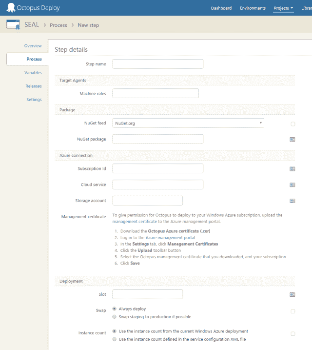
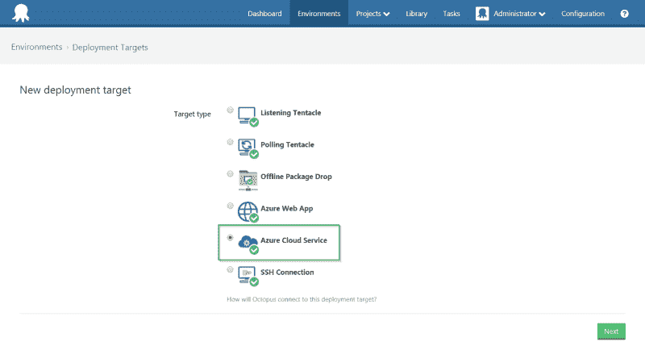

# 3.1 中的 Azure 变化- Octopus 部署

> 原文：<https://octopus.com/blog/azure-changes>

我们最近在 Octopus 3.0 中对部署目标和 Azure 云服务进行了重大更改，结果证明我们的设计是错误的。在 3.1 中，我们将回归到 2.6 时代部署 Azure 云服务的方式。这一变化也将影响我们部署 Azure web 应用的方式。

在以前版本的 Octopus 中，Azure 云服务是使用特殊的步骤类型部署的:

可以绑定订阅 ID 和其他字段，只需更改项目变量就可以使用不同的值。它工作得很好，但是它总是感觉与 Octopus 的其他工作方式“不同”。

在 3.0 中，我们增加了对不同部署目标的支持，而不是触角，并决定将 Azure 云服务作为一个部署目标:

作为开发人员，这感觉像是一个更干净的设计，因为它统一了我们处理所有部署目标的方式。但在现实中，虽然触手和 SSH 目标是可重用的(你可能会向它们部署多个应用)，但 Azure 云服务和 Azure web 应用不是；使用变量的老方法对许多人来说效果更好。让 Azure 云服务和 web 应用像触角一样工作是一种有漏洞的抽象，我们的设计是错误的。

我们不会坚持一个糟糕的设计，而是要推翻这个决定。对于 Octopus 3.1，我们将带回旧的 Azure step 类型，并让您使用变量而不是机器来控制目标。我们将保留我们在 3.0 中所做工作的一些功能:

*   Octopus 服务器仍将运行部署(不需要单独的触手工人)
*   配置转换和替换仍然有效。cspkg 文件
*   我们仍然会提供一个不错的 UI 来选择目标，但是让您用变量覆盖它
*   运行 Azure PowerShell 脚本会有非常好的体验

## 这对你意味着什么

如果你使用 Azure 网站或云服务，现在就坚持使用 2.6 版本。我们将确保有一条从 2.6 到 3.1 的 Azure 步骤迁移路径。如果你没有使用 Azure steps，那就升级吧。