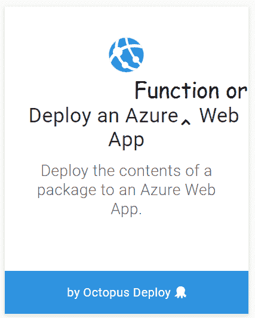
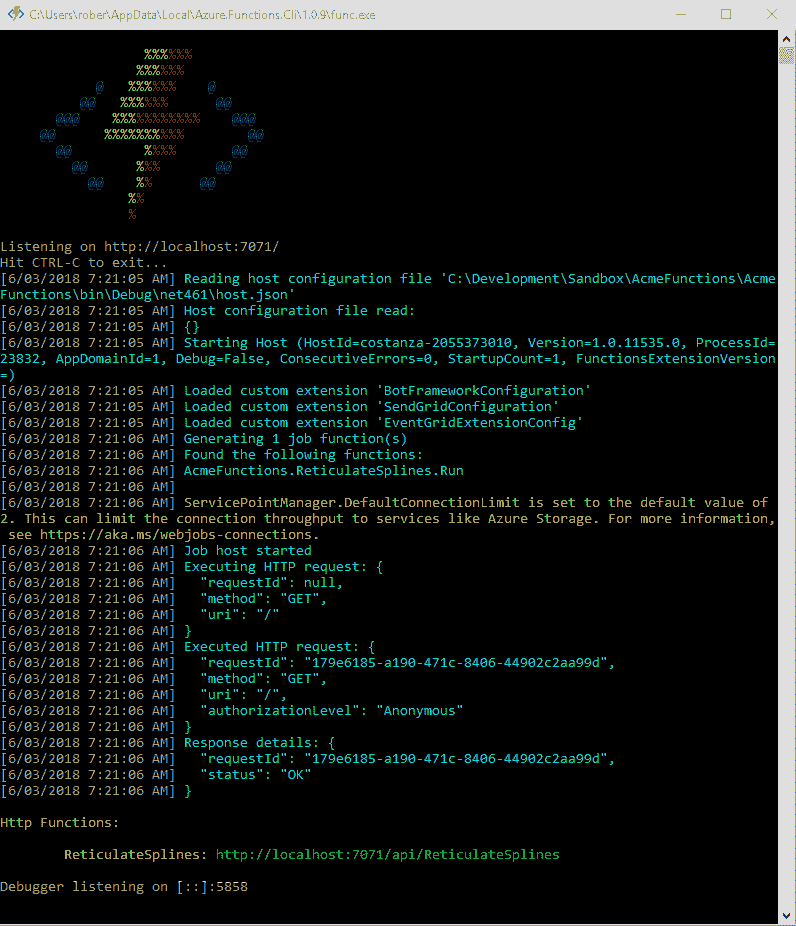
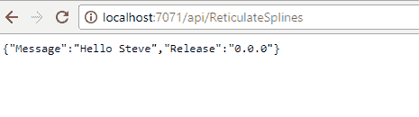
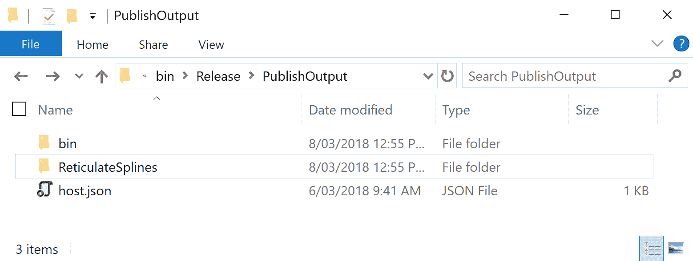
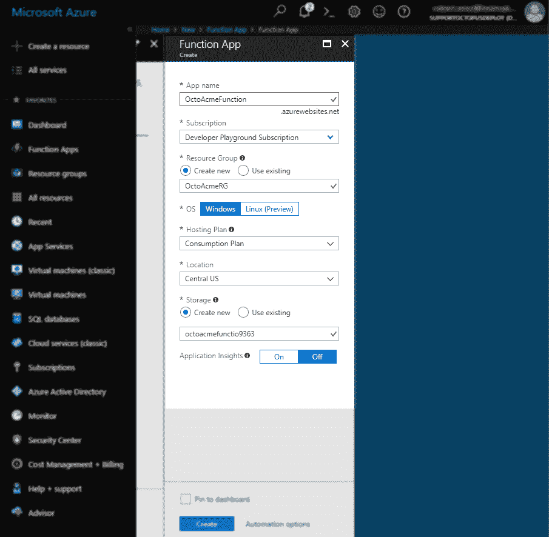
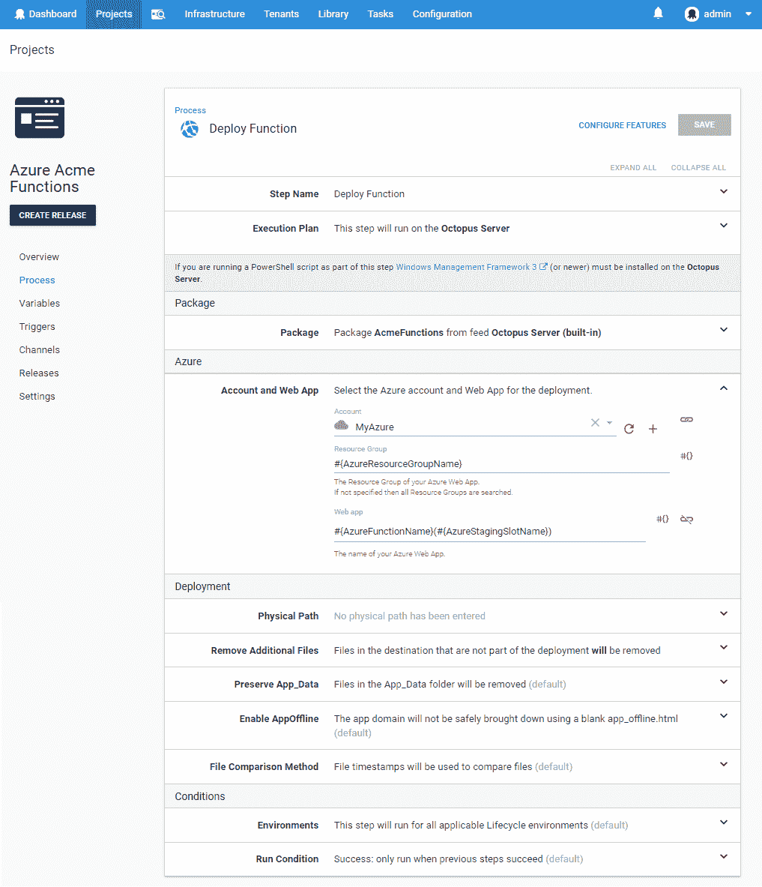
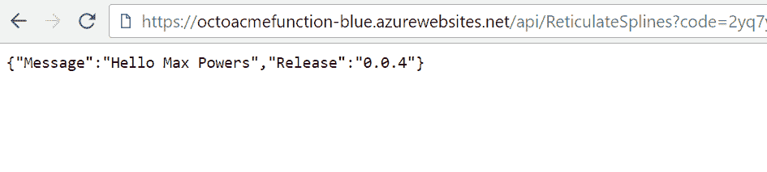
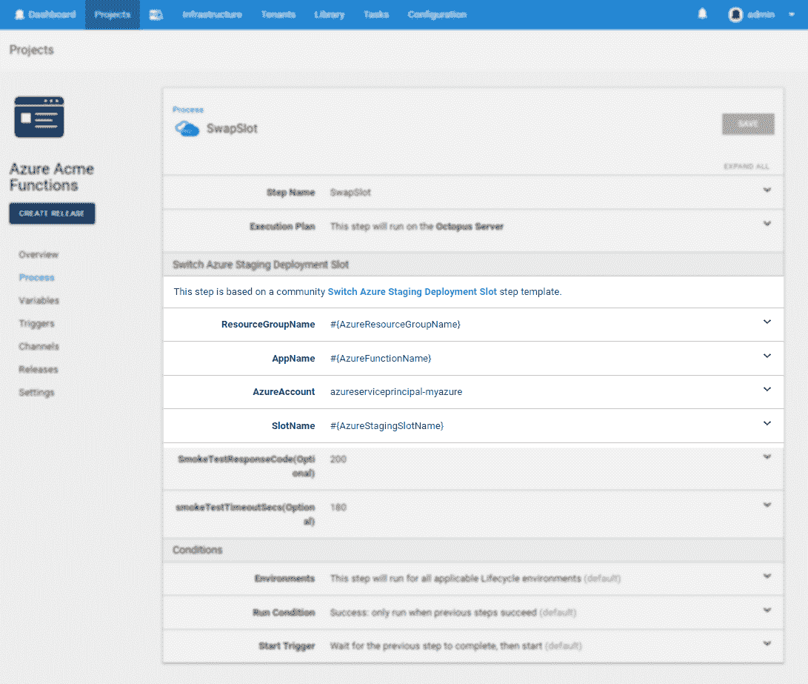
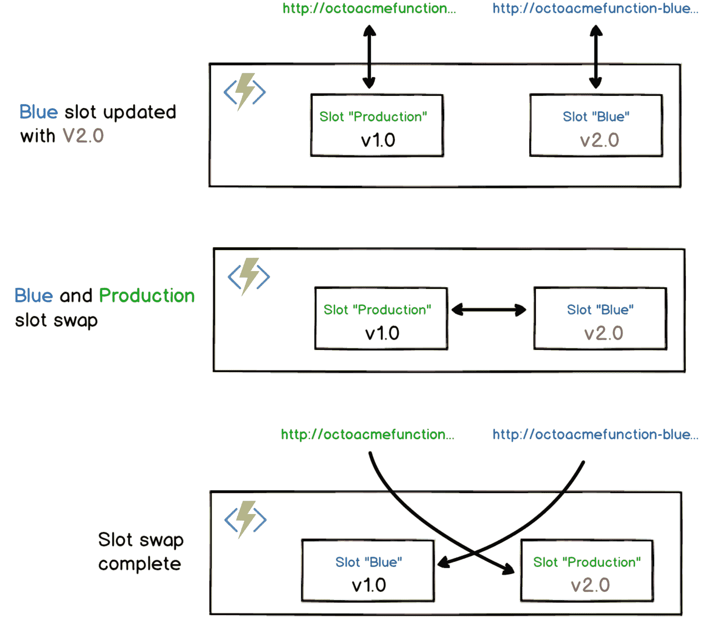

# 用 Octopus Deploy 部署 Azure 函数

> 原文：<https://octopus.com/blog/azure-functions>

[](#)

根据许多云提供商的说法，**无服务器计算**应用模型是未来的发展方向(需要引用)。AWS Lambdas 和 Azure 函数都允许你编写代码，根据它们的实际使用情况付费。虽然这意味着您现在将被迫为编写松散的代码付出代价，但它也允许您编写和交付松散耦合的服务，这些服务只在代码执行时增加您的账单，而在代码空闲时没有任何成本。

在 Octopus Deploy，我们希望在未来几个月为 AWS Lambdas 提供一流的支持，所以请继续关注他们的到来。事实证明，Azure 功能基本上只是在引擎盖下的 Azure Web 应用程序，上面有一些额外的处理程序，所以我们现有的**部署 Azure Web 应用程序的步骤仍然符合要求。**

[](#)

为了证明这一点，并表明我并没有试图避免添加新的 Azure 函数步骤，让我们来看看如何通过 Octopus Deploy 构建和部署一个基本的 Azure 函数。

## 创建并打包一个简单的 Azure 函数项目

对于我们简单的 Azure 函数，我们将创建一个 HTTP 触发的端点，它返回一个 JSON 有效负载，其中包含一些我们希望 Octopus 在部署期间提供的值。

### Visual Studio 项目

如果您通过 Visual Studio 创建函数，请确保您拥有 [Visual Studio 2017 v15.4](https://www.visualstudio.com/vs/) 或更高版本，其中包括 Azure SDKs。

创建一个新项目并选择`Azure Functions`项目类型。右击项目，**添加新项目**，添加一个 **Azure 函数**。

用以下内容替换生成的类:

```
 public static class ReticulateSplines
    {
        [FunctionName("ReticulateSplines")]
        public static async Task<HttpResponseMessage> Run([HttpTrigger(AuthorizationLevel.Function, "get", Route = null)]
            HttpRequestMessage req, TraceWriter log)
        {
            log.Info("Incoming Request request.");
            var myName = Environment.GetEnvironmentVariable("MyName", EnvironmentVariableTarget.Process);
            var release = Environment.GetEnvironmentVariable("Release", EnvironmentVariableTarget.Process);
            var reponse = new {Message = $"Hello {myName}", Release = release};
            return req.CreateResponse(HttpStatusCode.OK, reponse);
        }
    } 
```

当被调用时，这个函数将提取名为`MyName`和`Release`的变量，并在 JSON 响应中将它们返回给用户。

在解决方案资源管理器中打开`local.settings.json`文件，并添加以下属性:

```
{
  "IsEncrypted": false,
  "Values": {
    "MyName": "Steve",
    "Release":  "0.0.0"
  }
} 
```

这些值在本地开发过程中使用。如果您从 Visual Studio 运行该解决方案，Azure Functions 开发环境应该会启动并提供一个本地端点，您可以用它来测试您的代码。

【T2 

[](#)

### 章鱼包装

遗憾的是，由于 Azure 函数项目的输出，标准的 [`OctoPack`](https://octopus.com/docs/packaging-applications/create-packages/octopack) 生成的 NuGet 包将无法工作。这些函数的配置文件是在构建阶段之后生成的*，也就是 Octopack 被配置为生效的时候。我们建议使用`dotnet publish`将项目发布到一个目录，然后打包生成的文件:*

[](#)

幸运的是，由于 Octopus 会很乐意部署任何打包到 zip 中的东西，我们可以利用另一个名为 [Octopus CLI](https://octopus.com/docs/packaging-applications/create-packages/octopus-cli) 的 Octopus 命令行工具。使用您的标准构建工具(或者甚至在本地进行测试)，确保当前工作目录集是项目目录的，并调用:

```
dotnet publish --output bin\Release\PublishOutput --configuration Release
cd bin\Release\PublishOutput
octo pack --id=AcmeFunctions --format=zip --outFolder=./dist --version=9.14.159-pi
octo push --server=http://myoctopusserver.acme.com --apiKey=API-ABC123IS4XQUUOG9TWDXXX --package=dist/AcmeFunctions.9.14.159-pi.zip 
```

替换 Octopus 服务器、API 密钥和版本信息的相关值。或者，你可以使用我们为 [TeamCity](https://octopus.com/docs/packaging-applications/build-servers/teamcity) 、 [VSTS](https://octopus.com/docs/packaging-applications/package-repositories/guides/nuget-repositories/tfs-azure-devops) 、 [Bamboo](https://octopus.com/docs/packaging-applications/build-servers/bamboo) 或即将推出的 [AppVeyor](https://www.appveyor.com) 开发的插件，将项目的内容打包成 zip 文件。

## 创建 Azure 函数

虽然我可以在一个单独的部署项目中使用**部署 Azure 资源组**步骤来构建 Azure 功能，但为了保持演示的简单，我将直接通过 Azure 门户创建该功能。

在门户中点击**创建资源**按钮，搜索**功能 App** 。填写细节并记下`App name`和`Resource Group`值，因为我们需要很快将它们添加到我们的 Octopus 项目中。创建功能应用程序后，将其打开，进入**功能应用程序设置**页面并启用插槽。这个特性目前被标记为*预览*，虽然不是必需的，但它将允许我们创建一个蓝色\绿色部署模式。采用这种策略，我们首先部署到一个插槽，并确认其配置和运行正确，然后将其与*生产*插槽交换。在这种情况下，术语*生产*不同于*生产环境*和 Octopus *生产*环境。它只是指 Azure 功能有多个可以独立配置的端点。启用该功能后，创建一个名为*蓝色*的新插槽:

[](#)

## 创建一个章鱼项目

我们现在将在 Octopus deploy 中创建项目，该项目将使用蓝色\绿色部署策略将我们的包推送到 Azure，并提供在我们的函数中使用的适当范围的变量。

> **注意:**在 Octopus Deploy 中跨多个环境部署 Azure 功能的合适模型是为每个环境提供一个**单独的 Azure 功能**。这使我们能够在每个阶段安全地配置功能，而不会在环境中泄漏潜在的更改。我们建议您不要试图在一个函数上使用多个插槽来模拟环境。Azure 的功能很便宜，除了在使用的时候，你不需要花费任何东西，所以没有理由像其他云资源一样，把它们“挤”在一起。

### 添加变量

由于我们将需要编写几个部署后步骤来处理插槽交换，因此将所有配置放入项目的变量部分允许我们将它们整合到一个地方，并在不同的环境中对它们进行调整。在标准部署生命周期的情况下，我们通常会在不同的 Octopus 环境中使用不同的 Azure 资源组和/或 Azure 功能应用。

对于我们简单的单一环境场景，这些值是:

```
- AzureFunctionName = "OctoAcmeFunction"
- AzureResourceGroupName = "OctoAcmeRG"
- AzureStagingSlotName = "Blue"
- MyName = "Max Powers" 
```

[T32](#)

### 步骤 1:部署功能

如上所述，Azure 功能有效地使用了与标准 Azure Web 应用相同的架构，因此我们可以在 Octopus 中创建一个项目，该项目使用**部署 Azure Web 应用**步骤来推送包。

使用上面定义的项目变量，设置资源名称和 Web app。因为我们计划首先部署到暂存槽，所以这一步的 Web 应用程序名称采用了`<WebAppName>(<SlotName>)`的格式:

[](#)

### 步骤 2:更新 AppSettings

虽然我们可以在包上传过程中对配置文件执行变量替换，但推荐的处理 Azure 函数配置值的方式是通过 AppSettings。这些将自己作为环境变量暴露给正在运行的函数进程。

AppSettings 还包含 Azure Functions 本身使用的其他环境变量，因此我们不能删除其中包含的任何值。最安全的方法是首先加载现有变量，更新我们想要更改的几个关键属性，然后更新整个集合(Azure PowerShell cmdlets 不提供修改单个值的粒度方法)。

创建一个**运行一个 Azure PowerShell 脚本**步骤，并提供以下脚本:

```
function UpdateAppSettings {
 param( [string]$ResourceGroup, [string]$FunctionAppName, [string]$Slot, [hashtable]$AppSettings )

    Write-Host "Loading Existing AppSettings"
    $webApp = Get-AzureRmWebAppSlot -ResourceGroupName  $ResourceGroup -Name $FunctionAppName -Slot $Slot

    Write-Host "Applying New AppSettings"
    $hash = @{}
    ForEach ($kvp in $webApp.SiteConfig.AppSettings) {
        $hash[$kvp.Name] = $kvp.Value
    }

    ForEach ($key in $AppSettings.Keys) {
        $hash[$key] = $AppSettings[$key]
    }

    Write-Host "Saving AppSettings"
    Set-AzureRMWebAppSlot -ResourceGroupName $ResourceGroup -Name $FunctionAppName -AppSettings $hash -Slot $Slot | Out-Null
    Write-Host "AppSettings Updated"
}

UpdateAppSettings -AppSettings @{"MyName" = $OctopusParameters["MyName"]; Release = $OctopusParameters["Octopus.Release.Number"]} `
    -ResourceGroup $OctopusParameters["AzureResourceGroupName"] `
    -FunctionAppName $OctopusParameters["AzureFunctionName"] `
    -Slot $OctopusParameters["AzureStagingSlotName"] 
```

请注意我们是如何提供要应用于 AppSettings 的 Octopus 变量的。这允许我们精确地知道我们的函数需要什么，而不是盲目地遍历所有的章鱼变量，并假设可能需要某些东西。

一旦在部署过程中运行了这个步骤和前面的步骤，蓝色的*插槽就会用最新的包及其变量进行更新。该功能先前部署的版本(假设这不是流程第一次运行)仍可从*生产*插槽中获得。去往`https://octoacmefunction.azurewebsites.net/api/ReticulateSplines`的所有流量仍将去往之前的版本，但是`https://octoacmefunction-blue.azurewebsites.net/api/ReticulateSplines`的端点现在将使用新的部署，我们可以对其进行测试并确保其按预期工作。下一步将交换这些插槽，这样没有插槽名称的请求就可以转到我们当前部署在*蓝色*插槽中的插槽:*

[](#)

### 第三步:互换位置

还有一个为 Azure Web 应用程序构建的现有步骤，我们也可以很好地利用 Azure 函数。添加一个新步骤，并在步骤库中搜索**Switch Azure Staging Deployment Slot**步骤。为上述第一步中提供的`ResourceGroupName`、`AppName`和`SlotName`提供变量。对于`AzureAccount`字段，您目前需要获得您在 Octopus 中配置的 Azure 帐户的帐户 ID。当你通过八达通门户网站查看帐户时，可以在 URL 中看到这一点。在接下来的几周内，我们预计这一需求将会消失，因为我们将为 [Azure 账户](https://octopus.com/docs/projects/variables/azure-account-variables)提供一个类型化变量，就像我们为 [AWS 账户](https://octopus.com/docs/projects/variables/aws-account-variables)所做的一样。

[](#)

`SmokeTest`配置将命中该函数的主机地址，尽管它更适合预热 Web 应用程序，但确保该函数已成功部署也无妨。

## 部署

对于每个部署，*蓝色的*槽将作为更新目标，然后指向两个不同槽的外部指针将被交换(记住这实际上是一个*名称*交换，内容本身不会移动)。如果新的部署开始遇到问题，可以选择将插槽*交换回*，以便流量再次被传送到以前的版本(尽管我们总是鼓励尽可能使用前滚方法):

[](#)

## Octopus 中的 Azure 函数

正如我们所见，虽然 Azure 函数提供了一种开发和托管代码的新机制，但底层基础设施主要是建立在 Azure 网站产品的基础上，因此它已经在 Octopus Deploy 开箱即用中工作。通过 Octopus 管理这些部署提供了一个简单易懂的流程，允许任何人利用这种新的*无服务器*计算方法的能力。随着我们未来计划很快为 AWS Lambdas 提供一流的支持，没有理由不尝试这些新产品。