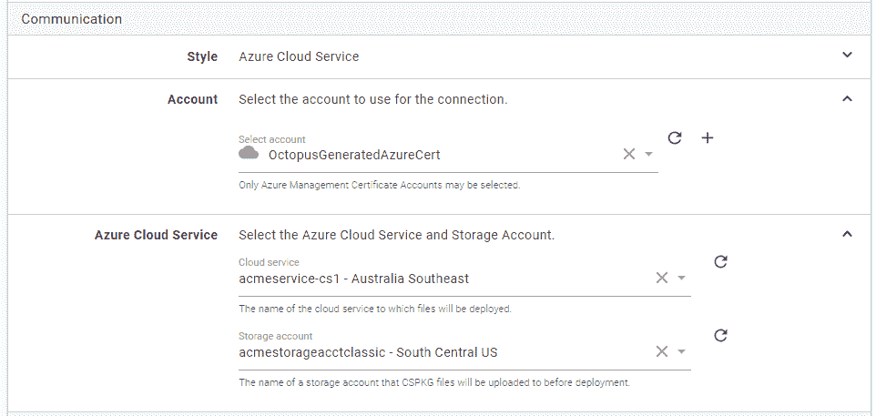
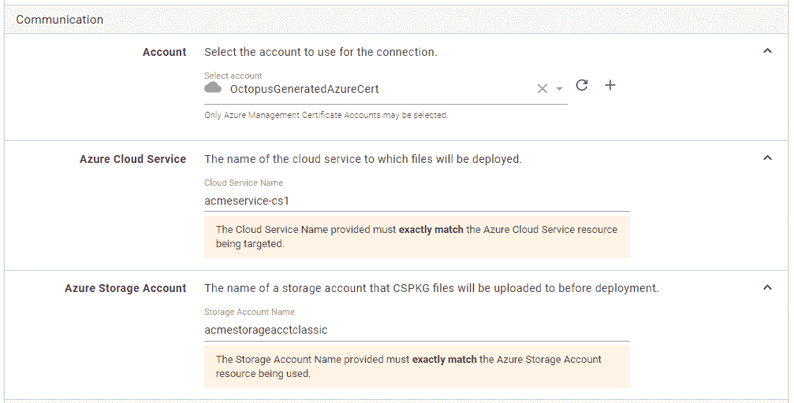
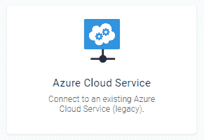

# 微软贬低 Azure 服务管理 API 对八达通用户意味着什么？-章鱼部署

> 原文：<https://octopus.com/blog/azure-management-certs>

## TL；dr；

Azure 已经否决了 Azure 服务管理 API，为了更好地利用新工具，从版本`2018.12.0`开始，Octopus 将不再在使用 Azure 证书帐户时主动从门户中检索云服务或存储帐户详细信息。尽管有这些 UI 变化，部署将继续工作，并且仍然可以创建使用它们的新步骤。

## 更长的故事

Azure 服务管理(ASM) API 是以编程方式与您的 Azure 资源进行交互的原始机制，直到 Azure 资源管理器(ARM) API 在 [2014](https://channel9.msdn.com/Events/Build/2014/2-607) 可用。

ARM API 是用于与 Azure 交互的新(更)API，引入了资源组等概念，以更好地对相关资源进行建模，并为旧 API 中不可用的一些新服务提供支持。因此，他们已经开始反对旧的 ASM。引用 Naveed Aziz 在 Azure 团队博客上的话

> ...服务管理 API 已经过时，不太适合现代云。

那很好，对吗？放弃旧的 API 而支持新的 API 通常不是什么大问题，只需修改几行代码，很快，您就会遇到一些新的端点，并且您的 XML 有效负载变成了 JSON...问题是 Azure 并没有将所有可用的功能从 ASM 转移到 ARM。

### 管理证书

首先，ARM 不支持使用管理证书进行身份验证，而是指导用户使用 Azure Active Directory 并创建服务主体。这种认证机制在 Octopus 中已经有一段时间了，我们建议任何仍在使用 Azure 证书的人今天就[升级到服务主体](https://octopus.com/docs/infrastructure/accounts/azure#azure-service-principal)。对这一变化的一个警告是由于一个仅适用于管理证书的特性，因为它在 ASM 中仅*支持*。

### Azure 云服务

Azure 云服务是 Azure 为托管客户网站提供简单 PaaS 模型的首批尝试之一。当 Azure 去年概述 ASM 的退役时，不太明显的是，这也对使用 Azure 云服务本身的能力产生了影响，因为没有办法使用新的 ARM APIs 来管理这些服务。在与 Azure 团队进一步讨论后，实际的 HTTP API 端点似乎仍然可用，因为 Visual Studio 本身实际上需要使用它们。然而，由于唯一可以利用它们的工具已经被弃用，我认为可以肯定 Azure 渴望人们放弃云服务。

## 这些变化将如何影响我的部署？

简而言之，它根本不会影响*的部署*。😃对于 Octopus 用户来说，上述可用 API 的变化意味着，为了使用*新的*库，我们将不再能够在门户中使用旧的。因此**如果你使用 Azure 管理证书，那么在配置目标或云服务部署步骤时，Octopus 服务器将不再自动填充任何 Azure 云服务或存储帐户。然而，部署将继续工作，并且仍然可以创建新的目标&步骤**。

不要像这样选择您的云服务:

将为您提供一组文本字段。

(顺便说一下，这实际上与我们最初公开这些特性的方式没有太大的不同。)

这种变化将同时出现在 [Azure 云服务目标](https://octopus.com/docs/infrastructure/deployment-targets/azure/cloud-service-targets)和 Azure 云服务部署步骤上(如果选择了“遗留”模式)

[T2](#) T4  

这些变化将从 Octopus 服务器版本`2018.12.0`开始出现。

### 向前和向上

为了继续使您的部署与 Azure 提供的越来越多的功能更容易集成，当[他们说](https://azure.microsoft.com/en-au/updates/deprecating-service-management-apis-support-for-azure-app-service/):

> 支持服务管理 API 将会阻碍我们在全球范围内交付优质的开发人员体验和控制。

虽然在幕后，我们将继续提供使用云服务管理证书执行部署的能力，但从 Octopus 门户中删除这些库意味着我们必须删除一些以前可用的功能。尽管努力保持向后兼容性是我们决策的一个关键部分，但有时旧的功能不得不被放弃。