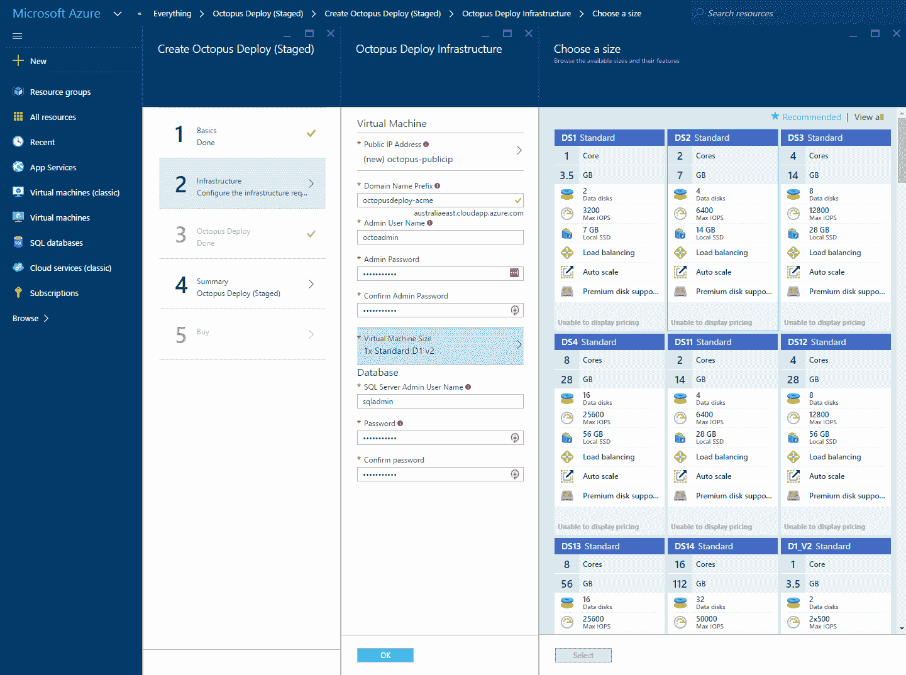

# 八达通部署在 Azure Marketplace -八达通部署

> 原文：<https://octopus.com/blog/azure-marketplace>

Octopus Deploy 现已在 [Azure Marketplace](https://azure.microsoft.com/en-us/marketplace/) 上市！

## 开始使用 Octopus Deploy 的最简单方法

Octopus Deploy marketplace 产品是一个解决方案模板，它创建了一个托管 Octopus Deploy 服务器的虚拟机和一个 Azure SQL 数据库实例。

您可以配置虚拟机的大小、DNS 名称以及管理员用户名和密码。点击“创建”，在一杯咖啡(it 专业人员的国际标准时间单位)中，您将有一个 Octopus Deploy 服务器可供使用。

### BYO 许可证

Octopus Deploy 实例是用 45 天的试用许可创建的。试用期过后，你可以继续免费使用我们的社区版(针对小团队)，或者你可以[购买一个许可](https://octopus.com/purchase)(或者使用你现有的许可)并将其输入到运行在 Azure 中的 Octopus Deploy 实例中。

祝 Azure 驱动的部署愉快！