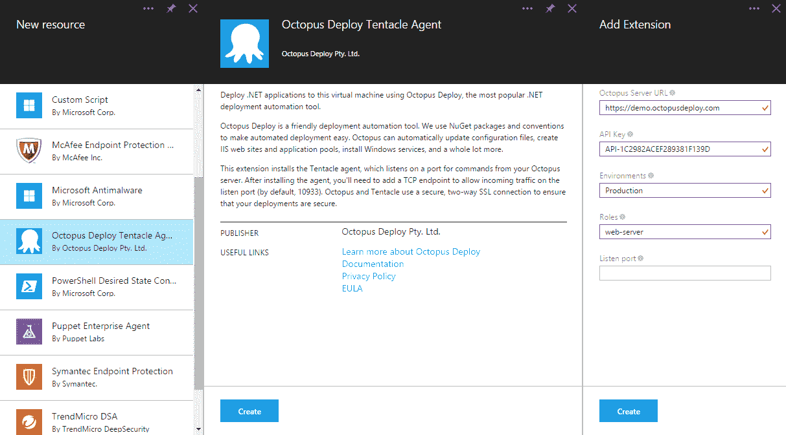

# Octopus 部署的 Azure VM 扩展- Octopus 部署

> 原文：<https://octopus.com/blog/azure-vm-extension>

今天 ScottGu 宣布 [Octopus Deploy 触手代理现在可以作为 Azure VM 的](https://weblogs.asp.net/scottgu/azure-new-marketplace-network-improvements-new-batch-service-automation-service-more)的扩展使用:

> Octopus 通过自动配置 IIS、安装服务和进行配置更改，简化了 ASP.NET web 应用程序、Windows 服务和其他应用程序的部署。Azure 的 Octopus 集成是 Azure UserVoice 上最受欢迎的功能之一，通过这一集成，我们将简化 octopus 在 VM 上的部署和配置。

当然，即使在这个扩展之前，你也可以通过脚本手动或自动安装触手。这个扩展只是在它周围放了一个漂亮的 UI。在引擎盖下，扩展使用我们的开源 [PowerShell DSC 资源用于触角](https://github.com/OctopusDeploy/OctopusDSC)。

## 为什么 Azure 虚拟机上有触须？

在 Microsoft Azure 上托管应用程序有许多不同的方式:网站、云服务或常规方式。NET 应用程序在虚拟机上运行。

当你在 Azure 上配置一个虚拟机时，你会得到一个正在运行的操作系统、一个远程桌面连接和一个 PowerShell 远程连接。仅此而已。如果您想在机器上部署、配置和重新部署应用程序，您要么需要手动完成，要么编写定制脚本来复制文件、更新配置文件等等。

当然，这些都是【Octopus Deploy 解决的所有问题，并且解决。通过将触手代理添加到 Azure VM，您可以立即开始部署到它，就像 Octopus 中的任何其他机器一样。

关于使用扩展或者通过 PowerShell 从命令行添加扩展的更多信息，[查看我们的文档](http://docs.octopusdeploy.com/display/OD/Azure+Virtual+Machines)。