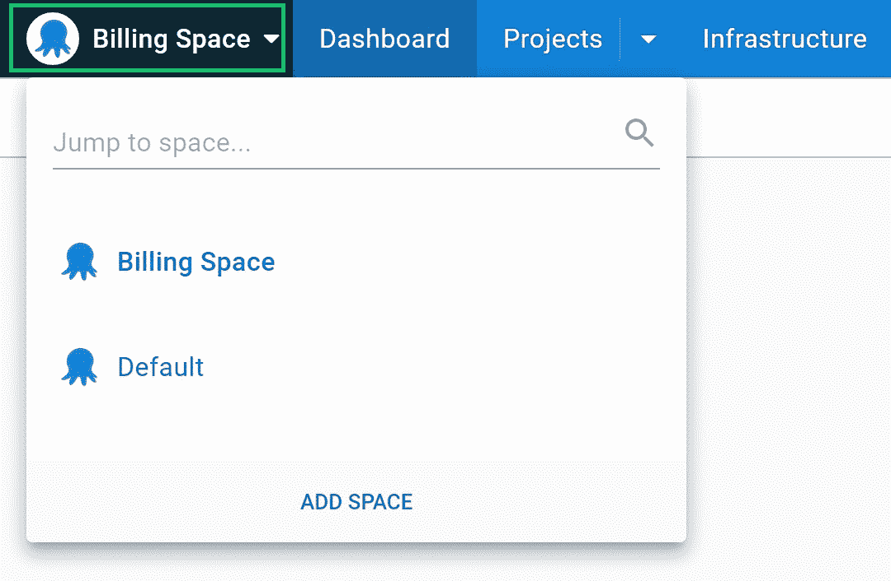

# 八达通空间的最佳实践-八达通部署

> 原文：<https://octopus.com/blog/best-practices-spaces>

在 Octopus 的这些年里，我们总是很高兴地看到我们的客户扩大了对 Octopus Deploy 的使用，以包括新的项目和团队。在早期，很难想象这会引起任何问题。然而，在 Octopus 中有太多的项目可能会分散注意力，特别是对于一个只负责其中几个项目的团队来说。

Octopus Spaces 功能可帮助您组织和保护您的项目、环境和基础架构，并控制哪些团队成员可以访问它们。对于安装多个 Octopus 部署实例来说，它们是一种有用的替代方法。

在本文中，您将学习如何有效地使用空间来组织部署。

## 空间概述

空间是在你的 Octopus 服务器中创建硬墙的分区。无法从另一个空间看到或使用分配给该空间的部署资源。您可以使用空间而不是创建多个 Octopus Deploy 实例，每个空间都是独立的。

以下项目的作用域为一个空间:

*   环境
*   生活过程
*   项目
*   可变集合
*   部署目标
*   房客

不能从其他空间访问这些空间范围的项目。

团队是一个特例。创建团队时，您可以选择是将其范围限定在单个空间，还是让团队跨越所有空间。

所有事件都被写入系统级审核日志，您可以按空间筛选日志。

八达通管理员可以将管理每个空间的全部责任交给空间管理员，这可以减少管理员的工作量。

空间的[管理指南有管理空间的说明。](https://octopus.com/docs/administration/spaces)

## 空间的好处

空间有两种主要的使用情形:

*   组织部署资源
*   控制对这些资源的访问

出于这两个原因中的一个或两个，您可能会选择使用空格。

### 组织部署资源

您的 Octopus Deploy 仪表板为每个项目显示一行，为生命周期中的每个阶段显示一列。当您添加更多项目时，仪表板会变高，当您创建更多阶段时，仪表板会变宽。如果你发现你的仪表板太大了，把项目移到共享空间会让它变得整洁并减少你滚动的次数。

在空间中的所有屏幕上，当从列表中选择资源时，您将获得相同的好处，例如编辑流程步骤，因为只显示当前空间中的项目。

空间允许您通过将相关资源组合在一起来限制每个区域的增长。

### 控制对部署资源的访问

在我们引入空间之前，您可以使用具有作用域角色的团队来控制项目的可见性。然而，这可能变得难以管理。很难阻止像部署目标这样的项目被新项目重用。

空间为您提供了一种便捷的方式来控制对一组相关资源的访问，而无需复杂的权限。您可以授予团队成员对他们需要的空间的完全或只读访问权限，然后他们可以使用空间切换器在这些空间之间快速切换。

## 如何设计你的空间

空间代表应用程序的逻辑组。如果您有几个密切相关的组件，它们很可能在一个变量集中共享一些变量，或者被部署到同一个基础设施。这些因素将自然地指导它们是否应该被分组到一个空间中或者保存在单独的空间中，以防止它们以不期望的方式变得相关。

为组织中的每个团队创建一个空间似乎是个好主意，但这并不总是最好的设计。特别是，在多个团队参与同一个应用程序的情况下，这可能会导致您将项目分割到太多的空间中。

相反，使用以下尺寸之一来设计您的空间:

*   客户
*   应用程序组
*   应用受众
*   公司部门

请继续阅读，了解关于这些选项的更多信息。

### 客户

如果您是一家为多个客户管理应用程序的机构，每个客户使用一个空间可以确保客户之间不会共享任何数据。所有部署目标、项目、变量和生命周期都是客户空间独有的。

您可以决定使用其他选项之一将客户端细分为多个空间。

当每个客户端有不同的应用程序时，此选项有效。如果您将同一个应用程序部署到特定于客户端的基础设施上，[租户](https://octopus.com/docs/tenants)提供了一种更好的管理方式。

### 应用程序组

应用程序组是一组可能部署到同一位置的相关组件。

应用程序组是组织空间的理想选择，因为类似的设计考虑也适用于会影响应用程序设计的空间。例如，您可以将内容管理系统(CMS)的组件归入一个空间，而将计费系统的组件归入另一个空间。

你可能会发现这种空间设计与你组织团队的方式相匹配。如果您已经考虑了您的应用程序组，那么选择这个解决方案是很好的。

如果一个应用程序组中有不止一个团队，您应该维护一个与软件一致的空间，而不是团队。您可以让每个团队访问该空间，两个团队都可以看到整个系统的部署视图，这样就可以清楚地看到一个应用程序部署是否阻塞了另一个应用程序部署。

### 应用受众

一种粒度较小的方法是拥有与目标受众相匹配的独立空间，例如内部和面向公众的应用程序。这种方法通过将内部资源转移到不同的空间来清理面向公众的空间。

这种设计可以快速改善面向公众的空间的信息，并可以作为将资源划分到每个应用程序套件的空间的第一步。

### 公司部门

如果你的公司被组织成开发独立应用的部门，这可能会提供一个自然的空间设计。例如，如果公司有向不同行业提供软件的部门，每个部门可以有一个单独的空间，有一个专门的空间经理。

有了自己的空间管理器，每个部门都可以自给自足地管理自己的空间，而不会让 Octopus 部署到其他部门。

## 有用的设计指标

理想的场景是，空间中的应用程序是独立的，部署到专门的目标，并有一个自治的团队负责它们。虽然你可能不会发现自己处于这种完美的状态，但它为你决定如何设计你的空间提供了有益的指导。

如果您将多个应用程序部署到相同的部署目标，您应该将部署放在相同的空间中。使用监听触手可以在多个空间中设置同一个部署目标。然而，这使得权限变得复杂，团队成员不会看到所有针对共享基础设施的部署。

如果有很强的理由将部署划分到多个空间，这些理由可能意味着您也应该有不同的部署目标。

## 要避免什么

您应该避免在每个环境中使用空格，因为您需要在每个空格中重复这个过程。当您进行更改时，很难在每个空间保持过程的一致性，并且您不会从发布快照中受益。发布快照确保在整个环境中使用相同版本的包、变量和流程，这提高了部署的可靠性。

你也应该避免使用更适合使用[租户](https://octopus.com/docs/tenants)的空间。

当一个应用程序包含几个组件时，最好把它们放在一个空间里；否则，将很难从整体上跟踪应用程序的当前部署状态。

## 结论

Spaces 是一个有价值的工具，用于组织和保护您使用 Octopus Deploy 管理的与部署相关的资源。它们提供了关于部署和资源的较小视图，但是您应该适当考虑它们的设计。

愉快的部署！