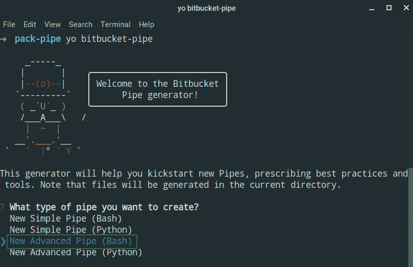
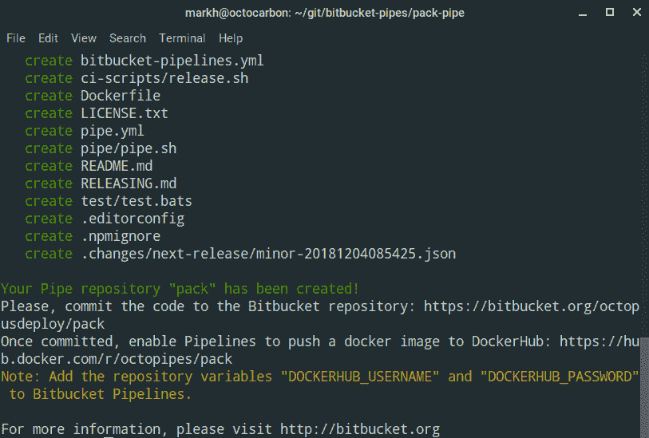
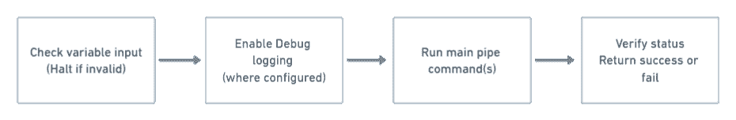
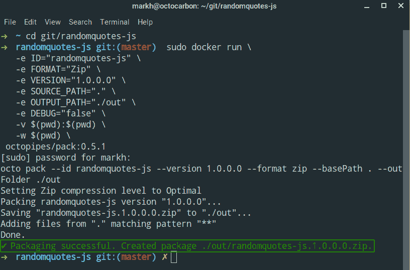
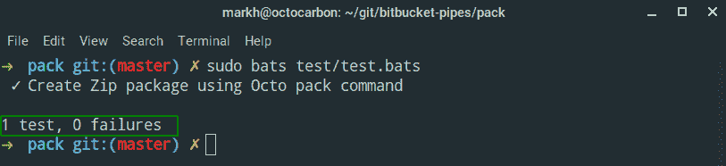
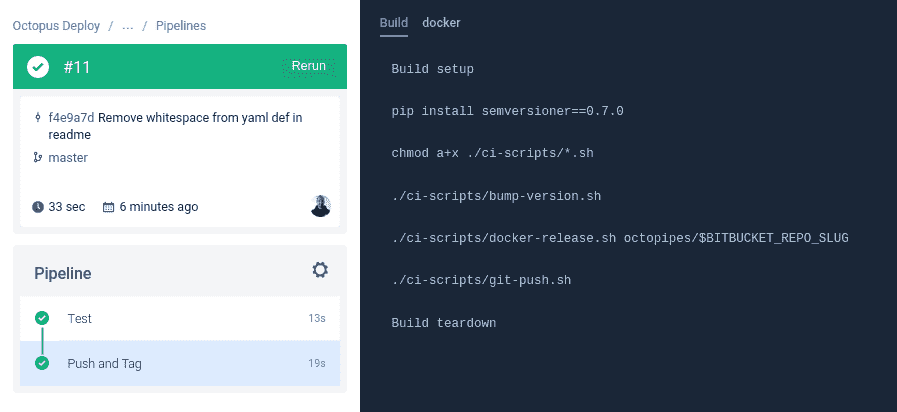
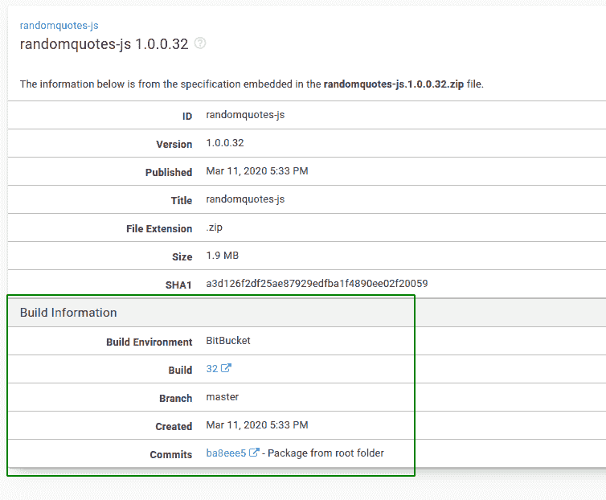

# Bitbucket 管道:管道和与 Octopus Deploy 集成- Octopus Deploy

> 原文：<https://octopus.com/blog/bitbucket-pipes-and-octopus-deploy>

[](#)

Atlassian 的 [Bitbucket Pipelines](https://bitbucket.org/product/features/pipelines) 是一个轻量级的云持续集成服务器，它使用预配置的 Docker 容器，允许您将基础架构定义为代码。 [Pipes](https://bitbucket.org/product/features/pipelines/integrations) 允许您向管道添加配置，对于第三方工具尤其有用。

在本文中，我为一个 [Octopus CLI](https://g.octopushq.com/OctopusCLI) 命令创建了一个实验管道，在我们的示例 node.js 应用程序 [RandomQuotes-Js](https://bitbucket.org/octopussamples/randomquotes-js) 的 Bitbucket 管道中使用它，最后，将管道与 Octopus 集成。

## 在这篇文章中

## 什么是比特桶管道？

亚特兰蒂斯人[说](https://confluence.atlassian.com/bitbucket/learn-about-pipes-978200267.html):

> 管道提供了一种配置管道的简单方法。当您想使用第三方工具时，它们尤其强大。只需将管道粘贴到 YAML 文件中，提供一些关键信息，剩下的事情就为您完成了。您可以在步骤中添加任意数量的管道，因此可能性是无穷的！

管道建立在管道、容器的核心概念上。管道使用位于 [Docker](https://www.docker.com/) 容器中的脚本，它通常包含在管道可用之前您在管道 YAML 文件中编写的命令。

## 管道使用示例

这是 Atlassian[bit bucket-upload-file](https://bitbucket.org/product/features/pipelines/integrations?p=atlassian/bitbucket-upload-file)管道在您的管道 YAML 文件中的样子:

```
- pipe: atlassian/bitbucket-upload-file:0.1.3
  variables:
    BITBUCKET_USERNAME: '<string>'
    BITBUCKET_APP_PASSWORD: '<string>'
    FILENAME: '<string>'
    # ACCOUNT: '<string>' # Optional
    # REPOSITORY: '<string>' # Optional
    # DEBUG: '<boolean>' # Optional 
```

*   `atlassian/bitbucket-upload-file:0.1.3`是包含要运行的管道的 Docker [图像](https://hub.docker.com/r/bitbucketpipelines/bitbucket-upload-file)的名称。
*   `BITBUCKET_USERNAME`是一个您需要提供的变量的例子，该变量包含管道在容器内部执行时要使用的值。

### 参照管线步骤中的管道

有两种方法可以在管线内的步骤中引用管道:

1.  直接参考 Docker 图像:

```
pipe: docker://<Docker_Account_Name>/<Image_Name>:<tag> 
```

2.  引用托管在 Bitbucket 上的管道存储库:

```
pipe: <Bitbucket_account>/<Bitbucket_repo>:<tag> 
```

这个方法从引用的`<Bitbucket_account>/<Bitbucket_repo>`管道库中的`pipe.yml`文件中寻找 Docker 图像的位置。

## 管道为什么有用？

为什么要大费周章写管道呢？

管道都是关于*再利用*。它们允许您在管道的多个步骤中重复相同的操作。通过将核心操作集中到一个管道中，您最终会得到一个更简单的管道配置。与在管道中直接编写脚本相比，管道的另一个关键特性是能够包含主管道不需要的依赖项。

## 创建位桶管道

管道由构成 Docker 映像的一组文件组成。我创建的管道的图像基于预先存在的 [octopusdeploy/octo](https://hub.docker.com/r/octopusdeploy/octo) 图像。成品管已在 Docker Hub 上发布为 [octopipes/pack](https://hub.docker.com/r/octopipes/pack/) 。

起初，创建一个管道可能看起来相当令人生畏，但是 Atlassian 提供了一个有帮助的分步指南。

我在 Ubuntu 机器上使用 Bash 终端创建了这个管道。如果您使用不同的平台，您可能需要调整您使用的命令。

## 选择烟斗的候选人

我经常听人说，对于软件来说，命名是最困难的事情，选择一个命令来包装在管道中也是如此。然而，在大多数 CI/CD 管道中，在您对代码构建并运行任何测试之后，您可能想要打包您的应用程序。所以选择 Octopus CLI [pack](https://octopus.com/docs/octopus-rest-api/octopus-cli/pack) 命令来创建管道是很自然的。

额外的好处是`pack`命令只有几个必需的参数，可选的参数可以用一些管道魔术来处理(稍后的会有更多)。

可以创建两种类型的管道:

我选择了一个**完整的**管道，这样我就可以发布它并在其他存储库中使用它。

### 创建管道存储库

接下来，我需要在 Bitbucket 中创建一个新的 [octopusdeploy/pack](https://bitbucket.org/octopusdeploy/pack) Git 存储库，并在本地克隆它。

有关创建新的 Git 存储库的更多信息，请参见 Atlassian [文档](https://confluence.atlassian.com/bitbucket/create-a-git-repository-759857290.html)。

### 创建管道骨架

Atlassian 提供了一种使用 [Yeoman](http://yeoman.io/) 生成管道库框架的方法。当您安装了所有的先决条件(`nodejs`和`npm`)后，您可以从终端使用`yo`命令运行生成器:

```
yo bitbucket-pipe 
```

这将提示您选择要创建的管道。我选了**新高级管(Bash)** 。

[](#)

系统会提示您一些问题，帮助您为管道的使用者填写元数据和其他有用的信息。完成后，它将生成您开始工作所需的文件:

[](#)

至少，您需要编辑以下文件以满足您的管道要求:

**提示:**检查其他的库，看看他们是如何编写管道的！

每个 Bitbucket 管道的一个优点是代码是公开的，所以你可以浏览它。例如，您可以在[位桶](https://bitbucket.org/atlassian/bitbucket-upload-file/)上查看`bitbucket-upload-file`管道的源代码。

这是了解其他作者如何构建管道的一个非常好的方式。

当你创建一个**完整的**管道时，Atlassian 要求你创建一个`pipe.yml`文件。本文档包含有关管道的元数据，包括以下内容:

*   管道的名称。
*   管道的 Docker 中心图像，格式为:`account/repo:tag`。
*   可以在其中指定默认值的管道变量列表。

如果您使用管道生成器选择了一个*高级*管道，将会为您创建一个`pipe.yml`文件，其中已经添加了所有相关信息。以下是我自动生成的 [pipe.yml](https://bitbucket.org/octopusdeploy/pack/src/master/pipe.yml) 文件的内容:

```
name: Octo Pack
image: octopipes/pack:0.0.0
description: Creates a package (.nupkg or .zip) from files on disk, without needing a .nuspec or .csproj
repository: https://bitbucket.org/octopusdeploy/pack
maintainer: support@octopus.com
tags:
    - octopus
    - package
    - deployment 
```

### 创建管道脚本

管道的主要部分是在容器中执行时将运行的脚本或二进制文件。它将包括执行管道任务所需的所有逻辑。你可以选择任何你熟悉的语言。当我早先创建我们管道的[骨架](#create-the-pipe-skeleton)时，我使用了 [Bash](https://en.wikipedia.org/wiki/Bash_(Unix_shell)) ，并且创建了一个示例`pipe/pipe.sh`文件供我完成。

**TL；博士**

如果您想查看完整的管道脚本，直接跳到[结尾](#complete-pipe-script)或查看[源代码](https://bitbucket.org/octopusdeploy/pack/src/master/pipe/pipe.sh)。如果没有，请继续阅读！

管道脚本文件的一般结构遵循以下约定:

[](#)

#### 强制管道变量

`pack`命令有五个我希望管道处理的参数:

1.  要创建的包的`--id`。
2.  包装的`--format`，如`NuPkg`或`Zip`。
3.  封装的`--version`(SEM ver)。
4.  `--basePath`指定包含要打包的文件和文件夹的根文件夹。
5.  `--outFolder`指定生成的包将被写入的文件夹。

为了支持这些参数，我将每个参数映射到一个位桶管道[变量](https://confluence.atlassian.com/bitbucket/variables-in-pipelines-794502608.html)。

我还遵循了变量的验证，如 Atlassian[demo-pipe-bash](https://bitbucket.org/atlassian/demo-pipe-bash/src/master/pipe/pipe.sh)脚本所示:

```
NAME=${NAME:?'NAME variable missing.'} 
```

这将检查一个`$NAME`变量值，并在变量不存在时显示一条错误消息。

对于我创建的五个变量，我的变量验证如下所示:

```
# mandatory parameters
ID=${ID:?'ID variable missing.'}
FORMAT=${FORMAT:?'FORMAT variable missing.'}
VERSION=${VERSION:?'VERSION variable missing.'}
SOURCE_PATH=${SOURCE_PATH:?'SOURCE_PATH variable missing.'}
OUTPUT_PATH=${OUTPUT_PATH:?'OUTPUT_PATH variable missing.'} 
```

#### 可选管道变量

接下来是一些可选变量，管道消费者可以根据自己的意愿选择提供。

我包含了一个`EXTRA_ARGS`数组变量来为`pack`命令包含多个额外的参数。您可以通过在管道中使用特殊的位存储桶数组类型来指定此变量:

```
variables:
  EXTRA_ARGS: ['--description', 'text containing spaces', '--verbose'] 
```

数组类型非常有用，因为它提供了一种向管道提供任何其他参数的简单方法。在我的例子中，这允许`pack`管道的消费者能够提供我没有显式处理的任何附加参数选项。

**高级管道写作技巧:**

要了解更多关于数组类型及其值如何传递给 Docker 容器的信息，请参阅 Atlassian 的[文档](https://confluence.atlassian.com/bitbucket/advanced-techniques-for-writing-pipes-969511009.html)。

最后，我包含了一个布尔变量`DEBUG`来包含额外的调试信息。您在管道中指定它的值，如下所示:

```
variables:
  DEBUG: 'true' 
```

#### 下封隔管

管道的唯一目的是打包一组文件，为了实现这个目的，我们引用了我用作管道 Docker 映像基础的[octopus deploy/octo](https://hub.docker.com/r/octopusdeploy/octo)Docker 映像。这使我们能够在管道中访问完整的 Octopus CLI。

为了将文件打包到 Bitbucket 管道中，我们的脚本需要运行`pack`命令并传入我们的变量:

```
run octo pack --id "$ID" --version "$VERSION" --format "$FORMAT" --basePath "$SOURCE_PATH" --outFolder "$OUTPUT_PATH" "${EXTRA_ARGS[@]}" 
```

最后，我们检查命令是否成功。如果是，我们将显示一条成功消息，并用所创建的包的文件名设置一个变量。如果没有，我们会显示一条错误消息并暂停执行。

`run`命令是一个在单独的`common.sh`文件中指定的辅助函数。看起来是这样的:

```
run() {
  output_file="/var/tmp/pipe-$(date +%s)-$RANDOM"

  echo "$@"
  set +e
  "$@" | tee "$output_file"
  status=$?
  set -e
} 
```

该函数包装对所提供命令的调用，在本例中是`octo pack`，将输出记录到一个临时文件中，并捕获退出状态。

#### 完整管道脚本

这就是我们剧本的全部内容。下面是完成的`pipe.sh`文件:

```
#!/usr/bin/env bash

# Creates a package (.nupkg or .zip) from files on disk, without needing a .nuspec or .csproj
#
# Required globals:
#   ID
#   FORMAT
#   VERSION
#   SOURCE_PATH
#   OUTPUT_PATH
#
# Optional globals:
#   EXTRA_ARGS
#   DEBUG

source "$(dirname "$0")/common.sh"

# mandatory parameters
ID=${ID:?'ID variable missing.'}
FORMAT=${FORMAT:?'FORMAT variable missing.'}
VERSION=${VERSION:?'VERSION variable missing.'}
SOURCE_PATH=${SOURCE_PATH:?'SOURCE_PATH variable missing.'}
OUTPUT_PATH=${OUTPUT_PATH:?'OUTPUT_PATH variable missing.'}

FORMAT=$(echo "$FORMAT" | tr '[:upper:]' '[:lower:]')

# Default parameters
EXTRA_ARGS_COUNT=${EXTRA_ARGS_COUNT:="0"}
DEBUG=${DEBUG:="false"}

enable_debug

if [ "${EXTRA_ARGS_COUNT}" -eq 0 ]; then
  # Flatten array of extra args
  debug "Setting EXTRA_ARGS to empty array"
  EXTRA_ARGS=
fi

debug "Flattening EXTRA_ARGS"
init_array_var 'EXTRA_ARGS'

debug ID: "${ID}"
debug FORMAT: "${FORMAT}"
debug VERSION: "${VERSION}"
debug SOURCE_PATH: "${SOURCE_PATH}"
debug OUTPUT_PATH: "${OUTPUT_PATH}"
debug EXTRA_ARGS_COUNT: "${EXTRA_ARGS_COUNT}"
debug EXTRA_ARGS: "${EXTRA_ARGS}"

run octo pack --id "$ID" --version "$VERSION" --format "$FORMAT" --basePath "$SOURCE_PATH" --outFolder "$OUTPUT_PATH" "${EXTRA_ARGS[@]}"

if [ "${status}" -eq 0 ]; then
  OCTO_PACK_FILENAME="$ID.$VERSION.$FORMAT"
  success "Packaging successful. Created package $OUTPUT_PATH/$OCTO_PACK_FILENAME."

else
  fail "Packaging failed."
fi 
```

### 创建管道 Dockerfile 文件

现在我们有了要运行的主脚本，我们需要使用 docker 文件创建我们的图像。如果您运行了管道生成器，那么您已经准备好了 docker 文件来进行编辑以适合您的管道。

对于`pack`管道，docker 文件如下所示:

```
FROM octopusdeploy/octo:7.3.2

RUN apk add --update --no-cache bash

COPY pipe /
RUN chmod a+x /*.sh

ENTRYPOINT ["/pipe.sh"] 
```

Dockerfile 以`octopusdeploy/octo`为基础，然后将`bash`添加到图像中。然后，它复制`pipe`文件夹的内容，并授予所有用户执行当前的`.sh`文件的权限。最后，它将容器的`ENTRYPOINT`设置为我们之前创建的 [pipe.sh](#complete-pipe-script) 文件。

### 创建管道自己的管线

完成管道后，您可以将 Docker 映像手动部署到 Docker Hub。然而，当您使用自己的`bitbucket-pipelines.yml`文件将更改推送到 Bitbucket 存储库时，也可以让 Bitbucket 管道自动为您完成繁重的工作。

对于`pack`管道，在自动生成的文件中，我只修改了推送步骤:

```
 push: &push
  step:
    name: Push and Tag
    image: python:3.7
    script:
    - pip install semversioner==0.7.0
    - chmod a+x ./ci-scripts/*.sh
    - ./ci-scripts/bump-version.sh
    - ./ci-scripts/docker-release.sh octopipes/$BITBUCKET_REPO_SLUG
    - ./ci-scripts/git-push.sh
    services:
    - docker 
```

该步骤安装[seversioner](https://pypi.org/project/semversioner/)，这是一个 python 工具，帮助自动生成发行说明，并根据 [SemVer](https://semver.org/) 为您的管道版本化。之后，它增加管道的版本，创建一个新的 Docker 映像，并将其推送到 Docker Hub。最后，它标记新版本并将其推回 Bitbucket 存储库。

你可以在[位桶](https://bitbucket.org/octopusdeploy/pack/src/master/bitbucket-pipelines.yml)上查看`pack`钻杆的完整`bitbucket-pipelines.yml`文件。

**无双 Docker 推送:**
`push`步骤在自己提交并推回到位存储库时，不会触发将两个 Docker 映像推送到 Docker Hub。这样做的原因是，如果提交消息中的任何地方包含了`[skip ci]`或`[ci skip]`，位桶管道支持跳过管道运行的选项。

### 创建管道自述文件

您可能会想，“为什么要花时间创建自述文件呢？”嗯，亚特兰蒂斯人自己推荐它:

> 你的自述是你的用户如何知道如何使用你的管道。我们可以在 Bitbucket 中显示它，所以它需要用 markdown 以特定的格式编写。

包含一个信息丰富的`README`会增加你的用户成功使用你的管道的机会。

`README`更重要的部分之一是 **YAML 定义**。这告诉用户向他们的`bitbucket-pipeline.yml`文件添加什么。

下面是`pack`的样子:

```
script:
  - pipe: octopipes/pack:0.6.0
    variables:
      ID: "<string>"
      FORMAT: "<string>"
      VERSION: "<string>"
      SOURCE_PATH: "<string>"
      OUTPUT_PATH: "<string>"
      # EXTRA_ARGS: "['<string>','<string>' ..]" # Optional
      # DEBUG: "<boolean>" # Optional 
```

点击可以查看`octopipes/pack`的`README`全文[。](https://bitbucket.org/octopusdeploy/pack/src/master/README.md)

## 运行管道

因为管道只是一个 Docker 映像，在您构建了映像之后，您可以使用`docker run`执行管道，将任何需要的参数作为环境变量传入。

下面是运行`pack`管道从我们的`RandomQuotes-JS`应用程序打包根目录的命令:

```
sudo docker run \
   -e ID="randomquotes-js" \
   -e FORMAT="Zip" \
   -e VERSION="1.0.0.0" \
   -e SOURCE_PATH="." \
   -e OUTPUT_PATH="./out" \
   -e DEBUG="false" \
   -v $(pwd):$(pwd) \
   -w $(pwd) \
 octopipes/pack:0.6.0 
```

输出显示成功打包了`randomquotes-js.1.0.0.0.zip`文件:

[](#)

## 测试管道

为了确保您的管道如您所愿，为它编写测试是一个好主意。在 Atlassian 的带领下，我选择使用 [BATS](https://www.systutorials.com/docs/linux/man/1-bats/) (Bash 自动化测试系统)。

就像许多测试框架一样，一个测试文件(通常以`.bats`结尾)包含以下结构:

*   一个`setup`方法来为你的测试设置任何需要的变量或者共享资源。
*   多个单独的`@test`声明；这些是你的测试案例。
*   一个`teardown`方法来删除你使用过的任何资源。

下面是我的 [test.bats](https://bitbucket.org/octopusdeploy/pack/src/master/test/test.bats) 文件:

```
#!/usr/bin/env bats

setup() {
  DOCKER_IMAGE=${DOCKER_IMAGE:="test/pack"}

  echo "Building image..."
  run docker build -t ${DOCKER_IMAGE}:test .

  # generated
  RANDOM_NUMBER=$RANDOM

  # locals
  ID="MyCompany.MyApp"
  FORMAT="zip"
  VERSION="1.0.0.0"
  SOURCE_PATH="test/code"
  OUTPUT_PATH="test/out"

  echo "$FORMAT"

  EXPECTED_FILE="$ID.$VERSION.$FORMAT"

  # Create test output dir
  rm -rf test/out
  mkdir test/out/extract -p

  echo "Create file with random content"
  echo $RANDOM_NUMBER > test/code/test-content.txt
}

teardown() {
  echo "Cleaning up files"
  chmod -R a+rwx test/out/
  rm -rf test/out
}

@test "Create Zip package using Octo pack command" {

    echo "Run test"
    run docker run \
        -e ID="${ID}" \
        -e FORMAT="${FORMAT}" \
        -e VERSION="${VERSION}" \
        -e SOURCE_PATH="${SOURCE_PATH}" \
        -e OUTPUT_PATH="${OUTPUT_PATH}" \
        -e DEBUG="false" \
        -v $(pwd):$(pwd) \
        -w $(pwd) \
        ${DOCKER_IMAGE}:test

    echo "Status: $status"
    echo "Output: $output"
    [ "$status" -eq 0 ]

    # Verify
    unzip "test/out/$EXPECTED_FILE" -d test/out/extract
    run cat "test/out/extract/test-content.txt"
    echo "Output: $output"
    [[ "${status}" -eq 0 ]]
    [[ "${output}" == *"$RANDOM_NUMBER"* ]]

} 
```

在我的`test.bats`文件中，`setup`构建了一个名为`test/pack`的管道的本地 Docker 映像。接下来，它用随机数创建一个文件。

然后我的`test`执行`docker run`(正如我在本地测试中所做的那样)并验证容器运行完成，最后从包中提取文件并检查内容是否与我在`setup`中生成的随机数匹配。

测试作为在我的`bitbucket-pipeline.yml`中配置的自动化 CI/CD 管道的一部分运行。如果你安装了`bats`，你也可以在本地运行测试。

下面是我的`test.bats`文件测试运行的输出:

[](#)

这就是测试你的烟斗的全部内容！

## 发布管道

当您对 Pipe 的工作感到满意时，您可以通过运行`docker push`直接发布 Docker 图像。

如果您已经像我们之前所做的那样建立了一个自动化的[管道](#create-the-pipes-own-pipeline)，那么您可以利用`semversioner`来创建一个变更集:

```
semversioner add-change --type patch --description "Initial Docker release" 
```

提交变更集后，将它们推送到 Bitbucket，剩下的工作应该由管道来处理。它还会自动更新以下位置的版本号:

*   `CHANGELOG.md`文件。
*   `README.md`文件。
*   元数据`pipe.yml`。

你可以在这里看到一个`pack`位桶管道创建`0.5.1`版本的例子:

[](#)

## 将管道集成到管道中

如果您已经做到这一步，那么您已经将管道发布到 Docker Hub，但是如何将该管道集成到另一个存储库的管道中呢？

为了找到答案，我将我们现有的 node.js 示例之一`RandomQuotes-JS`导入到一个新的 Bitbucket 存储库中，该示例驻留在 [GitHub](https://github.com/OctopusSamples/RandomQuotes-js) 上，并使用相同的[名称](https://bitbucket.org/octopussamples/randomquotes-js/)。

### 用管子

接下来，我创建了一个`bitbucket-pipelines.yml`文件并设置了我的管道。在构建和测试步骤之后，我插入了一个包步骤，如下所示:

```
- step:
    name: Pack for Octopus
    script:
      - export VERSION=1.0.0.$BITBUCKET_BUILD_NUMBER
      - pipe: octopusdeploy/pack:0.6.0
        variables:
          ID: ${BITBUCKET_REPO_SLUG}
          FORMAT: 'Zip'
          VERSION: ${VERSION}
          SOURCE_PATH: '.'
          OUTPUT_PATH: './out'
          DEBUG: 'false'
    artifacts:
      - out/*.zip 
```

该步骤看起来类似于管道的`README`文件中的示例。我在`pipe`指令前添加了一行来设置变量:

```
- export VERSION=1.0.0.$BITBUCKET_BUILD_NUMBER 
```

`export`命令告诉 Bitbucket 创建`VERSION`变量并在管道中使用它。

我还使用了 Bitbucket [工件](https://confluence.atlassian.com/bitbucket/using-artifacts-in-steps-935389074.html)，在这里我指定了一个 glob 模式来选择存在于`out`文件夹中的任何 zip 文件:

```
artifacts:
    - out/*.zip 
```

这允许管道创建的包被管道中的后续步骤使用。

## 用 Octopus 整合管道

在我创建了一个包之后，我想通过集成 Bitbucket 和 Octopus 来完成 Bitbucket 管道；具体来说，我想将我创建的包和相关的提交信息推送给 Octopus。

### 把包推给八达通

在我之前创建的打包步骤之后，我添加了另一个步骤，将包推送到 Octopus [内置的存储库](https://octopus.com/docs/packaging-applications/package-repositories/built-in-repository)。

这个步骤利用了 Bitbucket 中的一个特性，该特性允许您指定一个容器映像，该映像可以不同于管道中其他地方使用的默认映像。在这种情况下，我选择了`octopusdeploy/octo:7.3.2` Docker 图像。

这意味着我可以运行`octo push`命令并指定我在前面的`Pack for Octopus`步骤中创建的包，如下所示:

```
octo push --package ./out/$BITBUCKET_REPO_SLUG.$VERSION.zip  --server $OCTOPUS_SERVER --space $OCTOPUS_SPACE --apiKey $OCTOPUS_APIKEY 
```

您可以在下面看到实现推送至 Octopus 所需的最小 YAML:

```
- step:
    name: Push to Octopus
    image: octopusdeploy/octo:7.3.2
    script:
      - export VERSION=1.0.0.$BITBUCKET_BUILD_NUMBER
      - octo push --package ./out/$BITBUCKET_REPO_SLUG.$VERSION.zip  --server $OCTOPUS_SERVER --space $OCTOPUS_SPACE --apiKey $OCTOPUS_APIKEY 
```

### 将构建信息推送到 Octopus

为了完成集成，我想在 Octopus 中提供[构建信息](https://octopus.com/docs/packaging-applications/build-servers/build-information)。

对我来说，Octopus 最棒的一点是它是 API 优先的。这允许我们在它的基础上构建一流的 CLI。推送构建信息被证明是非常容易的。一旦我知道了 JSON 有效载荷的格式，我就使用 [build-information](https://octopus.com/docs/octopus-rest-api/octopus-cli/build-information) 命令创建了一个 [Bash 脚本](https://bitbucket.org/octopussamples/randomquotes-js/src/master/create-build-info.sh)来完成这个任务。

**提示:构建信息有效负载**
为了帮助揭开构建信息有效负载的一些复杂性，我按照我的同事 Shawn 的优秀[片段](https://octopus.com/blog/manually-push-build-information-to-octopus)对其结构进行了描述。

为了添加到我们前面的`Push to Octopus`步骤中，我们也可以包含这个脚本来推送构建信息。完整的步骤如下所示:

```
- step:
    name: Push to Octopus
    image: octopusdeploy/octo:7.3.2
    script:
      - apk update && apk upgrade && apk add --no-cache git curl jq
      - export VERSION=1.0.0.$BITBUCKET_BUILD_NUMBER
      - octo push --package ./out/$BITBUCKET_REPO_SLUG.$VERSION.zip  --server $OCTOPUS_SERVER --space $OCTOPUS_SPACE --apiKey $OCTOPUS_APIKEY
      - /bin/sh create-build-info.sh $BITBUCKET_REPO_OWNER $BITBUCKET_REPO_SLUG $BITBUCKET_BUILD_NUMBER $BITBUCKET_COMMIT $BITBUCKET_BRANCH $BITBUCKET_GIT_HTTP_ORIGIN
      - octo build-information --package-id $BITBUCKET_REPO_SLUG --version $VERSION --file=octopus.buildinfo --server $OCTOPUS_SERVER --space $OCTOPUS_SPACE --apiKey $OCTOPUS_APIKEY 
```

`create-build-info.sh`脚本创建一个名为`octopus.buildinfo`的 JSON 有效负载输出文件，然后我们在`build-information`命令中使用它来推送提交信息。

在提交被推送到 Octopus 之后，您可以在库的 Packages 部分看到它们:

[](#)

就是这样！

您可以在[位桶](https://bitbucket.org/octopussamples/randomquotes-js/src/master/bitbucket-pipelines.yml)上查看完整的`bitbucket-pipelines.yml`文件。

**样本 Octopus 项目**
您可以在我们的[样本](https://samples.octopus.app/app#/Spaces-104/projects/randomquotes-js/)实例中查看 RandomQuotes-JS Octopus 项目设置。

## 结论

创建我的第一个 Bitbucket 管道非常简单。我肯定能看到在 Bitbucket 中创建管道的优势。也就是说，我发现当对管道进行更改时，反馈周期需要一段时间才能恢复正常。我的建议是只写你需要的最少的功能，然后随着时间的推移在此基础上构建。使用 Octopus CLI 将 Bitbucket 管道与 Octopus 集成是轻而易举的事情，对于任何更复杂的事情，您总是可以随意使用 API。

## 了解更多信息

观看我们最近的网络研讨会，了解如何将 Atlassian 云管道与 Octopus Deploy 集成。我们涵盖了这篇文章中的许多概念，所以请查看:

[https://www.youtube.com/embed/yPjooXDJUA0](https://www.youtube.com/embed/yPjooXDJUA0)

VIDEO

欢迎发表评论，让我们知道您对 Bitbucket 管道、管道或基于容器的构建链的看法！