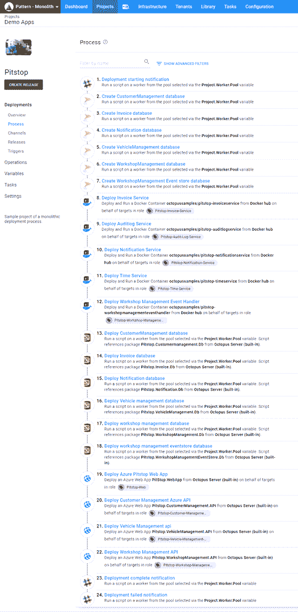
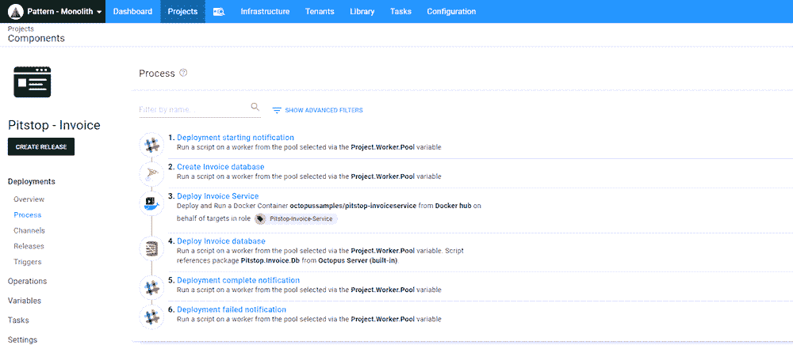
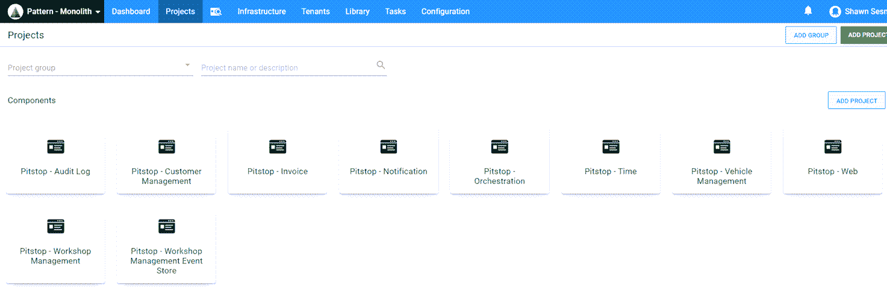
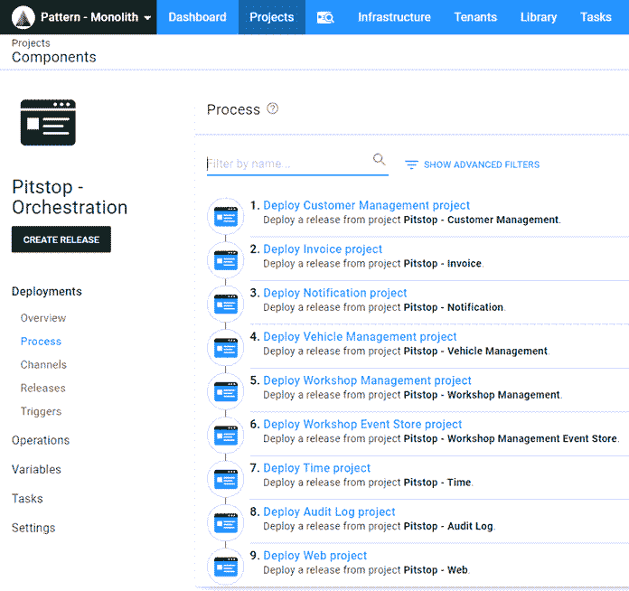

# 打破单一部署- Octopus 部署

> 原文：<https://octopus.com/blog/breaking-up-monolith-deployments>

术语*整体部署*通常带有负面含义，然而，整体部署是应用程序随着时间增长的自然发展。在这篇文章中，我演示了如何将一个整体流程分解成更小的可部署组件。

## 进站

在这篇文章中，我将使用 [Pitstop](https://github.com/EdwinVW/pitstop) 应用程序作为例子。我选择 Pitstop 是因为它包含多个移动部件:

*   Web 前端
*   蜜蜂
*   微服务
*   数据库
*   引用第三方 docker 容器

这个应用程序的最初版本将数据库和表的创建嵌入到了 C#代码中。为了进行更有用的演示，我提取了数据库活动，并将其放入部署流程中。此外，API 和 web 前端都被 dockerized 化了。同样，我对此进行了修改，以便它们可以部署到 Azure 而不是容器。下面是[修改版](https://github.com/OctopusSamples/PitStop)。

## 整体部署流程

对 Pitstop 应用程序的修改是为了在部署过程中添加更多内容。部署 Pitstop 应用程序包括以下步骤:

*   宽限通知-开始部署
*   创建 CustomerManagement 数据库(如果不存在)
*   创建发票数据库(如果不存在)
*   创建通知数据库(如果不存在)
*   创建车辆管理数据库(如果不存在)
*   创建车间管理数据库(如果不存在)
*   创建 WorkshopManagementEventStore 数据库(如果不存在)
*   部署发票微服务
*   部署审计日志微服务
*   部署通知微服务
*   部署时间服务微服务
*   部署车间管理微服务
*   部署客户管理数据库
*   部署发票数据库
*   部署通知数据库
*   部署车辆管理数据库
*   部署车间管理数据库
*   部署车间管理事件存储数据库
*   部署 Pistop web 应用程序
*   部署客户管理 API
*   部署车辆管理 API
*   部署车间管理 API
*   宽限通知-部署完成
*   松弛通知-部署失败(仅在失败时)

在这种形式下，完成部署大约需要 15 分钟。虽然这不是一个天文数字，但如果有一个组件停机并需要更新，这可能是一个永恒的数字。

## 打破巨石

查看我们的部署流程，我们可以确定一些相关的步骤，而其他步骤是独立的。例如，发票服务的步骤都是相互关联的，因此这些步骤可以分解到它们自己的 Octopus 项目中:

*   宽限通知-开始部署
*   创建发票数据库(如果不存在)
*   部署发票微服务
*   部署发票数据库
*   宽限通知-部署成功
*   松弛通知-部署失败(仅在失败时)

发票组件的部署现在只需 1 分钟，而在 monolith 中需要 15 分钟。这大大节省了时间，尤其是在发票组件是唯一需要更新的部分的情况下。

将整个过程分解成不同的项目将会产生类似这样的结果:

应用程序的每个组件都被分解到各自的项目中，现在可以单独部署了。

## 部署流程编排

既然我们已经将应用程序分解成了独立的可部署组件，那么当我们需要部署整个解决方案时，我们就面临着协调多个项目的问题。

### 创建业务流程项目

Octopus Deploy 包含一个名为 [Deploy a Release](https://octopus.com/docs/projects/coordinating-multiple-projects/deploy-release-step) 的内置步骤模板。该特性允许您选择不同的项目，并从其中部署最新的版本(社区模板[链部署](https://library.octopus.com/step-templates/18392835-d50e-4ce9-9065-8e15a3c30954/actiontemplate-chain-deployment)具有类似的功能)。 **Deploy a Release** 步骤能够在出现变量提示时将变量传递给子项目。

使用**部署发布**模板有几个注意事项:

*   必须在创建业务流程项目发布之前创建子项目发布。这可以通过我们的构建服务器插件来完成，以从构建中创建发布，或者使用 CLI。
*   无法选择子项目的特定发布版本。

## 结论

自动化应用部署是您开发运维之旅中的关键一步。如果您的部署过程已经达到了整体规模，下一步就是确定哪些组件可以单独部署，这通常是说起来容易做起来难。这种做法的一个副作用是，可以单独部署的相同组件通常可以单独构建，这可以大大减少构建持续时间，并缩短交付周期。随着构建持续时间和部署时间的减少，您可以更快、更频繁地部署应用程序。