# 超越 Hello World:构建一个真实的 Docker CI/CD 管道- Octopus Deploy

> 原文：<https://octopus.com/blog/build-a-real-world-docker-cicd-pipeline>

Docker 容器和 Kubernetes 是您 DevOps 工具箱中的优秀技术。这个**超越 Hello World** 博客系列涵盖了如何在现实应用中使用它们。

* * *

在上一篇文章中，我向您展示了如何将 [OctoPetShop](https://github.com/OctopusSamples/OctoPetShop) web 应用程序容器化，并为其生成 Docker 图像。

在这篇文章中，我配置了一个完整的 Docker CI/CD 管道来自动化这个过程。这包括配置与 JetBrains 的 TeamCity 的持续集成和与 Octopus Deploy 的持续交付的步骤。

## 在这篇文章中

## 配置 Docker 与 JetBrains 的 TeamCity 的持续集成

持续集成发生在构建服务器上。连续部分通常与触发构建的事件相关联，例如源代码提交或预定义的时间表。对于我们的构建服务器，我们将执行以下任务:

*   创建一个项目。
*   创建一个生成定义。
*   定义构建步骤。

### 向构建代理添加 Docker 构建功能

大多数主要的构建服务器都可以通过内置的步骤或可下载的插件来构建 Docker 映像。对于这个演示，我使用 TeamCity，因为我的大部分经验都是使用 Azure DevOps，我想扩展我的视野。

我没有创建一个新的虚拟机(VM ),安装并配置一个操作系统，安装构建代理，最后安装 Docker，而是选择了一个更有趣的方法。团队城市(以及其他产品)的制造商 JetBrains 为他们的构建代理提供了一个 [Docker 图像。他们不仅有一个构建代理映像，而且这个映像还可以运行 Docker 来执行 Docker 构建(在上面的链接文档中，我选择了*运行需要 Docker* 的构建下的选项二)。](https://hub.docker.com/r/jetbrains/teamcity-agent/)

**提示**
我第一次尝试运行时遇到了代理容器无法解析本地 DNS 条目的问题，但是 Robin Winslow 的文章 [Fix Docker 的网络 DNS 配置](https://development.robinwinslow.uk/2016/06/23/fix-docker-networking-dns/)向我展示了一个解决这个问题的巧妙技巧。

随着 DNS 问题的解决，容器启动并在我的 TeamCity 服务器上注册到未授权的代理类别下:

[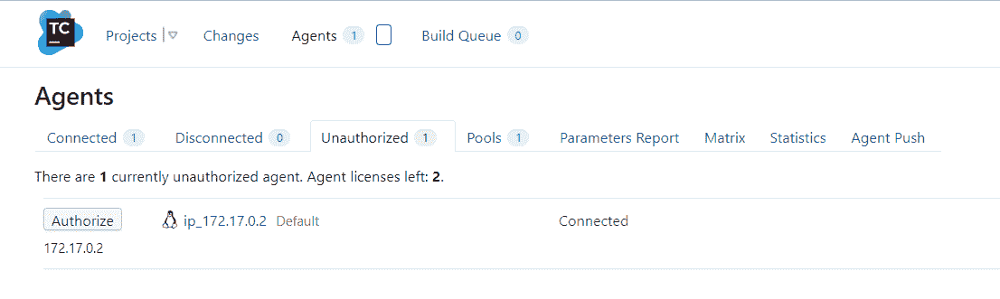](#)

单击**授权**按钮完成连接，代理就可以执行构建了。

### 创建团队城市项目

我的第一步是创建一个新的 TeamCity 项目，并将我的 git 存储库连接到它。GitHub 上有 OctoPetShop 的源代码，但我使用了一个本地 Azure DevOps 实例来托管我的。这篇文章假设你已经知道如何在 TeamCity 中[创建一个项目](https://www.jetbrains.com/help/teamcity/creating-and-editing-projects.html)，并且关注构建和部署过程。

### 添加到 Docker Hub 的连接

要将您的图像推送到 Docker Hub，您需要配置一个授权用户到 Docker Hub 的连接。

为此，导航到 OctoPetShop 项目的**连接**选项卡:

[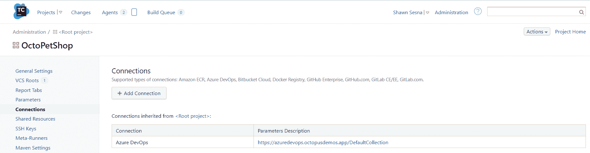](#)

点击**添加连接**:

[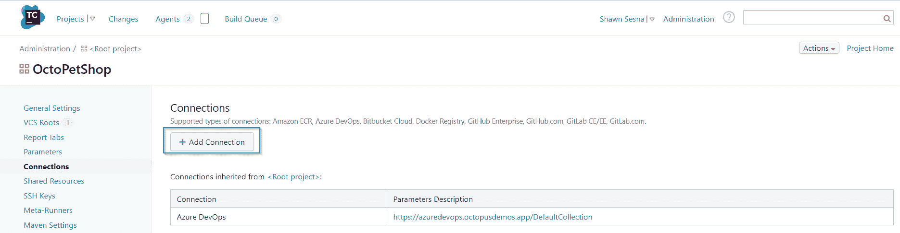](#)

从下拉菜单中选择 **Docker 注册表**，并填写用户名和密码。不要忘记使用**测试连接**来确保您的凭证有效:

[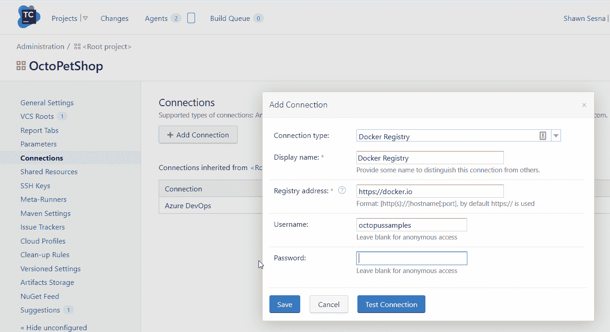 ](#) [ 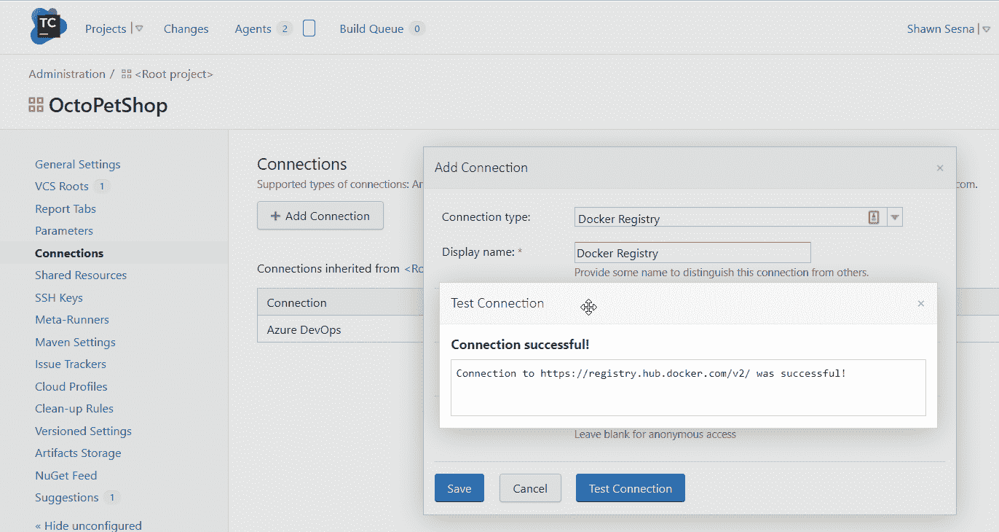](#)

有了这些整理工作，您就可以继续您的构建定义了。

### 创建构建定义

创建项目后，您可以创建一个新的构建定义来执行 Docker 构建操作。这个构建定义需要执行以下步骤:

*   构建 OctoPetShop web 前端。
*   构建 OctoPetShop 产品服务。
*   构建 OctoPetShop 购物车服务。
*   构建 OctoPetShop 数据库 DbUp。
*   将映像推送到 Docker Hub 以用于部署。

### 添加 Docker 支持构建功能

您需要将 Docker Hub 连接连接到您的构建定义。为此，您可以点击**构建特性**选项卡和**添加构建特性**:

[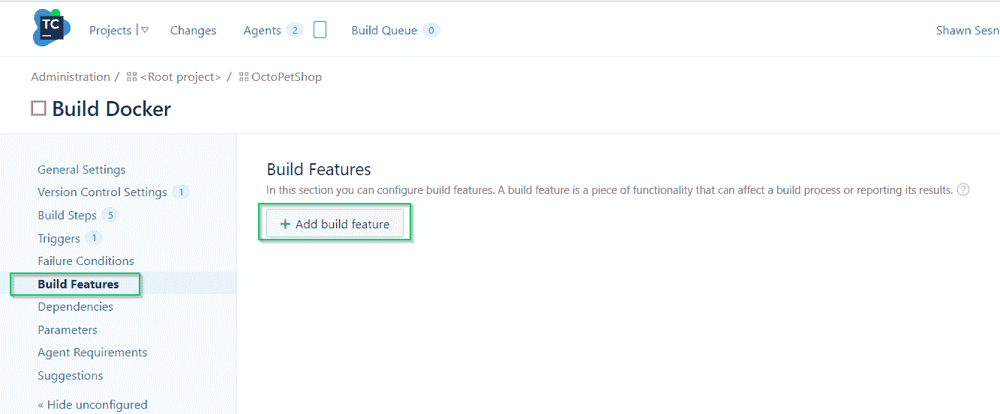](#)

从下拉菜单中选择 **Docker Support** :

[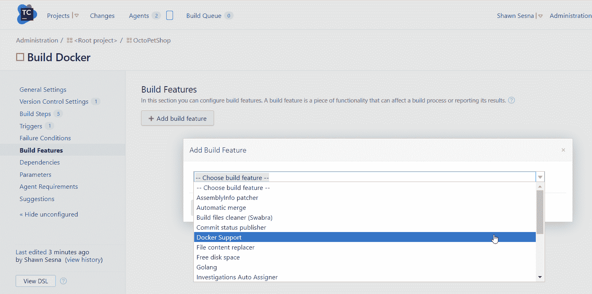](#)

检查**在构建**之前登录 Docker 注册表，选择您为项目创建的连接，然后点击**保存**:

[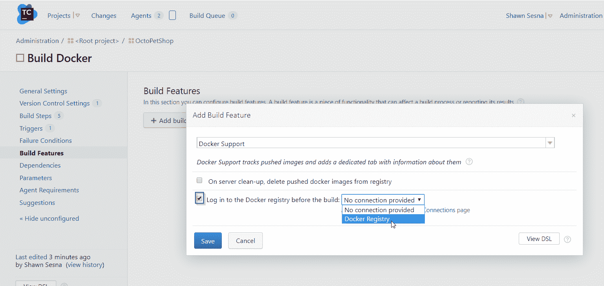](#)

### 添加构建步骤

步骤 1 到 4 几乎相同；唯一的区别是您将构建的 dockerfile 文件。点击**构建步骤**选项卡，并点击**添加构建步骤**按钮:

对于该步骤，请填写以下内容:

*   转轮类型:`Docker`
*   Docker 命令:`build`
*   回购协议中 dockerfile 的路径:即`Development-Active/OctopusSamples.OctoPetShop.web/dockerfile`
*   图像名称:标签:即`octopusexamples/octopetshop-web:1.0.0.0`

[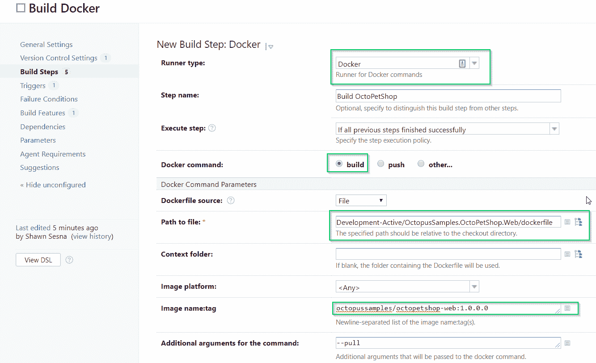](#)

对于 Docker 图片，用`DockerId/ImageName:version`标记你的图片被认为是最佳实践。省略标签的`version`部分并不罕见，但是每当一个图像的新版本上传到 Docker Hub 时，如果没有指定版本号，它会自动附加`latest`作为版本。Octopus Deploy 将 SemVer 用于包版本，在这个例子中，我将`1.0.0.0`硬编码为版本号，但是您也可以轻松地使用 TeamCity 参数来动态分配版本号。

您将为产品服务、购物车服务和数据库添加三个类似的步骤。

您将添加的最后一步是将您构建的映像推送到 Docker Hub(即执行 Docker push 命令)。对于这一步，您需要填写以下内容:

*   转轮类型:`Docker`
*   Docker 命令:`push`
*   图像名称:标签

[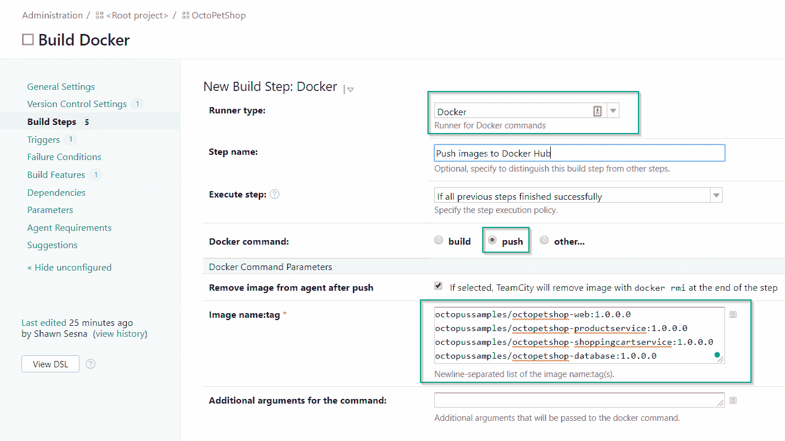](#)

对于推送步骤，您可以指定在步骤 1 到 4 中构建的所有映像，并在一个步骤中推送它们。除非出现任何输入错误，否则构建应该会成功执行:

[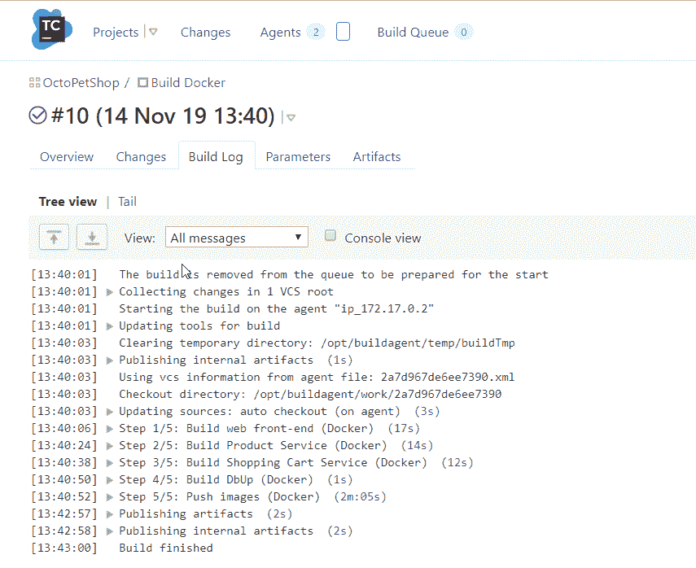](#)

恭喜你！您刚刚完成了本文的 CI 部分。剩下唯一要做的事情就是添加一个触发器，这样当有人提交到源代码控制时，一个构建就会自动执行。

## 使用 Octopus Deploy 配置 Docker 连续交付

对于本文的连续交付部分，您将使用 Octopus Deploy。使用 Octopus，您将执行以下操作:

*   添加 Docker Hub 作为外部 feed。
*   创建新项目。
*   定义我们的部署步骤。

### 添加 Docker Hub 作为外部 feed

您需要添加 Docker Hub 作为外部提要，以便 Octopus Deploy 可以从 Docker Hub 中提取您的图像，并将它们部署到运行 Docker 的服务器上。

登录 Octopus 后，点击**库**标签:

[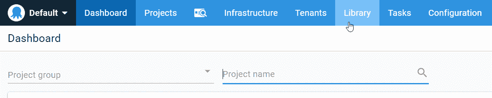](#)

在**库**部分，点击**外部进给**，点击**添加进给**按钮:

[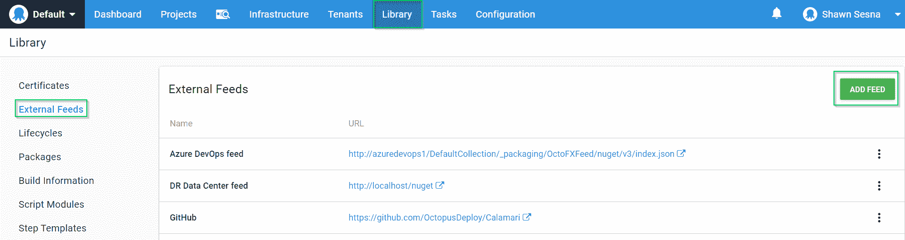](#)

在**创建 Feed** 表单上，填写以下内容:

*   进料类型:`Docker Container Registry`
*   名称:`Docker Hub`
*   用户名:`your-username`
*   密码:`your-password`

测试提要以确保 Octopus 可以登录 Docker Hub:

[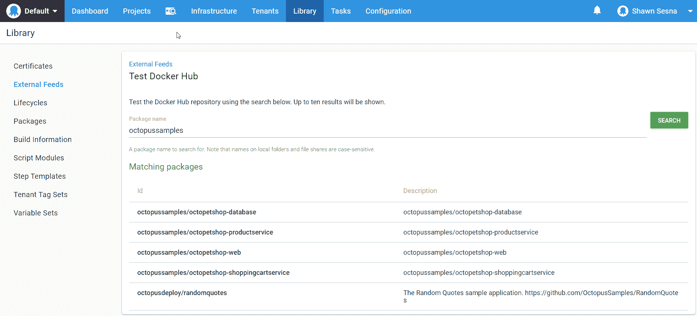](#)

配置好外部提要后，您可以定义我们的步骤。

### 创建 Octopus 部署项目

要创建新项目，点击**项目**选项卡，并点击**添加项目**按钮:

给项目命名，点击**保存**:

[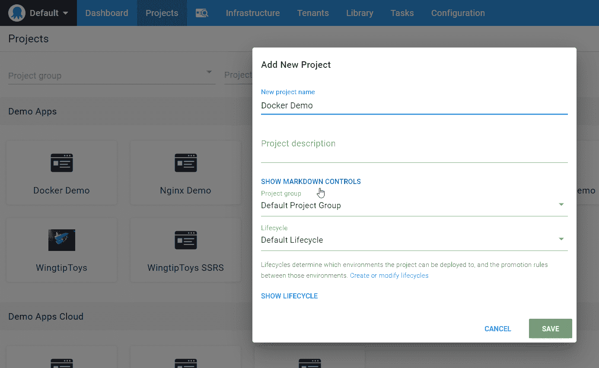](#)

与我们的构建类似，Octopus 中的步骤也基本相同，只有微小的差异。我将带您完成您将添加到流程中的第一步，并指出其余步骤中的差异。

在项目的**流程**选项卡上，点击**添加步骤**:

[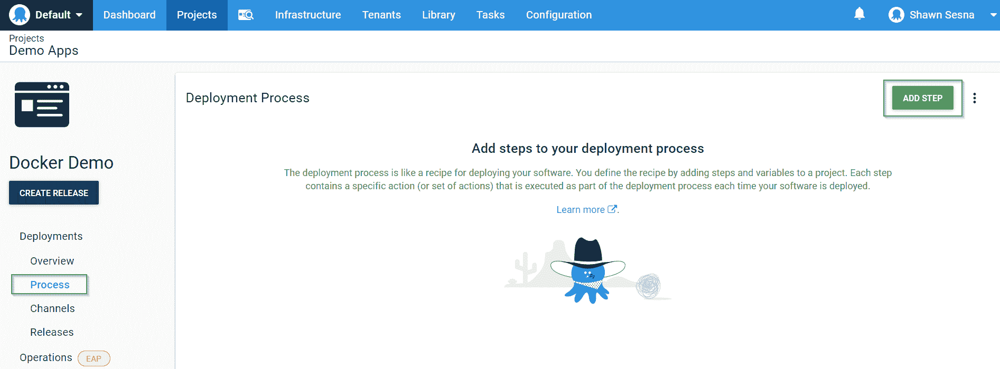](#)

选择 **Docker** 类别和**运行 Docker 容器**步骤:

对于此演示，使用 Microsoft SQL Server 2017 Docker 映像作为您的数据库服务器。这将是您在部署中配置的第一个容器。

Docker 容器步骤的表单相当长，所以我把截图分成了几个部分。对于第一部分，给步骤一个名称以及它将被部署到的角色。在这个演示中，我使用了一个简单的角色`Docker`，但是在生产场景中，这个角色可能更有意义，比如:`OctoPetShop-Web-Container`。

[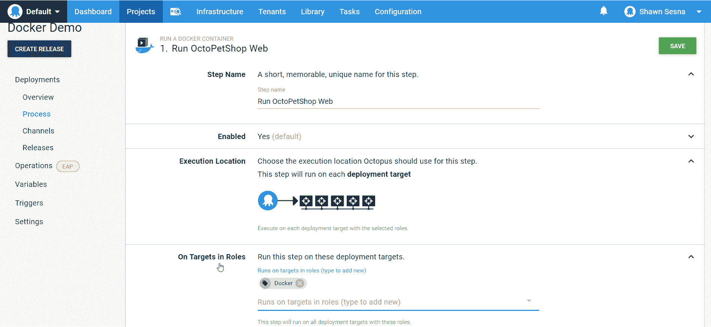](#)

选择我们的 Docker Hub 外部馈送，并选择`microsoft/mssql-server-linux`图像。

**提示**
在搜索框中键入`mssql`查找图片。

[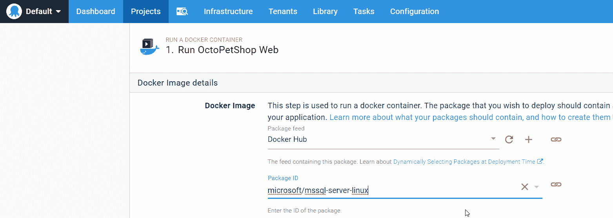](#)

选择`Bridge`的网络类型:

[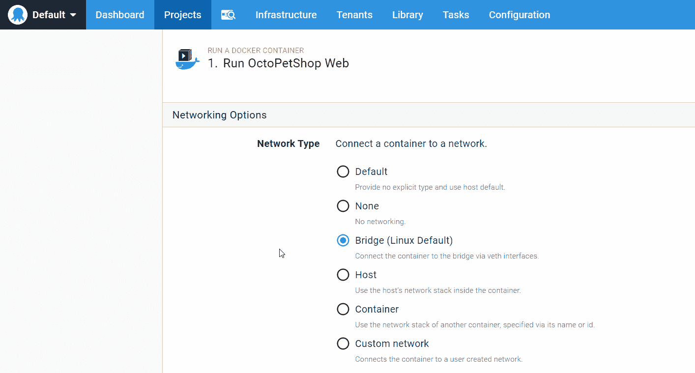](#)

要使您的数据库服务器可访问，您需要添加一个端口映射。指定默认的 SQL Server 端口`1433`:

[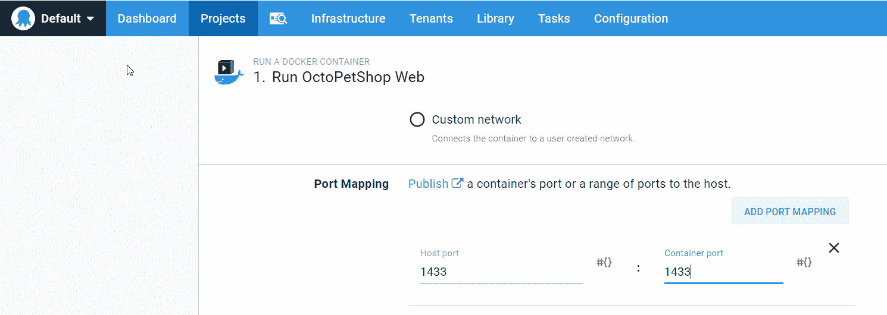](#)

向下滚动到**变量**部分，并添加以下显式变量映射。这个图像需要传递给它两个环境变量:`SA_PASSWORD`和`ACCEPT_EULA`。为`SA_PASSWORD`创建一个类型为 *Sensitive* 的项目变量:

[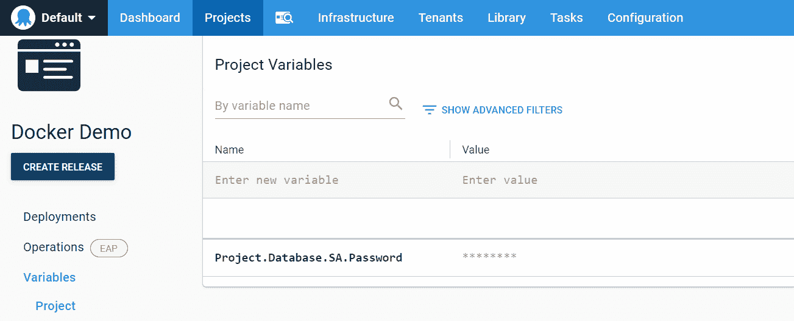 ](#) [ 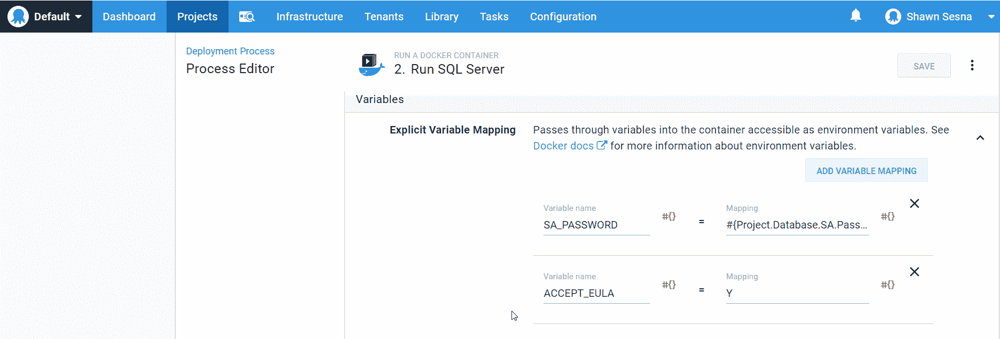](#)

这个容器就这样了。点击**保存**将该步骤提交给流程。

以下是其余容器的详细信息:

#### OctoPetShop 网站

*   Docker 图片:`octopussamples/octopetshop-web`
*   网络类型:`Host`
*   显式变量映射:
    *   `ProductServiceBaseUrl = http://localhost:5011/`
    *   `ShoppingCartServiceBaseUrl = http://localhost:5012`

#### OctoPetShop 产品服务

*   码头工人图片:`octopussamples/octopetshop-productservice`
*   网络类型:`Bridge`
*   端口映射:`5011:5011`
*   显式变量映射:
    *   `OPSConnectionString = "Data Source=#{Octopus.Machine.Hostname}; Initial Catalog=OctoPetShop; User ID=sa; Password=#{Project.Database.SA.Password}`

*   Docker 图片:`octopussamples/octopetshop-shoppingcartservice`
*   网络类型:`Bridge`
*   端口映射:`5012:5012`
*   显式变量映射:
    *   `OPSConnectionString = "Data Source=#{Octopus.Machine.Hostname}; Initial Catalog=OctoPetShop; User ID=sa; Password=#{Project.Database.SA.Password}`

#### OctoPetShop 数据库

*   Docker 图像:`octopussamples/octopetshop-database`
*   网络类型:`Host`
*   显式变量映射:
    *   `DbUpConnectionString = "Data Source=#{Octopus.Machine.Hostname}; Initial Catalog=OctoPetShop; User ID=sa; Password=#{Project.Database.SA.Password}`

定义好所有步骤后，您就可以创建并部署一个发布了:

**提示**
关于如何为 Linux 设置触手的信息，请参见我们的[文档](https://octopus.com/docs/infrastructure/deployment-targets/linux/tentacle)。

[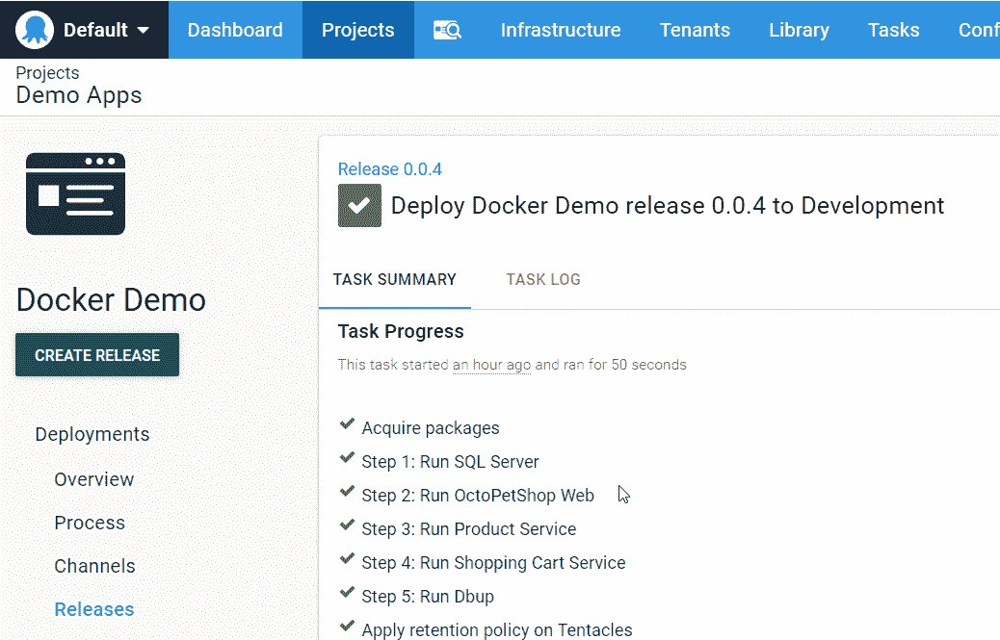](#)

如果您导航到您刚刚部署到的服务器，您应该看到您的 OctoPetShop 应用程序正在运行。与前面的演示一样，OctoPetShop 使用自签名证书重定向到 https，因此您很可能会收到关于它不安全的警告。在这种情况下，可以忽略警告并继续:

[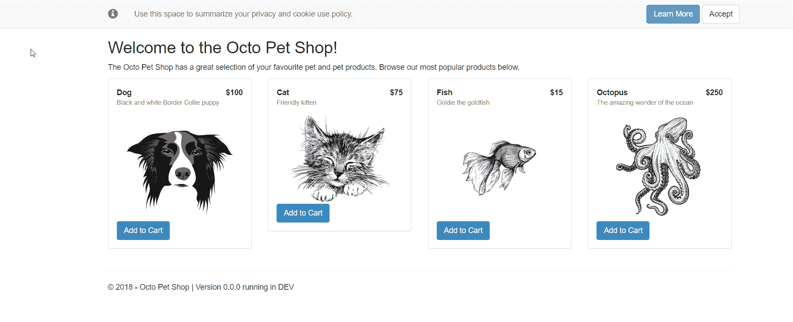](#)

## 完成 Docker CI/CD 管道

到目前为止，我们已经完成了 CI 和 CD 部分，但是您仍然需要连接它们。要将这些片段组合在一起，请回到您的 TeamCity 服务器。

### 安装 Octopus 部署团队城市插件

首先，导航并下载 [Octopus 部署插件](https://plugins.jetbrains.com/plugin/9038-octopus-deploy-integration)。

下载完成后，进入 TeamCity 服务器中的管理➜插件列表。从这里，点击**上传插件 zip** 按钮添加插件:

[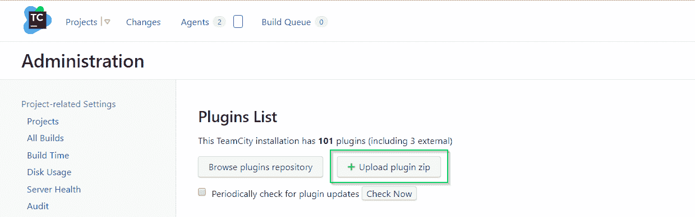](#)

这将添加一些步骤，您可以使用构建定义与 Octopus Deploy 进行交互:

[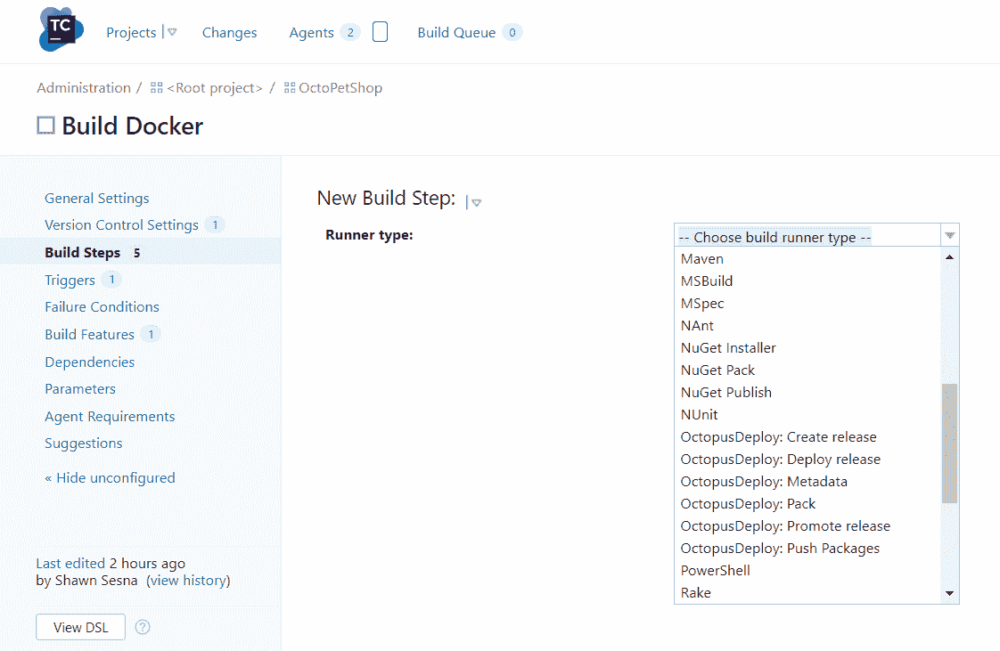](#)

### 添加创建发布步骤

接下来，向您的构建定义添加一个新步骤，**octopus deploy:Create release**:

[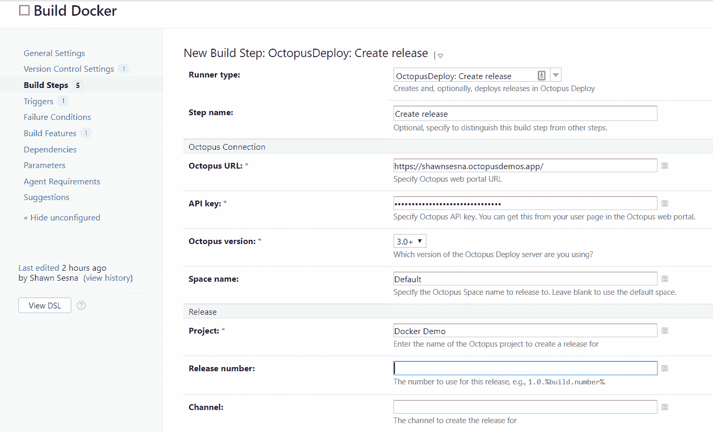](#)

现在，当您运行一个构建时，它会自动在 Octopus Deploy 中创建一个发布:

[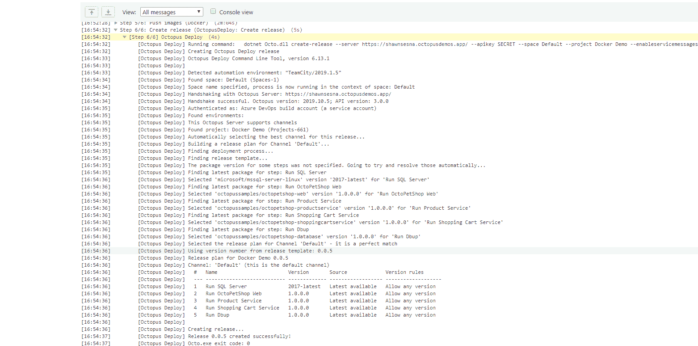](#)

[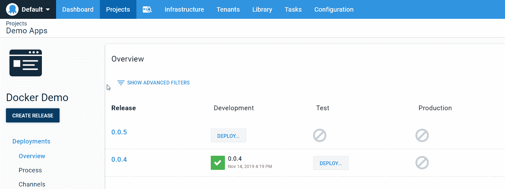](#)

如果您愿意，您可以直接从构建定义中将该版本的自动部署添加到开发中。

## 结论

这篇文章展示了使用 Docker 容器为现实世界的应用程序创建完整的 CI/CD 管道是可能的。它讲述了如何使用 JetBrains TeamCity 自动化 Docker 构建管道，以及如何使用 Octopus Deploy 配置 Docker 连续交付。