# 超越 Hello World:构建一个真实的 Kubernetes CI/CD 管道- Octopus Deploy

> 原文：<https://octopus.com/blog/build-a-real-world-kubernetes-cicd-pipeline>

[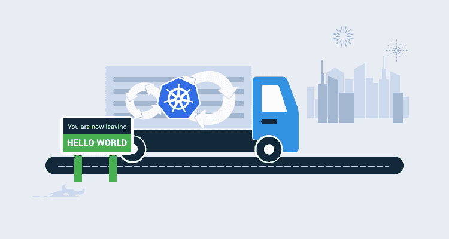](#)

Docker 容器和 Kubernetes 是您 DevOps 工具箱中的优秀技术。这个**超越 Hello World** 博客系列涵盖了如何在现实应用中使用它们。

* * *

在[的上一篇文章](/blog/kubernetes-for-the-uninitiated)中，我向您展示了如何使用我们的 OctoPetShop 容器建立一个 Kubernetes 集群。我们为 web 前端、产品服务和购物车服务创建了 YAML 文件。

在这篇文章中，我调整了 YAML 文件并建立了持续集成和持续交付(CI/CD)管道。

## 创建构建定义

Kubernetes 没有任何需要构建的东西，除了它使用的 Docker 图像。但是，我们创建的 YAML 文件可以放在源代码控制中并进行版本控制，因此使用构建服务器仍然是有意义的。我们的 [OctoPetShop](https://github.com/OctopusSamples/OctoPetShop) repo 包含一个 k8s 文件夹，我们在其中放置了创建集群所需的所有 YAML 文件。我们会用这个回购作为我们的来源。为了一致性，我们使用 TeamCity 作为我们的构建服务器。

### 设置版本号

在 Docker CI/CD 帖子中，我们将容器的版本号硬编码为 1.0.0.0。在这篇文章中，我们将为 YAML 文件的每个版本创建唯一的版本号。为简单起见，我将把版本号设置为四位数字的年份、两位数字的月份、两位数字的月份日期和修订版(yyyy。MM.dd.r)。

将 PowerShell 步骤添加到我们的构建定义中

[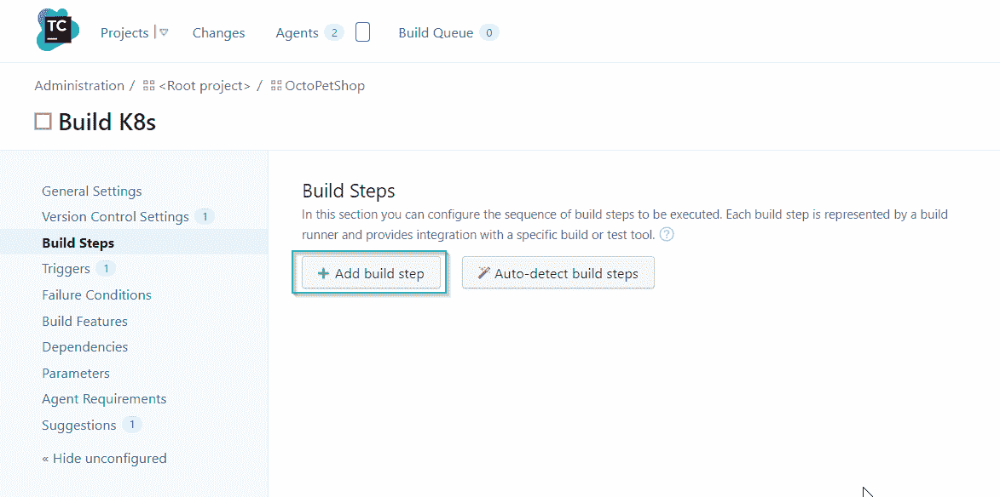](#)

输入以下 PowerShell 来设置版本号

```
Write-Host "##teamcity[buildNumber '$(Get-Date -Format "yyyy.MM.dd").%build.counter%']" 
```

[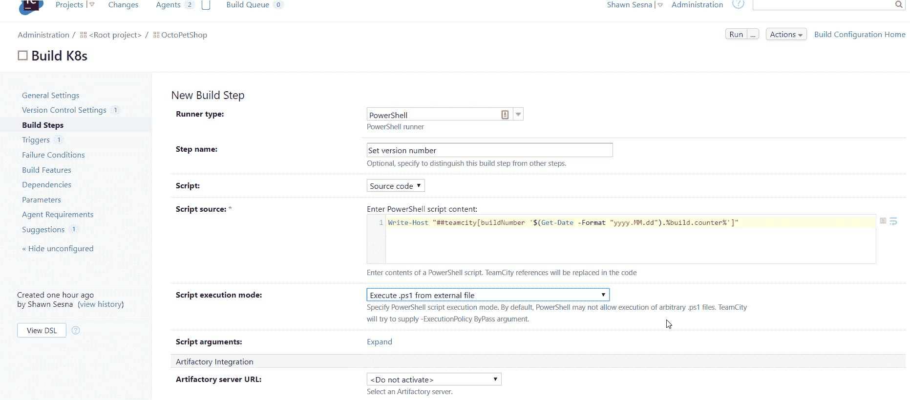](#)

这将允许我们在后续步骤中使用`%build.number%`来指定版本号。

[](#)

### 调整 YAML

我们的 repo 中的 YAML 拥有 SQL Server 的 SA 帐户的明文密码。让我们利用 Octopus 部署文件中的替代变量特性，用 Octopus 部署项目中的变量替换密码。首先，我们将占位符包含在 YAML 文件中。例如，打开 octopetshop-database-job.yaml，更改连接字符串的密码部分:

```
apiVersion: batch/v1
kind: Job
metadata:
  name: octopetshop-dbup
spec:
  template:
    spec:
      containers:
        - name: dbup
          image: octopussamples/octopetshop-database
          command: [ "dotnet", "run", "--no-launch-profile" ]
          env:
            - name: DbUpConnectionString
              value: Data Source=octopetshop-sqlserver-cluster-ip-service;Initial Catalog=OctoPetShop; User ID=sa; Password=#{Project.SA.Password}
      restartPolicy: Never 
```

对以下文件重复此过程:

*   章鱼小铺-产品服务-部署。YAML
*   octopetshop-shoppingcartservice-部署。YAML
*   octopetshop-SQL-deployment。YAML

如果要运行本地 k8s 实例，可能需要在 octopetshop-loadbalancer.yaml 文件中指定外部 IP 地址(托管解决方案如 Azure 或 AWS 通常会自动为您连接)。将 externalIPs 组件添加到 YAML 文件中，并将其设置为占位符:

```
apiVersion: v1
kind: Service
metadata:
  name: web-loadbalancer
spec:
  selector:
    component: web
  ports:
    - port: 5000
      targetPort: 5000
      name: http-port
    - port: 5001
      targetPort: 5001
      name: https-port
  type: LoadBalancer
  externalIPs:
  - #{Project.Kubernetes.LoadBalancer.ExertnalIp} 
```

### 打包 YAML

使用 Octopus Deploy Pack 步骤，我们可以将所有用于部署的 YAML 打包到一个 NuGet 包中。

[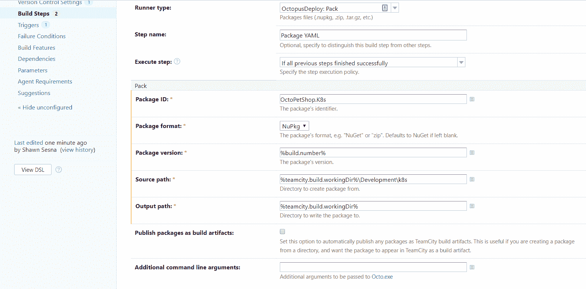](#)

### 将包推至 Octopus 部署

通过 Octopus Deploy 推送步骤，我们可以将 NuGet 包发送到 Octopus Deploy。

出于演示的目的，我们使用 Octopus Deploy 的内置 NuGet 存储库。

[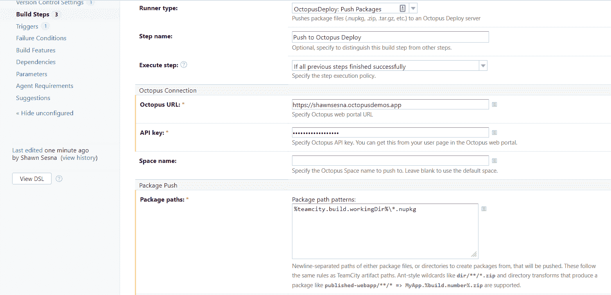](#)

我们的构建定义现在将为我们的部署打包所有的 YAML 文件，并将它们发送到我们的 Octopus Deploy 服务器！现在是[连续交付](https://octopus.com/devops/continuous-delivery/)的部分。

## 使用部署的 Octopus 配置连续交付

使用 Octopus Deploy 中的 YAML 文件包，我们可以创建我们的部署过程。在本节中，我们将执行以下操作:

*   创建新项目。
*   定义我们的部署步骤。

### 创建 Octopus 部署项目

要创建新项目，点击**项目**选项卡，并点击**添加项目**按钮:

[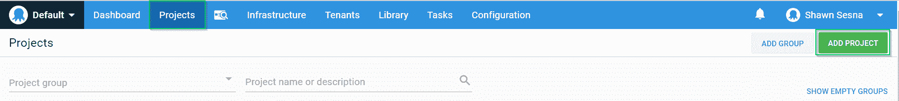](#)

给项目命名，点击**保存**:

[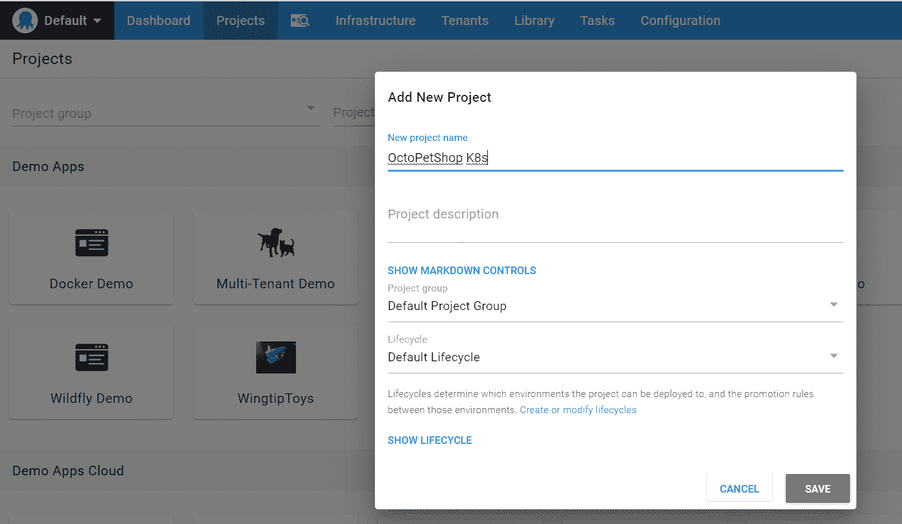](#)

让我们为我们的项目添加一些步骤。在项目的**流程**选项卡上，点击**添加步骤**:

[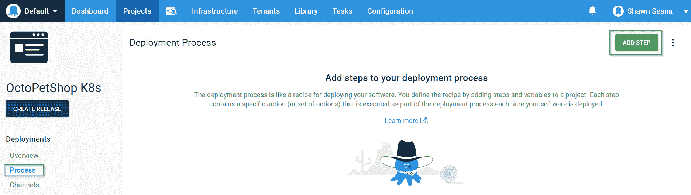](#)

除了指定的文件之外，我们的过程中的步骤几乎是相同的。我会带你看第一个。

在我们的流程中添加一个部署原始 Kubernetes YAML 步骤:

[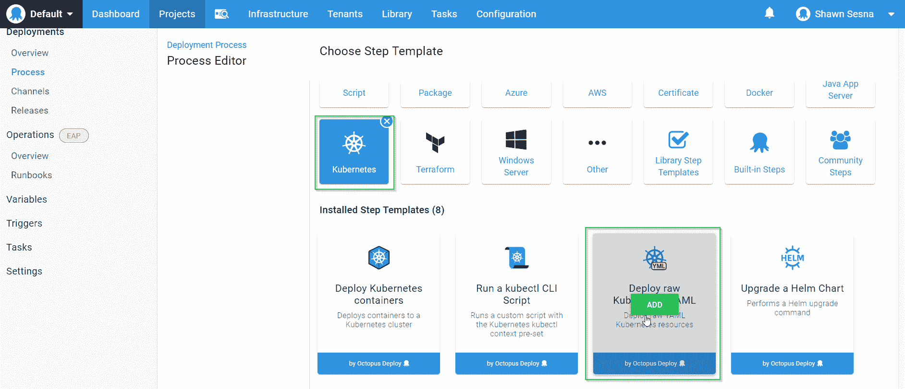](#)

第一步将部署 SQL Server 群集 IP 服务。部署到 Kubernetes 是通过它的 REST API 完成的，它使用了幕后的`kubectl` CLI 工具。Octopus 在 [workers](https://octopus.com/docs/infrastructure/workers) 上执行这个部署工作，而不是在部署目标上，所以你需要确保在 workers 上安装了一个版本的 kubectl 来完成这个工作。

对于 YAML 源，选择包内文件，指定包和包内的文件:

[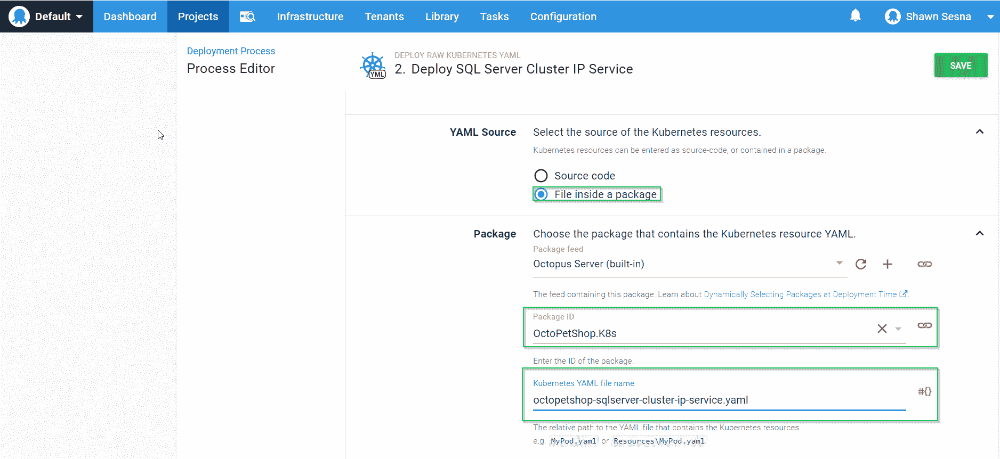](#)

如果您要部署到一个名称空间，请确保填写表单的该部分。

这一步就到此为止！除了文件名之外，其余步骤完全相同。完成后，您应该会看到这样的内容:

[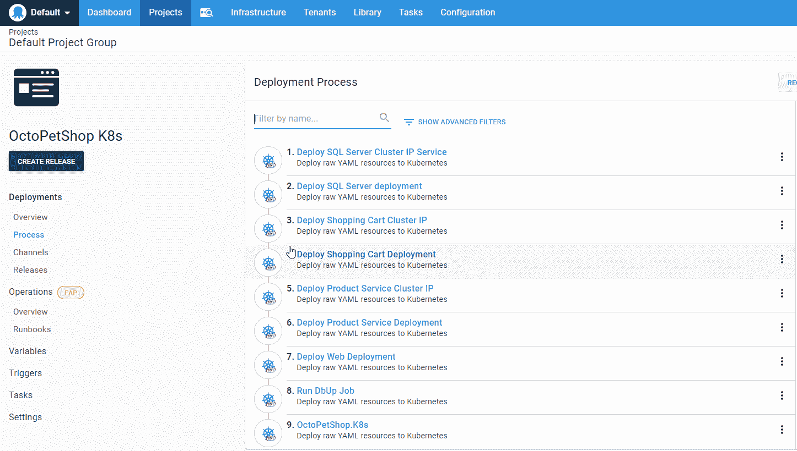](#)

我们现在剩下要做的就是添加项目变量。单击左侧的变量选项卡:

[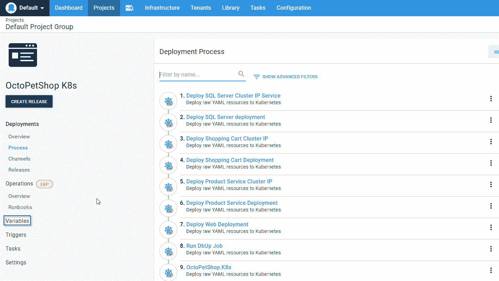](#)

创建一个名为 Project 的新变量。SA .密码并使其敏感:

[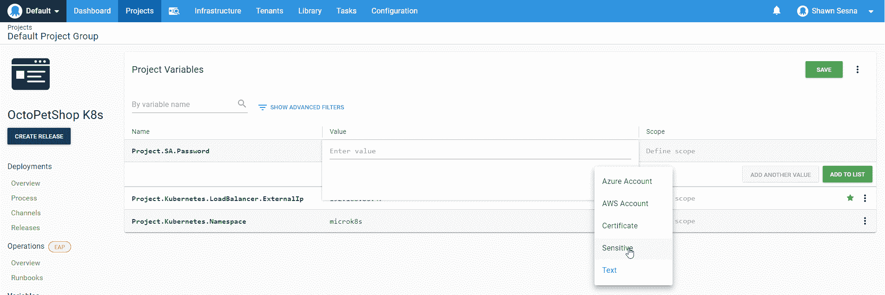](#)

给它一个符合 SQL Server 2017 密码复杂性要求的值。

在我们准备好创建一个发布之前，最后要做的是改变发布的编号以匹配我们的构建版本。这将允许我们将一个发布直接绑定到创建它的构建中。为此，请单击设置选项卡:

[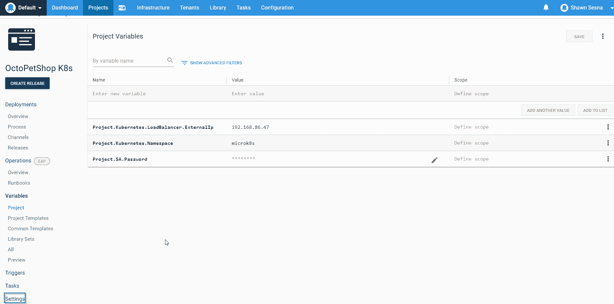](#)

展开“版本控制”部分:

[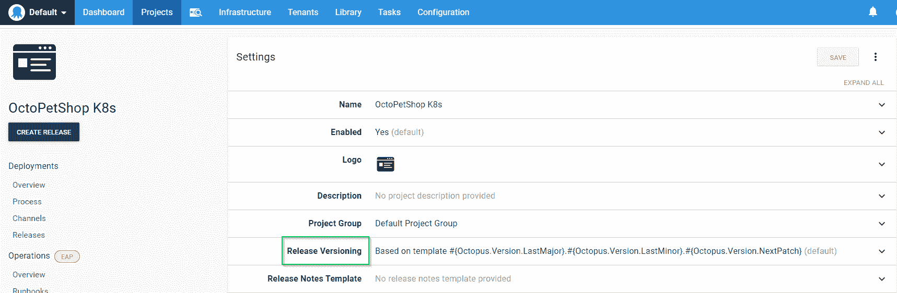](#)

选择使用随附软件包中的版本号，然后选择我们的 OctoPetShop。K8s 包装:

[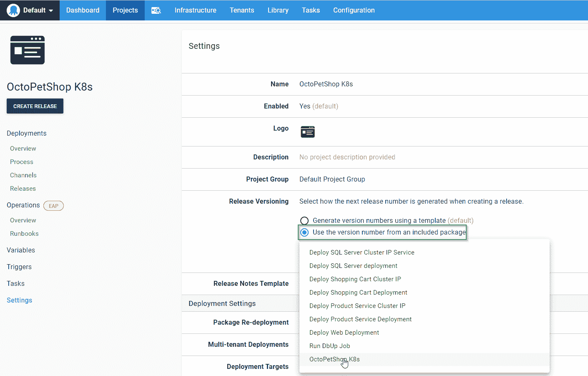](#)

我们现在准备创建一个版本！点击**创建发布**按钮！

[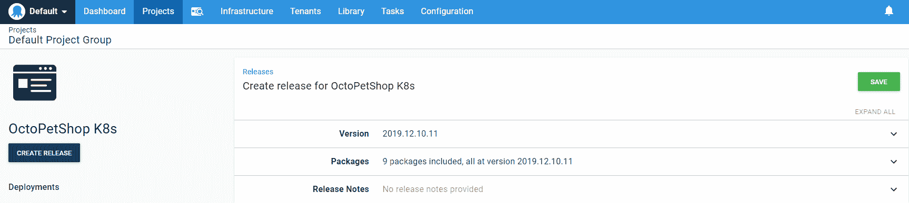](#)

在此页面上不需要做任何更改，只需点击**保存**然后点击**部署**开发环境:

[](#)

最后，通过点击**部署**确认我们想要部署:

[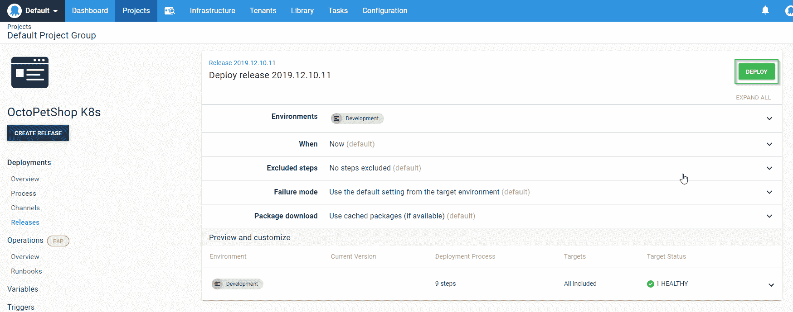](#)

部署完成后，您应该会看到类似这样的内容:

[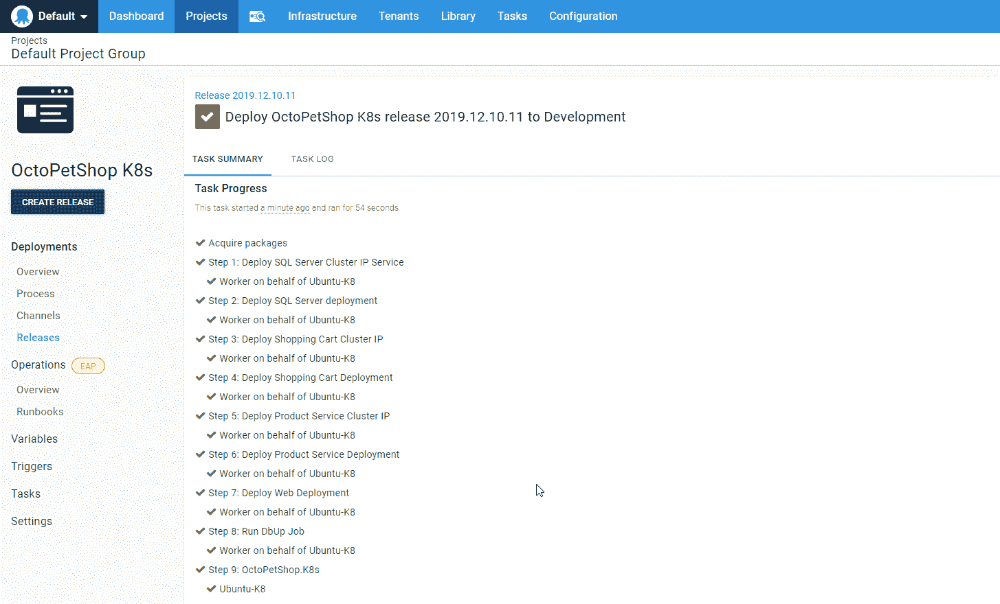](#)

通过部署，我们可以导航到我们的服务器来查看我们的应用程序。

我们的。NET 核心应用程序将重定向到 SSL，如果你得到一个关于网站不安全的警告，在这种情况下是可以的。

[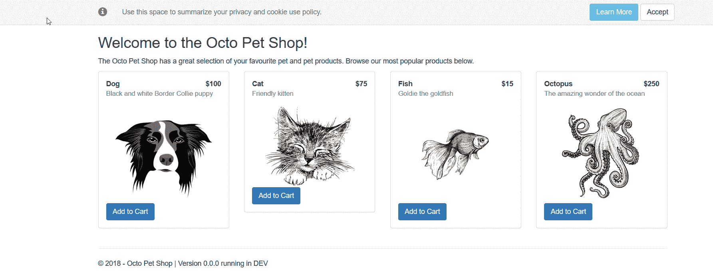](#)

## 只能选择连续交货

到目前为止，我们的过程依赖于我们创建 YAML 来定义我们的 Kubernetes 集群。使用 Octopus Deploy，有一种替代的方法部署到 Kubernetes，不需要使用构建服务器或了解 YAML。

部署 Kubernetes 容器步骤模板包含一个表单，我们可以使用它来定义我们的 Kubernetes 集群所需的所有属性，而无需编写一行 YAML:

[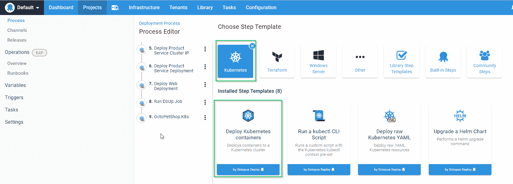](#)

该表单非常广泛，允许您创建 Kubernetes 集群所需的一切，例如:

*   集群 IP 服务
*   入口服务
*   部署
*   服务端口映射
*   配置映射
*   秘密
*   卷
*   容器
*   容器环境变量
*   容器端口映射
*   还有更多！

[](#)[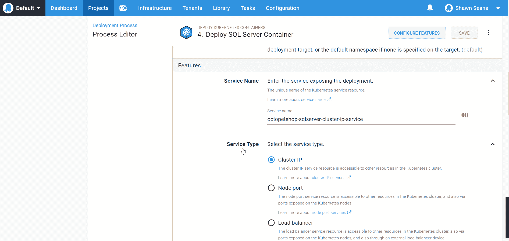](#)[](#)[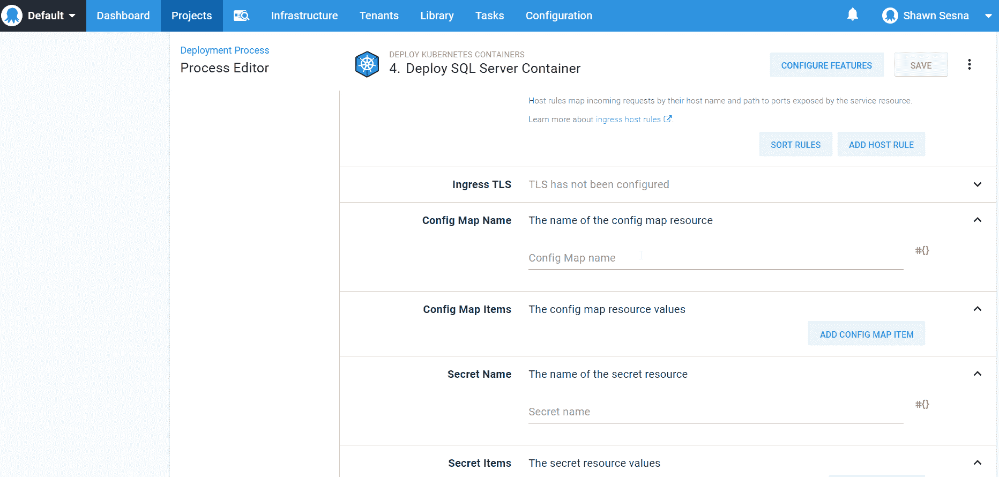T11](#)

这种方法让我们可以完全跳过 CI 部分，专注于 Kubernetes 管道中的 CD 部分。

form 方法在部署时动态编写 YAML，您需要确保安装在 worker 上的 kubectl 版本使用与您要部署到的 Kubernetes 版本相同的 API 格式。在我的情况下，我在 Ubuntu 18.04 上使用 MicroK8s，它似乎没有引用相同的 API 版本。

## 结论

在本文中，我演示了如何在 CI/CD 管道中使用 Kubernetes。我还演示了一种部署到 Kubernetes 的方法，该方法只使用管道的 CD 部分。

浏览 [DevOps 工程师手册](https://octopus.com/devops/)以了解有关 DevOps、CI/CD 和部署管道的更多信息。