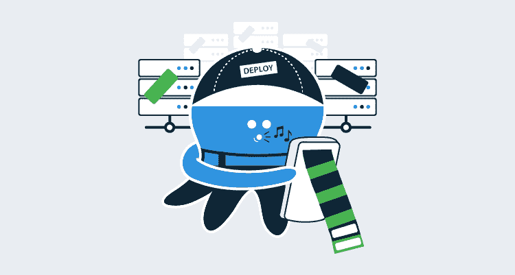
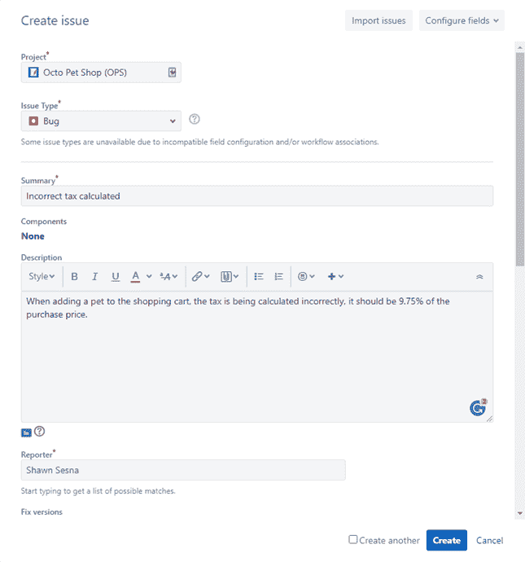
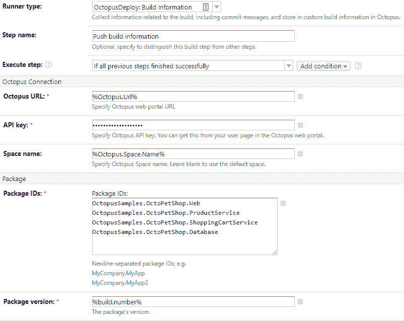
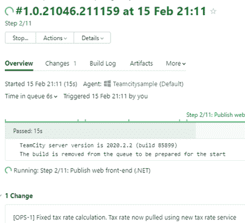
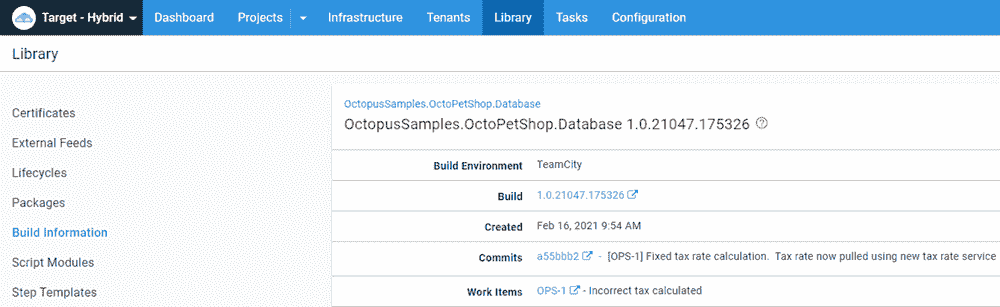
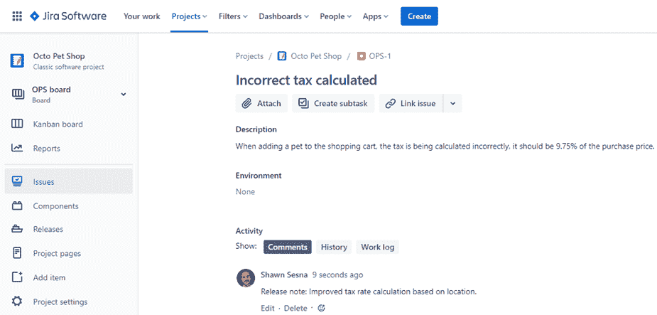
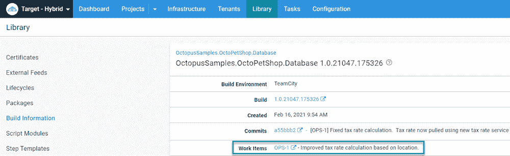
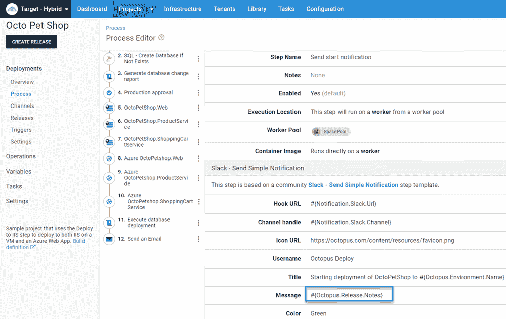
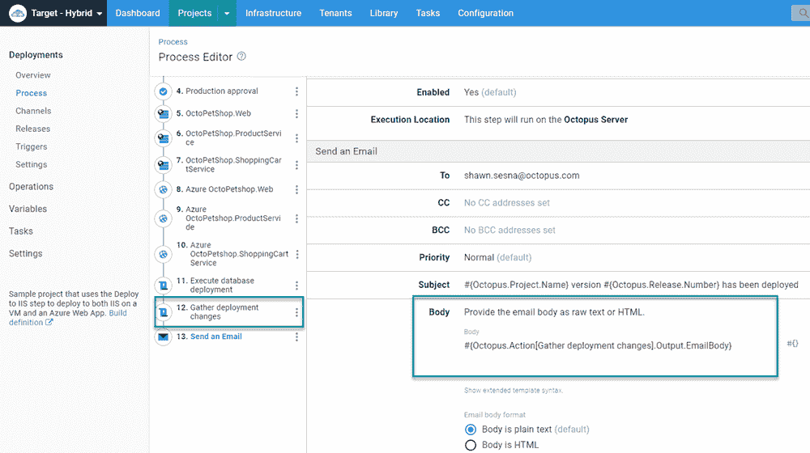
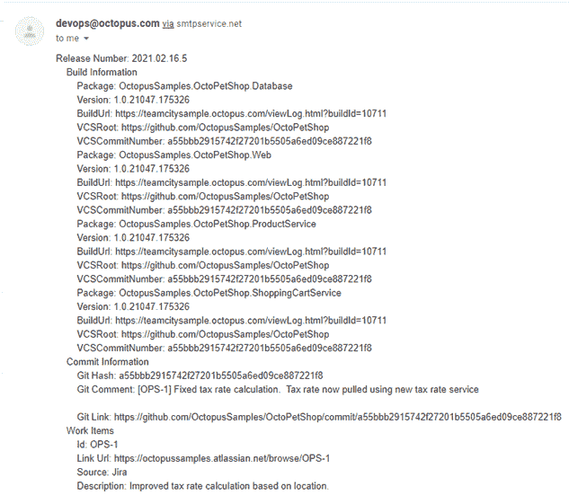

# 使用构建信息实现 CI/CD 管道的可见性——Octopus Deploy

> 原文：<https://octopus.com/blog/build-information-and-your-ci-cd-pipeline>

[](#)

持续集成(CI)通常包括三个部分:

1.  源代码管理服务器
2.  问题跟踪
3.  构建服务器

Azure DevOps 等工具将所有组件组合成一个解决方案，而其他配置将它们分开。例如，您可以使用 GitHub 进行源代码控制，使用 TeamCity 进行构建，使用吉拉进行问题跟踪。当谈到连续交付(CD)时，提交和问题跟踪对于确保部署软件的正确版本是很重要的。使用 Octopus Deploy，您可以将[构建信息](https://octopus.com/docs/packaging-applications/build-servers#build-information)，比如提交和发布，作为您发布的一部分。

值得注意的是，虽然提交在所有情况下都有效，但只有在 Octopus Deploy 中配置了以下集成之一时，问题跟踪才有效:

*   Azure DevOps 问题跟踪
*   GitHub 问题跟踪
*   吉拉一体化

在本文中，我将介绍如何配置 TeamCity 和 Octopus Deploy 以包含构建信息，以及如何在部署过程中使用这些信息。

## 示例场景

在这个演示中，我使用了上面描述的场景:GitHub ( [OctoPetShop](https://github.com/OctopusSamples/OctoPetShop) )、TeamCity 和吉拉。我将介绍这些特定的技术，但是无论您使用哪种工具，整个过程都是相似的。

这篇文章假设你已经知道如何在吉拉创建一个项目。

### 制造一个问题

我们将从在吉拉为 OctoPetShop 应用程序记录一个 bug 开始。

[](#)

创建问题后，我们需要记下`key`值，因为我们需要它来正确标记我们的提交。在这种情况下，值为`OPS-1`。

[](#)

### 将提交与问题关联

如何将提交与问题关联取决于您使用的问题跟踪器。对于吉拉，您的提交消息需要使用以下格式:

```
git commit -m "[key-value] Commit message" 
```

对于我们的例子，我们的提交消息看起来像这样:

```
git commit -m "[OPS-1] Fixed tax rate calculation.  Tax rate now pulled using new tax rate service" 
```

## 配置生成以推送生成信息

Octopus Deploy 提供官方插件来集成以下[构建服务器](https://octopus.com/docs/packaging-applications/build-servers):

*   Azure DevOps
*   团队城市
*   詹金斯
*   竹子

除了可用的插件，还有一些社区支持的与在线构建服务器的集成:

*   切尔莱西
*   GitHub 操作
*   比特桶管道
*   应用程序供应商

在这个演示中，我们使用 TeamCity。

1.  通过选择**Octopus Deploy:Build Information**runner，向构建定义添加一个新步骤。
2.  填写所需的值:

*   **八达通网址**:你的八达通服务器的网址
*   **API 键**:具有推送构建信息权限的 API 键
*   **空间名称**:推送到的空间名称(默认为空)
*   **包 id**:应用构建信息的包列表

[](#)

发布一个构建，我们可以看到我们的变更已经被构建服务器接受了。

[](#)

## 配置问题跟踪集成

如前所述，在 Octopus Deploy 中配置相应的集成之前，构建信息的问题跟踪不会起作用。对于本演示，我们需要配置[吉拉集成](https://octopus.com/docs/releases/issue-tracking/jira)。

1.  导航到 Octopus Deploy 中的**配置**选项卡，点击**设置**。
2.  点击`Jira`，填写所需信息:

*   **吉拉实例类型**:云还是服务器
*   **吉拉基地网址**:吉拉网址
*   **吉拉连接 App 密码**:连接的密码
*   **Octopus 安装 ID** :你在吉拉的 Octopus 部署插件中的 Octopus 安装 ID
*   **八达通服务器 URL** :你的八达通服务器的 URL
*   **启用**:启用集成的复选框

配置好我们的集成后，导航到**库**选项卡并选择**构建信息**。

在这个页面上，我们可以看到 Octopus Deploy 已经为 OctoPetShop 的包上传了构建信息。单击其中一个将显示提交和与之相关的问题。

[](#)

构建信息包含:

*   链接到它来自的版本。
*   提交。
*   它所关联的工作项(问题)。

### 发行说明前缀

你可能已经注意到了，我们还没有讨论**的发布说明前缀**。发行说明前缀提供了一种重写工作项标题的方法。Octopus Deploy 将在工作项的注释中查找我定义为`Release note:`的指定前缀。当它找到带有前缀的注释时，它会用前缀后面的任何文本覆盖工作项的标题。

所有 Octopus 部署问题集成都包含了`Release Note Prefix`特性。

我们这期的标题是`Incorrect tax calculated`，这并不是一个非常有用的发行说明。相反，我们希望它显示为`Improved tax rate calculation based on location.`

为此，我们使用我们定义的前缀向吉拉问题添加一条注释:

[](#)

在 Octopus 中，我们可以看到工作项的标题已经更新为所需的值。

[](#)

## 让每个人都知道

到目前为止，我们已经展示了如何通过 Octopus Deploy Web 门户访问构建信息。然而，并不是组织中每个人都能访问 Octopus Deploy，例如质量保证(QA)团队。Octopus Deploy 有一些内置变量，可以用来共享构建信息。

### 项目发布说明模板

在项目的设置中，你可以定义一个[发布说明模板](https://octopus.com/docs/releases/release-notes#Release-Notes-Templates)。该模板允许您定制与包相关的构建信息的显示。下面是一个示例模板:

```
#{each workItem in Octopus.Release.WorkItems}#{if Octopus.Template.Each.First == "True"}WorkItems:#{/if}
- [#{workItem.Id}](#{workItem.LinkUrl}) - #{workItem.Description}
#{/each}

Packages:
#{each package in Octopus.Release.Package}
- #{package.PackageId} #{package.Version}
#{each commit in package.Commits}
    - [#{commit.CommitId}](#{commit.LinkUrl}) - #{commit.Comment}
#{/each}
#{/each} 
```

`Octopus.Release.Package`变量是*版本说明模板中唯一可用的*。它在部署过程中不可用，例如**运行脚本**步骤。

有了定义的模板，在部署期间可以通过`Octopus.Release.Notes`变量访问发行说明。使用类似 Slack 的东西，您可以在通知消息中包含构建信息。

[](#)

因为每个包都标记了构建信息，所以消息看起来像这样:

[](#)

如果没有发行说明模板(或者手动输入的发行说明)，`Octopus.Release.Notes`变量为空。

### 章鱼。部署.变化

另一种访问构建信息的方法是`Octopus.Deployment.Changes`变量。使用**运行脚本**步骤，您可以迭代修改，构造一条消息并设置一个[输出变量](https://octopus.com/docs/projects/variables/output-variables):

```
$changeListRaw = $OctopusParameters["Octopus.Deployment.Changes"]
$changeList = $changeListRaw | ConvertFrom-Json

foreach ($change in $changeList)
{
    $emailBody = "Release Number: $($change.Version)`r`n"

    $emailBody += "    Build Information`r`n"
    foreach ($buildInformation in $change.BuildInformation)
    {
        $emailBody += "        Package: $($buildInformation.PackageId)`r`n"
        $emailBody += "        Version: $($buildInformation.Version)`r`n"
        $emailBody += "        BuildUrl: $($buildInformation.BuildUrl)`r`n"
        $emailBody += "        VCSRoot: $($buildInformation.VcsRoot)`r`n"
        $emailBody += "        VCSCommitNumber: $($buildInformation.VcsCommitNumber)`r`n"
    }

    $emailBody += "    Commit Information`r`n"
    foreach ($commit in $change.Commits)
    {
        $emailBody += "        Git Hash: $($Commit.Id)`r`n"
        $emailBody += "        Git Comment: $($Commit.Comment)`r`n"
        $emailBody += "        Git Link: $($Commit.LinkUrl)`r`n"
    }

    $emailBody += "    Work Items`r`n"
    foreach ($workItem in $change.WorkItems)
    {
        $emailBody += "        Id: $($WorkItem.Id)`r`n"
        $emailBody += "        Link Url: $($WorkItem.LinkUrl)`r`n"
        $emailBody += "        Source: $($WorkItem.Source)`r`n"
        $emailBody += "        Description: $($WorkItem.Description)`r`n"
    }
}

Set-OctopusVariable -name "EmailBody" -value $emailBody 
```

使用**发送电子邮件**模板，您可以将电子邮件的**正文**设置为输出变量的值。

[](#)

这将允许您向风险承担者发送电子邮件，通知他们部署的进度。

[](#)

## 结论

在 Octopus Deploy 中包含构建信息是一个非常强大的通信工具。我希望这篇文章展示了它在您的 CI/CD 管道中的不同使用方式。

浏览 [DevOps 工程师手册](https://octopus.com/devops/)了解更多关于 DevOps 和 CI/CD 的信息。

愉快的部署！