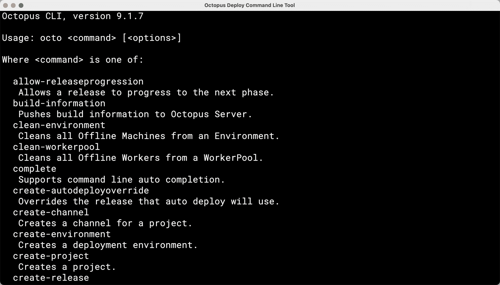
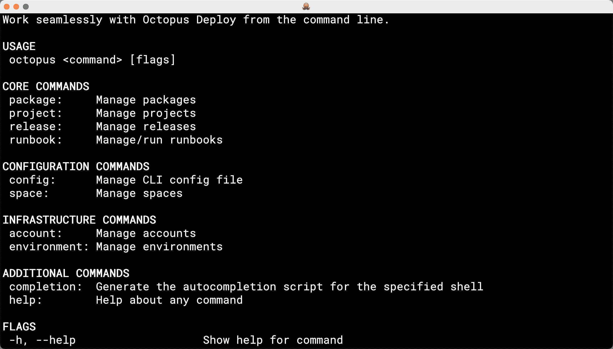

# 构建 Octopus CLI vNext - Octopus Deploy

> 原文：<https://octopus.com/blog/building-octopus-cli-vnext>

Octopus 命令行界面(CLI)多年来为我们提供了很好的服务。然而，它有一些我们想要解决的限制。

在这篇文章中，我分享了我们用 Octopus Deploy 改进 CLI 体验的计划。

## Octopus CLI 的状态(octo)

[Octopus CLI](https://github.com/OctopusDeploy/OctopusCLI) ( `octo`)建立在 C#之上，并且严重依赖[Octopus client](https://github.com/OctopusDeploy/OctopusClients)。NET 库。它提供命令来促进部署和 runbook 执行的自动化。值得注意的命令包括:

*   `build-information`
*   `create-release`
*   `deploy-release`
*   `pack`
*   `push`
*   `run-runbook`

Octopus CLI 仍然是与 [Octopus REST API](https://octopus.com/docs/octopus-rest-api) 交互的最有效方式之一。它使我们的客户能够自动执行重复性任务，同时提供执行一次性命令的灵活性。我们为支持的平台构建和维护的大多数集成，如 Azure DevOps、GitHub Actions 和 TeamCity，都使用它来执行与 [Octopus REST API](https://octopus.com/docs/octopus-rest-api) 一致的操作。

尽管 Octopus CLI 多年来为我们提供了很好的服务，但我们希望解决它的一些局限性:

*   **为自动化而建，而不是为人而建:**当你使用 Octopus CLI 时，你可以看出它主要是作为一个自动化工具而建的。CLI 需要不断发展，以包含以人为本的设计。
*   **命令结构和输出不一致:**Octopus CLI 命令结构不一致是由于这些年来添加的命令。产出不是由总体战略决定的。在命令结构中有一些明显的例外会损害一致性，例如`pack`。此外，这些命令是按操作而不是按目标资源分组的。这损害了整体用户体验，并使命令集的发展变得困难。
*   **运行时依赖:**尽管 Octopus CLI 是一个自包含的可执行文件，但它要求在运行二进制文件之前必须安装平台库(例如，依赖于。Alpine 上的. NET 自包含可执行文件)。这反映在用于各种 Linux 发行版的 Octopus CLI vNext 所需的安装脚本中。
*   **跨平台编译困难:**构建脚本与 Nuke 捆绑在一起，需要 Windows 专用工具(即`SignTool.exe`)，这使得构建跨平台变得困难。例如，参见[问题#124，macOS 构建失败](https://github.com/OctopusDeploy/OctopusCLI/issues/124)。
*   **不支持执行 API:**Octopus CLI(`octo`)不支持这些操作，添加对这些操作的支持需要大量代码路径(有关更多信息，请阅读我们的帖子[使用执行 API 加快部署](https://octopus.com/blog/faster-deployments-with-the-executions-api))
*   **缺乏自助故障排除:**Octopus CLI(`octo`)不支持内置功能，让客户排除网络连接问题等故障(参见[问题#220](https://github.com/OctopusDeploy/OctopusCLI/issues/220) )。

我们纠结于是否继续构建 Octopus CLI 的功能，并加入我们想要做出的改变以推动事情向前发展。经过仔细考虑，我们决定重新开始，不再受 Octopus CLI 10 多年设计决策的约束。这个决定也减轻了更新 Octopus CLI 的挑战，并使我们暴露于现有集成的下游问题。我们希望更有主见，专注于以客户为中心的工作流，我们经常遵从我们的 API。

## 介绍新的八达通 CLI(八达通)

新的 Octopus CLI ( `octopus`)代表了 Octopus CLI 的发展。首先，可用命令的数量将显著增加。新的 Octopus CLI 将支持管理资源的操作，如帐户、生命周期、项目和空间。它还将具有用户交互的新功能——我们是提倡这种功能的[命令行界面指南](https://clig.dev/)的支持者。此功能旨在通过一系列问题来指导用户以最简单的方式执行他们想要的操作:

交互式 CLI 将引导新手和有经验的用户找到他们想要的结果。也就是说，新的 Octopus CLI 将支持自动化作为其主要用例。

新的 Octopus CLI 基于 Go 编程语言。该语言及其支持库非常适合构建 CLI。我们还想利用这个机会改进 Octopus Deploy 的 [Go API 客户端，它是 Octopus Deploy](https://github.com/OctopusDeploy/go-octopusdeploy) 的 [Terraform 提供者的基础。](https://github.com/OctopusDeployLabs/terraform-provider-octopusdeploy)

## 为什么使用 Go 构建 CLI？

Go 是一种高度并发的语言，非常适合构建 CLI。Octopus Deploy 的 [Go API 客户端也是为了支持 Octopus Deploy](https://github.com/OctopusDeploy/go-octopusdeploy) 的 [Terraform Provider 而构建的。它已经通过了考验。](https://github.com/OctopusDeployLabs/terraform-provider-octopusdeploy)

最后，通过基于 C++的多平台支持，Go 有助于减少运行时内存占用。这提供了较小的可执行文件大小和对目标环境的少量要求——这结合起来支持客户希望通过`curl`将 CLI 与 Bash(例如)一起使用的场景。

## 我们需要你的帮助

我们希望构建一个客户喜欢使用的 CLI，因此我们非常感谢您的反馈。我们希望听到您希望我们支持的场景。

[提供反馈](https://octopusdeploy.typeform.com/to/COaNc9A3)

您可以通过 GitHub 上的 [cli 资源库来跟踪我们构建 CLI 的进度。请随时关注或启动存储库进行更新。我们也开始向流行的软件包库如 Chocolatey 和 Homebrew 发布可分发的版本。](https://github.com/OctopusDeploy/cli)

愉快的部署！