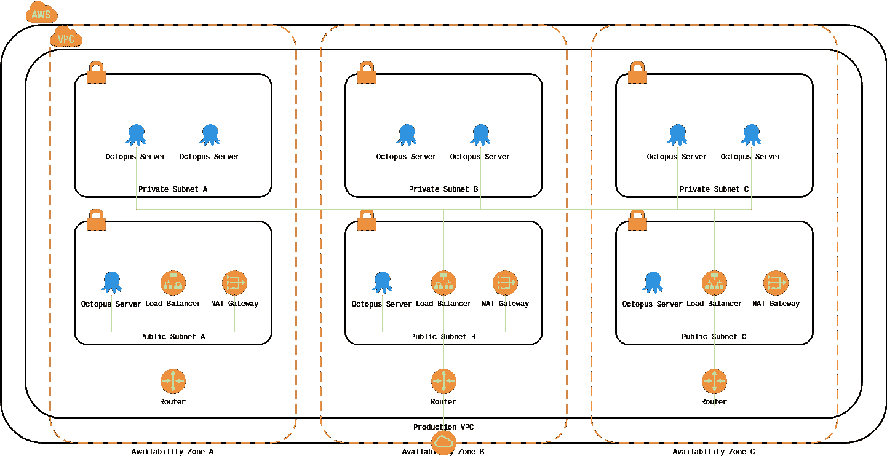

# 在 AWS - Octopus Deploy 中构建 Octopus 云

> 原文：<https://octopus.com/blog/building-the-octopus-cloud-in-aws>

[](#)

## 介绍

在我们开始构建章鱼云平台之前，我们讨论了它应该托管在哪里。我们最终归结为两个选择:亚马逊网络服务(AWS)或微软 Azure。

从那时起，我们选择了 AWS，主要是因为团队中的大多数人都有使用 AWS 服务的经验，而不是因为两家云提供商之间有任何具体的技术差异。

兴奋地开始，我们在 Windows 上使用 Docker 和 Kubernetes 一头扎进了这个项目。这是大约八个月前的事了，虽然我们取得了一些成功，但感觉像是一场持续的艰苦战斗。当时 Windows 上的 Docker 和 Kubernetes 感觉没有 Linux 上的 Docker 和 Kubernetes 成熟，我们也不能用 Linux，因为 Octopus 不是用。网络核心...还没有。

我们不得不做出一个艰难的决定:在花费了大量时间和精力之后继续使用 Docker 和 Kubernetes，或者转向一种更传统的屡试不爽的方法，在这种方法中，每个客户都有自己的 EC2 实例。我们决定暂时使用 EC2 实例。这篇博文中的推理，理解 MVP(最小可行产品)，以及为什么我更喜欢 Henrik Kniberg 的《最早可测试/可用/可爱》,对我们的思维有很大的影响。我们意识到从一开始就试图开发完美的产品对自己要求太高了。

## 建立工作关系网

创建 AWS 帐户后的首要任务之一是删除默认子网和默认 VPC，这样我们就可以创建自己的更大的网络掩码来容纳更多的客户。我们的想法是扩大规模，考虑到这一点，我们将生产 VPC 网络掩码设置为`/16`，将每个子网的网络掩码设置为`/20`。允许我们在每个 VPC 中容纳多达 16 个子网，每个子网容纳 4，091 个 IP 地址，总共提供 65，456 个 IP 地址。

我们的 VPC 和子网的设计基于 AWS 提供的[场景 2:具有公共和私有子网(NAT)的 VPC](https://docs.aws.amazon.com/AmazonVPC/latest/UserGuide/VPC_Scenario2.html)示例，如下所示:

[](#)

非高可用性 Octopus 云服务器分布在我们的公共子网中，并直接暴露于互联网。未来的高可用性 Octopus 云服务器将分布在我们的私有子网中，并通过应用负载平衡器暴露于互联网。

在撰写本文时，Octopus 云服务器可以在俄勒冈州(us-west-2)地区的 t2.medium EC2 实例上提供，但没有高可用性。然而，在不太遥远的将来，悉尼(ap-southeast-2)、伦敦(eu-west-2)和法兰克福(eu-central-1)地区可能会成为可用的，以及将 Octopus 云服务器从一个地区迁移到另一个地区并增加高可用性的能力。

为了创建我们的 VPC 和子网，我们使用了 [Terraform](https://www.terraform.io) ，因为它的配置语法。

> Terraform 使用 HashiCorp 配置语言(HCL ),这意味着在人类可读和可编辑以及机器友好之间取得平衡。

*来源:[地形配置语法](https://www.terraform.io/docs/configuration/syntax.html)*

例如，下面是一个为 VPC 配置公共和私有子网的模板。

```
provider "aws" {
  region  = "us-west-2"
}

resource "aws_vpc" "production" {
  cidr_block           = "10.10.0.0/16"
  instance_tenancy     = "default"
  enable_dns_support   = true
  enable_dns_hostnames = true

  tags {
    Name = "Production VPC"
  }
}

resource "aws_internet_gateway" "production" {
  vpc_id = "${aws_vpc.production.id}"

  tags {
    Name = "Production Internet Gateway"
  }
}

resource "aws_route_table" "public" {
  vpc_id = "${aws_vpc.production.id}"

  route {
    cidr_block = "0.0.0.0/0"
    gateway_id = "${aws_internet_gateway.production.id}"
  }

  tags {
    Name = "Production Subnet (Public A/B/C)"
  }
}

resource "aws_eip" "public_a" {
  vpc = true
}

resource "aws_subnet" "public_a" {
  vpc_id                  = "${aws_vpc.production.id}"
  cidr_block              = "10.10.0.0/20"
  availability_zone       = "us-west-2a"
  map_public_ip_on_launch = true

  tags {
    Name = "Production Subnet (Public A)"
  }
}

resource "aws_route_table_association" "public_a" {
  subnet_id      = "${aws_subnet.public_a.id}"
  route_table_id = "${aws_route_table.public.id}"
}

resource "aws_nat_gateway" "public_a" {
  allocation_id = "${aws_eip.public_a.id}"
  subnet_id     = "${aws_subnet.public_a.id}"

  tags {
    Name = "Production NAT Gateway (Public A)"
  }
}

resource "aws_subnet" "private_a" {
  vpc_id            = "${aws_vpc.production.id}"
  cidr_block        = "10.10.16.0/20"
  availability_zone = "us-west-2a"

  tags {
    Name = "Production Subnet (Private A)"
  }
}

resource "aws_route_table" "private_a" {
  vpc_id = "${aws_vpc.production.id}"

  route {
    cidr_block = "0.0.0.0/0"
    gateway_id = "${aws_nat_gateway.public_a.id}"
  }

  tags {
    Name = "Production Subnet (Private A)"
  }
}

resource "aws_route_table_association" "private_a" {
  subnet_id      = "${aws_subnet.private_a.id}"
  route_table_id = "${aws_route_table.private_a.id}"
} 
```

如果你想将上面的 Terraform 模板与类似的 CloudFormation 模板(YAML)进行比较，AWS 在这里提供了一个例子。

## 安全性

对于章鱼云来说，安全性是最重要的。

我们聘请[失眠安全](https://www.insomniasec.com/)对章鱼云进行渗透和漏洞测试，结果非常积极，没有检测到重大或中度风险。

我们通过允许入站和出站连接所需的最少协议和端口，为生产 VPC 实施了严格的网络访问控制列表(ACL)。对于附属于每个 Octopus 云服务器和防火墙的安全组(SG)也是如此。

我们还禁用了不安全和脆弱的 TLS 密码套件 Octopus 云服务器仅支持 TLS 1.2 和 TLS 1.1，这意味着 Windows XP 等旧客户端和旧浏览器无法访问 UI。

## EC2 实例

之前我提到过，我们目前在 t2.medium EC2 实例上运行 Octopus 云服务器，我认为这对大多数人来说会是一个惊喜。一个 t2.medium EC2 实例有 2 个 vCPUs 和 4GB RAM，并且:

> 与传统的 EC2 实例不同，T2 实例提供了基准级别的 CPU 性能，并且能够在该基准级别之上爆发。基准性能和突发能力由 CPU 信用控制。

*来源: [AWS 用户指南- T2 实例](https://docs.aws.amazon.com/AWSEC2/latest/UserGuide/t2-instances.html)*

t2 .培养基的基线水平是 40%。当 CPU 利用率低于基线水平时，将累积 CPU 信用，当 CPU 利用率高于基线水平时，将消耗 CPU 信用。如果你的 Octopus 云服务器消耗了所有的信用，CPU 将无法超过其基线水平。

在我们的封闭 alpha、封闭 beta 和可用性会议期间，我们发现，在空闲时，Octopus 云服务器使用大约 1%的 CPU 在执行同步部署时，CPU 利用率通常低于基线水平。

在我们的负载测试中，让我们措手不及的是，我们发现:

> T2 标准实例可以获得启动信用的次数是有限制的。默认限制是每个帐户、每个地区、每个连续 24 小时内启动或开始所有 T2 标准实例的次数总和为 100 次。

*来源: [AWS 用户指南- T2 标准](https://docs.aws.amazon.com/AWSEC2/latest/UserGuide/t2-std.html)*

为了解决这个问题，我们在 EC2 实例被提供后查询 CloudWatch，以查看它是在有信用还是没有信用的情况下启动的。如果它启动时没有配额，我们会在 EC2 实例上临时启用 T2 无限制，直到它完成配置。

## 下一步是什么？

允许客户在俄勒冈州(us-west-2)以外的 AWS 地区提供他们的 Octopus 云服务器是我们许多客户的要求。我们根据以下因素调查了哪些地区最有意义:

*   冗余的可用区域的数量，
*   最低的性能延迟。
*   什么能给我们最好的全球覆盖。

我们选择了悉尼(ap-southeast-2)、伦敦(eu-west-2)和法兰克福(eu-central-1)地区，它们将在我们推出章鱼云后不久可用。

在支持其他地区之后，我们还将提供在这些地区之间迁移 Octopus 云服务器的能力。

高可用性也是我们优先考虑的问题，可能会在我们支持悉尼和伦敦地区后推出。

我们在封闭测试版和封闭测试版中注意到，有一小部分客户在创建他们的章鱼云服务器时使用了像`test`、`demo`和`sandbox`这样的词作为他们子域的一部分。这让我们想到了客户想要*更改*他们的子域的场景，这个特性肯定会在不久的将来变得可用。

我们还没有放弃 Docker 和 Kubernetes。我们相信，这些技术将使我们能够更快地供应 Octopus 云服务器，增加额外的安全层，并帮助我们充分利用共同租赁来节省成本。