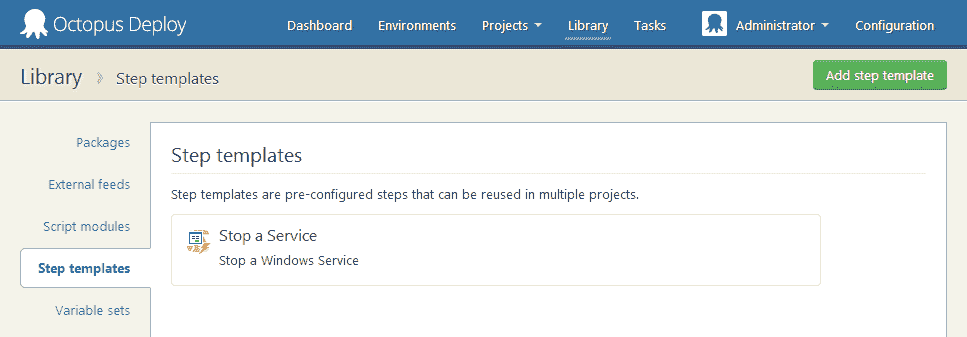
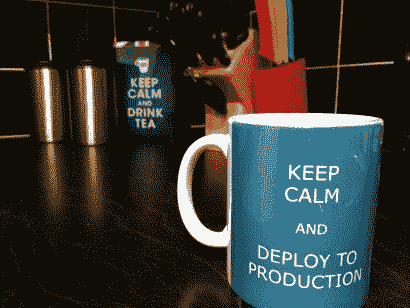

# 比赛:建立章鱼图书馆-章鱼部署

> 原文：<https://octopus.com/blog/build-octopus-library>

正如我上周宣布的，Octopus 2.4 中最酷的新增功能是创建可重用部署步骤的能力，这些步骤可以在项目之间共享。

章鱼 2.4 今天毕业稳定发布，可以从[下载](/downloads)页面获取。这意味着您现在可以开始自己创建和使用步骤模板，以及导出它们与他人共享，或导入他人制作的步骤。

为了更容易地共享 step 模板，我们创建了一个新站点，名为[库](http://library.octopusdeploy.com/#/listing)。在撰写本文时，[包含了 11 个模板，您可以导入到您的 Octopus 2.4+服务器中，并从今天开始使用](http://library.octopusdeploy.com/#/listing)，包括:

*   安装巧克力包
*   使用 Git 推送至 Azure 网站或 AppHarbor
*   运行 SQL 脚本
*   在文件中查找和替换
*   启动和停止 Windows 服务

我对这项功能非常非常兴奋，原因有二:

1.  这意味着我们能够在不改变产品的情况下为产品添加功能
2.  这意味着**你**可以与他人分享你的成果，并从他们的成果中获益

想象一个开放的存储库，其中任何常见的 Windows/。您可能遇到的. NET 部署任务已经编写好脚本，打包好，随时可以使用。这将是一个非常有用的资源。

# 帮助我们收藏图书馆！

我们*喜欢*你的帮助来扩大这个库，并用有用的、可重用的脚本和步骤来填充它。库网站是[的一个 GitHub 库](https://github.com/OctopusDeploy/Library):如果你有一个想法，并能把它变成一个可重用的步骤，只需导出它，并向我们发送拉请求！

如果分享你的剧本还不足以让世界变得更美好，我们将举办一场小小的比赛:

没错:你可以赢得你自己的超级时尚章鱼部署杯！ **:-)** 你所要做的就是提交一个步骤模板的拉请求，如果它被接受，你就可以参加抽奖了。在六月底，我会随机抽取 3 名获奖者，我们会给你邮寄一个杯子。

关于如何贡献你的模板的说明在 GitHub readme 上。快乐脚本！