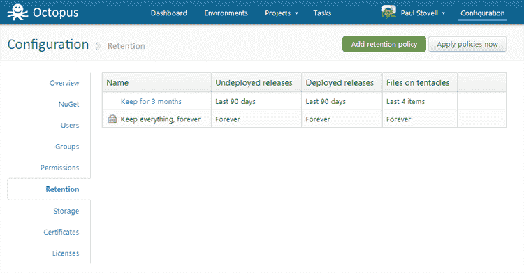
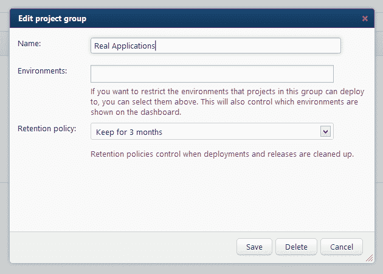
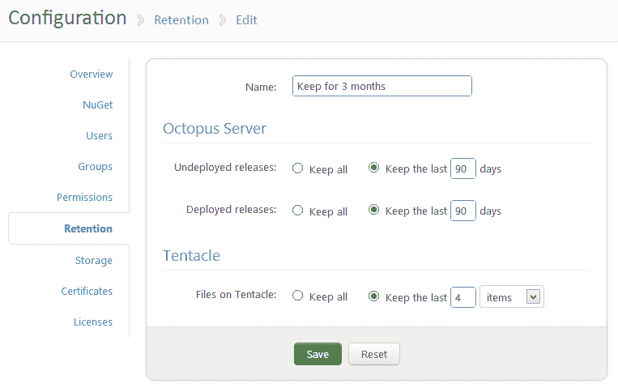
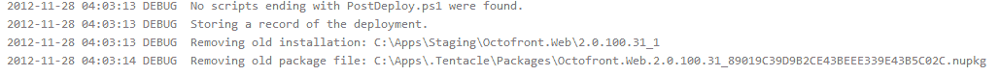
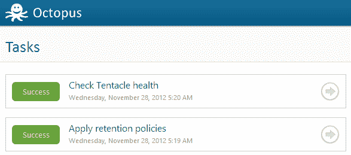
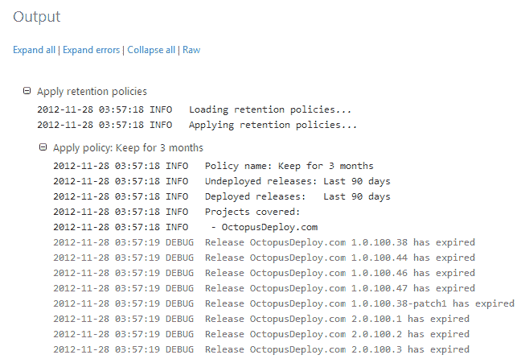

# 八达通 1.2 及保留政策-八达通部署

> 原文：<https://octopus.com/blog/1.2-with-retention-policies>

今天，我发布了[Octopus Deploy 1.2](http://octopusdeploy.com/downloads)，其中包括[我上个月在博客上发布的保留策略功能](http://octopusdeploy.com/blog/retention-policies-rfc)，这也是我们[Trello 板](https://trello.com/board/octopus/4e907de70880ba000079b75c)上投票最高的功能。在这篇文章中，我想演示该功能是如何工作的。

安装 1.2 之后，您将在*配置*区域下找到一个新选项卡，您可以在其中定义保留策略。

保留策略是在项目组级别设置的，这是 Octopus 1.1 中引入的功能。您可以在项目组设置对话框中选择项目组使用的保留策略：

请注意，有一个名为“永远保留所有内容”的默认保留策略。如果删除保留策略，项目组将恢复为此“保留所有内容”策略。

保留策略有三个不同的部分：

当您部署到环境时，Tentacle 选项将生效。在本例中，一旦我将一个包部署到给定的机器上 4 次，该包（.nupkg 及其提取到的目录）也将被删除。

八达通选项按计划运行，很像自动健康检查任务。您可以在“任务”页面上看到输出：

任务的输出会告诉您由于保留策略而删除了哪些发布：

当保留策略任务自动运行时，您也可以从保留策略页面手动运行它。您可能会发现，当您第一次升级到 1.2 时，您必须多次运行该任务，因为索引不会完全更新。

我希望你会发现这个新添加有用。