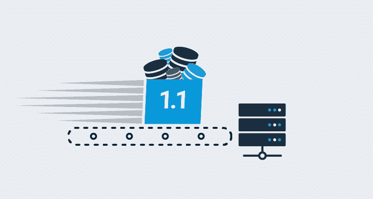
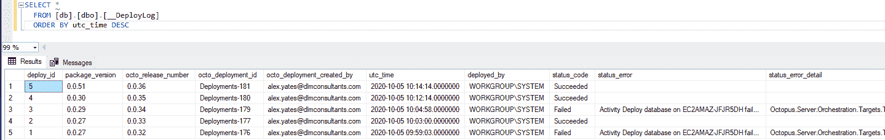
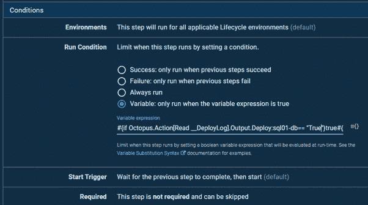
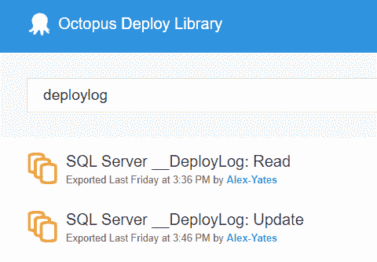
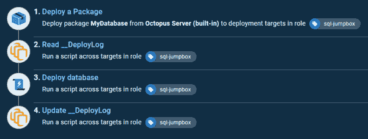
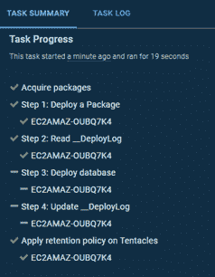

# 数据库部署速度快 100 倍- Octopus 部署

> 原文：<https://octopus.com/blog/100x-faster-db-deploys>

## 在紧耦合系统中跳过不必要的模式比较

[](#)

## 问题:紧密耦合的系统

我经常被问到的一个问题是，一个服务器上的所有数据库是应该放在一个 repo/Octopus 部署项目中，还是应该放在不同的 repo/项目中。另一个相关的问题是数据库和应用程序是否应该进入同一个回购/项目。这些问题没有简单的答案。作为一名顾问，我以“视情况而定”开始我的回答。

接下来，我将询问他们是使用分布式源代码控制系统(git)还是集中式源代码控制系统(TFS、SVN 等)。).了解这一点很重要，这样我才能校准我的答案。Git 通常比一个巨大的整体更适合许多小的 repos，但是对于许多集中式源代码控制系统来说就不一样了。

然后我会问一个更重要的问题:“数据库/应用程序之间的耦合有多紧密？”如果他们要求澄清，我会问这样的问题:

*   数据库之间有多少依赖关系？你有建筑图吗？(我会做梦，不是吗？)
*   数据库可以独立构建吗，还是需要按照一定的顺序一起构建/部署？(我祈祷没有任何循环依赖！)
*   单个工作项可能需要对多个数据库进行更改吗？
*   一个数据库的错误更改会给另一个数据库带来问题吗？
*   如果一个数据库因几个版本而与另一个数据库不同步，会有什么后果？
*   当有人“部署数据库”时，他们通常是指单个数据库，还是可能需要将更改部署到多个数据库？

在理想的世界中，架构应该是松散耦合的。这将允许人们把数据库分割成单独的较小的回购，可以独立管理。粒度越大越好。虽然这可能会强加一些严格的体系结构规则并引入一些局部复杂性，但它将显著降低全局复杂性并降低每个部署的风险。这也可以大大减少与完成工作相关的技术和官僚挑战。

本质上，松散耦合的系统允许人们更加线性地扩展开发工作，而不是扩大开发工作，这将带来天文数字的、通常被低估的管理成本和挑战。扩大开发努力的尝试往往会陷入政治、延迟和问题的泥沼。阅读凤凰计划，大多数人会意识到他们已经为这一现象的经典案例研究工作。

人们可能会说，这很好，但对我没有帮助。我已经有一块巨石了。我没有构建它，也不能快速更改它。也许还有其他原因导致了紧密耦合的系统，这些原因太长或太复杂，无法在这里一一介绍。

在这种情况下，虽然我可能主张采取措施分离系统，但我承认这不太可能是一个快速或廉价的解决方案。与此同时，有效的源代码控制和部署很重要，即使它是一个整体。在这些情况下，最终可能会有巨大的源代码控制 repos 和部署项目，需要协调许多相关部分的部署。

## 症状:整体回购和部署项目

我有几个从事商业智能系统的客户。他们有多达十几个相互读取的数据库。第一个通常负责从各种来源加载原始源数据。这通常是高度规范化的，并针对存储和耐用性进行了优化。接下来是各种中间数据库，在这些数据库中，数据被逐渐清理和转换，直到最终出现在各种数据仓库和数据集市中，这些数据仓库和数据集市为分析进行了优化。

通常，数据库可以按一定的顺序部署。数据仓库从中间数据库读取数据，这些中间数据库从源数据库读取数据。因此，理论上，我们可以首先部署数据源，然后按顺序部署中间数据库，最后部署数据仓库。

然而，现实世界并不总是那么简单。出于各种原因，有一些依赖项不适合该模型，重构它们会非常困难。虽然我们通常可以按照指定的顺序进行部署，但是有些跨数据库的依赖关系有时意味着顺序需要改变，而 Octopus Deploy 项目不够智能，无法提前发现这一点。

一位客户使用了一点黑客手段来解决这个问题。他们部署的最后一步是[Deploy Release](https://octopus.com/docs/projects/coordinating-multiple-projects/deploy-release-step)步骤，如果任何数据库部署步骤由于依赖关系中断而失败，该步骤将重新运行部署。该过程可能会根据数据库的数量重新运行部署(最大重新运行次数由[输出变量](https://octopus.com/docs/projects/variables/output-variables)控制)。只要在每次迭代中至少有一个数据库被成功部署，Octopus 就会一直尝试，直到所有数据库都被部署，因此，如果数据库的部署有任何顺序，Octopus 最终都会找到。很丑但是很管用。

最大的实际问题是这需要多长时间。客户使用基于状态的部署流程。这意味着每次部署数据库时，数据库比较软件(Redgate 或 SSDT)都会执行完整的比较。对于每个数据库，这通常需要一两分钟的时间，但时间会有所不同。对于最大的数据库，可能需要 5 分钟以上。12 个数据库乘以 12 次尝试，通常可以累加起来。

但比那更糟。这个 BI 系统不是一个内部系统，而是我的客户向他们的客户销售的一项服务。他们为每个客户维护一个数据库实例。当他们部署到生产环境时，他们不只是部署一次，而是部署多次，而且通常是在严格的部署窗口内。如果部署时间太长，他们错过了机会，客户会不高兴的。一些客户是批量部署的，而另一些客户有自己独特的合同，需要更复杂、更不频繁的部署。较不频繁的部署会导致较大的部署，这很可能需要多次重新运行。

持续时间、风险和复杂性在多个轴上成倍增长。

团队也受到资源的限制。大量的处理工作被迫通过少数[工人](https://octopus.com/docs/infrastructure/workers)完成，这通常是瓶颈。这是一场完美的风暴。我提到过单片系统真的很可怕吗？

真正令人沮丧的是，虽然我们可能会进行数百次数据库比较，但绝大多数都是浪费时间，因为我们不知道实际上什么都没有改变。即使部署第一次成功，也可能只有一两个数据库被更新，但是所有的数据库都会按顺序进行比较。只需一两分钟的部署可能需要几个小时。

## 如何治疗这些症状

有一种观点认为，即使没有任何变化，进行比较仍然是有价值的。它保护你不受漂移的影响。通过强制每次都从源代码控制中重新部署所有数据库，它确保了源代码控制的真实性，并减少了由于生产中的意外变化而导致失败的机会。

总的来说，我同意这个原则，但是对于我的客户来说，进行所有这些比较的成本让他们不堪重负。如果在第一次尝试中就已经成功部署了数据库，那么在第二次或第三次尝试中重新部署数据库也是非常困难的。虽然重新部署所有数据库可能是有价值的，但是短时间的部署也是有价值的，所以最终，人们需要做出权衡。

我向我的客户建议，他们应该设计他们的部署过程，以便只在软件包编号增加时才部署数据库。这意味着两件事:

1.  我们需要改变构建过程，以确保新的 NuGet 包只在 DB 模式实际发生变化时才被创建。(所有数据库都在一个 git 回购中。构建过程最初为每次提交构建并打包所有数据库，验证所有依赖关系。然而，这导致了非常长的构建时间(1 小时以上)。只构建已经更新的数据库并不像您想象的那样简单，因为由于依赖关系，当两个数据库同时更新时，它们需要以正确的顺序构建。我去年在我的个人博客上写了更多关于我们如何解决这个问题的内容:[http://workingwithdevs . com/azure-devo PS-services-API-powershell-hosted-build-agents/](http://workingwithdevs.com/azure-devops-services-api-powershell-hosted-build-agents/)。
2.  我们需要改变我们的部署过程来识别当前的包是否已经被部署。这也比你想象的要难，我很感谢 Bob Walker 花时间与我讨论各种选项和陷阱。在这篇博文的剩余部分，我将重点关注这一部分。

起初，我低估了这项任务的复杂性。我打算用章鱼。触手. previous installation . package version[系统变量](https://octopus.com/docs/projects/variables/system-variables)确定之前部署的包。我可以编写一个简单的 PowerShell 脚本来比较以前的包号和当前的包号，如果它们相同，我可以跳过部署。

然而，这是有问题的。如果之前的部署失败了怎么办？如果已经将包部署到了触手上，但是后续的数据库模式比较步骤(从包中读取文件)还没有执行，该怎么办？如果我在池中的一个工人上运行任务会怎么样？如果我在一个动态工作者上运行这个会怎么样？在我意识到这一点之前，我进行了比我最初预期的更多的 API 调用，代码开始看起来复杂得令人恼火。

经过一番思考，我决定从[基于迁移的部署工具](http://workingwithdevs.com/delivering-databases-migrations-vs-state/)那里借用一个技巧。我在每个目标数据库上创建了 __DeployLog 表。在每次部署之后，我都将包和版本号记录到该表中，同时记录时间戳、用户 ID、部署状态和任何错误消息。

由于以前部署的数据现在安全地存储在数据库本身上，所以可以用几个快速的 SQL 命令来完成所有长的数据库部署步骤，以验证当前版本中的包是否已经部署到目标数据库。这些额外的查询会稍微增加部署的总持续时间，但是每个跳过的部署都会显著减少总部署时间。因此，对于具有许多基于状态的数据库部署步骤的项目，最终结果可能是大大减少部署时间。对于我的客户来说，这将常规部署时间减少了大约 10 倍，并且由于重新运行问题，最具挑战性的部署减少了大约 100 倍。

结果是，团队可以多次尝试部署，中间有足够的时间来调查任何问题，而不是因为一次漫长的部署尝试而错过生产部署窗口。在开发和测试领域，生产力得到了巨大的提升。开发人员可以在测试服务器上运行部署，并在几分钟内看到结果，而不是几个小时。除了显著改善开发人员的反馈循环之外，它还显著减少了共享环境中的资源占用问题。

最重要的是，事实证明 __DeployLog 表很受内部和客户操作人员的欢迎，他们在数据库中有一个简洁可靠的审计日志。

[](#)

## 代码

要在您自己的部署项目中做同样的事情，您需要在流程开始时使用类似这样的代码来读取 __DeployLog，以确定是否有必要部署数据库。您可以将它作为每个数据库的单独部署步骤运行，也可以将其添加到部署数据库的现有脚本的顶部。

注意，在脚本的顶部，有几个变量需要声明。这个任务留给了用户。如果可以的话，我推荐使用 [Octopus 变量](https://octopus.com/docs/projects/variables)，而不是将值硬编码到脚本中。

还要注意最后一行:

```
Set-OctopusVariable -name "Deploy:$DLM_ServerInstance-$DLM_Database" -value $deployRequired 
```

这段代码假设脚本作为一个独立于现有数据库部署步骤的部署步骤运行，并设置一个[输出变量](https://octopus.com/docs/projects/variables/output-variables)，该变量决定是否应该执行数据库部署步骤。

如果您将此作为一个单独的步骤运行，则不需要修改此代码。但是，如果您已经将代码复制到了现有数据库部署脚本的顶部，那么您会希望删除上面的行，而将数据库代码移动到如下所示的 if 语句中:

```
If ($deployRequired){
  # put your existing db deploy code here
}
Else {
  Write-Output “Skipping database deployment.”
} 
```

假设您已经创建了一个单独的步骤来读取 __DeployLog，那么您现有的数据库部署步骤应该更新为使用下面的[变量表达式](https://octopus.com/docs/projects/variables/variable-substitutions#VariableSubstitutionSyntax-Conditionalsconditionals)作为[运行条件](https://octopus.com/docs/deployment-process/conditions)。这会读取输出变量，并使用它来决定是否执行数据库部署:

```
#{if Octopus.Action[Read \__DeployLog].Output.Deploy:sql01-db== "True"}true#{/if} 
```

[](#)

记住用您自己的 SQL Server 实例和数据库名称替换“sql01”和“db”。

在您的数据库部署之后，您需要添加以下脚本来用包号和部署状态更新 __DeployLog。如果您只是将代码复制到数据库部署脚本中，那么您会希望将其包装到相同的 If 条件中。如果您将它作为一个单独的步骤运行，您将希望使用与上面相同的运行条件。除非实际执行了数据库部署，否则不希望更新 __DeployLog。

最后，为了使这一切尽可能简单，我刚刚向社区图书馆发布了几个 Octopus 部署步骤模板:

[](#)

最终的过程可能如下所示:

[](#)

现在，如果软件包编号自上次成功部署后没有更改，则不会重新部署:

[](#)

## 处理潜在问题

我充分意识到这篇博文只是治标不治本。而且有副作用要注意。

数据库漂移可能会持续更长时间才被发现，这并不理想。也有可能一些依赖关系会被破坏，因为我们不会定期重建/部署所有的数据库。考虑在一些测试或试运行环境中运行完整的构建和端到端的部署和集成测试是有益的，也许是每晚一次，以确保没有遗漏任何依赖项。

还有不直观的问题。由于这是一种有点不寻常和复杂的处理部署的方式，所以维护这个过程会有更大的认知和操作成本。这增加了误解的可能性，从而可能导致问题。

然而，这里真正的问题是数据库与循环依赖紧密耦合。这是一个更难解决、更昂贵的问题，我不确定我能通过一篇博文解决这个问题。

话又说回来，我不相信任何一个读到这篇文章的人都有一个完美的系统。对我们大多数人来说，这是一种权衡、错误和“这在当时看来是个好主意”的过程。对于那些只是试图保持服务器运行，而没有支持或投资来“正常运行”的人，我向你们致敬，我希望这是有用的。

* * *

自 2010 年以来，Alex Yates 一直在帮助组织将 DevOps 原则应用于他们的数据。他最引以为豪的是帮助 Skyscanner 开发了一天 95 次部署的能力，并支持联合国项目服务办公室的发布流程。亚历克斯与除南极洲以外的各大洲的客户都有过合作——所以他渴望见到任何研究企鹅的人。

作为一名热心的社区成员，他共同组织了[数据接力](https://datarelay.co.uk/)，是【www.SpeakingMentors.com】的创始人，并自 2017 年以来被公认为[微软数据平台 MVP](https://mvp.microsoft.com/en-us/PublicProfile/5002655?fullName=Alex%20Yates) 。

Alex 是官方 Octopus Deploy 合作伙伴 [DLM 顾问](https://dlmconsultants.com/)的创始人。他喜欢为那些希望通过改进 IT 和数据库交付实践来实现更好业务成果的客户提供指导、辅导、培训和咨询。

如果你想和亚历克斯一起工作，请发电子邮件:[enquiries@dlmconsultants.com](mailto:enquiries@dlmconsultants.com)