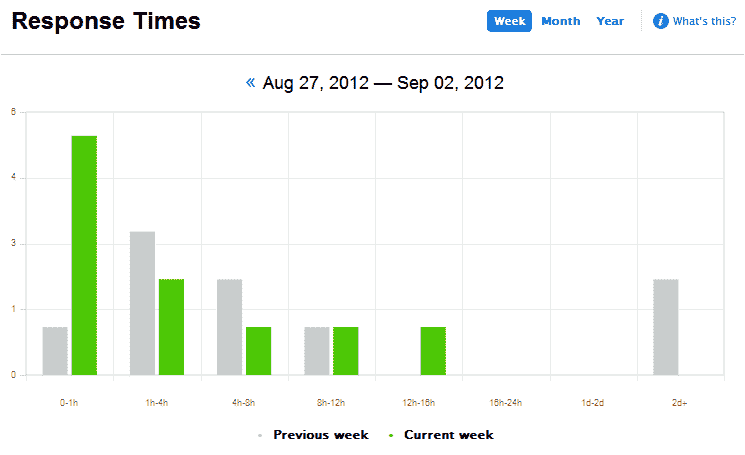
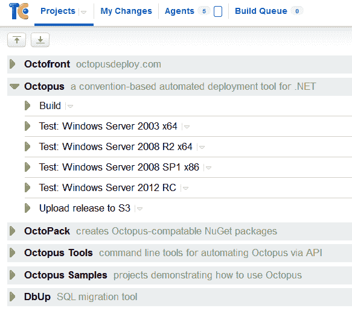

# 八达通部署有限公司背后的服务

> 原文：<https://octopus.com/blog/business/services-behind-octopus>

Octopus Deploy 是一家小型且相对简单的软件初创公司，没有员工(目前还没有！)即便如此，**仍有数量惊人的服务**来维持它的运行。在这篇文章中，我将介绍 Octopus 所依赖的关键服务。

## 在线状态

[OctopusDeploy.com](http://octopusdeploy.com)网站使用一个定制的小型 CMS 来管理[主页](http://octopusdeploy.com/)，这个[博客](http://octopusdeploy.com/blog)，[文档](http://octopusdeploy.com/documentation)，等等。几个月前的一个周末，我与 ASP.NET MVC 4 和 RavenDB 一起黑了它，它运行得很好。我已经公开了 GitHub 库，但是我不小心签入了一些 API 密钥等等。，因此我需要在共享之前清理历史记录。评论由 [Disqus](http://disqus.com/) 提供，这使得 CMS 引擎非常简单。

该网站托管在弗吉尼亚数据中心两个可用区域中的两台亚马逊 EC2 机器上(这两台服务器不是为了性能，而是为了几个月前由于 EC2 中断导致网站[离线后的可靠性)。RavenDB 数据库托管在](http://www.techradar.com/news/web/internet/amazon-ec2-outage-takes-down-netflix-instagram-and-pinterest-1087602) [RavenHQ](https://www.ravenhq.com/) 的一个复制实例中。有一天，我会将 RavenDB 数据库移到 EC2 实例中，以使数据更接近，但现在由 RavenHQ 为我处理备份还是不错的。图片和[下载](http://octopusdeploy.com/downloads)由亚马逊 S3 托管，启用了 CloudFront CDN。亚马逊 Route 53 是 DNS 服务器。

为了支持，我使用[招标](http://tenderapp.com/)，在 help.octopusdeploy.com。大部分支持都是通过招标完成的，尽管人们也可以直接给 support@octopudeploy.com 的 T4 发邮件或者在 Jabbr 上聊天。我认为支持的渠道越多越好。

我在标书中关注的一个关键指标是支持请求的响应时间。它们往往因时区(因为请求可能在我上床睡觉时发布)或难度(有些需要研究)而异。尽管现在有超过 250 个安装的 Octopus 在使用，但是支持并没有像我想象的那样占用那么多时间。我每天会收到 4-5 个问题，但大多数都很容易解决。我的目标是在 24 小时内回复所有请求。

当客户购买 Octopus 的许可证时，购买页面由 [FastSpring](http://www.fastspring.com/) 托管，然后由他们处理交易、申请增值税等等。购买页面使用定制的 HTML/CSS(由 FastSpring 服务器托管)来保持与主 Octopus Deploy 网站一致的外观。购买后，FastSpring 调用我们的 Amazon EC2 实例上托管的 REST API 来生成 XML 许可证密钥，该密钥包含在发送给客户的电子邮件中。

我无法告诉你我有多喜欢 FastSpring。虽然他们的主网站看起来并不令人印象深刻，但他们的管理系统非常棒，而且他们以一种非常简单的方式支持如此多的功能。他们声称有很大的支持，这在我的经历中也是真实的。在 FastSpring 之前，我使用的是 SWReg...不太好。

为了让客户了解路线图，我使用了一个[公共 Trello 板](https://trello.com/board/octopus/4e907de70880ba000079b75c)。虽然大多数公司公开了他们的 bug 追踪器，但他们通常对功能保持沉默。对于该产品的未来版本，有一些“巨大的、巨大的、绝密的”想法不在列表中(主要是因为它们需要更多的思考)，但在很大程度上，我看不出公开即将推出的功能有什么坏处，我认为更多的公司应该这样做。对于功能建议，我们也有一个[用户之声](http://octopusdeploy.uservoice.com)网站。

最后，我已经开始使用 [Google AdWords](http://adwords.google.com) 来帮助提高产品的知名度。我仍然是 Adwords 的新手，我认为我还没有完全正确地使用它，但它现在负责这个网站大约 70%的流量。我在几个广告组中有大约十几个不同的广告，以及大约 30 美元/天的自动预算。大部分流量来自展示网；很少来自搜索广告(尽管很多来自有机搜索)。

## 发展

微软的 BizSpark 计划在为我使用的微软产品提供 MSDN 许可证方面很有帮助。我肯定在 BizSpark 还有其他优势，但我还没有真正花时间去搞清楚它们是什么。虽然 Octopus Deploy Ltd .是一家英国有限公司，但我实际上参加了澳大利亚 BizSpark 计划，因为那是我创业时的基地。

对于源代码，我为 Octopus Deploy 建立了一个 [GitHub 组织，它不仅托管开源项目，还拥有 Octopus Deploy 主要产品源代码的私有存储库、这个网站和其他私有代码存储库。事实上，当客户购买 Octopus Deploy 的源代码许可证时，他们会被邀请访问私有的 GitHub 库。虽然许多软件公司提供源代码许可证，但我认为访问 GitHub 库会使定制和合并变得更加容易。](https://github.com/OctopusDeploy)

对于自动化构建，我使用 JetBrains 的 [TeamCity。虽然我使用免费的专业版许可证，但我不得不购买两个额外的构建代理许可证。这是因为 Octopus Deploy 在](http://www.jetbrains.com/teamcity/)[许多不同版本的 Windows](http://octopusdeploy.com/documentation/install/octopus) 上运行，所以我需要在不同的配置上运行集成测试，以发现任何兼容性错误。不同的测试配置如下:

Octopus Deploy 网站是使用...你猜对了...章鱼展开！每次公开发布之前，我都会在内部的 Octopus 服务器上安装发布候选，升级触手，然后重新部署公开网站。除了集成测试，这给了我信心，在发布中没有大的问题。

这些开发服务器(TeamCity 服务器、5 个构建代理和 Octopus 服务器)都托管在一个由 [LeaseWeb](http://www.leaseweb.com/en) 托管的 Hyper-V 服务器上。虽然不如托管在 EC2 上可靠(因为只有一台没有灾难恢复的服务器)，但这要便宜得多，并且为我的操作系统配置提供了更多选择(例如，我运行了一段时间 Windows Server 2012 beta 服务器)。而且它们不是关键任务——如果我不得不花一两天的时间配置和重新配置一个新的构建/部署服务器，这不会是一个大问题。

Octopus Deploy 的安装程序使用 [WiX](http://wix.sourceforge.net/) 构建，代码和 MSI 使用 VeriSign 的[代码签名证书进行签名。](http://www.verisign.co.uk/code-signing/index.html)

为了监控 OctopusDeploy.com 网站，我使用了几种不同的服务。当然，[谷歌分析](http://www.google.com/analytics/)起了很大的作用，我很幸运地得到了才华横溢的[阿利斯泰尔·拉蒂摩尔](https://plus.google.com/106121478996830875790/posts "Alistair Lattimore on G+")的帮助来优化网站和理解分析结果。 [Pingdom](http://www.pingdom.com/) 给了我一个正常运行时间和停机时间通知的图表。[Appfail.net](http://appfail.net/)与网站整合，通过电子邮件向我报告任何异常，并提供一个漂亮的错误图表。

## 日常重复性的电子邮件、新闻、摘要等的处理工作

我有一个 [Office 365](http://www.microsoft.com/en-gb/office365/online-software.aspx) 订阅，它提供了`@octopusdeploy.com`域的电子邮件以及我的个人电子邮件。像`sales@octopusdeploy.com`和`support@octopusdeploy.com`这样的邮箱被设置为分发列表。对于发布公告和产品更新，我使用 [MailChimp](http://www.mailchimp.com) (订阅[此处](http://eepurl.com/ft5-o "Subscribe to the Octopus mailing list"))。

使用 [Xero](http://www.xero.com/) 对业务进行记账。Xero 可能是我在这一整页中最喜欢的服务(FastSpring 排名第二)，这说明了很多，因为它是一个会计系统。我确实有会计师([丹尼斯&特恩布尔](http://www.dennisandturnbull.com/))来帮助我准备申报表，但是我喜欢自己做大部分的会计和增值税申报表。每个人都抱怨记账，但对我来说，一个月只需要几个小时，用 Xero 还挺享受的。

八达通是增值税注册的，但这主要是因为我在全职工作之前做的合同。Xero 对准备增值税申报非常有帮助。由于 FastSpring 充当记录的[供应商，这意味着他们收取增值税(如果适用)并支付增值税-我的增值税申报表不包括八达通销售的增值税。我曾经和一些人交谈过，他们似乎认为使用像 FastSpring 这样的第三方来处理销售意味着他们将支付两次增值税，这是不正确的。](https://support.fastspring.com/entries/20285288-can-i-redirect-to-my-site-when-an-order-is-completed)

我要推荐的最后一个网站是 HMRC 网站。这需要一段时间来设置(你必须注册每项服务，他们会发布一个激活码，你激活)，但这意味着我可以在线登录，查看该企业必须支付的每项不同税收的到期金额。那很有用。

## 摘要

嗯，这是一个很长的列表。如您所见，即使对于像 Octopus Deploy 这样的小型企业，也有许多服务协同工作，以使一切顺利运行。有些需要实时投资来设置，而有些只需要五分钟。有些很有趣，如果不是关键任务的话，而其他的我不能没有。养大一个初创企业绝对需要一个村子！

未来会怎样？目前，为了找到我的客户的信息，我依赖于电子邮件历史记录和上述服务，如 FastSpring/Tender 来存储详细信息——将其纳入一个单一的(基本的)CRM 系统可能会变得更加重要。如果你有给我的建议，请在下面的框中留言。