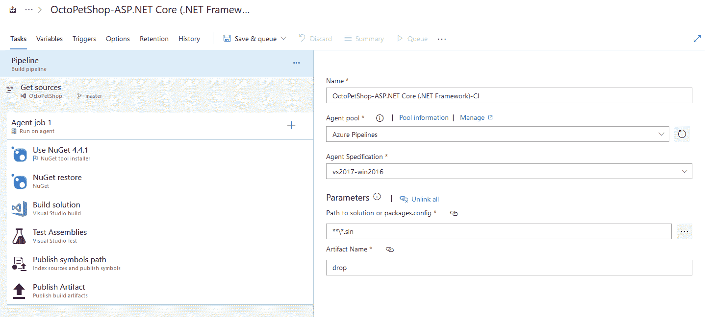
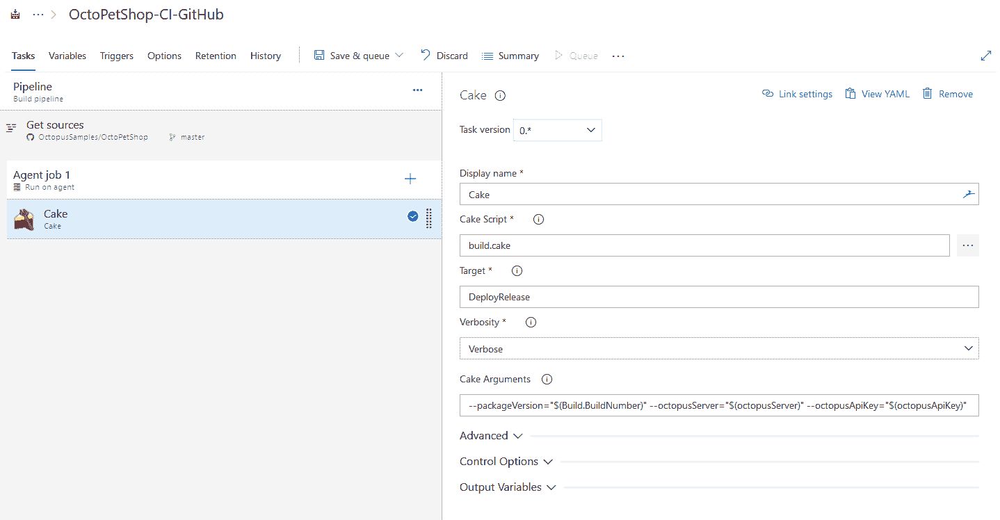

# 使用蛋糕构建脚本为您的。NET 核心 web 应用程序- Octopus 部署

> 原文：<https://octopus.com/blog/cake-build-scripts>

[](#)

Cake 是一个为。NET 开发人员使用 C#领域特定语言(DSL)编写构建过程的脚本。在本文中，我们将通过一个具体的工作示例来探索 Cake 的好处及其主要特性，以实现灵活、可维护、自动化的构建过程。

您可能在过去听说过 Make 和 makefiles，但是如果您没有听说过也不用担心，因为您就要知道了。Make 是一个构建自动化工具，而 makefile 是一个包含 Make 构建应用程序所需的指令的文件。它还可以用来运行相关的任务，比如清理构建目录。

随着开发人员希望使用他们喜欢的语言来定义他们的构建过程，这些年来出现了许多 Make 的变体。Rake (Ruby Make)和 Ruby on Rails 一起变得非常流行。

在。NET 世界中，根据您选择的语言，您有几个选项。有[PSake](https://github.com/psake/psake)(PowerShell)[山寨](https://fake.build/) (F#)，还有[蛋糕](https://cakebuild.net/) (C#)。我们今天主要讨论蛋糕，但是如果你想用 PowerShell 或者 F#编写脚本，可以看看其他的。

## 蛋糕的好处

使用 Cake 的主要好处之一是您的构建脚本将使用 C# DSL 编写。您的团队可以使用他们最熟悉的语言来自动化他们的构建，而不是使用 XML、JSON 或 YAML。

另一个不容忽视的好处是能够在本地和 CI 服务器上执行 Cake 脚本。想一想。除非您的构建代理存在任何环境问题，否则相同的 Cake 脚本将在您的机器、团队成员的机器和 CI 服务器上运行。您的 CI 项目配置可以简化为:

1.  从源代码管理中签出。
2.  运行这个蛋糕脚本。

说到源代码控制，您的 Cake 脚本位于您的项目存储库中。您的构建过程是版本化的，并且可以使用与您的应用程序代码相同的代码评审过程进行更改和评审。提交您的脚本还将您的应用程序代码与构建过程结合起来，因此您不必在 CI 服务器中单独更改构建步骤。应用程序和构建脚本的这种链接是 YAML 成为构建管道建模的流行选择的原因之一。Cake 还有一个额外的好处，就是可以在您的机器上运行这些构建步骤。

Cake 通过[社区贡献的插件](https://cakebuild.net/extensions/)内置了对许多工具(包括 Octopus Deploy)和许多其他工具的支持。您用于构建的工具很有可能是受支持的，如果不支持，您可以创建一个外接程序在脚本中使用。

## 蛋糕脚本示例

我们的示例项目 OctoPetShop 有一个[完整的蛋糕脚本示例](https://github.com/OctopusSamples/OctoPetShop/blob/a9254521a67db6364ff4ac888fa56873ae07f7c8/build.cake),我们将在本文中探讨。该链接指向撰写本文时使用的版本。如果您想查看最新版本，您可以查看[此链接](https://github.com/OctopusSamples/OctoPetShop/blob/master/build.cake)。

Cake 脚本的第一部分导入您在构建过程中使用的任何外部工具、插件或模块。在我们的例子中，我们添加了一个#tool 指令，并指定我们需要 NuGet 的 OctopusTools 版本 6.13.1。然后我们为`Cake.Common.Tools.OctopusDeploy`名称空间添加了一个`using`语句:

```
#tool "nuget:?package=OctopusTools&version=6.13.1"

using Cake.Common.Tools.OctopusDeploy; 
```

到目前为止，我们在这个脚本中只使用了 Octopus Deploy 工具，但是 Cake 内置了对许多工具的支持，包括 NuGet、测试框架等等。

### 参数和全局变量

在下一节中，我们将设置一些在脚本执行期间使用的参数和变量。

有了`Argument`别名，Cake 会给你一个从命令行提供的参数值或者你指定的默认值。我们有要运行的目标任务的参数、要使用的构建配置、用于版本控制的版本和预发布标签，以及与 Octopus 服务器集成的信息。

之后，我们有一个简单的类来收集关于我们项目的信息和一些变量，我们将在`Setup`中填充它们:

```
var target = Argument("target", "Default");
var configuration = Argument("configuration", "Release");
var version = Argument("packageVersion", "0.0.1");
var prerelease = Argument("prerelease", "");
var databaseRuntime = Argument("databaseRuntime", "win-x64");
var octopusServer = Argument("octopusServer", "https://your.octopus.server");
var octopusApiKey = Argument("octopusApiKey", "hey, don't commit your API key");

class ProjectInformation
{
    public string Name { get; set; }
    public string FullPath { get; set; }
    public string Runtime { get; set; }
    public bool IsTestProject { get; set; }
}

string packageVersion;
List<ProjectInformation> projects; 
```

### 设置

让我们来看看那个`Setup`方法。

我们检查是否在本地运行构建，如果是，并且没有提供预发布标签，我们将预发布标签设置为"-local。"

然后我们设置我们的全局变量`packageVersion`和`projects`:

```
Setup(context =>
{
    if (BuildSystem.IsLocalBuild && string.IsNullOrEmpty(prerelease))
    {
        prerelease = "-local";
    }

    packageVersion = $"{version}{prerelease}";

    projects = GetFiles("./**/*.csproj").Select(p => new ProjectInformation
    {
        Name = p.GetFilenameWithoutExtension().ToString(),
        FullPath = p.GetDirectory().FullPath,
        Runtime = p.GetFilenameWithoutExtension().ToString() == "OctopusSamples.OctoPetShop.Database" ? databaseRuntime : null,
        IsTestProject = p.GetFilenameWithoutExtension().ToString().EndsWith(".Tests")
    }).ToList();

    Information("Building OctoPetShop v{0}", packageVersion);
}); 
```

### 任务

任务定义您的构建过程。它们类似于传统持续集成(CI)项目或管道中的构建步骤。

让我们来看看我们的第一个任务，`Clean`。我们用`Task`方法定义它，并提供一个名称。然后我们使用`Does`方法来定义这个任务做什么。在这种情况下，我们清理我们的发布和打包目录，然后为我们的项目调用`DotNetCoreClean`:

```
Task("Clean")
    .Does(() =>
        {
            CleanDirectory("publish");
            CleanDirectory("package");

            var cleanSettings = new DotNetCoreCleanSettings { Configuration = configuration };

            foreach(var project in projects)
            {
                DotNetCoreClean(project.FullPath, cleanSettings);
            }
        }); 
```

### 属国

让我们直接跳到`Build`任务。看起来和`Clean`差不多，但是多了一个新棋子:`IsDependentOn`。这个方法让我们在任务之间创建一个依赖链。当我们调用`Build`任务时，Cake 将确保`Clean`和`Restore`都被首先调用:

```
Task("Build")
    .IsDependentOn("Clean")
    .IsDependentOn("Restore")
    .Does(() =>
    {
        foreach(var project in projects)
        {
            var buildSettings = new DotNetCoreBuildSettings()
                {
                    Configuration = configuration,
                    NoRestore = true
                };

            if (!string.IsNullOrEmpty(project.Runtime))
            {
                buildSettings.Runtime = project.Runtime;
            }

            DotNetCoreBuild(project.FullPath, buildSettings);
        }
    }); 
```

我们还有另一个名为`RunUnitTests`的任务，它依赖于`Build`。运行`RunUnitTests`任务将触发`Clean`、`Restore`和`Build`:

```
Task("RunUnitTests")
    .IsDependentOn("Build")
    .Does(() =>
    {
        foreach(var project in projects.Where(p => p.IsTestProject))
        {
            DotNetCoreTest(project.FullPath, new DotNetCoreTestSettings { Configuration = configuration });
        }
    }); 
```

如果您继续通读脚本，您将看到发布应用程序、使用 Octopus 工具打包应用程序、将包推送到 Octopus 以及使用 Octopus 创建和部署发行版的任务。

最后，我们在剧本的结尾有这些台词。这创建了一个`Default`任务，它将运行`RunUnitTests`任务及其依赖项。

调用`RunTarget`方法的最后一行代码启动了构建过程。这里我们传入由用户、CI 服务器提供的全局变量`target`，或者默认为名为`Default`的任务:

```
Task("Default")
    .IsDependentOn("RunUnitTests");

RunTarget(target); 
```

## 在本地执行蛋糕

Cake 提供了一个 [PowerShell 或 Shell 引导脚本](https://cakebuild.net/docs/tutorials/setting-up-a-new-project)，您可以使用它来执行您的 Cake 脚本:

```
.\build.ps1 -Target Pack -ScriptArgs '--packageVersion=1.2.3 --prerelease=-dev' 
```

就是这样！脚本启动了，在短暂的等待之后，我们在本地构建了 NuGet 包，并得到了这个方便的报告:

```
Task                          Duration
--------------------------------------------------
Setup                         00:00:00.1432566
Clean                         00:00:05.4768163
Restore                       00:00:06.1162465
Build                         00:00:09.6114684
RunUnitTests                  00:00:04.3110846
Publish                       00:00:06.9924016
Pack                          00:00:12.7274733
--------------------------------------------------
Total:                        00:00:45.3787473 
```

我们可以将这些包直接上传到我们的 Octopus 服务器，或者提交我们的更改，因为我们知道我们的构建是有效的。

还有针对 Visual Studio 和 Visual Studio 代码的扩展，这些扩展提供了智能感知、语法突出显示以及从 ide 运行脚本的能力。

## 从 CI 服务器执行 Cake

现在我们有了本地运行的 Cake 脚本，我们可以把它带到 CI 服务器上。在这个例子中，我们使用 Azure DevOps，它有一个运行 Cake 脚本的扩展。

下面是创建新的 ASP.NET 核心构建管道时生成的步骤片段。这与我们在蛋糕脚本中创建的步骤非常相似。

[](#)

在安装了蛋糕扩展后，我们可以在构建中添加蛋糕步骤，在这种情况下，这是我们需要的唯一步骤。我们提供了蛋糕脚本的路径，我们想要运行的目标，以及一些版本号和章鱼服务器信息的附加参数。

[](#)

运行构建后，我们不仅可以在日志中获得蛋糕脚本的完整输出，还可以像在本地运行时一样获得任务摘要:

```
Task                          Duration
--------------------------------------------------
Setup                         00:00:00.0434025
Clean                         00:00:18.1795863
Restore                       00:01:07.9769173
Build                         00:00:36.6475174
RunUnitTests                  00:00:21.3958462
Publish                       00:00:06.2555954
Pack                          00:00:12.0804766
PushPackages                  00:00:16.0161892
CreateRelease                 00:00:05.4893287
DeployRelease                 00:02:09.6799635
--------------------------------------------------
Total:                        00:05:13.7648231 
```

## 结论

像蛋糕这样的构建自动化框架给你和你的团队带来了很多好处。有了 Cake，您可以使用熟悉的 C# DSL 编写构建脚本。它使您能够将开发过程应用到您的构建中。您可以在本地和配置项服务器上运行相同的步骤。而且，Cake 广泛的内置工具支持和社区插件应该能够满足大部分(如果不是全部)脚本需求。