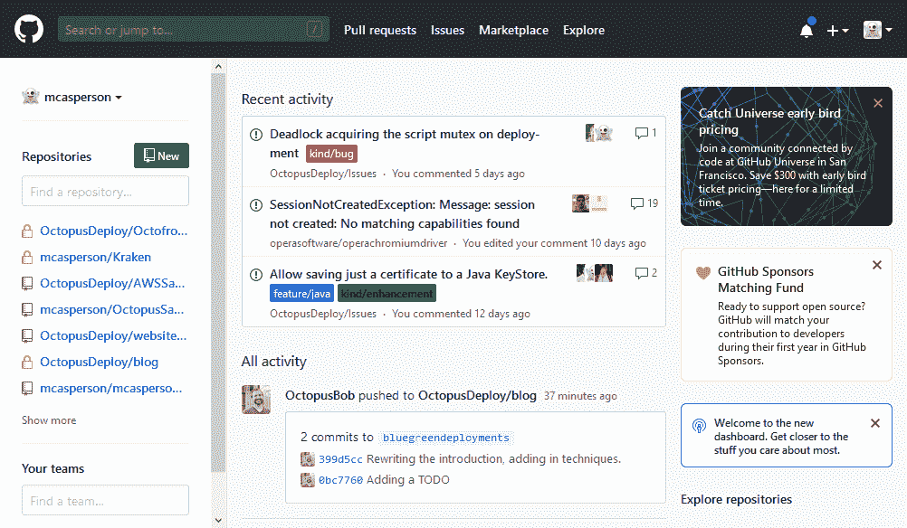

# GitHub Actions 能代替你的 CI 服务器吗？-章鱼部署

> 原文：<https://octopus.com/blog/can-github-actions-replace-your-ci-server>

随着 GitHub Actions(尽管是测试版)的引入，世界源代码库现在包括了托管和执行 CI/CD 管道的能力。既然托管代码本质上已经商品化了，那么运行构建脚本接下来也会商品化，这是很自然也是不可避免的。

关于 CI 有趣的事情是，它是一个机器驱动的过程，当输入(比如你最近的提交)可用时运行，并且在没有干预的情况下生成输出(比如你的工件和测试结果)。这些年来，我们看到每一个主要的 CI 平台都继续通过管道作为代码的概念将构建管道提炼到这个公式，结果是 CI 用户界面被用作只读仪表板，CI 服务器成为构建代理编排器。

因此，假设 GitHub Actions 托管代码，将构建管道作为代码公开，提供运行这些管道的执行环境，并提供一个存储库来托管结果工件，那么您还需要 CI 服务器吗？

## 放弃 CI 服务器并转向 GitHub Actions 的主要原因

作为实验，我决定将一个开源项目迁移到 GitHub Actions。这使我能够复制一个相当复杂的测试，并在 GitHub 的新服务上构建管道，这揭示了很多喜欢它的理由。

GitHub Actions 的核心思想是从 Docker 容器组合构建环境。概括地说，您的工作流是一系列作业，每个作业可以是直接在底层虚拟机上运行的脚本，也可以是通过卷装载来执行共享虚拟机文件系统的 Docker 容器。

*突出显示的区域显示了将虚拟机文件系统安装到 Docker 容器中的操作。*

以这种方式构建您的构建环境是明智的，因为每个主要的开发工具都已经有一个支持的 Docker 容器可供使用，并且您被迫不再维护那些艺术作品一样的构建代理(也就是说，这些构建代理是多年来手工调整和维护的)。将工作流工作做得恰到好处会有一些开销，但是从长远来看，这种努力会得到数倍的回报。这也意味着构建过程的增量变化可以在一个分支中测试，而不需要构建定制的构建代理，当你考虑到甚至像 Java 和。NET 现在每六个月就有一个主要版本。

让 GitHub 托管执行环境意味着 forks 也继承了构建环境。这对开源项目维护者来说是一个巨大的胜利，他们不再需要为了在他们自己的构建环境中运行复杂的回归测试而消耗代码变更，贡献者可以确信他们的变更将通过任何需要的测试。

让我们面对现实吧，*每个人*都将跳上 GitHub Actions 列车。您最喜欢的集成工具肯定会有一个自定义的 Action one 或一个 Docker 容器可以轻松地用作 Action。

## 但是 GitHub 的动作还没有完全准备好

GitHub 操作中有一些缺口，您需要在跳转之前考虑一下。

首先，版本化是一种痛苦。 [GitVersion 提供了一个解决方法](/blog/versioning-with-github-actions)，但是缺少一个在你的工作流中使用的增量编译号变量是一个令人惊讶的疏忽。

没有简单的方法可以在存储库之间共享秘密，这意味着如果您的微服务 CI/CD 管道包括向云提供商的推送，则每个存储库都需要包括您的凭据的副本。这将很难维持，因为钥匙是循环的。

完全不支持捕获输出变量。如果你看看我们是如何实现 [GitVersion](/blog/versioning-with-github-actions) 的，你会看到命令的输出被保存到一个文件中，因为文件系统是在动作之间共享输出的最容易的地方。最好是在变量中捕获该版本，而不是打印文件内容并将结果传递给后续的命令行参数。

虽然 [GitHub 提供了一个令人印象深刻的操作系统列表来在](https://help.github.com/en/articles/virtual-environments-for-github-actions)上运行您的构建，但是如果您必须测试 Ubuntu 或旧版本的 Windows 和 MacOS 之外的任何版本的 Linux，您仍然需要提供您自己的测试环境。

最后，GitHub UI 仍然以存储库为中心。知道哪些 repos 定义了操作，更不用说试图查看您的构建状态了。如果你有很多用 GitHub Actions 构建的项目，就要期望点击*很多次*。

*你不会在这个主页上找到你的构建状态。*

## 结论

如果您维护少量开源项目，GitHub Actions 是理想的选择。贡献者可以派生您的代码和构建环境，您不再需要维护任何单独的构建基础设施。

但是一旦你开始扩展到几个项目之外，GitHub UI 就会对你不利。此外，任何复杂的构建都必须找到捕获输出变量和共享秘密的变通方法。

话虽如此，GitHub Actions 仍处于测试阶段，许多不便之处可能会在未来得到解决。如果 GitHub 可以提供一个以构建为中心的仪表板，并消除工作流中的一些粗糙边缘，您将不得不认真考虑是否要维护一个专用的 CI 服务器。

GitHub Actions 是行业商品化低挂水果的又一个例子。结合开发人员已经完成了将构建管道放入代码的艰苦工作这一事实，云计算将不经常执行的代码的成本降低到几乎为零，代码库提供了执行这些管道的方法也就不足为奇了。现在的挑战是消费构建工件的提供者继续为 CI/CD 过程增加价值。