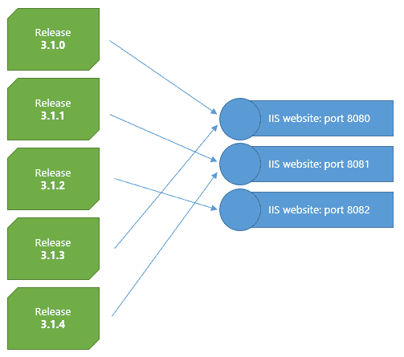
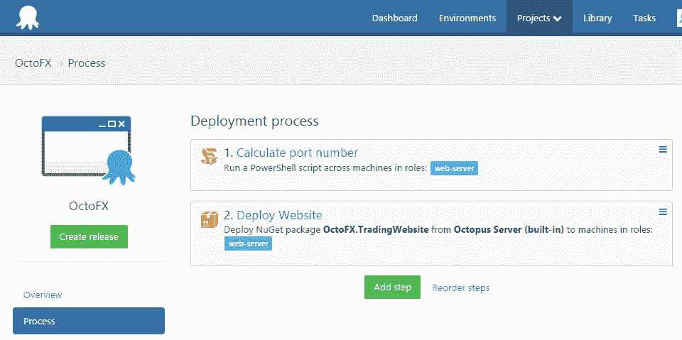
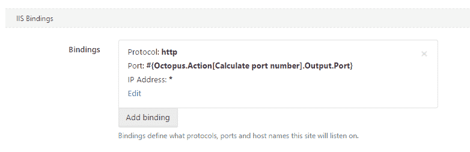

# 更改每个部署上的网站端口- Octopus Deploy

> 原文：<https://octopus.com/blog/changing-website-port-on-each-deployment>

想象你在一个网站上工作，你有一个测试环境供测试人员玩。测试可能需要一段时间，并且您希望部署得更频繁一些，因此如果站点的旧版本在新版本部署后仍然可用，那就更好了。您可能还想设置某种限制——例如，只保留最近的三个部署可用。

这里有一个直观的例子:



假设我们的版本号自动递增，对此有一个非常简单的解决方案:要决定使用哪个端口号，我们可以获取版本号的最后一部分，并使用它来决定端口号。如果我们想要限制发布/端口的数量，我们可以对它应用[模](https://en.wikipedia.org/wiki/Modulo_operation)操作符。我们可以在部署之前运行的 PowerShell 脚本步骤中做到这一点，并设置一个[输出变量](https://octopusdeploy.com/blog/fun-with-output-variables)，然后我们可以在后续的打包步骤中使用它。

下面是部署过程的样子:



计算端口号步骤获取发布版本号，使用`System.Version`解析它，并获取版本号的第三部分。然后，它使用模来计算要使用的端口号:

```
# Example: 3.1.1
$release = $OctopusParameters['Octopus.Release.Number']
$version = New-Object System.Version $release
$build = $version.Build    # Major, Minor, Build, Revision

$sitesToKeep = 3
$port = 8080 + ($build % $sitesToKeep)

Write-Host "Website will be available on port: $port"
Set-OctopusVariable -Name "Port" -Value "$port" 
```

多亏了`Set-OctopusVariable`，变量`$port`现在可以在后续步骤中作为`#{Octopus.Action[Calculate port number].Output.Port}`使用。在配置包步骤的 IIS 功能时，我们可以使用该变量设置端口号:



这就是全部了！对于每个部署，将使用不同的 IIS 网站。`#{Octopus.Action[Calculate port number].Output.Port}`甚至可以用在电子邮件步骤中，通知测试人员有一个新版本可供测试，以及它在哪个端口号上。为胜利输出变量和算术！