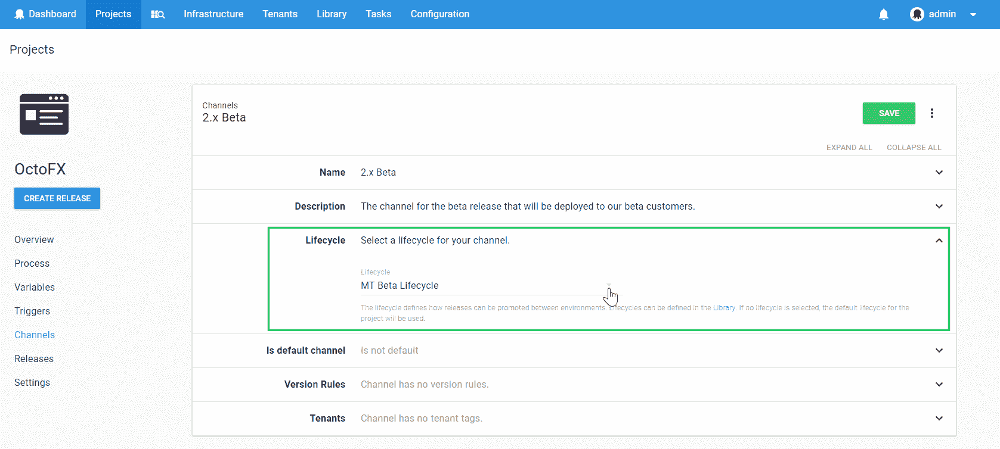
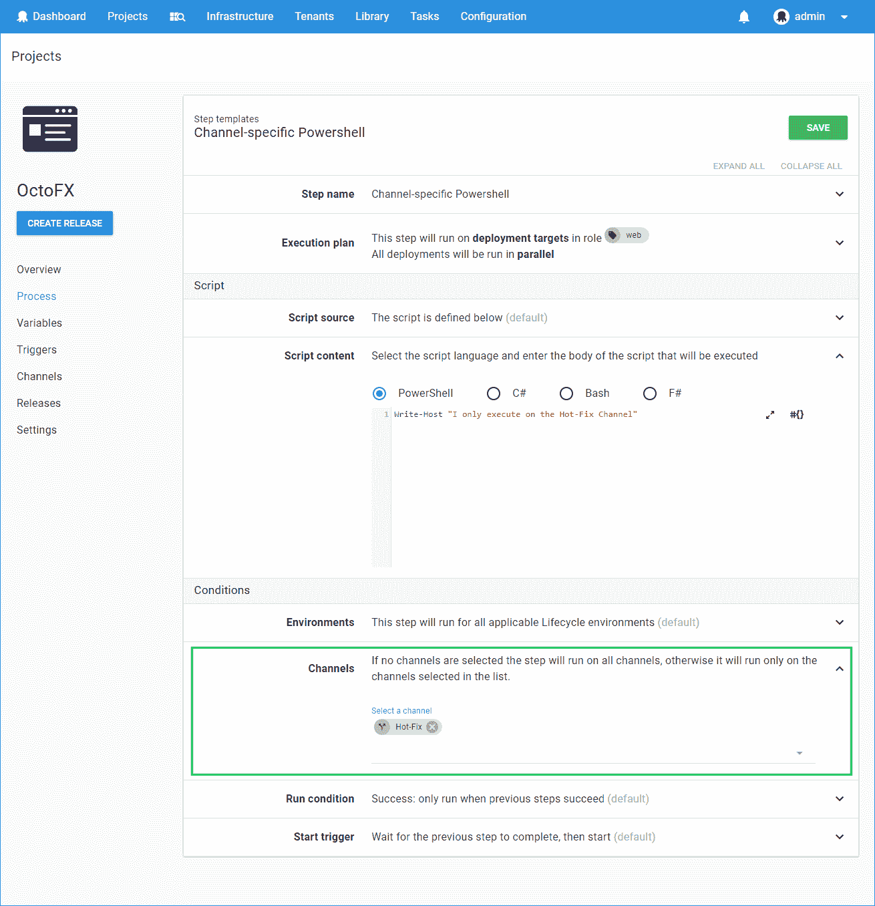
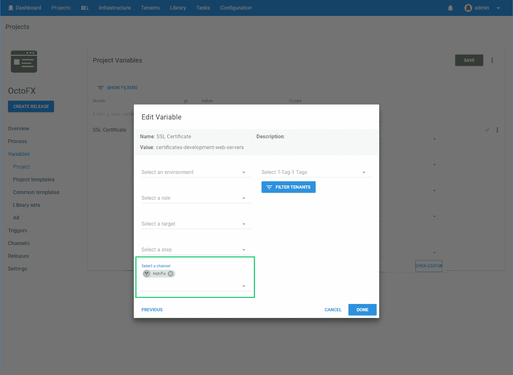
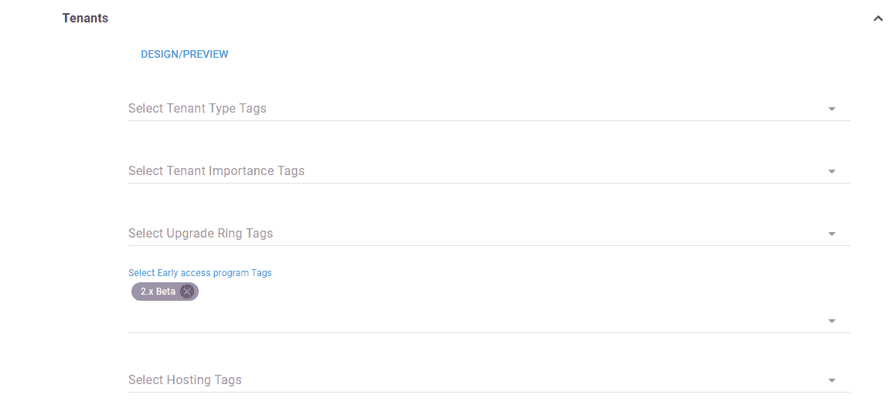
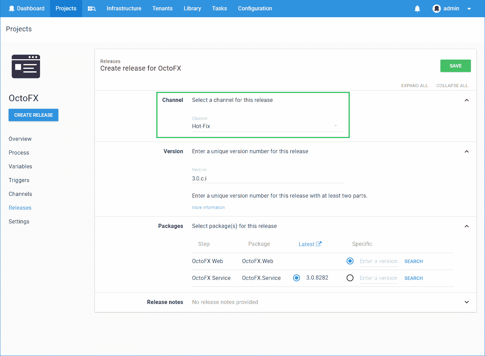
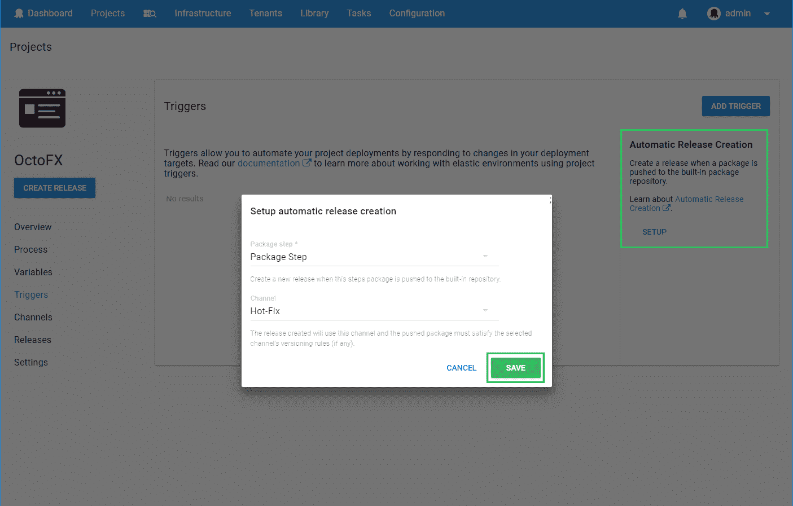
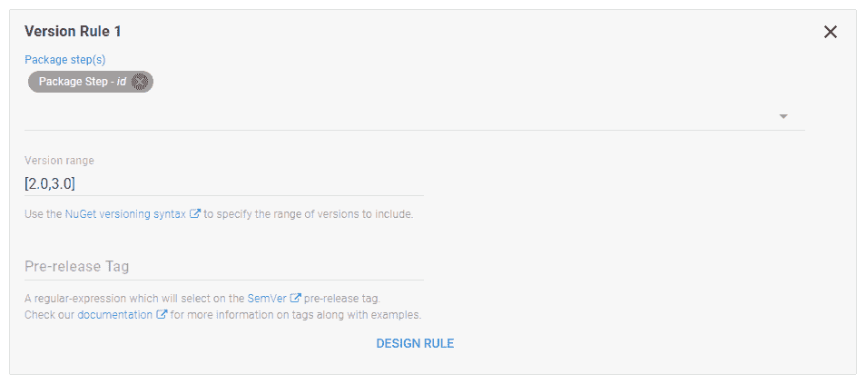
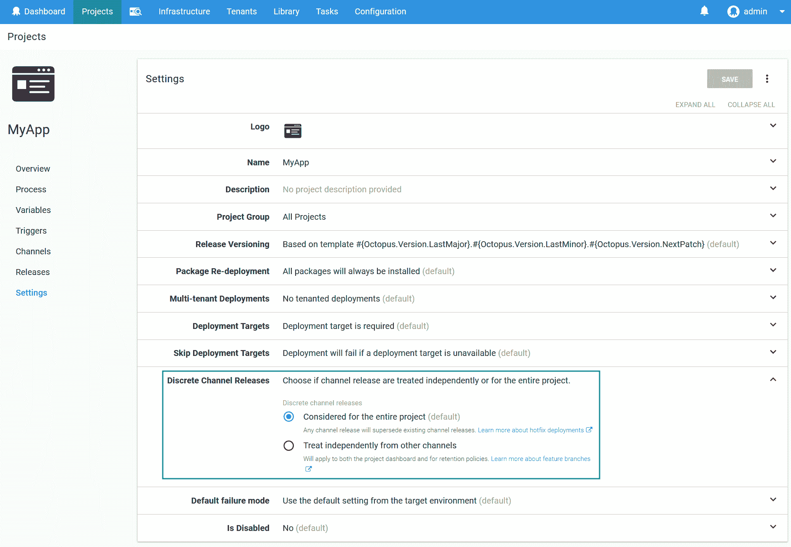
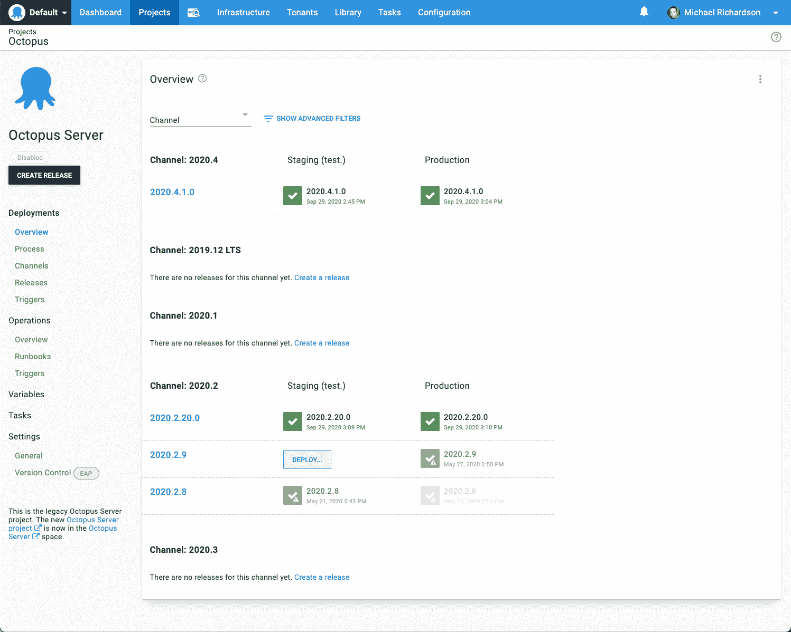

# 渠道-八达通部署

> 原文：<https://octopus.com/blog/channels-walkthrough>

当您部署您的项目时，您可以将项目的[发布](/docs/releases)分配给特定的通道。当您希望根据您设置的标准以不同的方式处理项目的发布时，这很有用。没有渠道，您可能会发现自己为了实现多种发布策略而复制项目。当然，这将使您不得不尝试管理多个重复的项目。Channels 允许您使用一个项目，多个发布策略。

通道在下列情况下很有用:

*   特性分支(或实验分支)被部署到测试环境中，而不是生产环境中。
*   软件的早期访问版本将发布给早期访问计划的成员。
*   热修复直接部署到生产环境中，然后在修复发布后部署到基础设施的其余部分。

当您实施使用通道的部署流程时，您可以将以下内容限定在特定的通道范围内:

您还可以为每个通道定义版本控制规则，以确保只有符合特定标准的版本才会被部署到特定的通道。

## 管理渠道

每个[项目](/docs/projects)都有一个默认通道。

通过选择您正在处理的特定项目并点击**通道**，可从项目概述页面管理通道。

当您添加更多频道时，您会注意到它们在频道页面上按字母顺序排列。

## 创建新频道

1.  在频道页面中，点击**添加频道**按钮。
2.  为频道命名并添加描述。通道名称在项目中必须是唯一的。
3.  选择渠道将使用的[生命周期](/docs/releases/lifecycles)，或者允许渠道继承项目的默认生命周期。有关创建新生命周期的信息，请参见[生命周期文档](/docs/releases/lifecycles)。
4.  如果您想使其成为项目的默认通道，单击**默认通道**复选框。
5.  设计[版本规则](#Channels-versionrules)，该规则将用于强制将您的包的哪些版本部署到该通道。

## 设计版本规则

版本规则有助于为渠道选择正确的软件包版本。它们仅在手动或通过[自动发布创建](/docs/projects/project-triggers/automatic-release-creation)创建发布时使用。

1.  在**新频道**画面中，点击**添加版本规则**。
2.  选择将应用版本规则的程序包步骤(以及相应的程序包)。
3.  在**版本范围**字段中输入版本范围。您可以使用 [Nuget](https://oc.to/NuGetVersioning) 或 [Maven](https://oc.to/MavenVersioning) 版本化语法来指定要包含的版本范围。

您可以使用完整的语义版本作为版本范围规范的一部分。例如:`[2.0.0-alpha.1,2.0.0)`将匹配所有 2.0.0 预发布版本(其中预发布组件为`>= alpha.1`)，并将排除 2.0.0 版本。

4.  输入您想要包含的任何预发布标签。

遵循标准 2.0.0 [SemVer 语法](http://semver.org/)，预发布标签是字母数字文本，可以出现在标准 *major.minor.patch* 模式之后，紧跟在连字符之后。为这个字段提供一个 regex 模式允许通道以一种非常灵活的方式根据它们的标签过滤包。regex 模式也将对 [SemVer 构建元数据](https://semver.org/#spec-item-10)进行评估。一些例子是。

| **图案** | **描述** | **示例用例** |
| --- | --- | --- |
| ^[^\+].* | 匹配任何预发布版本 | 通过指定在试运行时停止的生命周期，强制实施无法推向生产 |
| ^(&#124;\+.*)$ | 匹配任何非预发布版本，但允许构建元数据 | 确保脚本步骤仅针对非预发布包运行 |
| $ | 匹配没有预发布或元数据组件的版本 | 官方版本被过滤掉，只包含核心版本组件(例如 1.0.0) |
| 贝塔 | 匹配预发布版本，如`beta`和`beta0003` | 使用直接进入预发布环境的生命周期来部署预发布 |
| 贝塔 | 匹配标签中带有 beta anwhere 的预发布版本，如`beta`和`mybeta` | 使用直接进入预发布环境的生命周期来部署预发布 |
| ^(?！beta)。+ | 匹配不以 beta 开头的预发布版本 | 将除“测试版”之外的任何东西都视为功能分支包，以便您可以提供短期基础架构并部署到其中 |
| ^bugfix- | 匹配任何带有`*bugfix-*`前缀的(例如`bugfix-syscrash`) | 当对主线分支进行紧急 bug 修复并直接从阶段发布到生产时，绕过开发和 UAT 环境 |
| 贝塔 | 匹配以`beta`开头但*不是包含`beta`的*元数据的预发布版本 | 防止服务器元数据意外匹配规则 |

如果将预发布标签添加到频道，您还需要将标签`^$`添加到您的`default`频道

5.  点击**设计规则**。

**设计版本规则**窗口将显示一个包列表，这些包将作为之前选择的部署包步骤的一部分进行部署。将用您设计的版本规则在该通道中部署的软件包版本将以绿色突出显示，而不用部署的软件包版本将以红色显示。您可以在此窗口中继续编辑版本规则。

【T2 

6.  点击**保存**。

## 使用频道

一旦一个项目有一个以上的渠道，有许多地方可以使用它们。

### 控制部署生命周期

每个渠道都定义了在不同环境之间发布时使用哪个[生命周期](/docs/releases/lifecycles)。您可以为每个通道选择一个生命周期，或者使用项目定义的默认生命周期。

例如，当您将预发布软件交付给您的早期访问用户时，您可以使用早期访问(或测试版)渠道，该渠道使用将软件部署到您的早期访问用户可以访问的环境中的生命周期。

### 修改部署流程

部署步骤可以被限制为仅在特定通道上运行。

例如，当软件的更新版本可用时，您可能决定通过电子邮件通知您的早期用户。这可以通过在您的部署流程中添加电子邮件步骤并将该步骤纳入早期访问渠道来实现。这样，该步骤将仅在一个版本被部署到早期访问渠道时运行，并且您的早期访问用户将仅接收关于相关版本的电子邮件。

### 变量

当您向不同的渠道发布软件时，这些渠道中的一些变量可能需要有所不同。[变量](/docs/projects/variables)可以作用于特定的通道。

### 部署到租户

您可以使用通道控制将哪些版本部署到某些租户。在本例中，该渠道中的版本将仅部署到标记有`Early access program/2.x Beta`的租户。

## 创建版本

Octopus Deploy 中的每个释放都必须放入一个通道中。只要有可能，八达通将为您的释放选择最佳的渠道，或者您可以手动选择一个渠道。

### 手动创建版本

创建发布时，您可以选择一个频道。

选择渠道将导致发布使用与渠道相关的生命周期(或者项目默认，如果渠道没有生命周期)。它还将导致部署过程和变量被修改，如上所述。

包列表允许您选择部署中涉及的每个包的版本。*最新*列显示与为该通道定义的版本规则相匹配的最新软件包(更多信息，请参见[版本规则](#Channels-versionrules))。

### 使用构建服务器扩展或 Octopus CLI

当使用一个[构建服务器扩展](/docs/octopus-rest-api)或 [Octopus CLI](/docs/octopus-rest-api/octopus-cli/create-release) 来创建发布时，您可以让 Octopus 自动为您的发布选择正确的通道(这是默认行为)，或者自己选择一个特定的通道。

### 自动发布创建

为您的项目启用[自动发布创建](/docs/projects/project-triggers/automatic-release-creation)时，您需要选择一个通道(如果项目有多个通道)。

任何自动创建的版本都将使用配置的通道。此外，为渠道配置的任何版本规则都将用于决定是否自动创建版本。

例如，如果软件包的版本 3.1.0 是 Acme。Web 被推送到 Octopus 内部 NuGet 存储库，并且为自动版本创建选择的通道具有不包括 3.1.0 的版本规则范围，则不会创建任何版本。

## 离散渠道发布

信道用于建模的场景可以分为两类。首先，渠道控制发布版本的部署方式(不同的生命周期、部署步骤等)，但是部署的版本不应该被区别对待。这方面的一个例子是 *Hotfix* 通道，用于选择一个旨在快速发布到产品的生命周期。

在第二种使用模式中，通过不同渠道部署的版本是不同的，应该如此对待。举个例子，假设一家公司将部署工具作为可下载的自托管产品和云托管的软件即服务产品。在这个例子中，`self-hosted`和`cloud`通道不仅选择不同的生命周期和部署步骤，而且还希望在仪表板上将它们作为单独的版本来查看。

在项目➜设置中，有一个名为*离散渠道发布*的选项，旨在模拟该场景。

将此项设置为`Treat independently from other channels`将导致:

*   要在仪表板上显示的每个频道的版本
*   在应用发布[保留策略](/docs/administration/retention-policies)时，每个渠道将被单独对待

下图显示了启用离散渠道发布的仪表板示例:

需要支持？我们是来帮助你的。