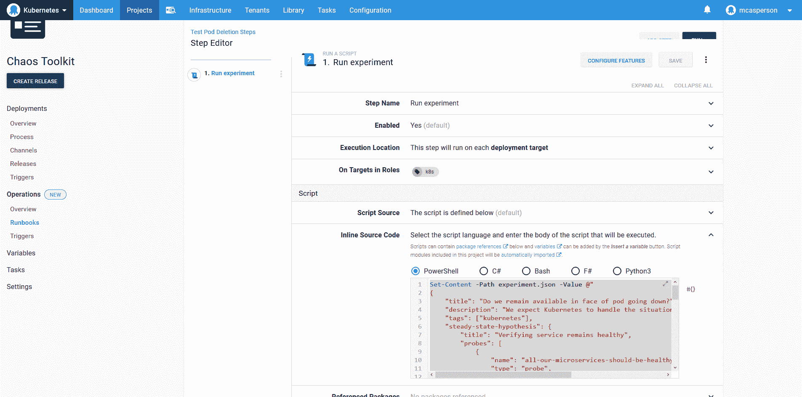

# 混沌工程和运行手册-章鱼部署

> 原文：<https://octopus.com/blog/chaos-engineering-and-runbooks>

Octopus 中的操作手册将 Ops 置于 DevOps 中。这篇文章是一系列文章的一部分:

* * *

Octopus 2021 Q3 包括对 Kubernetes 部署的更新支持，以及针对 Google Cloud、AWS 和 Azure 用户的 runbooks。在我们的[发布公告](https://octopus.com/blog/octopus-release-2021-q3)中了解更多信息。

自动将自身重新配置到所需状态的声明式系统的承诺是:

> 由停止或毁坏的资源引起的大多数故障将在没有任何人工干预的情况下被纠正。

Kubernetes 就是一个很好的例子，因为当部署将集群恢复到期望的状态时，部署中被删除的单元会被重新创建。

证明一个系统可以容忍单个组件的故障是混沌工程的本质。

在他的演讲 [BoF 深潜:混沌工程](https://youtu.be/Qus15C5vT5Y?list=PLj6h78yzYM2PpmMAnvpvsnR4c27wJePh3&t=1447)中，[混沌工具包](https://chaostoolkit.org/)的创建者 Sylvain Hellegouarch 概述了如何将混沌工程应用于 Kubernetes。虽然这个演讲的技术细节很有价值，但他关于如何以及何时进行混沌实验的建议是 Octopus 用户最感兴趣的(这个演讲已经进行了 24 分钟):

> 不要把你的混沌工程和你的部署联系起来。正交运行该部分。

> 你应该总是有持续运行的混沌工程，因为在部署时做[混沌工程]的问题是你的系统存在于你的部署之间。它在进化，所以在你跑步的时候要不断改变系统。

直到最近，在 Octopus 中运行任何类型的自动化流程都意味着创建一个部署。有可能破解部署的想法来实现管理任务，但这很尴尬。

有了 Octopus Runbooks，Octopus 现在可以一流地支持与部署并行运行管理任务。Runbooks 可以访问所有现有的环境、变量、目标、步骤、安全性、审计和报告，但不受部署或生命周期概念的约束。

这使得 runbooks 非常适合运行像混沌工程工具包这样的工具。在这篇文章中，我们创建了一个非常简单的混沌实验作为运行手册，并指出运行手册为这种任务提供的优势。

## Kubernetes 部署

我们首先创建一个部署流程，该流程在 Kubernetes 集群上旋转多个 pod。这是通过 Octopus 中的*部署 Kubernetes 容器*步骤实现的。

在下面的截图中，您可以看到我创建了一个部署，它创建了 10 个 NGINX pods。

[](#)

## 混沌运行手册示例

除了部署之外，我还有一个 runbook，它执行一个简单的 Chaos Toolkit 实验，删除一个 pod，并使用[微服务 _ 可用 _ 健康](https://docs.chaostoolkit.org/drivers/kubernetes/#microservice_available_and_healthy)功能确保部署是健康的。

测试完成后，生成一份 [PDF 报告](https://docs.chaostoolkit.org/reference/usage/report/)，显示实验结果。由 **chaos** 工具生成的输出和报告被捕获为工件。

```
Set-Content -Path experiment.json -Value @"
{
    "title": "Do we remain available in face of pod going down?",
    "description": "We expect Kubernetes to handle the situation gracefully when a pod goes down",
    "tags": ["kubernetes"],
    "steady-state-hypothesis": {
        "title": "Verifying service remains healthy",
        "probes": [
            {
                "name": "all-our-microservices-should-be-healthy",
                "type": "probe",
                "tolerance": true,
                "provider": {
                    "type": "python",
                    "module": "chaosk8s.probes",
                    "func": "microservice_available_and_healthy",
                    "arguments": {
                        "name": "myapp"
                    }
                }
            }
        ]
    },
    "method": [
        {
            "type": "action",
            "name": "terminate-db-pod",
            "provider": {
                "type": "python",
                "module": "chaosk8s.pod.actions",
                "func": "terminate_pods",
                "arguments": {
                    "label_selector": "app=my-app",
                    "name_pattern": "my-app-[0-9]$",
                    "rand": true
                }
            },
            "pauses": {
                "after": 5
            }
        }
    ]
}
"@
chaos run experiment.json
docker run `
    -v "$(Get-Location):/tmp/result" `
    -it `
    chaostoolkit/reporting
New-OctopusArtifact journal.json
New-OctopusArtifact report.pdf 
```

[](#)

下面是 runbook 执行的结果，输出 JSON 和报告 PDF 作为工件提供:

[](#)

我们已经成功地实现了一个简单的混沌工程实验。

那么 runbooks 给这个过程带来了什么好处呢？

## 部署和操作手册并行

通过在单个项目中定义部署和操作手册，我们有一个单一的上下文来捕获部署过程和任何正在进行的测试或部署管理。

从方便的角度来看，这意味着:

*   单一用户界面
*   一组共享的变量
*   紧密链接的概览仪表板
*   合并报告

从管理的角度来看，只有一个项目需要配置安全规则和一个整合的审计日志。

[](#)

Runbooks 将针对部署运行的管理任务与部署本身放在一起。这使得运行、检查和跟踪基础设施的状态变得容易。

## 共享上下文

复杂的 Kubernetes 部署将实现名称空间来保持资源分离，并对服务帐户进行 RBAC 控制，以确保流氓部署定义不会干扰集群的其余部分。当这些权限边界在 Octopus Kubernetes 目标中表示时，它们通过确保管理任务也受到约束而很好地适应了 runbooks。

像几乎所有使用 Kubernetes 的 CLI 工具一样，Chaos Toolkit 可以从 Kubernetes `config`文件的细节中访问集群。Octopus 根据部署或 runbook 执行的目标提供了这个配置文件的本地副本。因此，无论部署使用专门的 Kubernetes 步骤还是 runbook 实现通用的 Kubernetes 脚本，两者都共享一个只定义一次的目标。

## 独立的执行工作流程

虽然共享相同的底层上下文，但 runbooks 的执行独立于部署。Runbooks 定义了自己的计划触发器，也可以在任何环境中手动运行，而不受生命周期的限制。

这是混沌工程的理想选择。正如 Sylvain 在他的演讲中提到的，应该在部署之间连续运行混沌实验来验证集群。

在下面的截图中，混沌实验每十分钟运行一次，以持续验证集群。

[](#)

## 结论

我惊喜地发现，在 Octopus 中安装和运行混沌工具包是如此简单。在已经定义了 Kubernetes 部署的情况下，针对现有目标和环境编写另一个工具几乎不费吹灰之力。

除了简单执行工具的初始能力之外，Octopus Runbook automation 还提供了跨领域的功能，如日志记录、审计、安全、用户管理、报告和仪表板，作为一个成熟可靠的基础来扩展组织内的流程，如混沌工程。

愉快的部署！