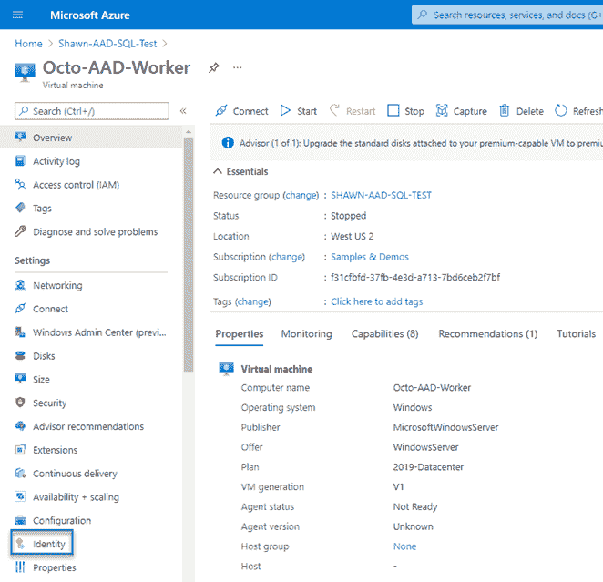
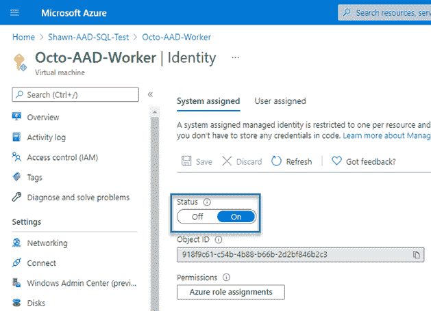
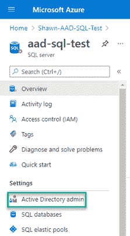
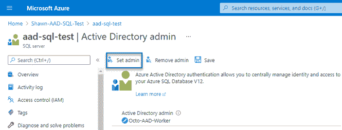
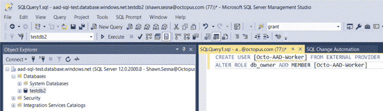
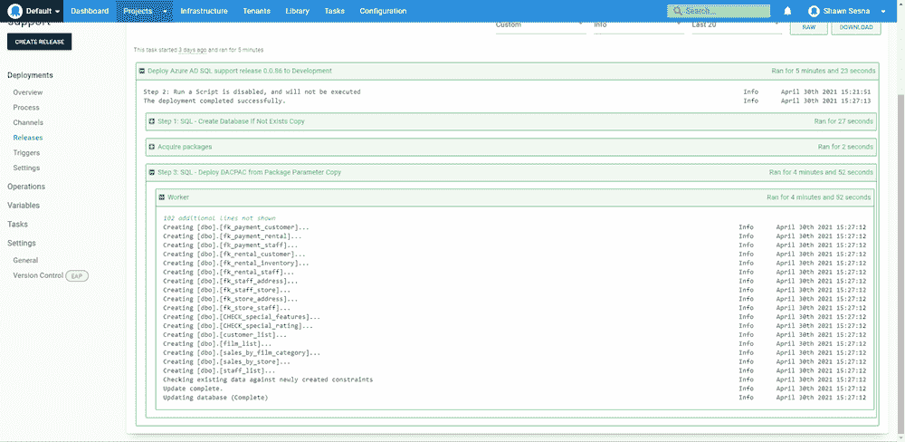

# 在自定义步骤模板中使用类- Octopus Deploy

> 原文：<https://octopus.com/blog/classes-in-custom-step-templates>

[](#)

我最近决定创建一个新的 [DACPAC](https://library.octopus.com/step-templates/ae9d0024-a5aa-4aa8-95a9-cba53c291054/actiontemplate-sql-deploy-dacpac-with-aad-auth-support) 步骤模板，以支持 [Azure Active Directory 托管身份认证](https://docs.microsoft.com/en-us/azure/active-directory/managed-identities-azure-resources/overview)(修改现有模板会带来重大变化)。

在这篇文章中，我将向您展示我是如何用 PowerShell 和一个自定义类来完成这个任务的。

## 准备

首先，您需要提供一个 Azure SQL Server 和一个 Azure VM。本文假设您熟悉这些类型的资源的供应，并且不会涉及这些主题。

### 为托管身份配置虚拟机

创建 Azure VM 后，您需要将其配置为使用托管身份特性。

导航到虚拟机资源并单击左侧窗格中的**标识**。

[](#)

在身份面板上，将上的**状态**切换到**。**

[](#)

虚拟机现在可以向 Azure 资源(如 Azure SQL Server)进行身份验证。

### 为托管身份认证配置 Azure SQL Server

有两种方法可以向 SQL server 授予托管身份的身份验证:

*   将虚拟机管理的身份配置为 Azure SQL Server 的活动目录管理员。
*   将受管身份作为外部登录添加到数据库。

#### 配置 Active Directory 管理员

导航到 Azure SQL Server 资源并点击**活动目录管理**。

由于您只能将一个帐户配置为活动目录管理员，所以我不建议在生产中使用这种方法。

[](#)

在**活动目录管理**屏幕上，点击**设置管理**。选择您的虚拟机并点击**选择**。该帐户现在将显示为选定的管理员帐户。点击**保存**保存您的更改。

[](#)

#### 将受管身份作为外部登录添加到数据库

使用类似 SQL Server Management Studio (SSMS)的工具，您可以执行一个脚本来授予虚拟机权限。

选择要添加权限的数据库，注意`USER`是虚拟机的名称，并运行以下命令:

```
CREATE USER [Octo-AAD-Worker] FROM EXTERNAL PROVIDER
ALTER ROLE db_owner ADD MEMBER [Octo-AAD-Worker] 
```

检查您是否针对正确的数据库执行脚本。

[](#)

您的 VM 现在拥有所选数据库的`db_owner`角色。

### 测试连通性

要验证受管身份是否正常工作，请执行以下操作:

1.  登录 Azure VM 并打开 PowerShell 或 PowerShell ISE。
2.  运行以下脚本来验证它正在连接:

```
$response = Invoke-WebRequest -Uri 'http://169.254.169.254/metadata/identity/oauth2/token?api-version=2018-02-01&resource=https%3A%2F%2Fdatabase.windows.net%2F' -Method GET -Headers @{Metadata="true"}
$content = $response.Content | ConvertFrom-Json
$AccessToken = $content.access_token

$connectionString = "Data Source=aad-sql-test.database.windows.net; Initial Catalog=TestDB2;"

$sqlConnection = New-Object System.Data.SqlClient.SqlConnection
$sqlConnection.ConnectionString = $connectionString
$sqlConnection.AccessToken = $AccessToken

$command = $sqlConnection.CreateCommand()
$command.CommandType = [System.Data.CommandType]'Text'
$command.CommandText = "SELECT @@VERSION"

$sqlConnection.Open()

$command.ExecuteNonQuery();

$sqlConnection.Close() 
```

这个脚本应该成功，没有错误消息，并将返回一个`-1`，在这种情况下，这意味着成功。

该脚本调用内部 Azure 身份服务来返回用于对数据库服务器进行身份验证的访问令牌。

## DACPAC 步骤模板

DACPAC 步骤模板使用。NET 对象与 SQL Server 交互，而不是调用`sqlpackage.exe`命令行程序。为了建立与数据库服务器的连接，代码创建了一个 [DacServices](https://docs.microsoft.com/en-us/dotnet/api/microsoft.sqlserver.dac.dacservices?view=sql-dacfx-150) 对象，将一个连接字符串传递给构造函数。

与上面的脚本类似，使用托管身份进行身份验证需要一个不能添加到连接字符串本身的访问令牌。上面的脚本显示, [SqlConnection](https://docs.microsoft.com/en-us/dotnet/api/system.data.sqlclient.sqlconnection?view=dotnet-plat-ext-5.0) 对象包含属性`AccessToken`,该属性是为身份验证目的而分配的。然而`DacServices`不包含这样的属性。

要使用托管身份认证方法，您必须使用一个[重载构造函数](https://docs.microsoft.com/en-us/dotnet/api/microsoft.sqlserver.dac.dacservices.-ctor?view=sql-dacfx-150#Microsoft_SqlServer_Dac_DacServices__ctor_System_String_Microsoft_SqlServer_Dac_IUniversalAuthProvider_)实例化一个`DacServices`对象，该构造函数接受一个实现`Microsoft.SqlServer.Dac.IUniversalAuthProvider`接口的对象。

### 在 PowerShell 中创建类

从 PowerShell 版本 5 开始，您可以在 PowerShell 本身中创建自定义类:

```
class AzureADAuth : Microsoft.SqlServer.Dac.IUniversalAuthProvider
{
    [string] GetValidAccessToken()
    {
      # Call Azure API to retrieve the token
      $response = Invoke-WebRequest -Uri 'http://169.254.169.254/metadata/identity/oauth2/token?api-version=2018-02-01&resource=https%3A%2F%2Fdatabase.windows.net%2F' -Method GET -Headers @{Metadata="true"} -UseBasicParsing
      $content = $response.Content | ConvertFrom-Json
      $azureAccessToken = $content.access_token
      # Return access token
      return $azureAccessToken
    }
} 
```

在代码执行之前评估的*类*定义可能会出现问题。尽管在类定义之前加载了适当的程序集，但是如果 PowerShell 找不到类型，它就会失败。如果 DLL 在全局程序集缓存(GAC)中，它可能会工作，但是，对于 step 模板，您不能这样假设。

```
+ class AzureADAuth : Microsoft.SqlServer.Dac.IUniversalAuthProvider
+                     ~~~~~~~~~~~~~~~~~~~~~~~~~~~~~~~~~~~~~~~~~~~~~~
Unable to find type [Microsoft.SqlServer.Dac.IUniversalAuthProvider].
    + CategoryInfo          : ParserError: (:) [], ParentContainsErrorRecordException
    + FullyQualifiedErrorId : TypeNotFound 
```

#### 替代类创建方法

我发现我可以通过使用 C#语法在字符串变量中定义类来创建类！我也可以在添加类型时传入依赖程序集引用:

```
# Define C# class
$authClass = @"
public class AzureADAuth : Microsoft.SqlServer.Dac.IUniversalAuthProvider
{
    public string GetValidAccessToken()
    {
        System.Net.HttpWebRequest request = (System.Net.HttpWebRequest)System.Net.WebRequest.Create("http://169.254.169.254/metadata/identity/oauth2/token?api-version=2018-02-01&resource=https://database.windows.net/");
        request.Headers["Metadata"] = "true";
        request.Method = "GET";
        string accessToken = null;

        System.Net.HttpWebResponse response = (System.Net.HttpWebResponse)request.GetResponse();

        System.IO.StreamReader streamResponse = new System.IO.StreamReader(response.GetResponseStream());
        string stringResponse = streamResponse.ReadToEnd();
        System.Web.Script.Serialization.JavaScriptSerializer j = new System.Web.Script.Serialization.JavaScriptSerializer();
        System.Collections.Generic.Dictionary<string, string> list = (System.Collections.Generic.Dictionary<string, string>) j.Deserialize(stringResponse, typeof(System.Collections.Generic.Dictionary<string, string>));
        accessToken = list["access_token"];

        return accessToken;
    }
}
"@

# Create new object
Add-Type -TypeDefinition $authClass -ReferencedAssemblies @("$($DacDLL.FullName)", "System.Net", "System.Web.Extensions", "System.Collections")

$dacServices = New-Object Microsoft.SqlServer.Dac.DacServices $connectionString, $azureAuth 
```

由于 DACPAC 步骤模板很长，本文只包括与类创建相关的代码部分。这里不包括搜索`$DacDLL`的值。

### 部署

测试我们的代码显示了使用托管身份方法的成功部署。

[](#)

## 结论

在这篇文章中，我演示了在 PowerShell 中创建定制类，包括接口的实现。希望这对你以后使用 PowerShell 的工作有所帮助。

愉快的部署！