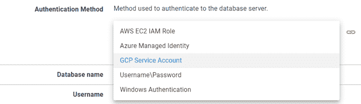
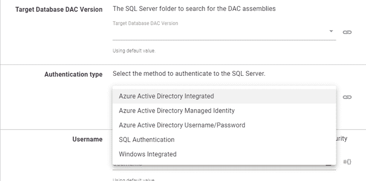

# 云-原生数据库部署认证- Octopus 部署

> 原文：<https://octopus.com/blog/cloud-native-database-template-authorization>

Amazon Web Services (AWS)、Azure 和 Google Cloud Platform (GCP)引入了无密码身份验证机制，可以为虚拟机(VM)等资源分配一个身份(Azure)、一个服务帐户(GCP)或一个角色(AWS)，这些身份或角色可用于对数据库服务器实例等其他资源进行身份验证。

Octopus Deploy 有几个内置步骤支持使用这种方法对资源进行身份验证，但是，数据库部署几乎完全是使用社区步骤模板完成的。

Octopus 社区一直在努力更新模板以支持云原生身份验证。

在这篇文章中，我列出了更新了云提供商认证功能的模板。

## 支持云原生身份验证方法的数据库技术

只有云提供商提供的一些数据库技术支持云原生身份验证。下面，我按提供商列出了支持的技术:

自动警报系统

*   亚马逊极光
*   MariaDB
*   关系型数据库
*   一种数据库系统

蔚蓝的

*   天蓝色宇宙数据库
*   关系型数据库
*   一种数据库系统
*   Microsoft SQL Server

GCP

GCP 和 AWS 都支持 Microsoft SQL Server 的 Windows 身份验证，但是，服务器必须连接到云提供商上的 Active Directory 域。

Amazon Aurora 和 Azure Cosmos 尚未使用本文中列出的模板进行测试。

## 支持云身份验证的 Step 模板

以下社区步骤模板已更新，支持使用云原生数据库身份验证:

除了**SQL-Deploy DAC PAC with AAD Auth support**之外，上述模板可在 Windows (PowerShell、PowerShell Core)和 Linux (PowerShell Core)上运行，并且已更新为支持以下类型的**身份验证方法**选择器:

*   AWS EC2 IAM 职责
*   Azure 托管身份
*   GCP 服务帐户
*   用户名\密码
*   Windows 身份验证

Flyway 数据库迁移仅与 PowerShell Core 兼容。

### SQL -部署具有 AAD 身份验证支持的 DACPAC

使用**SQL-Deploy DAC PAC with AAD Auth support**模板的云原生身份验证仅限于 Azure 云提供商，并支持以下方法:

*   Azure Active Directory 集成版
*   Azure Active Directory 托管身份
*   Azure 活动目录用户名/密码
*   SQL 身份验证
*   Windows 集成版

**SQL-Deploy DAC PAC with AAD Auth support**用 PowerShell 编写，利用了。NET 标准 DLL 文件，这些文件是 SQL Server 安装或 SQL Server PowerShell 模块的一部分。正因为如此，它不能在 Linux 操作系统上运行。

## 结论

Octopus 社区认识到使用云提供商提供的认证机制的优势。

在这篇文章中，我列出了更新了云提供商认证功能的模板。

## 了解更多信息

我们的示例实例更新了使用云原生身份验证的示例:

愉快的部署！